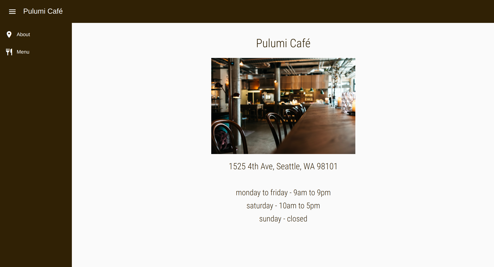
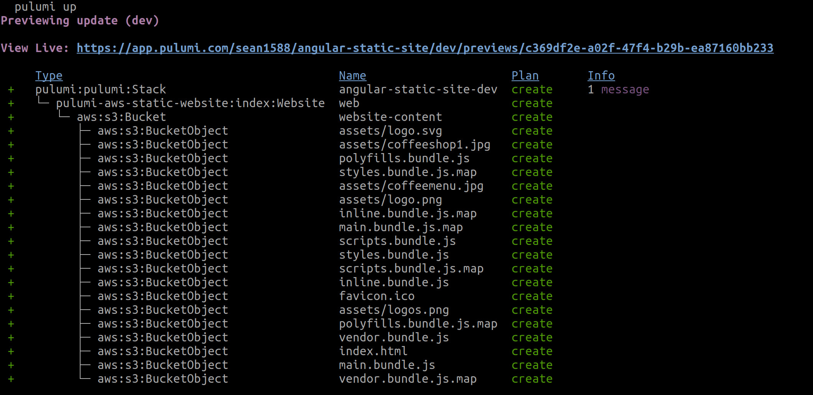

In this blog post, we’re going to use some Angular framework components to assemble a static website and then use Pulumi and its AWS Static Website component to deploy it to AWS. The website is for a café called the Pulumi Café. It will contain two pages, one an About page and the other a Menu page, as well as some navigational pieces.

To follow this example, you need to have both Angular and Pulumi installed. (Here’s a link to the [Pulumi installation instructions](/docs/clouds/aws/get-started/).) You’ll also need an AWS account.

## What is Angular?

Angular is an open-source UI framework for building single-page client applications with HTML and TypeScript. Angular itself is written in TypeScript and its architecture follows the Model-View-Controller (MVC) design pattern.

## What are Components in Angular?

In Angular, the basic building blocks of a website are called _components_. These are reusable structures that contain their own logic and functionality. For example, you could create a button as an Angular component and program it to have a particular look and a particular behavior. Then, you would reuse the button component wherever you need it in the website. The button could also be configurable meaning that, based on different properties, you could change its look and behavior.

A simple website, like the one we’ll be building in this post, is mainly created from a group of Angular components.

## What is the AWS Static Website Component?

The AWS Static Website component from Pulumi makes it easy to deploy an AWS S3 static website and, optionally, add a CloudFront content distribution network (CDN). While you can use any of the programming languages Pulumi supports (TypeScript, JavaScript, Python, Go, .NET, Java, and YAML), we’ll be using TypeScript, since that is what the Angular framework uses.

The great advantage of the AWS Static Website component is that you can have a complete, functioning site in a few minutes. The component encapsulates all the complex logic that an AWS static website requires. Without the component, you would need to spend hours or even days writing and debugging code to get the same result.

If you’re interested in learning more about the component, read [Deploy Static Websites to AWS using 10 lines of YAML](/blog/deploy-aws-static-website-with-yaml/).

## The Angular Components

All the Angular components you need to build the website are available in the GitHub [repository](https://github.com/sean1588/angular-static-site-pulumi). The repository contains:

* A component for the [left navigation bar](https://github.com/sean1588/angular-static-site-pulumi/tree/main/src/app/components/shared/leftnav).
* A component for the [top navigation bar](https://github.com/sean1588/angular-static-site-pulumi/tree/main/src/app/components/shared/topnav).
* A component for the [Home](https://github.com/sean1588/angular-static-site-pulumi/tree/main/src/app/components/home) page.
* A component for the [Menu](https://github.com/sean1588/angular-static-site-pulumi/tree/main/src/app/components/menu) page.

We also use some components that come with the Angular framework.

Each of the components has a TypeScript file that contains the programming logic and an HTML file that describes how the component will render.

## Building the Pulumi Café Website

Here are the instructions to build the website.

1. Clone the GitHub repository located [here](https://github.com/sean1588/angular-static-site-pulumi).
1. Run `npm install` to install the website’s node dependencies.

## Deploy the Site with Pulumi

You’re now ready to set up Pulumi to deploy the site to AWS.

1. Create a directory named `pulumi` in the root of the project directory and then navigate to it with this command:

    ```bash
    mkdir pulumi && cd pulumi

    ```

1. You’re now in the `pulumi` directory. Generate a Pulumi project file and create a Pulumi.yaml file with the following command. You will be asked a few questions from the prompt. Use `angular-static-website` for the project name and accept the suggested defaults for the remaining questions:

    ```bash
    pulumi new aws-yaml
    ```

## Modify the .yaml File

We need to add a few lines of code to the Pulumi.yaml file. In the `resources` section, the code references the AWS Static Website component and sets the `sitePath` property to the location of the `dist` build directory. We also want to know the URL of the site once it’s deployed. That’s what the `outputs` section  does. The `websiteURL` parameter is one of the outputs that the AWS Static Website component provides. Replace the contents of `Pulumi.yaml` with the following code:

```yaml
name: angular-static-website
runtime: yaml
description: Example of deploying Angular with Pulumi
resources:
  web:
    type: "aws-static-website:index:Website"
    properties:
      sitePath: "../dist/"
outputs:
  websiteURL: ${web.websiteURL}
```

The AWS Static Website component is the reason you only need a few lines of code to deploy the site. By using it, all the work of setting up AWS is done for you.

To deploy the website, type `pulumi up`. You’ll first see a preview of all the resources that will be created. Confirm that you want to proceed and Pulumi deploys the website to AWS.

It’s that simple. With just a few lines of code and one command you deployed your site. Navigate to the site and you’ll see the Home page for the café.

You can see the navigation components on the left-hand side. Click `Menu` to see the Menu page.



## Manage Your Site with Pulumi

Along with making it simple to deploy your site, Pulumi also makes it easy to perform some management tasks. For example, If you want to take down the site, run `pulumi destroy`. You never have to worry that you’ll forget to remove some resource and continue to pay for it. Pulumi also keeps track of changes to website files, can generate resource graphs and give you complete information about the resources you’re using.



## Learn More

If you want to learn more about Pulumi and the AWS Static Website component, here are a few links you might find interesting:

* Along with the [Deploy Static Websites to AWS using 10 lines of YAML](/blog/deploy-aws-static-website-with-yaml/) blog post, take a look at the [AWS Static Website reference page](/registry/packages/aws-static-website/).
* If you want to learn about other Pulumi components, the [registry](/registry/) page catalogs them all.
* If you want to view more examples of how to use Pulumi, go to the Pulumi [examples](https://github.com/pulumi/examples) repo.
* If you want to delve deeper into Pulumi, the [Getting Started](/docs/quickstart/) guide is a good first step.
* If you’re interested in learning more about Pulumi concepts, try the [Concepts](/docs/concepts/) page.
* If you want to learn more about Angular, see their [Getting Started](https://angular.io/start) docs.
