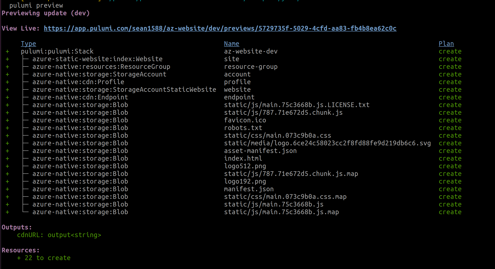

Deploying a static website often involves provisioning a number of pieces of infrastructure and stitching those pieces together in a way to make the site accessible to your users. A static website typically consists of HTML, CSS, and JavaScript files along with any other static assets the site might need to render such as PNG and SVG files for example. These files are then uploaded to a storage bucket where they can be served from. This post will demonstrate how to easily deploy your static website to Azure and make it available for public access.

## Azure Static Website Component

Pulumi components enable us to create re-usable abstractions that can perform complex tasks all behind a simple interface the user can programmatically interact with. The [Azure Static Website component]() looks to take all of the complexity of getting a static website deployed to Azure and simplify it down to just consuming a simple component and passing it a few input arguments. This component relieves the complexities of this process by allowing you to simply tell the component where your files are located and it will take care of all the rest.

**This component does the following:**

* Provisions an Azure storage account
* Uploads the website contents located in the specified directory
* Optionally can configure a CDN, custom domain, and certs.

## Using the component to deploy a static website

Let’s walk through a simple example of using this component to deploy a static website. Today, we are going to provision a storage account, upload the website contents, and wire it up to an Azure CDN.

In order to follow along with this example you will need to have the following:

* Pulumi CLI installed on your machine
* Access to an Azure account to provision the infrastructure
* Static site to upload

See our [getting started]() guide for information on how to configure Pulumi and Azure.

We will provision a number of pieces of infrastructure in Azure to enable serving our static website. The main ones are a Storage Account to contain all of our website files and a CDN. Let’s start by creating a new Pulumi project. First, create a new directory on your machine where the Pulumi project will live. A common pattern is to include the infrastructure configuration in a directory alongside the website you will be deploying. You can create a directory called `infrastructure` to house the Pulumi program or you can use another name if you prefer. This allows us to easily reference the location of the contents of your site as well as keeps your infrastructure code along-side your application. Pulumi supports multiple programming languages such as TypeScript, Python, Go, .NET, and even markup languages like YAML. Once you have created the directory, run the following command for your language of choice inside the directory:



{}

```bash
pulumi new azure-typescript
```

{}

{}

```bash
pulumi new azure-python
```

{}

{}

```bash
pulumi new azure-csharp
```

{}

{}

```bash
pulumi new azure-go
```

{}

{}

```bash
pulumi new azure-yaml
```

{}

{}

There will be some prompts that appear asking you a few questions. Feel free to accept the defaults or change them to your desired preference. This command generated a new project and created a few files for you. You can copy the code examples below for the language you chose to use.



{}

```typescript
import * as pulumi from "@pulumi/pulumi";
import * as website from "@pulumi/azure-static-website";

const site = new website.Website("site", {
   sitePath: "../site", // replace with path containing website contents
   withCDN: true,
});

export const { cdnURL } = site;
```

{}

{}

```python
import pulumi
import pulumi_azure_static_website as azure_static_website

site = azure_static_website.Website("site",
    site_path="../site", # replace with path containing website contents
    with_cdn=True)
pulumi.export("cdnURL", site.cdn_url)
```

{}

{}

```csharp
using System.Collections.Generic;
using Pulumi;
using AzureStaticWebsite = Pulumi.AzureStaticWebsite;

return await Deployment.RunAsync(() =>
{
    var web = new AzureStaticWebsite.Website("web", new()
    {
        WithCDN = true,
        SitePath = "../site", // replace with path containing website contents
    });

    return new Dictionary<string, object?>
    {
        ["websiteURL"] = web.CdnURL,
    };
});
```

{}

{}

```go
package main

import (
	"github.com/pulumi/pulumi-azure-static-website/sdk/go/azure-static-website"
	"github.com/pulumi/pulumi/sdk/v3/go/pulumi"
)

func main() {
	pulumi.Run(func(ctx *pulumi.Context) error {
		web, err := azure - static - website.NewWebsite(ctx, "web", &azure-static-website.WebsiteArgs{
			WithCDN:  pulumi.Bool(true),
			SitePath: pulumi.String("../site"), // replace with path containing website contents
		})
		if err != nil {
			return err
		}
		ctx.Export("websiteURL", web.CdnURL)
		return nil
	})
}
```

{}

{}

```yaml
name: az-website
runtime: yaml
description: A static website build with pulumi-azure-static-website.
resources:
  web:
    type: "azure-static-website:index:Website"
    properties:
      withCDN: true
      sitePath: "../site"
outputs:
  websiteURL: ${web.cdnURL}
```

{}

{}

This code creates a new instance of the Website component and sets a couple of properties. `sitePath` is the location where your website contents live. The `sitePath` specified should be the output location of your website's build not the overall directory where your application lives. For example, if using a framework like React, the build output is usually placed in a directory called `build`. In addition, we set `withCDN` to true to let the component know that you would like to provision a CDN as well. It also exports the `cdnURL` property, which is the URL where the site can be accessed. That’s all that is needed and now we are ready to deploy!

You can now run `pulumi up` to deploy the site to Azure. This will first show a preview of the resources that will be provisioned. You can go ahead and accept by selecting `yes`.



In a few minutes your site will be provisioned and ready to access. Use the `cdnURL` that was output at the end of the provisioning to access the site!

As you can see, the Azure static website component made this task very easy. With just a few lines of code we were able to provision our site.

If you would like to learn more about Pulumi, here are some links you may find interesting:

* Visit our [Getting Started]() to quickly get up and running with Pulumi.
* View the GitHub repo for the [Azure static website component](https://github.com/pulumi/pulumi-aws-static-website).
* Visit our [registry page]() to more components we have available for you to consume.
* Check out our new [templates]() that make it quick and easy to deploy common cloud architectures.
