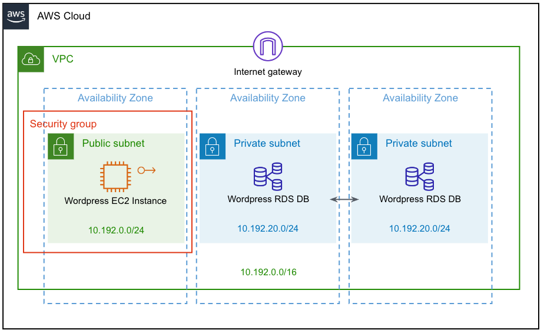
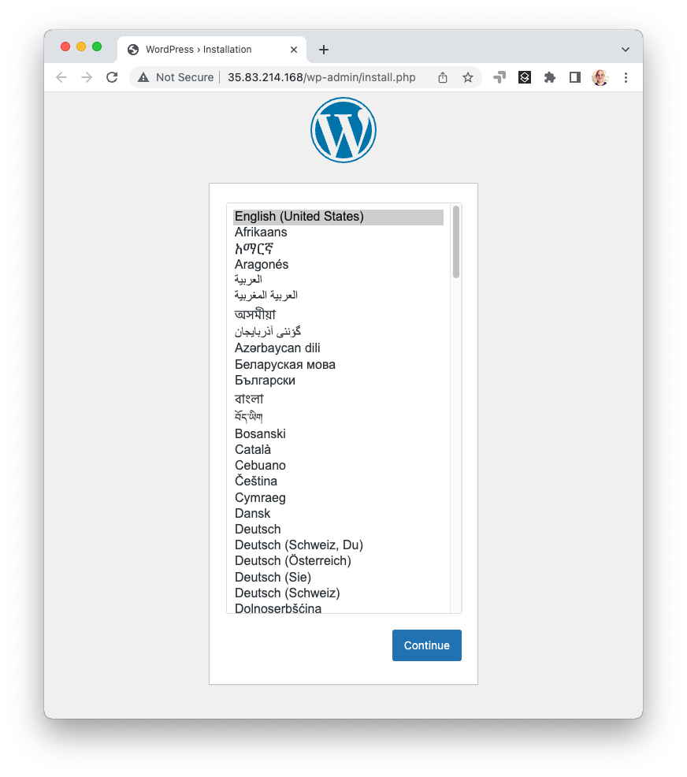

There are two primary kinds of infrastructure as code tools: *configuration management*, like Ansible, Chef, and Puppet, which configure, patch, or upgrade existing servers, and *provisioning*, like Pulumi, Terraform, and CloudFormation, which create, update, and delete the underlying infrastructure itself. Provisioning has taken over from configuration management as the dominant form of IaC over the past decade as we've shifted to modern immutable infrastructure architectures that use containers, serverless, and managed services. And yet, configuration management still remains important and relevant, especially for heritage, stateful, server-centric, and on-prem or hybrid solutions. The good news is that it doesn't need to be either-or choice: the two approaches are complementary. In this post, you'll see how and why you might combine them by deploying a WordPress Server to AWS by provisioning infrastructure with Pulumi and configuring the server with Ansible.

<!--more-->

## Preamble: On Provisioning and Configuration

Before diving in, why might you want to provisioning *and* configuration IaC tools together?

Provisioning is more common these days because modern workloads using containers, managed services, and serverless architectures are amenable to *immutable infrastructure* approaches --- replacing instead of patching. This entails fewer state transitions and failure modes to consider, making automation less error prone, more repeatable, and more scalable. This streamlines deploying infrastructure from CI/CD or other advanced automation, scaling up to 10s, 100s, or even 1,000s of environments repeatably.

This distinction is sometimes referred to as the difference between *["cattle" and "pets"](http://it20.info/2012/12/vcloud-openstack-pets-and-cattle/)*. In this analogy, cattle are given numbers like `vm0042.cern.ch`, are almost identical to all other cattle, and when they get ill, you get another one. In contrast, pets are given names like `myspecialpet.cern.ch`, are unique and lovingly hand-raised and cared for, and when they get ill, you nurse them back to health.

To illustrate what these differences mean from an infrastructure as code perspective, let's say you have a server running an old version of WordPress and want to upgrade to the latest:

* With configuration management, it is a pet, so you would patch the server, upgrading it from version X to the new version Y. This is challenging because it requires knowing all possible X=>Y transitions and potential failure modes. Imagine the upgrade from X=>Y fails --- how do you recover? Is it a manual recovery? And imagine version Z comes out: is upgrading X=>Z the same upgrade path as Y=>Z? Or is each permutation different? It becomes very difficult to predict and carefully consider all combinations of upgrade paths and failures.

* With provisioning, it is cattle, so you don't worry about such things. You'd place your server, possibly many of them, behind a stable IP address and/or load balancer and, instead of patching, you would provision one or more new servers running version Y (or Z), redirect the IP address and/or load balancer to the new server(s), and then destroy the old server(s) running the old version X after traffic has been redirected. This reduces the space of state transitions to consider and eliminates a whole host of failure recovery scenarios. If something fails, you just fix the problem, and rinse and repeat; provisioning tools are better at picking up where they left off, even from partial states. In fact, this workflow is precisely the way most container-based systems, including Kubernetes, work, generalizing common patterns.

Many heritage workloads still use configuration management tools for mutable infrastructure like virtual machine (VM) servers running in on-prem or hybrid environments. Provisioning can work too, however, many VM-centric tools and practices formed over the years around mutable infrastructure. In some cases with stateful workloads it may legitimitely be preferable to continue using VMs and configuration management. And even if you're not choosing it for new workloads, configuration management is definitely here to stay --- many organizations have mission-critical workloads and procedures built up around this family of tools.

For this post, imagine your organization decided to stick with Ansible configuration management for managing a stateful WordPress server, but is otherwise modernizing by using Pulumi IaC to provision AWS infrastructure.

## Pulumi and Ansible Better Together - The Approach

Our goal is to set up WordPress in AWS in an automated and repeatable manner. It should be easy to scale a single environment based on demand, upgrade the infrastructure as requirements evolve, and repeatably set up and tear down entirely new environments. These are all areas where IaC shines.

Here's a quick sketch of the approach:

* Create a Pulumi program in your language of choice (Python, YAML, any Node.js language (such as JavaScript, TypeScript), Go, any .NET language (such as C#), or any JVM language (such as Java, Groovy, Scala, or Kotlin). This program defines the declarative infrastructure specification.

* Declare the AWS infrastructure topology using Pulumi's native programming model. This infrastructure includes a Virtual Private Cloud (VPC), public and private subnets, security groups, a MySQL RDS database that WordPress will store data in, and an EC2 instance that's accessible over the Internet to run the WordPress server, among a few other supporting bits of infrastructure.

  Here is a visual diagram of this AWS architecture:

  

* Declare configuration commands, still all within Pulumi's programming model, to perform two tasks:
    1. Update packages over SSH, using `yum` to ensure prerequisites like Python are present.
    2. Run the Ansible Playbook on the machine running Pulumi as the Ansible control node. This installs and configures WordPress on the new infrastructure.

* Run a single command, `pulumi up`, to orchestrate everything, including provisioning or updating the AWS infrastructure and running commands and Ansible playbooks to perform the on-VM configuration.

* Finally, the WordPress server's IP address is printed, and our server is ready to go!

Now that you've got an idea of the overall game plan, let's get started --- first, you'll create a Pulumi project to house your IaC.

## Creating Your Infrastructure as Code Project

To start, you'll create a Pulumi IaC project, which will declare all of the supporting AWS infrastructure into which you'll then install WordPress.

> Note: If you're following along, be sure to install the prerequisites:
>
> * [Install Pulumi](https://www.pulumi.com/docs/get-started/install/)
> * [Install Ansible](https://docs.ansible.com/ansible/latest/installation_guide/intro_installation.html)
> * [Configure AWS Credentials](https://www.pulumi.com/docs/intro/cloud-providers/aws/setup/)

First, create a new Pulumi project in your language of choice:

{}

{}

```bash
$ pulumi new aws-typescript
```

{}

{}

```bash
$ pulumi new aws-python
```

{}

{}

```bash
$ pulumi new aws-go
```

{}

{}

```bash
$ pulumi new aws-csharp
```

{}

{}

```bash
$ pulumi new aws-yaml
```

{}

Next, to make our infrastructure setup easy to vary between environments, the code leverages [Pulumi's "configuration" system]() --- not to be confused with configuration management tools --- which just allows you to vary provisioning settings for each stack in case your environments have different needs. For instance, perhaps you have different SSH keys, or want larger instance sizes, in development versus production:

{}

{}

```typescript
const config = new pulumi.Config();
// A path to the EC2 keypair's public key:
const publicKeyPath = config.require("publicKeyPath");
// A path to the EC2 keypair's private key:
const privateKeyPath = config.require("privateKeyPath");
// The WordPress database size:
const dbInstanceSize = config.get("dbInstanceSize") || "db.t3.small";
// The WordPress database name:
const dbName = config.get("dbName") || "wordpressdb";
// The WordPress database user's name:
const dbUsername = config.get("dbUsername") || "admin";
// The WordPress database user's password:
const dbPassword = config.requireSecret("dbPassword");
// The WordPress EC2 instance's size:
const ec2InstanceSize = config.get("ec2InstanceSize") || "t3.small";
```

{}

{}

```python
config = pulumi.Config()
# A path to the EC2 keypair's public key:
public_key_path = config.require("publicKeyPath")
# A path to the EC2 keypair's private key:
private_key_path = config.require("privateKeyPath")
# The WordPress database size:
db_instance_size = config.get("dbInstanceSize") or "db.t3.small"
# The WordPress database name:
db_name = config.get("dbName") or "wordpressdb"
# The WordPress database user's name:
db_username = config.get("dbUsername") or "admin"
# The WordPress database user's password:
db_password = config.require_secret("dbPassword")
# The WordPress EC2 instance's size:
ec2_instance_size = config.get("ec2InstanceSize") or "t3.small"
```

{}

{}

```go
cfg := config.New(ctx, "")
// A path to the EC2 keypair's public key:
publicKeyPath := cfg.Require("publicKeyPath")
// A path to the EC2 keypair's private key:
privateKeyPath := cfg.Require("privateKeyPath")
//  The WordPress database size:
dbInstanceSize := cfg.Get("dbInstanceSize")
if dbInstanceSize == "" {
        dbInstanceSize = "db.t3.small"
}
// The WordPress database name:
dbName := cfg.Get("dbName")
if dbName == "" {
        dbName = "wordpressdb"
}
// The WordPress database user's name:
dbUsername := cfg.Get("dbUsername")
if dbUsername == "" {
        dbUsername = "admin"
}
//  The WordPress database user's password:
dbPassword := cfg.RequireSecret("dbPassword")
// The WordPress EC2 instance's size:
ec2InstanceSize := cfg.Get("ec2InstanceSize")
if ec2InstanceSize == "" {
        ec2InstanceSize = "t3.small"
}
```

{}

{}

```csharp
var config = new Config();
// A path to the EC2 keypair's public key:
var publicKeyPath = config.Require("publicKeyPath");
// A path to the EC2 keypair's private key:
var privateKeyPath = config.Require("privateKeyPath");
// The WordPress database size:
var dbInstanceSize = config.Get("dbInstanceSize") ?? "db.t3.small";
// The WordPress database name:
var dbName = config.Get("dbName") ?? "wordpressdb";
// The WordPress database user's name:
var dbUsername = config.Get("dbUsername") ?? "admin";
// The WordPress database user's password:
var dbPassword = config.RequireSecret("dbPassword");
// The WordPress EC2 instance's size:
var ec2InstanceSize = config.Get("ec2InstanceSize") ?? "t3.small";
```

{}

{}

```yaml
configuration:
  # A path to the EC2 keypair's public key:
  publicKeyPath:
    type: String
    required: true
  # A path to the EC2 keypair's private key:
  privateKeyPath:
    type: String
    required: true
  # The WordPress database size:
  dbInstanceSize:
    type: String
    default: db.t3.small
  # The WordPress database name:
  dbName:
    type: String
    default: wordpressdb
  # The WordPress database user's name:
  dbUsername:
    type: String
    default: admin
  # The WordPress database user's password:
  dbPassword:
    type: String
    secret: true
    required: true
  # The WordPress EC2 instance's size:
  ec2InstanceSize:
    type: String
    default: t3.small
```

{}

After this, you'll declare a few variables that are fetched dynamically, so you don't need to hard-code them, and so your stack can be flexibly deployed into different AWS regions. This includes automatically getting the availability zones in the target AWS region as well as the AMI for Amazon Linux 2 which also varies by region:

{}

{}

```typescript
// Dynamically fetch AZs so we can spread across them.
const availabilityZones = aws.getAvailabilityZones();
// Dynamically query for the Amazon Linux 2 AMI in this region.
const awsLinuxAmi = aws.ec2.getAmi({
    owners: ["amazon"],
    filters: [{
        name: "name",
        values: ["amzn2-ami-hvm-*-x86_64-ebs"],
    }],
    mostRecent: true,
});
```

{}

{}

```python
# Dynamically fetch AZs so we can spread across them.
availability_zones = aws.get_availability_zones()
# Dynamically query for the Amazon Linux 2 AMI in this region.
aws_linux_ami = aws.ec2.get_ami(owners=["amazon"],
    filters=[aws.ec2.GetAmiFilterArgs(
        name="name",
        values=["amzn2-ami-hvm-*-x86_64-ebs"],
    )],
    most_recent=True)
```

{}

{}

```go
// Dynamically fetch AZs so we can spread across them.
availabilityZones, err := aws.GetAvailabilityZones(ctx, nil)
if err != nil {
    return err
}
// Dynamically query for the Amazon Linux 2 AMI in this region.
awsLinuxAmi, err := ec2.LookupAmi(ctx, &ec2.LookupAmiArgs{
    Owners: []string{
        "amazon",
    },
    Filters: []ec2.GetAmiFilter{
        ec2.GetAmiFilter{
            Name: "name",
            Values: []string{
                "amzn2-ami-hvm-*-x86_64-ebs",
            },
        },
    },
    MostRecent: pulumi.BoolRef(true),
}, nil)
if err != nil {
    return err
}
```

{}

{}

```csharp
// Dynamically fetch AZs so we can spread across them.
var availabilityZones = Aws.GetAvailabilityZones.Invoke();
// Dynamically query for the Amazon Linux 2 AMI in this region.
var awsLinuxAmi = Aws.Ec2.GetAmi.Invoke(new Aws.Ec2.GetAmiInvokeArgs
{
    Owners = { "amazon" },
    Filters =
    {
        new Aws.Ec2.Inputs.GetAmiFilterInputArgs
        {
            Name = "name",
            Values = { "amzn2-ami-hvm-*-x86_64-ebs" },
        },
    },
    MostRecent = true,
});
```

{}

{}

```yaml
variables:
  # Dynamically fetch AZs so we can spread across them.
  availabilityZones:
    Fn::Invoke:
      Function: aws:getAvailabilityZones
  # Dynamically query for the Amazon Linux 2 AMI in this region.
  awsLinuxAmi:
    Fn::Invoke:
      Function: aws:ec2:getAmi
      Arguments:
        owners: ["amazon"]
        filters:
          - name: name
            values: ["amzn2-ami-hvm-*-x86_64-ebs"]
        mostRecent: true
```

{}

Finally, you'll read in the contents of the public and private key files so they're ready to use in the infrastructure declarations that are coming soon. Notice that this code uses [Pulumi's built-in secrets feature]() to ensure the private key remains encrypted at all times:

{}

{}

```typescript
// Read in the public key for easy use below.
const publicKey = fs.readFileSync(publicKeyPath).toString();
// Read in the private key for easy use below (and to ensure it's marked a secret!)
const privateKey = pulumi.secret(fs.readFileSync(privateKeyPath).toString());
```

{}

{}

```python
# Read in the public key for easy use below.
public_key = open(public_key_path).read()
# Read in the private key for easy use below (and to ensure it's marked a secret!)
private_key = pulumi.Output.secret(open(private_key_path).read())
```

{}

{}

```go
// Read in the public key for easy use below.
publicKeyBytes, err := ioutil.ReadFile(publicKeyPath)
if err != nil {
    return err
}
publicKey := pulumi.String(string(publicKeyBytes))
// Read in the private key for easy use below (and to ensure it's marked a secret!)
privateKeyBytes, err := ioutil.ReadFile(privateKeyPath)
if err != nil {
    return err
}
privateKey := pulumi.ToSecret(string(privateKeyBytes))
```

{}

{}

```csharp
// Read in the public key for easy use below.
var publicKey = File.ReadAllText(publicKeyPath);
// Read in the private key for easy use below (and to ensure it's marked a secret!)
var privateKey = Output.CreateSecret(File.ReadAllText(privateKeyPath));
```

{}

{}

```yaml
variables:
  ...
  # Read in the public key for easy use below.
  publicKey:
    Fn::ReadFile: ${publicKeyPath}
  # Read in the private key for easy use below (and to ensure it's marked a secret!)
  privateKey:
    Fn::Secret:
      Fn::ReadFile: ${privateKeyPath}
```

{}

Next up, you will start declaring the AWS infrastructure building blocks needed to run your WordPress server.

## Provisioning the AWS Network

First comes the network. This is the network into which you'll deploy the WordPress database and VM. The VM needs to be accessible over the Internet so that you can access WordPress over HTTP(S). But the database clearly must not be! Only the VM will be able to access it. Accomplishing this first entails provisioning a VPC, public and private subnets, an Internet gateway, and route tables:

{}

{}

```typescript
// Set up a Virtual Private Cloud to deploy our EC2 instance and RDS datbase into.
const prodVpc = new aws.ec2.Vpc("prod-vpc", {
    cidrBlock: "10.192.0.0/16",
    enableDnsSupport: true, // gives you an internal domain name.
    enableDnsHostnames: true, // gives you an internal host name.
    enableClassiclink: false,
    instanceTenancy: "default",
});

// Create public subnets for the EC2 instance.
const prodSubnetPublic1 = new aws.ec2.Subnet("prod-subnet-public-1", {
    vpcId: prodVpc.id,
    cidrBlock: "10.192.0.0/24",
    mapPublicIpOnLaunch: true, // public
    availabilityZone: availabilityZones.then(azs => azs.names[0]),
});

// Create private subnets for RDS:
const prodSubnetPrivate1 = new aws.ec2.Subnet("prod-subnet-private-1", {
    vpcId: prodVpc.id,
    cidrBlock: "10.192.20.0/24",
    mapPublicIpOnLaunch: false, // private
    availabilityZone: availabilityZones.then(azs => azs.names[1]),
});
const prodSubnetPrivate2 = new aws.ec2.Subnet("prod-subnet-private-2", {
    vpcId: prodVpc.id,
    cidrBlock: "10.192.21.0/24",
    mapPublicIpOnLaunch: false, // private
    availabilityZone: availabilityZones.then(azs => azs.names[2]),
});

// Create a gateway for internet connectivity:
const prodIgw = new aws.ec2.InternetGateway("prod-igw", {vpcId: prodVpc.id});

// Create and associate a route table:
const prodPublicRt = new aws.ec2.RouteTable("prod-public-rt", {
    vpcId: prodVpc.id,
    routes: [{
        // associated subnets can reach anywhere.
        cidrBlock: "0.0.0.0/0",
        // use this IGW to reach the internet.
        gatewayId: prodIgw.id,
    }],
});
const prodRtaPublicSubnet1 = new aws.ec2.RouteTableAssociation("prod-rta-public-subnet-1", {
    subnetId: prodSubnetPublic1.id,
    routeTableId: prodPublicRt.id,
});
```

{}

{}

```python
# Set up a Virtual Private Cloud to deploy our EC2 instance and RDS datbase into.
prod_vpc = aws.ec2.Vpc("prod-vpc",
    cidr_block="10.192.0.0/16",
    enable_dns_support=True, # gives you an internal domain name
    enable_dns_hostnames=True, # gives yoiu an internal host name
    enable_classiclink=False,
    instance_tenancy="default")

# Create public subnets for the EC2 instance.
prod_subnet_public1 = aws.ec2.Subnet("prod-subnet-public-1",
    vpc_id=prod_vpc.id,
    cidr_block="10.192.0.0/24",
    map_public_ip_on_launch=True,
    availability_zone=availability_zones.names[0])

# Create private subnets for RDS:
prod_subnet_private1 = aws.ec2.Subnet("prod-subnet-private-1",
    vpc_id=prod_vpc.id,
    cidr_block="10.192.20.0/24",
    map_public_ip_on_launch=False,
    availability_zone=availability_zones.names[1])
prod_subnet_private2 = aws.ec2.Subnet("prod-subnet-private-2",
    vpc_id=prod_vpc.id,
    cidr_block="10.192.21.0/24",
    map_public_ip_on_launch=False,
    availability_zone=availability_zones.names[2])

# Create a gateway for internet connectivity:
prod_igw = aws.ec2.InternetGateway("prod-igw", vpc_id=prod_vpc.id)

# Create a route table:
prod_public_rt = aws.ec2.RouteTable("prod-public-rt",
    vpc_id=prod_vpc.id,
    routes=[aws.ec2.RouteTableRouteArgs(
        # associated subnets can reach anywhere:
        cidr_block="0.0.0.0/0",
        # use this IGW to reach the internet:
        gateway_id=prod_igw.id,
    )])
prod_rta_public_subnet1 = aws.ec2.RouteTableAssociation("prod-rta-public-subnet-1",
    subnet_id=prod_subnet_public1.id,
    route_table_id=prod_public_rt.id)
```

{}

{}

```go
// Set up a Virtual Private Cloud to deploy our EC2 instance and RDS datbase into.
prodVpc, err := ec2.NewVpc(ctx, "prod-vpc", &ec2.VpcArgs{
    CidrBlock:          pulumi.String("10.192.0.0/16"),
    EnableDnsSupport:   pulumi.Bool(true), // gives you an internal domain name.
    EnableDnsHostnames: pulumi.Bool(true), // gives you an internal host name.
    EnableClassiclink:  pulumi.Bool(false),
    InstanceTenancy:    pulumi.String("default"),
})
if err != nil {
    return err
}
// Create public subnets for the EC2 instance.
prodSubnetPublic1, err := ec2.NewSubnet(ctx, "prod-subnet-public-1", &ec2.SubnetArgs{
    VpcId:               prodVpc.ID(),
    CidrBlock:           pulumi.String("10.192.0.0/24"),
    MapPublicIpOnLaunch: pulumi.Bool(true), // public
    AvailabilityZone:    pulumi.String(availabilityZones.Names[0]),
})
if err != nil {
    return err
}
// Create private subnets for RDS:
prodSubnetPrivate1, err := ec2.NewSubnet(ctx, "prod-subnet-private-1", &ec2.SubnetArgs{
    VpcId:               prodVpc.ID(),
    CidrBlock:           pulumi.String("10.192.20.0/24"),
    MapPublicIpOnLaunch: pulumi.Bool(false), // private
    AvailabilityZone:    pulumi.String(availabilityZones.Names[1]),
})
if err != nil {
    return err
}
prodSubnetPrivate2, err := ec2.NewSubnet(ctx, "prod-subnet-private-2", &ec2.SubnetArgs{
    VpcId:               prodVpc.ID(),
    CidrBlock:           pulumi.String("10.192.21.0/24"),
    MapPublicIpOnLaunch: pulumi.Bool(false), // private
    AvailabilityZone:    pulumi.String(availabilityZones.Names[2]),
})
if err != nil {
    return err
}
// Create a gateway for internet connectivity:
prodIgw, err := ec2.NewInternetGateway(ctx, "prod-igw", &ec2.InternetGatewayArgs{
    VpcId: prodVpc.ID(),
})
if err != nil {
    return err
}
// Create a route table:
prodPublicRt, err := ec2.NewRouteTable(ctx, "prod-public-rt", &ec2.RouteTableArgs{
    VpcId: prodVpc.ID(),
    Routes: ec2.RouteTableRouteArray{
        &ec2.RouteTableRouteArgs{
            // associated subnets can reach anywhere.
            CidrBlock: pulumi.String("0.0.0.0/0"),
            // use this IGW to reach the internet.
            GatewayId: prodIgw.ID(),
        },
    },
})
if err != nil {
    return err
}
_, err = ec2.NewRouteTableAssociation(ctx, "prod-rta-public-subnet-1", &ec2.RouteTableAssociationArgs{
    SubnetId:     prodSubnetPublic1.ID(),
    RouteTableId: prodPublicRt.ID(),
})
if err != nil {
    return err
}

```

{}

{}

```csharp
// Set up a Virtual Private Cloud to deploy our EC2 instance and RDS datbase into.
var prodVpc = new Aws.Ec2.Vpc("prod-vpc", new Aws.Ec2.VpcArgs
{
    CidrBlock = "10.192.0.0/16",
    EnableDnsSupport = true, // gives you an internal domain name.
    EnableDnsHostnames = true, // gives you an internal host name.
    EnableClassiclink = false,
    InstanceTenancy = "default",
});

// Create public subnets for the EC2 instance.
var prodSubnetPublic1 = new Aws.Ec2.Subnet("prod-subnet-public-1", new Aws.Ec2.SubnetArgs
{
    VpcId = prodVpc.Id,
    CidrBlock = "10.192.0.0/24",
    MapPublicIpOnLaunch = true, // public
    AvailabilityZone = availabilityZones.Apply(az => az.Names[0]),
});

// Create private subnets for RDS:
var prodSubnetPrivate1 = new Aws.Ec2.Subnet("prod-subnet-private-1", new Aws.Ec2.SubnetArgs
{
    VpcId = prodVpc.Id,
    CidrBlock = "10.192.20.0/24",
    MapPublicIpOnLaunch = false, // private
    AvailabilityZone = availabilityZones.Apply(az => az.Names[1]),
});
var prodSubnetPrivate2 = new Aws.Ec2.Subnet("prod-subnet-private-2", new Aws.Ec2.SubnetArgs
{
    VpcId = prodVpc.Id,
    CidrBlock = "10.192.21.0/24",
    MapPublicIpOnLaunch = false, // private
    AvailabilityZone = availabilityZones.Apply(az => az.Names[2]),
});

// Create a gateway for internet connectivity:
var prodIgw = new Aws.Ec2.InternetGateway("prod-igw", new Aws.Ec2.InternetGatewayArgs
{
    VpcId = prodVpc.Id,
});

// Create and associate a route table:
var prodPublicCrt = new Aws.Ec2.RouteTable("prod-public-crt", new Aws.Ec2.RouteTableArgs
{
    VpcId = prodVpc.Id,
    Routes =
    {
        new Aws.Ec2.Inputs.RouteTableRouteArgs
        {
            // associated subnets can reach anywhere.
            CidrBlock = "0.0.0.0/0",
            // use this IGW to reach the internet.
            GatewayId = prodIgw.Id,
        },
    },
});
var prodCrtaPublicSubnet1 = new Aws.Ec2.RouteTableAssociation("prod-crta-public-subnet-1", new Aws.Ec2.RouteTableAssociationArgs
{
    SubnetId = prodSubnetPublic1.Id,
    RouteTableId = prodPublicCrt.Id,
});
```

{}

{}

```yaml
resources:
  # Set up a Virtual Private Cloud to deploy our EC2 instance and RDS datbase into.
  prod-vpc:
    type: aws:ec2:Vpc
    properties:
      cidrBlock: 10.192.0.0/16
      enableDnsSupport: true # gives you an internal domain name
      enableDnsHostnames: true # gives you an internal host name
      enableClassiclink: false
      instanceTenancy: default
  # Create public subnets for the EC2 instance.
  prod-subnet-public-1:
    type: aws:ec2:Subnet
    properties:
      vpcId: ${prod-vpc.id}
      cidrBlock: 10.192.0.0/24
      mapPublicIpOnLaunch: true # public subnet
      availabilityZone: ${availabilityZones.names[0]}
  # Create private subnets for RDS:
  prod-subnet-private-1:
    type: aws:ec2:Subnet
    properties:
      vpcId: ${prod-vpc.id}
      cidrBlock: 10.192.20.0/24
      mapPublicIpOnLaunch: false # private subnet
      availabilityZone: ${availabilityZones.names[1]}
  prod-subnet-private-2:
    type: aws:ec2:Subnet
    properties:
      vpcId: ${prod-vpc.id}
      cidrBlock: 10.192.21.0/24
      mapPublicIpOnLaunch: false # private subnet
      availabilityZone: ${availabilityZones.names[2]}
  # Create a gateway for internet connectivity:
  prod-igw:
    type: aws:ec2:InternetGateway
    properties:
      vpcId: ${prod-vpc.id}
  # Create a route table:
  prod-public-rt:
    type: aws:ec2:RouteTable
    properties:
      vpcId: ${prod-vpc.id}
      routes:
          # associated subnets can reach anywhere:
        - cidrBlock: 0.0.0.0/0
          # we use this IGW to reach the internet:
          gatewayId: ${prod-igw.id}
  prod-rta-public-subnet-1:
    type: aws:ec2:RouteTableAssociation
    properties:
      subnetId: ${prod-subnet-public-1.id}
      routeTableId: ${prod-public-rt.id}
```

{}

> Note: All of the AWS building blocks are declared one at a time here to make it entirely transparent what's going on. Once you've set up a VPC a handful of times, however, this can get tedious. The [Pulumi Crosswalk for AWS package]() offers standard VPC configurations out-of-the-box with fewer lines of code, and built-in best practices. Check it out!

Next, to accomplish the stated connectivity goals --- EC2 instance available over HTTP(S) and SSH on the Internet, and the RDS database available only to MySQL traffic originating from the EC2 instance itself -- you'll now create two security groups, one each for the public and private subnets respectively:

{}

{}

```typescript
// Security group for EC2:
const ec2AllowRule = new aws.ec2.SecurityGroup("ec2-allow-rule", {
    vpcId: prodVpc.id,
    ingress: [
        {
            description: "HTTPS",
            fromPort: 443,
            toPort: 443,
            protocol: "tcp",
            cidrBlocks: ["0.0.0.0/0"],
        },
        {
            description: "HTTP",
            fromPort: 80,
            toPort: 80,
            protocol: "tcp",
            cidrBlocks: ["0.0.0.0/0"],
        },
        {
            description: "SSH",
            fromPort: 22,
            toPort: 22,
            protocol: "tcp",
            cidrBlocks: ["0.0.0.0/0"],
        },
    ],
    egress: [{
        fromPort: 0,
        toPort: 0,
        protocol: "-1",
        cidrBlocks: ["0.0.0.0/0"],
    }],
    tags: {
        Name: "allow ssh,http,https",
    },
});

// Security group for RDS:
const rdsAllowRule = new aws.ec2.SecurityGroup("rds-allow-rule", {
    vpcId: prodVpc.id,
    ingress: [{
        description: "MySQL",
        fromPort: 3306,
        toPort: 3306,
        protocol: "tcp",
        securityGroups: [ec2AllowRule.id],
    }],
    // Allow all outbound traffic.
    egress: [{
        fromPort: 0,
        toPort: 0,
        protocol: "-1",
        cidrBlocks: ["0.0.0.0/0"],
    }],
    tags: {
        Name: "allow ec2",
    },
});
```

{}

{}

```python
# Security group for EC2:
ec2_allow_rule = aws.ec2.SecurityGroup("ec2-allow-rule",
    vpc_id=prod_vpc.id,
    ingress=[
        aws.ec2.SecurityGroupIngressArgs(
            description="HTTPS",
            from_port=443,
            to_port=443,
            protocol="tcp",
            cidr_blocks=["0.0.0.0/0"],
        ),
        aws.ec2.SecurityGroupIngressArgs(
            description="HTTP",
            from_port=80,
            to_port=80,
            protocol="tcp",
            cidr_blocks=["0.0.0.0/0"],
        ),
        aws.ec2.SecurityGroupIngressArgs(
            description="SSH",
            from_port=22,
            to_port=22,
            protocol="tcp",
            cidr_blocks=["0.0.0.0/0"],
        ),
    ],
    egress=[aws.ec2.SecurityGroupEgressArgs(
        from_port=0,
        to_port=0,
        protocol="-1",
        cidr_blocks=["0.0.0.0/0"],
    )],
    tags={
        "Name": "allow ssh,http,https",
    })

# Security group for RDS:
rds_allow_rule = aws.ec2.SecurityGroup("rds-allow-rule",
    vpc_id=prod_vpc.id,
    ingress=[aws.ec2.SecurityGroupIngressArgs(
        description="MySQL",
        from_port=3306,
        to_port=3306,
        protocol="tcp",
        security_groups=[ec2_allow_rule.id],
    )],
    # allow all outbound traffic.
    egress=[aws.ec2.SecurityGroupEgressArgs(
        from_port=0,
        to_port=0,
        protocol="-1",
        cidr_blocks=["0.0.0.0/0"],
    )],
    tags={
        "Name": "allow ec2",
    })
```

{}

{}

```go
// Security group for EC2:
ec2AllowRule, err := ec2.NewSecurityGroup(ctx, "ec2-allow-rule", &ec2.SecurityGroupArgs{
    VpcId: prodVpc.ID(),
    Ingress: ec2.SecurityGroupIngressArray{
        &ec2.SecurityGroupIngressArgs{
            Description: pulumi.String("HTTPS"),
            FromPort:    pulumi.Int(443),
            ToPort:      pulumi.Int(443),
            Protocol:    pulumi.String("tcp"),
            CidrBlocks: pulumi.StringArray{
                pulumi.String("0.0.0.0/0"),
            },
        },
        &ec2.SecurityGroupIngressArgs{
            Description: pulumi.String("HTTP"),
            FromPort:    pulumi.Int(80),
            ToPort:      pulumi.Int(80),
            Protocol:    pulumi.String("tcp"),
            CidrBlocks: pulumi.StringArray{
                pulumi.String("0.0.0.0/0"),
            },
        },
        &ec2.SecurityGroupIngressArgs{
            Description: pulumi.String("SSH"),
            FromPort:    pulumi.Int(22),
            ToPort:      pulumi.Int(22),
            Protocol:    pulumi.String("tcp"),
            CidrBlocks: pulumi.StringArray{
                pulumi.String("0.0.0.0/0"),
            },
        },
    },
    Egress: ec2.SecurityGroupEgressArray{
        &ec2.SecurityGroupEgressArgs{
            FromPort: pulumi.Int(0),
            ToPort:   pulumi.Int(0),
            Protocol: pulumi.String("-1"),
            CidrBlocks: pulumi.StringArray{
                pulumi.String("0.0.0.0/0"),
            },
        },
    },
    Tags: pulumi.StringMap{
        "Name": pulumi.String("allow ssh,http,https"),
    },
})
if err != nil {
    return err
}
// Security group for RDS:
rdsAllowRule, err := ec2.NewSecurityGroup(ctx, "rds-allow-rule", &ec2.SecurityGroupArgs{
    VpcId: prodVpc.ID(),
    Ingress: ec2.SecurityGroupIngressArray{
        &ec2.SecurityGroupIngressArgs{
            Description: pulumi.String("MySQL"),
            FromPort:    pulumi.Int(3306),
            ToPort:      pulumi.Int(3306),
            Protocol:    pulumi.String("tcp"),
            SecurityGroups: pulumi.StringArray{
                ec2AllowRule.ID(),
            },
        },
    },
    // Allow all outbound traffic.
    Egress: ec2.SecurityGroupEgressArray{
        &ec2.SecurityGroupEgressArgs{
            FromPort: pulumi.Int(0),
            ToPort:   pulumi.Int(0),
            Protocol: pulumi.String("-1"),
            CidrBlocks: pulumi.StringArray{
                pulumi.String("0.0.0.0/0"),
            },
        },
    },
    Tags: pulumi.StringMap{
        "Name": pulumi.String("allow ec2"),
    },
})
if err != nil {
    return err
}
```

{}

{}

```csharp
// Security group for EC2:
var ec2AllowRule = new Aws.Ec2.SecurityGroup("ec2-allow-rule", new Aws.Ec2.SecurityGroupArgs
{
    VpcId = prodVpc.Id,
    Ingress =
    {
        new Aws.Ec2.Inputs.SecurityGroupIngressArgs
        {
            Description = "HTTPS",
            FromPort = 443,
            ToPort = 443,
            Protocol = "tcp",
            CidrBlocks =
            {
                "0.0.0.0/0",
            },
        },
        new Aws.Ec2.Inputs.SecurityGroupIngressArgs
        {
            Description = "HTTP",
            FromPort = 80,
            ToPort = 80,
            Protocol = "tcp",
            CidrBlocks =
            {
                "0.0.0.0/0",
            },
        },
        new Aws.Ec2.Inputs.SecurityGroupIngressArgs
        {
            Description = "SSH",
            FromPort = 22,
            ToPort = 22,
            Protocol = "tcp",
            CidrBlocks =
            {
                "0.0.0.0/0",
            },
        },
    },
    Egress =
    {
        new Aws.Ec2.Inputs.SecurityGroupEgressArgs
        {
            FromPort = 0,
            ToPort = 0,
            Protocol = "-1",
            CidrBlocks =
            {
                "0.0.0.0/0",
            },
        },
    },
    Tags =
    {
        { "Name", "allow ssh,http,https" },
    },
});

// Security group for RDS:
var rdsAllowRule = new Aws.Ec2.SecurityGroup("rds-allow-rule", new Aws.Ec2.SecurityGroupArgs
{
    VpcId = prodVpc.Id,
    Ingress =
    {
        new Aws.Ec2.Inputs.SecurityGroupIngressArgs
        {
            Description = "MySQL",
            FromPort = 3306,
            ToPort = 3306,
            Protocol = "tcp",
            SecurityGroups =
            {
                ec2AllowRule.Id,
            },
        },
    },
    // Allow all outbound traffic.
    Egress =
    {
        new Aws.Ec2.Inputs.SecurityGroupEgressArgs
        {
            FromPort = 0,
            ToPort = 0,
            Protocol = "-1",
            CidrBlocks =
            {
                "0.0.0.0/0",
            },
        },
    },
    Tags =
    {
        { "Name", "allow ec2" },
    },
});
```

{}

{}

```yaml
  # Security group for EC2:
  ec2-allow-rule:
    type: aws:ec2:SecurityGroup
    properties:
      vpcId: ${prod-vpc.id}
      ingress:
        - description: "HTTPS"
          fromPort: 443
          toPort: 443
          protocol: "tcp"
          cidrBlocks: [0.0.0.0/0]
        - description: "HTTP"
          fromPort: 80
          toPort: 80
          protocol: "tcp"
          cidrBlocks: [0.0.0.0/0]
        - description: "SSH"
          fromPort: 22
          toPort: 22
          protocol: "tcp"
          cidrBlocks: [0.0.0.0/0]
      egress:
         - fromPort: 0
           toPort: 0
           protocol: "-1"
           cidrBlocks: [0.0.0.0/0]
      tags:
        Name: "allow ssh,http,https"
  # Security group for RDS:
  rds-allow-rule:
    type: aws:ec2:SecurityGroup
    properties:
      vpcId: ${prod-vpc.id}
      # Only allow MySQL ingress from the EC2 VM.
      ingress:
        - description: "MySQL"
          fromPort: 3306
          toPort: 3306
          protocol: "tcp"
          securityGroups: ["${ec2-allow-rule.id}"]
      # Allow all outbound traffic.
      egress:
        - fromPort: 0
          toPort: 0
          protocol: "-1"
          cidrBlocks: [0.0.0.0/0]
      tags:
        Name: "allow ec2"
```

{}

Now that you have a network, you will deploy the WordPress RDS database and the EC2 instance into it.

## Provisioning the AWS EC2 Instance and RDS Database

To start, create a RDS database running MySQL 5.7 so that WordPress can use it. The database is given a specific database name, username, and password, so that WordPress can be subsequently configured to access it using this information. You'll also create a subnet group to place RDS into the private subnets allocated for it earlier:

{}

{}

```typescript
// Place the RDS instance into private subnets:
const rdsSubnetGrp = new aws.rds.SubnetGroup("rds-subnet-grp", {subnetIds: [
    prodSubnetPrivate1.id,
    prodSubnetPrivate2.id,
]});

// Create the RDS instance:
const wordpressdb = new aws.rds.Instance("wordpressdb", {
    allocatedStorage: 10,
    engine: "mysql",
    engineVersion: "5.7",
    instanceClass: dbInstanceSize,
    dbSubnetGroupName: rdsSubnetGrp.id,
    vpcSecurityGroupIds: [rdsAllowRule.id],
    dbName: dbName,
    username: dbUsername,
    password: dbPassword,
    skipFinalSnapshot: true,
});
```

{}

{}

```python
# Place the RDS instance into private subnets:
rds_subnet_grp = aws.rds.SubnetGroup("rds-subnet-grp", subnet_ids=[
    prod_subnet_private1.id,
    prod_subnet_private2.id,
])

# Create the RDS instance:
wordpressdb = aws.rds.Instance("wordpressdb",
    allocated_storage=10,
    engine="mysql",
    engine_version="5.7",
    instance_class=db_instance_size,
    db_subnet_group_name=rds_subnet_grp.id,
    vpc_security_group_ids=[rds_allow_rule.id],
    db_name=db_name,
    username=db_username,
    password=db_password,
    skip_final_snapshot=True)
```

{}

{}

```go
// Place the RDS instance into private subnets:
rdsSubnetGrp, err := rds.NewSubnetGroup(ctx, "rds-subnet-grp", &rds.SubnetGroupArgs{
    SubnetIds: pulumi.StringArray{
        prodSubnetPrivate1.ID(),
        prodSubnetPrivate2.ID(),
    },
})
if err != nil {
    return err
}
// Create the RDS instance:
wordpressdb, err := rds.NewInstance(ctx, "wordpressdb", &rds.InstanceArgs{
    AllocatedStorage:  pulumi.Int(10),
    Engine:            pulumi.String("mysql"),
    EngineVersion:     pulumi.String("5.7"),
    InstanceClass:     pulumi.String(dbInstanceSize),
    DbSubnetGroupName: rdsSubnetGrp.ID(),
    VpcSecurityGroupIds: pulumi.StringArray{
        rdsAllowRule.ID(),
    },
    DbName:            pulumi.String(dbName),
    Username:          pulumi.String(dbUsername),
    Password:          dbPassword,
    SkipFinalSnapshot: pulumi.Bool(true),
})
if err != nil {
    return err
}
```

{}

{}

```csharp
// Place the RDS instance into private subnets:
var rdsSubnetGrp = new Aws.Rds.SubnetGroup("rds-subnet-grp", new Aws.Rds.SubnetGroupArgs
{
    SubnetIds =
    {
        prodSubnetPrivate1.Id,
        prodSubnetPrivate2.Id,
    },
});

// Create the RDS instance:
var wordpressdb = new Aws.Rds.Instance("wordpressdb", new Aws.Rds.InstanceArgs
{
    AllocatedStorage = 10,
    Engine = "mysql",
    EngineVersion = "5.7",
    InstanceClass = dbInstanceSize,
    DbSubnetGroupName = rdsSubnetGrp.Id,
    VpcSecurityGroupIds =
    {
        rdsAllowRule.Id,
    },
    DbName = dbName,
    Username = dbUsername,
    Password = dbPassword,
    SkipFinalSnapshot = true,
});
```

{}

{}

```yaml
  # Place RDS into the private subnets:
  rds-subnet-grp:
    type: aws:rds:SubnetGroup
    properties:
      subnetIds:
        - ${prod-subnet-private-1.id}
        - ${prod-subnet-private-2.id}
  # Create the RDS instance:
  wordpressdb:
    type: aws:rds:Instance
    properties:
      allocatedStorage: 10
      engine: "mysql"
      engineVersion: "5.7"
      instanceClass: ${dbInstanceSize}
      dbSubnetGroupName: ${rds-subnet-grp.id}
      vpcSecurityGroupIds: ["${rds-allow-rule.id}"]
      dbName: ${dbName}
      username: ${dbUsername}
      password: ${dbPassword}
      skipFinalSnapshot: true
```

{}

Now that you have a database, you're ready to provision the EC2 instance and supporting infrastructure. This step comes after the RDS database, since WordPress running on the instance needs to access the database. Pulumi tracks the dependencies between them so it performs operations in the correct order.

Start by creating an EC2 key pair so you can SSH into the machine. This is also required to execute remote commands during the post-provisioning configuration:

{}

{}

```typescript
// Create a keypair to access the EC2 instance:
const wordpressKeypair = new aws.ec2.KeyPair("wordpress-keypair", {
    publicKey: publicKey,
});
```

{}

{}

```python
# Create a keypair to access the EC2 instance:
wordpress_keypair = aws.ec2.KeyPair("wordpress-keypair", public_key=public_key)
```

{}

{}

```go
// Create a keypair to access the EC2 instance:
wordpressKeypair, err := ec2.NewKeyPair(ctx, "wordpress-keypair", &ec2.KeyPairArgs{
    PublicKey: pulumi.String(publicKey),
})
if err != nil {
    return err
}
```

{}

{}

```csharp
// Create a keypair to access the EC2 instance:
var wordpressKeypair = new Aws.Ec2.KeyPair("wordpress-keypair", new Aws.Ec2.KeyPairArgs
{
    PublicKey = publicKey,
});
```

{}

{}

```yaml
  # Create a keypair to access the EC2 instance:
  wordpress-keypair:
    type: aws:ec2:KeyPair
    properties:
      publicKey: ${publicKey}
```

{}

> Note: Enabling operators to manually SSH into machines is a common practice. Most of us are generally trying to move away from it these days, however. SSH'ing into a machine and manually running commands just leads to headaches: configuration drift, unrepeatable automation, and deployment outages, to name a few. All of these are antithetical to the modern way of doing cloud engineering -- but no doubt, it's unfortunately still relatively commonplace.

Now create the EC2 instance and give it an elastic IP (EIP) address so that it's stable even if you need to upgrade or even entirely replace the server:

{}

{}

```typescript
// Create an EC2 instance to run Wordpress (after RDS is ready).
const wordpressInstance = new aws.ec2.Instance("wordpress-instance", {
    ami: awsLinuxAmi.then(awsLinuxAmi => awsLinuxAmi.id),
    instanceType: ec2InstanceSize,
    subnetId: prodSubnetPublic1.id,
    vpcSecurityGroupIds: [ec2AllowRule.id],
    keyName: wordpressKeypair.id,
    tags: {
        Name: "Wordpress.web",
    },
}, {
    // Only create after RDS is provisioned.
    dependsOn: [wordpressdb],
});

// Give our EC2 instance an elastic IP address.
const wordpressEip = new aws.ec2.Eip("wordpress-eip", {
    instance: wordpressInstance.id,
});
```

{}

{}

```python
# Create an EC2 instance to run Wordpress (after RDS is ready).
wordpress_instance = aws.ec2.Instance("wordpress-instance",
    ami=aws_linux_ami.id,
    instance_type=ec2_instance_size,
    subnet_id=prod_subnet_public1.id,
    vpc_security_group_ids=[ec2_allow_rule.id],
    key_name=wordpress_keypair.id,
    tags={
        "Name": "Wordpress.web",
    },
    # Only create after RDS is provisioned.
    opts=pulumi.ResourceOptions(depends_on=[wordpressdb]))

# Give our EC2 instance an elastic IP address.
wordpress_eip = aws.ec2.Eip("wordpress-eip", instance=wordpress_instance.id)
```

{}

{}

```go
// Create an EC2 instance to run Wordpress (after RDS is ready).
wordpressInstance, err := ec2.NewInstance(ctx, "wordpress-instance", &ec2.InstanceArgs{
    Ami:          pulumi.String(awsLinuxAmi.Id),
    InstanceType: pulumi.String(ec2InstanceSize),
    SubnetId:     prodSubnetPublic1.ID(),
    VpcSecurityGroupIds: pulumi.StringArray{
        ec2AllowRule.ID(),
    },
    KeyName: wordpressKeypair.ID(),
    Tags: pulumi.StringMap{
        "Name": pulumi.String("Wordpress.web"),
    },
}, pulumi.DependsOn([]pulumi.Resource{
    // Only create after RDS is provisioned.
    wordpressdb,
}))
if err != nil {
    return err
}

// Give our EC2 instance an elastic IP address.
wordpressEip, err := ec2.NewEip(ctx, "wordpress-eip", &ec2.EipArgs{
    Instance: wordpressInstance.ID(),
})
if err != nil {
    return err
}
```

{}

{}

```csharp
// Create an EC2 instance to run Wordpress (after RDS is ready).
var wordpressInstance = new Aws.Ec2.Instance("wordpress-instance", new Aws.Ec2.InstanceArgs
{
    Ami = awsLinuxAmi.Apply(awsLinuxAmi => awsLinuxAmi.Id),
    InstanceType = ec2InstanceSize,
    SubnetId = prodSubnetPublic1.Id,
    VpcSecurityGroupIds =
    {
        ec2AllowRule.Id,
    },
    KeyName = wordpressKeypair.Id,
    Tags =
    {
        { "Name", "Wordpress.web" },
    },
}, new CustomResourceOptions
{
    // Only create after RDS is provisioned.
    DependsOn = { wordpressdb },
});

// Give our EC2 instance an elastic IP address.
var wordpressEip = new Aws.Ec2.Eip("wordpress-eip", new Aws.Ec2.EipArgs
{
    Instance = wordpressInstance.Id,
});
```

{}

{}

```yaml
  # Create an EC2 instance to run Wordpress (after RDS is ready).
  wordpress-instance:
    type: aws:ec2:Instance
    properties:
      ami: ${awsLinuxAmi.id}
      instanceType: ${ec2InstanceSize}
      subnetId: ${prod-subnet-public-1.id}
      vpcSecurityGroupIds: ["${ec2-allow-rule.id}"]
      keyName: ${wordpress-keypair.id}
      tags:
        Name: "Wordpress.web"
    options:
      dependsOn:
        # Only create after RDS is provisioned.
        - ${wordpressdb}
  # Give our EC2 instance an elastic IP address.
  wordpress-eip:
    type: aws:ec2:Eip
    properties:
      instance: ${wordpress-instance.id}
```

{}

## Configuring the AWS EC2 Instance Using the Pulumi Command Package

Here's where things deviate from the normal Pulumi way of doing things: we'll now *configure* our server.

Pulumi's [Command package]() lets you run local or remote commands sequenced amongst other ordinary infrastructure as code actions. For instance, you can copy a local file to a remote server using SCP, run a local command, or run a remote command over SSH, before or after creating or destroying other infrastructure. This is precisely the building block that will allow Pulumi to orchestrate configuration management tasks.

The first thing to do is render the [Ansible playbook](https://docs.ansible.com/ansible/latest/user_guide/playbooks_intro.html). Why "render"? The `playbook.yml` needs information only known at deployment time within your Pulumi program, including the server's address, the database URL, name, username, password, and so on, all of which are configurable and only known after spinning up the server and database.

The `playbook.yml` contains everything necessary to get Wordpress up and running. Notice the templated variables like `$DB_RDS` that need to be substituted with real values:

```yaml
# An Ansible Playbook that installs Wordpress on a fresh Amazon Linux 2 Server.
# The only prerequisite is that Python 2.7 and Ansible are available on the server.
- name: Install Wordpress on new Amazon Linux 2 Server.
  hosts: all
  become: yes

  vars:
    # Explicitly use Python2.7, since this playbook requires it.
    ansible_python_interpreter: /usr/bin/python

  tasks:

  - name: Setting up variables
    set_fact:
      php_modules:
...
      # RDS MySQL variables populated post-provisioning:
      mysql_rds: $DB_RDS
      mysql_db: $DB_NAME
      mysql_user: $DB_USERNAME
      mysql_password: $DB_PASSWORD

  - name: Yum update
...
```

> Note: The playbook file has been truncated for brevity. The full `playbook.yml` is available [here](https://github.com/pulumi/examples/blob/master/aws-yaml-ansible-wordpress/playbook.yml).

To render the playbook, you'll just use the `command:local:Command` resource to execute the standard `envsubst` UNIX command:

{}

{}

```typescript
// Render the Ansible playbook using RDS info.
const renderPlaybookCmd = new command.local.Command("renderPlaybookCmd", {
    create: "cat playbook.yml | envsubst > playbook_rendered.yml",
    environment: {
        DB_RDS: wordpressdb.endpoint,
        DB_NAME: dbName,
        DB_USERNAME: dbUsername,
        DB_PASSWORD: dbPassword,
    },
});
```

{}

{}

```python
# Render the Ansible playbook using RDS info.
render_playbook_cmd = command.local.Command("renderPlaybookCmd",
    create="cat playbook.yml | envsubst > playbook_rendered.yml",
    environment={
        "DB_RDS": wordpressdb.endpoint,
        "DB_NAME": db_name,
        "DB_USERNAME": db_username,
        "DB_PASSWORD": db_password,
    })
```

{}

{}

```go
// Render the Ansible playbook using RDS info.
renderPlaybookCmd, err := local.NewCommand(ctx, "renderPlaybookCmd", &local.CommandArgs{
    Create: pulumi.String("cat playbook.yml | envsubst > playbook_rendered.yml"),
    Environment: pulumi.StringMap{
        "DB_RDS":      wordpressdb.Endpoint,
        "DB_NAME":     pulumi.String(dbName),
        "DB_USERNAME": pulumi.String(dbUsername),
        "DB_PASSWORD": dbPassword,
    },
})
if err != nil {
    return err
}
```

{}

{}

```csharp
// Render the Ansible playbook using RDS info.
var renderPlaybookCmd = new Command.Local.Command("renderPlaybookCmd", new Command.Local.CommandArgs
{
    Create = "cat playbook.yml | envsubst > playbook_rendered.yml",
    Environment =
    {
        { "DB_RDS", wordpressdb.Endpoint },
        { "DB_NAME", dbName },
        { "DB_USERNAME", dbUsername },
        { "DB_PASSWORD", dbPassword },
    },
});
```

{}

{}

```yaml
  # Render the Ansible playbook using RDS info.
  renderPlaybookCmd:
    type: command:local:Command
    properties:
      create: "cat playbook.yml | envsubst > playbook_rendered.yml"
      environment:
        DB_RDS: ${wordpressdb.endpoint}
        DB_NAME: ${dbName}
        DB_USERNAME: ${dbUsername}
        DB_PASSWORD: ${dbPassword}
```

{}

This command runs locally on the machine running Pulumi (the control node in Ansible parlance), which means we'll end up with a file, `playbook_rendered.yml`, very similar to `playbook.yml` above but with variables substituted, after executing it:

```yaml
# An Ansible Playbook that installs Wordpress on a fresh Amazon Linux 2 Server.
# The only prerequisite is that Python 2.7 and Ansible are available on the server.
- name: Install Wordpress on new Amazon Linux 2 Server.
  hosts: all
  become: yes

  vars:
    # Explicitly use Python2.7, since this playbook requires it.
    ansible_python_interpreter: /usr/bin/python

  tasks:

  - name: Setting up variables
    set_fact:
      php_modules:
...

          # RDS MySQL variables populated post-provisioning:
      mysql_rds: wordpressdb72d0d1x.fep6qenxwgtk.us-west-2.rds.amazonaws.com:3306
      mysql_db: wordpressdb
      mysql_user: admin
      mysql_password: [secret]

  - name: Yum update
...
```

Now things get more interesting: you will run a remote command over SSH to run `yum` commands that update packages and ensure Python is available, since Ansible will need it. This is done with the `command:remote:Command` and it fully understands how and when to connect remotely to the newly provisioned EC2 instance:

{}

{}

```typescript
// Run a script to update packages on the remote machine.
const updatePythonCmd = new command.remote.Command("updatePythonCmd", {
    connection: {
        host: wordpressEip.publicIp,
        port: 22,
        user: "ec2-user",
        privateKey: privateKey,
    },
    create: `(sudo yum update -y || true);
(sudo yum install python35 -y);
(sudo yum install amazon-linux-extras -y)
`,
});
```

{}

{}

```python
# Run a script to update packages on the remote machine.
update_python_cmd = command.remote.Command("updatePythonCmd",
    connection=command.remote.ConnectionArgs(
        host=wordpress_eip.public_ip,
        port=22,
        user="ec2-user",
        private_key=private_key,
    ),
    create="""(sudo yum update -y || true);
(sudo yum install python35 -y);
(sudo yum install amazon-linux-extras -y)
""")
```

{}

{}

```go
// Run a script to update packages on the remote machine.
updatePythonCmd, err := remote.NewCommand(ctx, "updatePythonCmd", &remote.CommandArgs{
    Connection: &remote.ConnectionArgs{
        Host:       wordpressEip.PublicIp,
        Port:       pulumi.Float64(22),
        User:       pulumi.String("ec2-user"),
        PrivateKey: privateKey,
    },
    Create: pulumi.String("(sudo yum update -y || true);" +
        "(sudo yum install python35 -y);" +
        "(sudo yum install amazon-linux-extras -y)\n"),
})
if err != nil {
    return err
}
```

{}

{}

```csharp
// Run a script to update packages on the remote machine.
var updatePythonCmd = new Command.Remote.Command("updatePythonCmd", new Command.Remote.CommandArgs
{
    Connection = new Command.Remote.Inputs.ConnectionArgs
    {
        Host = wordpressEip.PublicIp,
        Port = 22,
        User = "ec2-user",
        PrivateKey = privateKey,
    },
    Create = "(sudo yum update -y || true);"+
        "(sudo yum install python35 -y);"+
        "(sudo yum install amazon-linux-extras -y)"
});
```

{}

{}

```yaml
  # Run a script to update packages on the remote machine.
  updatePythonCmd:
    type: command:remote:Command
    properties:
      connection:
        host: ${wordpress-eip.publicIp}
        port: 22
        user: ec2-user
        privateKey: ${privateKey}
      create: >
        (sudo yum update -y || true);
        (sudo yum install python35 -y);
        (sudo yum install amazon-linux-extras -y)
```

{}

This looks similar to the local command execution, except that it uses the `remote:Command` type instead of `local:Command`, and also needs the EC2 key pair's private key to SSH into the server. Pulumi's dependency system ensures this action is sequenced correctly after the server is running and information required to perform the command is available.

## Configuring WordPress on EC2 Using Ansible

Alas, we now reach the pièce de résistance! In this section, you will configure WordPress on the new EC2 instance using Ansible.

A local command will run the rendered Ansible playbook using [the `ansible-playbook` command](https://docs.ansible.com/ansible/latest/cli/ansible-playbook.html), effectively turning the machine running Pulumi into an Ansible control node. Ansible will chug away on the playbook, executing commands as specified within it, thereby installing WordPress on your new server:

{}

{}

```typescript
// Finally, play the Ansible playbook to finish installing.
const playAnsiblePlaybookCmd = new command.local.Command("playAnsiblePlaybookCmd", {
    create: pulumi.interpolate`ANSIBLE_HOST_KEY_CHECKING=False ansible-playbook \
-u ec2-user -i '${wordpressEip.publicIp},' \
--private-key ${privateKeyPath} \
playbook_rendered.yml`
}, {
    dependsOn: [
        renderPlaybookCmd,
        updatePythonCmd,
    ],
});
```

{}

{}

```python
# Finally, play the Ansible playbook to finish installing.
play_ansible_playbook_cmd = command.local.Command("playAnsiblePlaybookCmd",
    create=wordpress_eip.public_ip.apply(lambda public_ip: f"""\
ANSIBLE_HOST_KEY_CHECKING=False ansible-playbook \
-u ec2-user \
-i '{public_ip},' \
--private-key {private_key_path} \
playbook_rendered.yml"""),
opts=pulumi.ResourceOptions(depends_on=[
        render_playbook_cmd,
        update_python_cmd,
    ]))
```

{}

{}

```go
// Finally, play the Ansible playbook to finish installing.
_, err = local.NewCommand(ctx, "playAnsiblePlaybookCmd", &local.CommandArgs{
    Create: wordpressEip.PublicIp.ApplyT(func(publicIp string) (string, error) {
        return fmt.Sprintf("ANSIBLE_HOST_KEY_CHECKING=False ansible-playbook "+
            "-u ec2-user "+
            "-i '%v,' "+
            "--private-key %v "+
            "playbook_rendered.yml", publicIp, privateKeyPath), nil
    }).(pulumi.StringOutput),
}, pulumi.DependsOn([]pulumi.Resource{
    renderPlaybookCmd,
    updatePythonCmd,
}))
if err != nil {
    return err
}
```

{}

{}

```csharp
var playAnsiblePlaybookCmd = new Command.Local.Command("playAnsiblePlaybookCmd", new Command.Local.CommandArgs
{
    Create = wordpressEip.PublicIp.Apply(publicIp =>
        $"ANSIBLE_HOST_KEY_CHECKING=False ansible-playbook "+
            $"-u ec2-user "+
            $"-i '{publicIp},' "+
            $"--private-key {privateKeyPath} "+
            $"playbook_rendered.yml"),
}, new CustomResourceOptions
{
    DependsOn =
    {
        renderPlaybookCmd,
        updatePythonCmd,
    },
});
```

{}

{}

```yaml
  # Finally, play the Ansible playbook to finish installing.
  playAnsiblePlaybookCmd:
    type: command:local:Command
    properties:
      create: "ANSIBLE_HOST_KEY_CHECKING=False ansible-playbook
        -u ec2-user
        -i '${wordpress-eip.publicIp},'
        --private-key ${privateKeyPath}
        playbook_rendered.yml"
    options:
      dependsOn:
        - ${renderPlaybookCmd}
        - ${updatePythonCmd}
```

{}

That's it! The entirety of your infrastructure --- from the underlying AWS infrastructure, to the configuration commands to upgrade your server, to running the Ansible playbook which installs WordPress -- is declared in a single Pulumi program in your language of choice. The only step left is to deploy it!

## Seeing Everything in Action

To deploy this, you just need to do a few things.

You already created a project with `pulumi new` earlier, but can always create additional stacks using `pulumi stack init`.

Next, generate the key pair that will be used to access the EC2 instance over SSH:

```bash
$ ssh-keygen -f wordpress-keypair
```

This will create two files: your private (`wordpress-keypair`) and your public (`wordpress-keypair.pub`) keys. Keep your private key safe, since anybody with access to it can log into your EC2 machine!

Note that you may choose a different file name if you're creating multiple stacks, for instance.

After that, simply set the Pulumi configuration values for the various settings. That includes any valid AWS region, the public and private keys, and a database password (which you should encrypt using `--secret`):

```bash
$ pulumi config set aws:region us-east-1 # any valid AWS region
$ pulumi config set publicKeyPath wordpress-keypair.pub # your newly generated public key
$ pulumi config set privateKeyPath wordpress-keypair # your newly generated private key
$ pulumi config set dbPassword Sup45ekreT@ --secret # your RDS database password -- keep it safe!
```

There are some other optional variables you can set if you choose. Feel free to skip these. If you don't set them, they'll receive the default values shown below:

```bash
$ pulumi config set dbInstanceSize db.t3.small # the RDS instance size to use
$ pulumi config set dbName wordpressdb # the name of the Wordpress database in RDS
$ pulumi config set dbUsername admin # the name of the Wordpress user that will be used
$ pulumi config set ec2InstanceSize t3.small # the EC2 instance size to provision
```

Now all you need to do is run `pulumi up`. This will do all of the magic, and you'll see various things going on in the output: resources being created in AWS, commands being run locally and remotely, and the Ansible Playbook running and provisioning your Wordpress server:

```bash
$ pulumi up
Updating (dev)

     Type                              Name                          Status      Info
 +   pulumi:pulumi:Stack               pulumi-ansible-wordpress-dev  created
 +   ├─ aws:ec2:Vpc                    prod-vpc                      created
 +   ├─ aws:ec2:KeyPair                wordpress-keypair             created
 +   ├─ aws:ec2:Subnet                 prod-subnet-private-1         created
 +   ├─ aws:ec2:InternetGateway        prod-igw                      created
 +   ├─ aws:ec2:Subnet                 prod-subnet-private-2         created
 +   ├─ aws:ec2:Subnet                 prod-subnet-public-1          created
 +   ├─ aws:ec2:SecurityGroup          ec2-allow-rule                created
 +   ├─ aws:ec2:RouteTable             prod-public-rt                created
 +   ├─ aws:rds:SubnetGroup            rds-subnet-grp                created
 +   ├─ aws:ec2:SecurityGroup          rds-allow-rule                created
 +   ├─ aws:rds:Instance               wordpressdb                   created
 +   ├─ aws:ec2:RouteTableAssociation  prod-rta-public-subnet-1      created
 +   ├─ aws:ec2:Instance               wordpress-instance            created
 +   ├─ command:local:Command          renderPlaybookCmd             created
 +   ├─ aws:ec2:Eip                    wordpress-eip                 created
 +   ├─ command:remote:Command         updatePythonCmd               created     12 messages
 +   └─ command:local:Command          playAnsiblePlaybookCmd        created

Diagnostics:
  command:remote:Command (updatePythonCmd):
...

Outputs:
    url: "35.83.214.168"

Resources:
    + 18 created

Duration: 8m13s
```

After a few minutes, your new server will be ready! Notice that Pulumi orchestrates all of it, in the right order, including Ansible.

Now that everything's up and running, let's check out WordPress. The server's security group allows HTTP(S) Internet traffic, so you just need to get its address. You probably noticed it was printed in the example output above. The program exports the resulting auto-allocated EIP address to make fetching it easy:

{}

{}

```typescript
// Export the resulting wordpress EIP for easy access.
export const url = wordpressEip.publicIp;
```

{}

{}

```python
# Export the resulting wordpress EIP for easy access.
pulumi.export("url", wordpress_eip.public_ip)
```

{}

{}

```go
// Export the resulting wordpress EIP for easy access.
ctx.Export("url", wordpressEip.PublicIp)
```

{}

{}

```csharp
// Export the resulting wordpress EIP for easy access.
this.Url = wordpressEip.PublicIp;
```

{}

{}

```yaml
# Export the resulting wordpress EIP for easy access.
outputs:
  url: ${wordpress-eip.publicIp}
```

{}

The IP address shows up at the end of `pulumi up`, but you can also access it with the `pulumi stack output` command:

```bash
$ pulumi stack output url
35.83.214.168
```

Using this, you can `curl` the WordPress server and see your handy work in action:

```bash
$ curl -L http://$(pulumi stack output url)
<!DOCTYPE html>
<html lang="en-US" xml:lang="en-US">
<head>...</head>
<body class="wp-core-ui language-chooser">
...
```

Or you can open a web browser to see a more visually pleasing WordPress welcome page:

```bash
$ open http://$(pulumi stack output url)
```



From there, feel free to experiment. You can simply make edits, rerun `pulumi up`, and it will incrementally update and deploy any changes you have made. After you're done, you can destroy your stack and remove it, eliminating all AWS resources entirely:

```bash
$ pulumi destroy
$ pulumi stack rm
```

And there you go, cattle and pets, provisioning and configuration infrastructure as code, Pulumi and Ansible --- better together!

## Winding Down

In this article, you saw that provisioning and configuration don't need to be an either-or. Indeed, they can be used together quite naturally. This is helpful for many configuration scenarios because infrastructure needs to be created before it can be configured, which is exactly what provisioning does. This can also be a great way to bridge between heritage workloads running on-prem or in hybrid VM environments, as you incrementally modernize your cloud architecture. Patching isn't generally needed with containers because you just build and publish a new version, and roll out upgrades to it, and there's a lot to like about that. But there's no doubt, stateful servers are a reality that will be with us for the foreseeable future, and hopefully this article has given you some ideas how to incrementally modernize one step at a time.

> The full code for this post is available on GitHub in all languages:
>
> * [C#](https://github.com/pulumi/examples/blob/master/aws-cs-ansible-wordpress/)
> * [Go](https://github.com/pulumi/examples/blob/master/aws-yaml-ansible-wordpress/)
> * [Python](https://github.com/pulumi/examples/blob/master/aws-py-ansible-wordpress/)
> * [TypeScript](https://github.com/pulumi/examples/blob/master/aws-ts-ansible-wordpress/)
> * [YAML](https://github.com/pulumi/examples/blob/master/aws-yaml-ansible-wordpress/)
