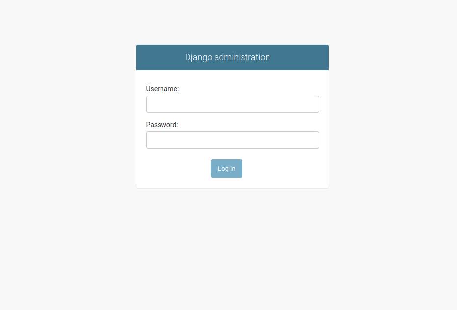
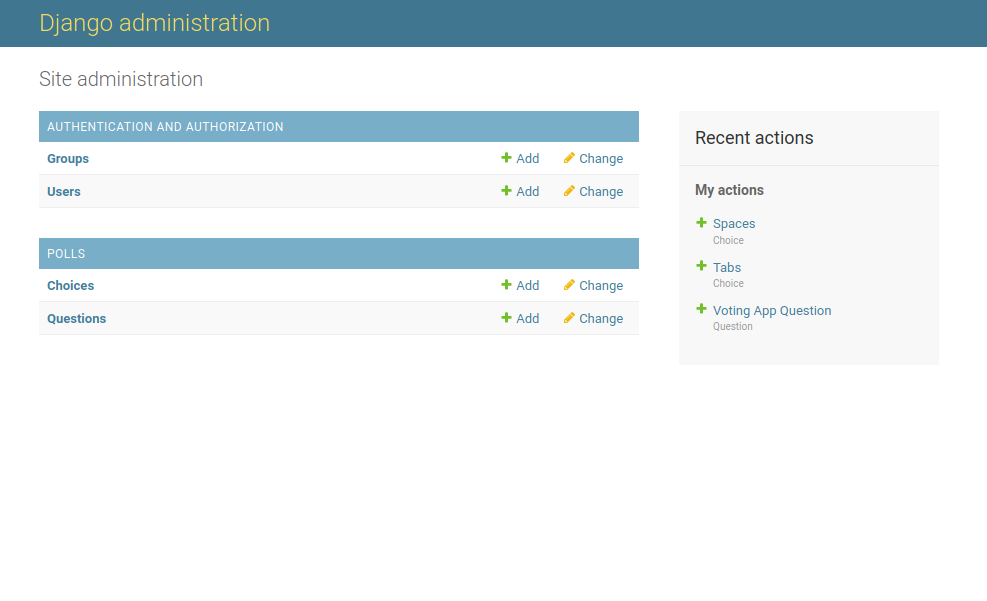
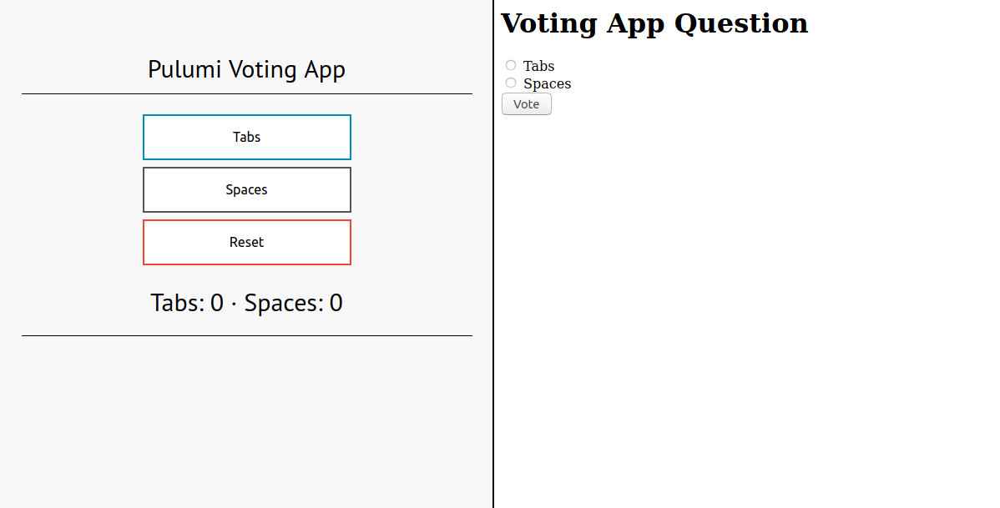

In this blog post, we will finish swapping out the frontend and backend of our [Python AWS application](). Although Flask and Redis are different from Django and MySQL in many ways, the underlying infrastructure behind their deployment is nonetheless very similar, and can be effortlessly updated as we transition from one to the other.

<!--more-->

We will be paying additional attention to security, and will be making use of Pulumi's secret management tools to protect our passwords and private keys.

The first step is to create a new directory and initialize a Pulumi project with `pulumi new aws-python`.

```bash
$ mkdir aws-django-voting-app && cd aws-django-voting-app
$ pulumi new aws-python
```

Next, let's create a folder to hold our application and start a Django project in it.

```bash
$ mkdir frontend && cd frontend
$ django-admin startproject mysite
$ cd mysite
```

This tutorial was written for the [aws-django-voting-app example](https://github.com/pulumi/examples/tree/master/aws-django-voting-app) but will work with any other Django application. The most important file is `./mysite/settings.py`, which we will modify to accept secrets and configuration parameters in the form of environment variables. A common mistake that programmers make is to submit files with important data to source code repositories. Even if it is a private repository, it is still not recommended to leave passwords and private keys in your files.

```python
SECRET_KEY = os.environ['SECRET_KEY']
```

```python
DATABASES = {
    'default': {
        'ENGINE': 'django.db.backends.mysql',
        'NAME': os.environ['DATABASE_NAME'],
        'USER': os.environ['USER_NAME'],
        'PASSWORD': os.environ['USER_PASSWORD'],
        'HOST': os.environ['DATABASE_ADDRESS'],
        'PORT': os.environ['DATABASE_PORT'],
    }
}
```

To perform database migrations as part of the deployment, we will create a `setupDatabase.sh` script inside the `aws-django-voting-app/frontend/mysite` folder. As a bonus, the script will create an admin account that we can use to log into our website. Make sure the file has exec permissions.

```bash
#!/bin/bash
set -exu
python3 /mysite/manage.py makemigrations
python3 /mysite/manage.py migrate
export DJANGO_SUPERUSER_PASSWORD=$DJANGO_PASSWORD
python3 /mysite/manage.py createsuperuser \
    --no-input \
    --username=$DJANGO_NAME \
    --email=$DJANGO_NAME@example.com
```

The next step is to go back into the `aws-django-voting-app/frontend` folder and containerize our application with Docker. First, we will list the libraries our application uses by creating a `requirements.txt` file with the following lines.

```python
django==3.1
mysqlclient==1.4.0
```

And lastly, we can create the `Dockerfile`.

```bash
FROM ubuntu:18.04

WORKDIR /

EXPOSE 80

RUN apt-get update && \
    apt install -y gcc python3-dev python3-pip mysql-client-core-5.7 libmysqlclient-dev

ADD requirements.txt /

RUN pip3 install -r requirements.txt

ADD mysite /mysite

CMD [ "python3", "/mysite/manage.py", "runserver", "0.0.0.0:80" ]
```

Now that our Django application and Dockerfile are ready, we can return to the main `aws-django-voting-app` folder. The Pulumi project requires several configuration variables, which we set using `pulumi config set`. They are used to configure the MySQL admin account, a user account for initializing the table, and the Django website admin account. The private key that Django uses will also be passed in the same way.

```bash
$ pulumi config set sql-admin-name <NAME>
$ pulumi config set sql-admin-password <PASSWORD> --secret
$ pulumi config set sql-user-name <NAME>
$ pulumi config set sql-user-password <PASSWORD> --secret
$ pulumi config set django-admin-name <NAME>
$ pulumi config set django-admin-password <PASSWORD> --secret
$ pulumi config set django_secret_key = <VALUE> --secret
```

The `requirements.txt` file lists the libraries used by the project. We will need to add the following:

```python
pulumi-docker>=2.0.0,<3.0.0
pulumi-mysql>=2.0.0,<3.0.0
mysql-connector-python>=1.0.0,<10.0.0
```

The first few lines of our `__main__.py` file indicate the libraries to import and describe the application's configuration options.

```python
import json
import base64
import pulumi
import pulumi_aws as aws
import pulumi_docker as docker
import pulumi_mysql as mysql

config = pulumi.Config()
sql_admin_name = config.require("sql-admin-name")
sql_admin_password = config.require_secret("sql-admin-password")
sql_user_name = config.require("sql-user-name")
sql_user_password = config.require_secret("sql-user-password")
availability_zone = pulumi.Config("aws").get("region")

django_admin_name = config.require("django-admin-name")
django_admin_password = config.require_secret("django-admin-password")

django_secret_key = config.require_secret("django-secret-key")
```

After setting up the imports and configurations, we create an ECS Cluster, VPC, Subnet, RDS instance, and several other items. All the components are identical to the ones in the [first]() and [second]() blog posts, and the full code can be seen in this example's [github repository](https://github.com/pulumi/examples/tree/master/aws-django-voting-app).

```python
app_cluster = aws.ecs.Cluster(...)

app_vpc = aws.ec2.Vpc(...)
app_vpc_subnet = aws.ec2.Subnet(...)

app_gateway = aws.ec2.InternetGateway(...)
app_routetable = aws.ec2.RouteTable(...)
app_security_group = aws.ec2.SecurityGroup(...)

app_exec_role = aws.iam.Role(...)
exec_policy_attachment = aws.iam.RolePolicyAttachment(...)
app_task_role = aws.iam.Role(...)
task_policy_attachment = aws.iam.RolePolicyAttachment(...)
task_policy_attachment = aws.iam.RolePolicyAttachment(...)

app_ecr_repo = aws.ecr.Repository(...)
app_lifecycle_policy = aws.ecr.LifecyclePolicy(...)

extra_rds_subnet = aws.ec2.Subnet(...)
app_database_subnetgroup = aws.rds.SubnetGroup(...)
mysql_rds_server = aws.rds.Instance(...)
mysql_provider = mysql.Provider(...)
mysql_database = mysql.Database(...)
mysql_user = mysql.User(...)
mysql_access_grant = mysql.Grant(...)
```

With the basic infrastructure and MySQL backend in place, all that's left is to create the Django frontend.

A target group, balancer, and listener are created for the frontend.

```python
django_targetgroup = aws.lb.TargetGroup("django-targetgroup",
	port=80,
	protocol="TCP",
	target_type="ip",
    stickiness= {
        "enabled": False,
        "type": "lb_cookie",
    },
	vpc_id=app_vpc.id)

django_balancer = aws.lb.LoadBalancer("django-balancer",
    load_balancer_type="network",
    internal=False,
    security_groups=[],
    subnets=[app_vpc_subnet.id])

django_listener = aws.lb.Listener("django-listener",
	load_balancer_arn=django_balancer.arn,
	port=80,
    protocol="TCP",
	default_actions=[{
		"type": "forward",
		"target_group_arn": django_targetgroup.arn
	}])
```

The application is built into a Docker image and pushed to our ECR repository we created
earlier.

```python
def get_registry_info(rid):
    creds = aws.ecr.get_credentials(registry_id=rid)
    decoded = base64.b64decode(creds.authorization_token).decode()
    parts = decoded.split(':')
    if len(parts) != 2:
        raise Exception("Invalid credentials")
    return docker.ImageRegistry(creds.proxy_endpoint, parts[0], parts[1])

app_registry = app_ecr_repo.registry_id.apply(get_registry_info)

django_image = docker.Image("django-dockerimage",
    image_name=app_ecr_repo.repository_url,
    build="./frontend",
    skip_push=False,
    registry=app_registry
)
```

To help with debugging our application, we will create a Cloudwatch instance to store all logs.

```python
django_log_group = aws.cloudwatch.LogGroup("django-log-group",
    retention_in_days=1,
    name="django-log-group"
)
```

Our project is special because it uses two independant ECS services---one that sets up the MySQL
database, and one that continuously runs and handles the website.

While it is possible to have a single ECS service set up both the database and the server, doing
so presents the risk of exposing important information to the internet. To set up the database,
the ECS service would need to know our MySQL admin credendtials. However, since the service would
also handle the website, it would mean that a successful attack on our Django website
could allow the attacker to access the credentials for our backend.

First, let's create the task definition that runs once and sets up the database.

```python
django_database_task_definition = aws.ecs.TaskDefinition("django-database-task-definition",
    family="django_database_task_definition-family",
    cpu="256",
    memory="512",
    network_mode="awsvpc",
    requires_compatibilities=["FARGATE"],
    execution_role_arn=app_exec_role.arn,
    task_role_arn=app_task_role.arn,
    container_definitions=pulumi.Output.all(
            # We must do Output.all() to access Pulumi secrets
            django_image.image_name,
            django_secret_key,
            mysql_database.name,
            sql_admin_name,
            sql_admin_password,
            django_admin_name,
            django_admin_password,
            mysql_rds_server.address,
            mysql_rds_server.port).apply(lambda args: json.dumps([{
        "name": "django-container",
        "image": args[0],
        "memory": 512,
        "essential": True,
        "portMappings": [{
            "containerPort": 80,
            "hostPort": 80,
            "protocol": "tcp"
        }],
        "environment": [
            { "name": "SECRET_KEY", "value": args[1]  },
            { "name": "DATABASE_NAME", "value": args[2]  },
            { "name": "USER_NAME", "value": args[3]  },
            { "name": "USER_PASSWORD", "value": args[4]  },
            { "name": "DJANGO_NAME", "value": args[5]  },
            { "name": "DJANGO_PASSWORD", "value": args[6]  },
            { "name": "DATABASE_ADDRESS", "value": args[7]  },
            { "name": "DATABASE_PORT", "value": str(int(args[8]))  },
        ],
        "logConfiguration": {
            "logDriver": "awslogs",
            "options": {
                "awslogs-group": "django-log-group",
                "awslogs-region": "us-west-2",
                "awslogs-stream-prefix": "djangoApp-database",
            },
        },
        # We override the command in the Dockerfile with a new one
        "command": ["/mysite/setupDatabase.sh"]
    }])))
```

We can now launch our first service on Fargate.

```python
django_database_service = aws.ecs.Service("django-database-service",
	cluster=app_cluster.arn,
    desired_count=1,
    launch_type="FARGATE",
    task_definition=django_database_task_definition.arn,
    wait_for_steady_state=False,
    network_configuration={
		"assign_public_ip": "true",
		"subnets": [app_vpc_subnet.id],
		"security_groups": [app_security_group.id]
	},
    load_balancers=[{
		"target_group_arn": django_targetgroup.arn,
		"container_name": "django-container",
		"container_port": 80,
	}],
    opts=pulumi.ResourceOptions(depends_on=[django_listener]),
)
```

Finally, let's create the second task definition to run the website.

```python
django_site_task_definition = aws.ecs.TaskDefinition("django-site-task-definition",
    family="django-site-task-definition-family",
    cpu="256",
    memory="512",
    network_mode="awsvpc",
    requires_compatibilities=["FARGATE"],
    execution_role_arn=app_exec_role.arn,
    task_role_arn=app_task_role.arn,
    container_definitions=pulumi.Output.all(
            django_image.image_name,
            django_secret_key,
            mysql_database.name,
            sql_user_name,
            sql_user_password,
            mysql_rds_server.address,
            mysql_rds_server.port).apply(lambda args: json.dumps([{
        "name": "django-container",
        "image": args[0],
        "memory": 512,
        "essential": True,
        "portMappings": [{
            "containerPort": 80,
            "hostPort": 80,
            "protocol": "tcp"
        }],
        "environment": [
            { "name": "SECRET_KEY", "value": args[1]  },
            { "name": "DATABASE_NAME", "value": args[2]  },
            { "name": "USER_NAME", "value": args[3]  },
            { "name": "USER_PASSWORD", "value": args[4]  },
            { "name": "DATABASE_ADDRESS", "value": args[5]  },
            { "name": "DATABASE_PORT", "value": str(int(args[6]))  },
        ],
        "logConfiguration": {
            "logDriver": "awslogs",
            "options": {
                "awslogs-group": "django-log-group",
                "awslogs-region": "us-west-2",
                "awslogs-stream-prefix": "djangoApp-site",
            },
        },
    }])))
```

Similarly, we will launch our second task definition on Fargate.

```python
django_site_service = aws.ecs.Service("django-site-service",
	cluster=app_cluster.arn,
    desired_count=1,
    launch_type="FARGATE",
    task_definition=django_site_task_definition.arn,
    wait_for_steady_state=False,
    network_configuration={
		"assign_public_ip": "true",
		"subnets": [app_vpc_subnet.id],
		"security_groups": [app_security_group.id]
	},
    load_balancers=[{
		"target_group_arn": django_targetgroup.arn,
		"container_name": "django-container",
		"container_port": 80,
	}],
    opts=pulumi.ResourceOptions(depends_on=[django_listener]),
```

To connect to our application, we export the DNS name of the Django balancer and open it
in a browser window.

```python
pulumi.export("app-url", django_balancer.dns_name)
```

To add questions to the database, add "/admin/" to the end of the URL,
and log in using your Django admin credentials.



The Administration panel allows you to manage the state of your application. Groups, users,
choices, and questions can all be added easily.



Comparison between Flask and Django:



In this example, I described how to set up a basic Django voting application and deploy it to AWS. Although our Django and Flask applications use very different AWS services, we seamlessly replaced the previous infrastructure with what was needed.

Next week, we'll explore PostgreSQL, Express, React, and Node.js, and use them to create a simple application.

The blog post's full code and an in-depth explanation for each component are on [Github](https://github.com/pulumi/examples/tree/master/aws-django-voting-app).
