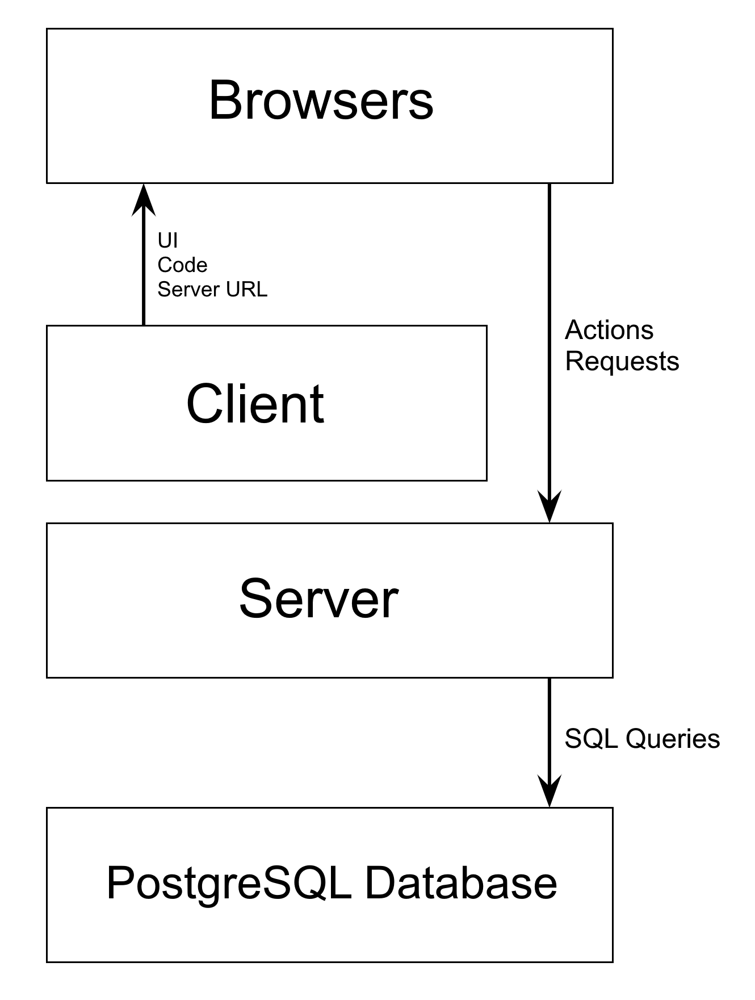

In this blog post, we will explore PERN stack applications and deploy one to AWS. *PERN* is an acronym for PostgreSQL, Express, React, and Node. A PERN stack application is a project that uses PostgreSQL, Express as an application framework, React as a user interface framework, and runs on Node. We will also use [Pulumi Crosswalk]() to reduce the amount of code and provide a quick and straightforward path for deploying the application.

<!--more-->

PERN projects have four distinct tiers:

- a database that keeps track of our data,

- a stateless server that receives commands to manage the database,

- a clientside server that contains and renders the user interface code,

- and the users who run the code in their browsers and send requests to the stateless server.



An advantage of infrastructure as code is that the application and infrastructure deployment can use the same language. As React and the other components use NodeJS, we'll use it for our infrastructure by writing it in TypeScript. The first step is to create a new directory and initialize a Pulumi project with `pulumi new aws-typescript`.

```bash
$ mkdir aws-pern-voting-app && cd aws-pern-voting-app
$ pulumi new aws-typescript
```

This tutorial was written for the [aws-pern-voting-app example](https://github.com/pulumi/examples/tree/master/aws-pern-voting-app) but will work with any other PERN stack application. The example uses two folders to hold the client and server tiers and a Dockerfile that builds images that run as containers in AWS.

To deploy our PERN stack, the project requires several configuration variables, which we set using `pulumi config set`. The variables are used to configure the PostgreSQL admin account, a user account for initializing the schema and table, and the database's region.

```bash
$ pulumi config set sql-admin-name <NAME>
$ pulumi config set sql-admin-password <PASSWORD> --secret
$ pulumi config set sql-user-name <NAME>
$ pulumi config set sql-user-password <PASSWORD> --secret
$ pulumi config set aws:region <REGION>
```

The `package.json` file lists the libraries used by the project. We will add the following to the `dependencies` section:

```json
"@pulumi/cloud-aws": "^0.19.0",
"@pulumi/postgresql": "^2.3.0",
"pg": "^8.3.3"
```

Our project uses a Dynamic Provider to help create tables and Schemas. It offers the same features as our [MySQL provider](), but for PostgreSQL.

```typescript
import * as pulumi from "@pulumi/pulumi";
import * as crypto from "crypto";

export interface SchemaInputs {
    creatorName: pulumi.Input<string>
    creatorPassword: pulumi.Input<string>
    serverAddress: pulumi.Input<string>
    databaseName: pulumi.Input<string>
    creationScript: pulumi.Input<string>
    deletionScript: pulumi.Input<string>
    postgresUserName: pulumi.Input<string>
}

export class SchemaProvider implements pulumi.dynamic.ResourceProvider {
    async create(args: SchemaInputs): Promise<pulumi.dynamic.CreateResult> {
        const { Pool } = require("pg");
        const pool = new Pool({
            user: args.creatorName,
            password: args.creatorPassword,
            host: args.serverAddress,
            port: 2000,
            database: args.databaseName
        });
        const scriptExecuted = await pool.query(args.creationScript);

        await pool.end();
        return {id: "postgresqlSchema-" + crypto.randomBytes(16).toString('hex'), outs: args};
    }

    async delete(id: string, args: SchemaInputs): Promise<void> {
        const { Pool } = require("pg");
        const pool = new Pool({
            user: args.creatorName,
            password: args.creatorPassword,
            host: args.serverAddress,
            port: 2000,
            database: args.databaseName
        });
        const scriptExecuted = await pool.query(args.deletionScript);
        await pool.end();
    }

    async diff(id: string, oldArgs: SchemaInputs, newArgs: SchemaInputs): Promise<pulumi.dynamic.DiffResult> {
        let changes: boolean = ((oldArgs.creatorName != newArgs.creatorName) ||
            (oldArgs.creatorPassword != newArgs.creatorPassword) || (oldArgs.serverAddress != newArgs.serverAddress) ||
            (oldArgs.databaseName != newArgs.databaseName) || (oldArgs.creationScript != newArgs.creationScript) ||
            (oldArgs.deletionScript != newArgs.deletionScript));

        let replaces: string[] = [];
        if (oldArgs.serverAddress != newArgs.serverAddress) { replaces.push("serverAddress") };
        if (oldArgs.databaseName != newArgs.databaseName) { replaces.push("databaseName") };
        if (oldArgs.creationScript != newArgs.creationScript) { replaces.push("creationScript") };

        return {
            changes: changes,
            replaces: replaces,
            stables: [],
            deleteBeforeReplace: true
        }
    }

    async update(id: string, oldArgs: SchemaInputs, newArgs: SchemaInputs): Promise<pulumi.dynamic.UpdateResult> {
        return { outs: newArgs };
    }
}

export class Schema extends pulumi.dynamic.Resource {
    public readonly creatorName!: pulumi.Output<string>;
    public readonly creatorPassword!: pulumi.Output<string>;
    public readonly serverAddress!: pulumi.Output<string>;
    public readonly databaseName!: pulumi.Output<string>;
    public readonly creationScript!: pulumi.Output<string>;
    public readonly deletionScript!: pulumi.Output<string>;
    constructor(name: string, args: SchemaInputs) {
        super(new SchemaProvider, name, args);
    }
}
```

With the Dynamic provider configured, we can focus on the main `index.ts` file. We start with importing libraries and describing the application's configuration options.

```typescript
import * as aws from "@pulumi/aws";
import * as awsx from "@pulumi/awsx";
import * as pulumi from "@pulumi/pulumi";
import * as postgresql from "@pulumi/postgresql";
import { Schema } from "./PostgreSqlDynamicProvider";
import { table } from "console";

const config = new pulumi.Config();
const sql_admin_name = config.require("sql-admin-name");
const sql_admin_password = config.requireSecret("sql-admin-password");
const sql_user_name = config.require("sql-user-name");
const sql_user_password = config.requireSecret("sql-user-password");
const awsConfig = new pulumi.Config("aws");
const availabilityZone = awsConfig.get("region");
```

Apart from language differences, the code for creating the VPC, subnets, and tables is almost identical to our previous projects. Since we will be using Crosswalk, we can leave out a few components that will be automatically created later.

```typescript
const appVpc = new aws.ec2.Vpc("app-vpc", {
    cidrBlock: "172.31.0.0/16",
    enableDnsHostnames: true
});

const appGateway = new aws.ec2.InternetGateway("app-gateway", {
    vpcId: appVpc.id
});

const appRoutetable = new aws.ec2.RouteTable("app-routetable", {
    routes: [
        {
            cidrBlock: "0.0.0.0/0",
            gatewayId: appGateway.id,
        }
    ],
    vpcId: appVpc.id
});

const appRoutetableAssociation = new aws.ec2.MainRouteTableAssociation("app-routetable-association", {
    routeTableId: appRoutetable.id,
    vpcId: appVpc.id
});

const rdsSecurityGroup = new aws.ec2.SecurityGroup("rds-security-group", {
	vpcId: appVpc.id,
	description: "Enables HTTP access",
    ingress: [{
		protocol: 'tcp',
		fromPort: 0,
		toPort: 65535,
		cidrBlocks: ['0.0.0.0/0'],
    }],
    egress: [{
		protocol: '-1',
		fromPort: 0,
		toPort: 0,
		cidrBlocks: ['0.0.0.0/0'],
    }]
});

const firstRdsSubnet = new aws.ec2.Subnet("first-rds-subnet", {
    vpcId: appVpc.id,
    cidrBlock: "172.31.0.0/20",
    availabilityZone: availabilityZone + "a"
});

const secondRdsSubnet = new aws.ec2.Subnet("second-rds-subnet", {
    vpcId: appVpc.id,
    cidrBlock: "172.31.128.0/20",
    availabilityZone: availabilityZone + "b"
});
```

We create a SubnetGroup and an RDS instance. The latter uses PostgreSQL instead of MySQL, and is assigned 2000.

```typescript
const rdsSubnetGroup = new aws.rds.SubnetGroup("rds-subnet-group", {
    subnetIds: [firstRdsSubnet.id, secondRdsSubnet.id]
});

const postgresqlRdsServer = new aws.rds.Instance("postgresql-rds-server", {
    engine: "postgres",
    username: sql_admin_name,
    password: sql_admin_password,
    instanceClass: "db.t2.micro",
    allocatedStorage: 20,
    skipFinalSnapshot: true,
    publiclyAccessible: true,
    port: 2000,
    dbSubnetGroupName: rdsSubnetGroup.name,
    vpcSecurityGroupIds: [rdsSecurityGroup.id]
});
```

Pulumi offers additional tools to make handling PostgreSQL easier.

```typescript
const postgresqlProvider = new postgresql.Provider("postgresql-provider", {
        host: postgresqlRdsServer.address,
        port: postgresqlRdsServer.port,
        username: sql_admin_name,
        password: sql_admin_password,
        superuser: false
});
```

We initialize the example database and create a user to manage it.

```typescript
const postgresDatabase = new postgresql.Database("postgresql-database", {
    name: "votes"}, {
    provider: postgresqlProvider
});

const postgresUser = new postgresql.Role("postgres-standard-role", {
    name: sql_user_name,
    password: sql_user_password,
    superuser: false,
    login: true,
    connectionLimit: -1}, {
    provider: postgresqlProvider
});
```

We use the Dynamic provider to create a schema and a table, grant permissions for our user to edit and select it, and populate the table with two initial voting options.

```typescript
const creation_script = `
    CREATE SCHEMA voting_app;
    CREATE TABLE voting_app.choice(
        choice_id SERIAL PRIMARY KEY,
        text VARCHAR(255) NOT NULL,
        vote_count INTEGER NOT NULL
    );
    GRANT USAGE ON SCHEMA voting_app TO ${sql_user_name};
    GRANT SELECT, UPDATE ON ALL TABLES IN SCHEMA voting_app TO ${sql_user_name};
    INSERT INTO voting_app.choice (text, vote_count) VALUES('Tabs', 0);
    INSERT INTO voting_app.choice (text, vote_count) VALUES('Spaces', 0);
`;

const deletion_script = "DROP SCHEMA IF EXISTS voting_app CASCADE";

const postgresqlVotesTable = new Schema("postgresql-votes-schema", {
    creatorName: sql_admin_name,
    creatorPassword: sql_admin_password,
    serverAddress: postgresqlRdsServer.address,
    databaseName: postgresDatabase.name,
    creationScript: creation_script,
    deletionScript: deletion_script,
    postgresUserName: postgresUser.name
});
```

With the basic infrastructure and provider completed, we can write the application deployment code to ECS. We will use Pulumi Crosswalk, a collection of libraries that makes common infrastructure-as-code tasks in AWS easier and more secure by automatically using well-architected best practices.

We'll first set up the server. The Network Listener is assigned the same port as the server, which is, in our case, port 5000. A set of environment variables representing our PostgreSQL connection credentials are passed directly to the `awsx.ecs.FargateService`. With AWS Crosswalk, what would have been over 150 lines of code is reduced to just under 20 lines of code.

```typescript
const serversideListener = new awsx.elasticloadbalancingv2.NetworkListener("server-side-listener", { port: 5000 });
const serversideService = new awsx.ecs.FargateService("server-side-service", {
    taskDefinitionArgs: {
        containers: {
            serversideService: {
                image: awsx.ecs.Image.fromPath("server-side-service", "./serverside"),
                memory: 512,
                portMappings: [serversideListener],
                environment: [
                    { name: "USER_NAME", value: sql_user_name },
                    { name: "USER_PASSWORD", value: sql_user_password },
                    { name: "RDS_ADDRESS", value: postgresqlRdsServer.address },
                    { name: "RDS_PORT", value: String(2000) },
                    { name: "DATABASE_NAME", value: postgresDatabase.name },
                ],
            },
        },
    },
});
```

The same is true for the client service, which is reduced to a short and easy to understand format. By default, React uses port 3000, but it can set to a different port. The `SERVER_HOSTNAME` environment variable is passed in when the container starts to generate a tiny configuration file at runtime called `serverParams.js` with the URL. This way, we do not have to rebuild the entire docker image should the server URL change.

```typescript
const clientsideListener = new awsx.elasticloadbalancingv2.NetworkListener("client-side-listener", { port: 3000 });
const clientsideService = new awsx.ecs.FargateService("client-side-service", {
    taskDefinitionArgs: {
        containers: {
            clientsideService: {
                image: awsx.ecs.Image.fromPath("client-side-service", "./clientside"),
                memory: 512,
                portMappings: [clientsideListener],
                environment: [
                    { name: "SERVER_HOSTNAME", value: serversideListener.endpoint.hostname },
                ],
            },
        },
    },
});
```

To make our PERN stack application available on the Internet, we export the clientside listener's address. We can open a browser window with the URL and port to view our application.

```typescript
export let URL = clientsideListener.endpoint.hostname;
```

In this example, I explained the basic principles behind PERN stack applications and showed how to create the infrastructure to deploy them on ECS. A flexible and optimized tool, Pulumi Crosswalk supports rapidly prototyping applications, scaling workloads, securing and integrating applications in existing infrastructure, and going to production in multiple complex environments.

Next week, I'll demonstrate how to integrate applications with Kubernetes, and seamlessly deploy them to EKS using Pulumi.

The blog post's code can be [found on Github](https://github.com/pulumi/examples/tree/master/aws-pern-voting-app).
