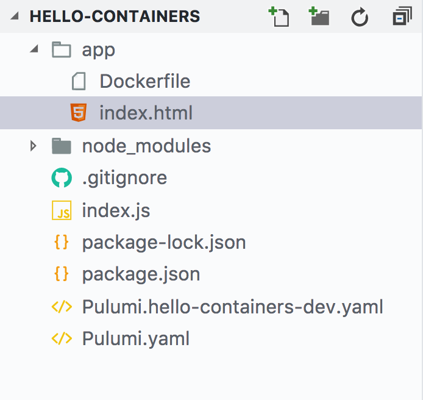
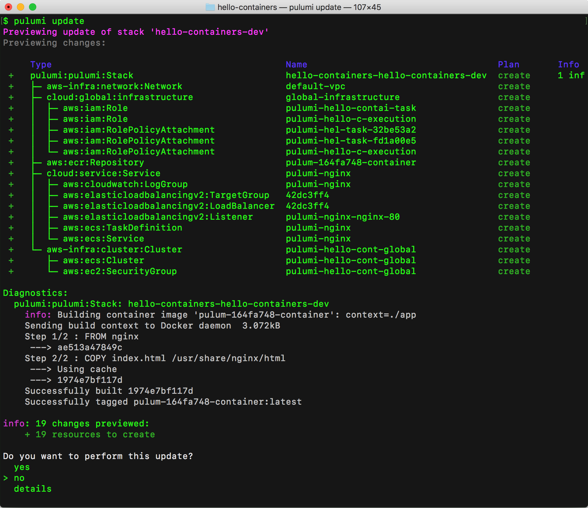
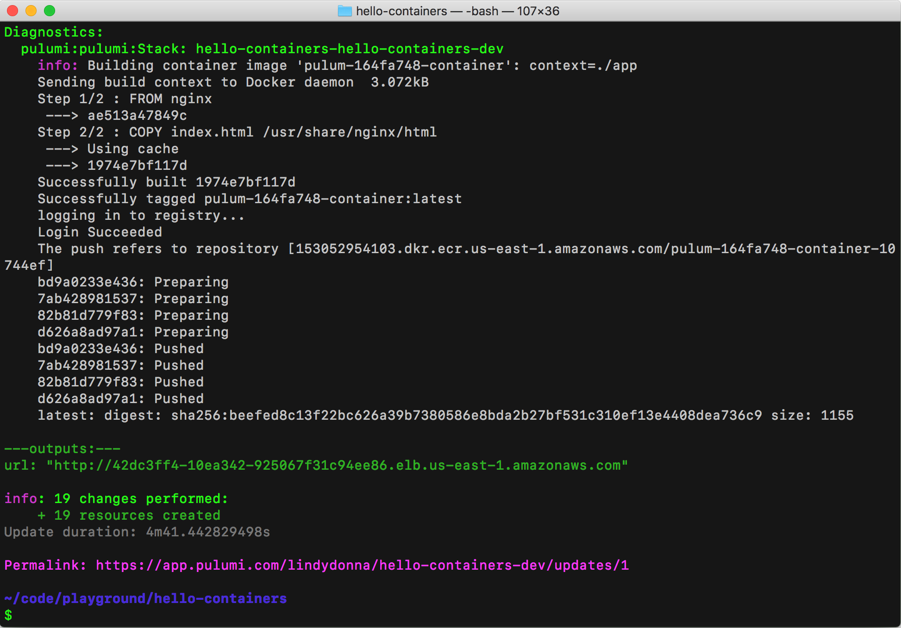

Containers are a great way to deploy applications to the cloud,
especially with new execution models like [AWS
Fargate](https://aws.amazon.com/fargate/). Pulumi makes it easy to
deploy production Docker containers, handling details such as creating a
container registry instance in ECR, creating task definitions in ECS,
and configuring a load balancer. With Pulumi, deploying a container to
production is almost as easy as running it locally!

In this blog post, we'll deploy a simple Docker container running
NGINX.

## Setup

If this is your first time using Pulumi, go to
[https://app.pulumi.com](https://app.pulumi.com/) and sign in with
GitHub.

Then, run the following command to install the Pulumi CLI:

    $ curl -fsSL https://get.pulumi.com/ | sh

If you're on Windows, run this:

    @"%SystemRoot%System32WindowsPowerShell1.0powershell.exe" -NoProfile -InputFormat None -ExecutionPolicy Bypass -Command "iex ((New-Object System.Net.WebClient).DownloadString('https://get.pulumi.com/install.ps1'))" 
    SET "PATH=%PATH%;%USERPROFILE%.pulumiin"

You'll deploy this app to your own AWS account, so follow the steps to
[configure your AWS account]().

Make sure you have [Node.js](https://nodejs.org/en/download/) installed,
with a version of 6.10.x or later.

Finally, make sure [Docker](https://docs.docker.com/install/) is
installed and running.

## Create the app

We'll create a Pulumi project, define the infrastructure in JavaScript,
and create a Dockerfile.

To create a new Pulumi project, run the following commands:

```bash
mkdir hello-containers && cd hello-containers
pulumi new aws-javascript
```

This creates a new project in the directory `hello-containers`. Next, replace the contents of `index.js` with the following:

```javascript
const cloud = require("@pulumi/cloud-aws"); 
let service = new cloud.Service("pulumi-nginx", { 
    containers: { 
        nginx: { 
            build: "./app", 
            memory: 128, 
            ports: [{ port: 80 }], 
        }, 
    }, 
    replicas: 2, 
}); 

/* export just the hostname property of the container frontend */
exports.url = service.defaultEndpoint.apply(e => `http://${e.hostname}`);
```


These 15 lines of code are everything you need to deploy a custom
container! We're using `cloud.Service`, which is a high-level,
convenient interface for building containers and provisioning an AWS
container service. Using the `build `property, we point to a folder
containing a `Dockerfile`, which is `app` in this case.

Now, let's create a `Dockerfile` and a static page. Create a
subfolder `app` with the following files.

Add the following as `Dockerfile`:

```
FROM nginx

COPY index.html /usr/share/nginx/html
```

Add the following as `index.html`:

```html
<html>
    <head>
    <title>Hello World</title>
    <meta charset="UTF-8">
    </head>
    <body>
    <p>Hello containers!</p>
    <p>Made with ❤️ with <a href="https://pulumi.com">Pulumi</a></p>
    </body>
</html>
```

You should have the following directory structure:



4. Install the `@pulumi/cloud-aws` NPM package:

    npm install --save @pulumi/cloud-aws @pulumi/cloud

5. Configure Pulumi to use AWS Fargate. Note that, currently, Fargate is
available only in `us-east-1`, `us-east-2`, `us-west-2`, and
`eu-west-1`.

    pulumi config set cloud-aws:useFargate true

## Deploy the app

To deploy both the infrastructure and app code, we'll run
`pulumi update`. This command first shows a preview of all the resources
that will be created and prompts for confirmation. During the preview
phase, Pulumi invokes `docker build`. 



Choose the `yes` option to deploy to AWS. This will take about 5
minutes. Pulumi automatically builds and provisions an AWS container
repository in ECR, builds the Docker container, and places the image in
the repository. This all happens automatically and does not require
manual configuration on your part.

At the end of the update, you'll see a link to the Pulumi Console that
shows the details of the deployment.



Go to this link and click the **Resources** tab. You'll see all the
resources you've created. Notice that Pulumi has created an ECR
repository, a load balancer, an ECS service and task definition, and IAM
roles.

Now, go back to the stack details page, which shows the stack
configuration, as well as the stack output property. The following line
creates the stack output `url`:

`` exports.url = service.defaultEndpoint.apply(e => `http://${e.hostname}`); ``

If you navigate to the link for `url` you'll see the following page: 


## View logs

You can view container frontend and compute logs via the `pulumi logs`
command. You can see here that most of the traffic is hitting routes
that don't exist, aside from the last log line where I navigated to the
site using Chrome. Since this is an HTTP server that's open to the
internet, it's not uncommon for attackers to try to find a security
vulnerability on a site. Fortunately, our container is serving only
static content. The logs command makes it easy to get details on your
site traffic.

    $ pulumi logs
    Collecting logs for stack hello-containers-dev since 2018-06-15T15:01:18.000-07:00.

     2018-06-15T15:27:47.468-07:00[                  pulumi-nginx] 2018/06/15 22:27:47 [error] 5#5: *4 open() "/usr/share/nginx/html/proxychecker.axd" failed (2: No such file or directory), client: 62.210.157.152, server: localhost, request: "GET http://proxy.dazhou.net/proxychecker.axd?e=457758511%40qq.com&p=http%3A%2F%2F34.201.27.186%3A80&s=AS HTTP/1.1", host: "proxy.dazhou.net"
     2018-06-15T15:27:47.468-07:00[                  pulumi-nginx] 62.210.157.152 - - [15/Jun/2018:22:27:47 +0000] "GET http://proxy.dazhou.net/proxychecker.axd?e=457758511%40qq.com&p=http%3A%2F%2F34.201.27.186%3A80&s=AS HTTP/1.1" 404 170 "-" "Go-http-client/1.1" "-"
     2018-06-15T15:32:02.128-07:00[                  pulumi-nginx] 2018/06/15 22:32:02 [error] 5#5: *382 "/usr/share/nginx/html/phpmyadmin/index.html" is not found (2: No such file or directory), client: 178.239.177.212, server: localhost, request: "HEAD http://34.201.27.186:80/phpmyadmin/ HTTP/1.1", host: "34.201.27.186"
     2018-06-15T16:07:05.874-07:00[                  pulumi-nginx] 172.31.44.144 - - [15/Jun/2018:23:07:05 +0000] "GET / HTTP/1.1" 304 0 "-" "Mozilla/5.0 (Macintosh; Intel Mac OS X 10_13_4) AppleWebKit/537.36 (KHTML, like Gecko) Chrome/67.0.3396.87 Safari/537.36" "-" 

## Clean up

To clean up the resources we've provisioned, run `pulumi destroy`.

## Next steps

The [sample code for this post](https://github.com/pulumi/examples/tree/master/cloud-js-containers)
is available in the [Pulumi examples repo on GitHub](https://github.com/pulumi/examples). For an example application
that connects two containers, see the [Voting App](https://github.com/pulumi/examples/tree/master/cloud-ts-voting-app)
TypeScript sample.
