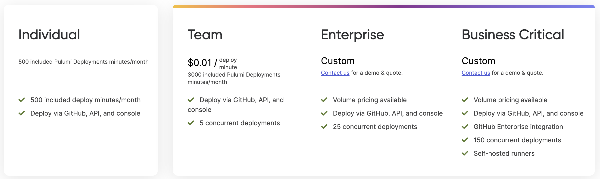
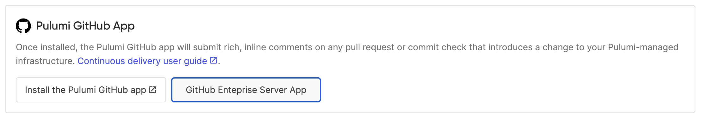
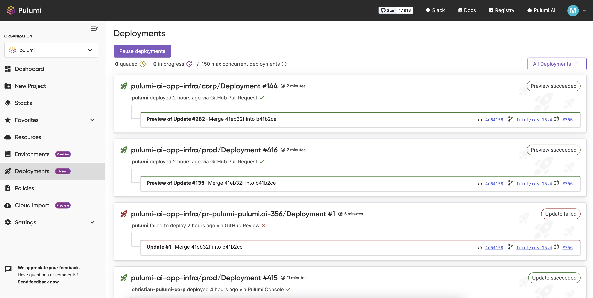
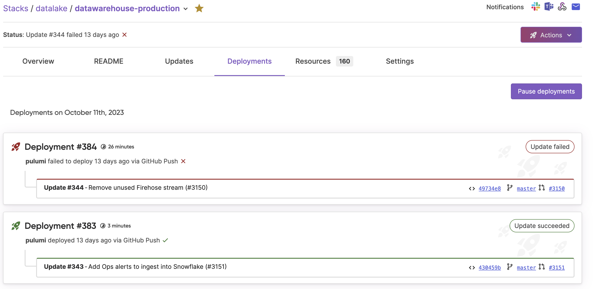

We are thrilled to announce the general availability (GA) of [Pulumi Deployments](/docs/pulumi-cloud/deployments), a fully managed platform designed to simplify and accelerate your journey from code to cloud. Whether you're an organization just beginning your cloud journey or a platform team supporting thousands of engineers, Pulumi Deployments is your go-to solution for managing infrastructure at scale. With the GA of Pulumi Deployments comes a suite of feature improvements since launch and a pricing model starting November 1st.

<!--more-->

## Introduction to Pulumi Deployments

Pulumi Deployments is a fully managed platform engineered to streamline your infrastructure management tasks, offering an unparalleled blend of scalability, automation, and control. Designed with the needs of platform teams and cloud engineers in mind, this platform allows you to execute a range of infrastructure as code actions—such as previews, updates, destroys, and refreshes—right within Pulumi's managed service. Through a centralized configuration system, it bundles all your deployment necessities like source code, cloud credentials, and environment variables into a single, atomic unit, thereby eliminating the complexities often associated with stack management. Whether you want to trigger deployments via a simple click in the Pulumi Cloud UI or leverage REST APIs for custom automation workflows, Pulumi Deployments offers the flexibility and building blocks you need to efficiently go from code to cloud.

"Pulumi Deployments is easier to set up for new projects than our in-house developed CI/CD pipelines for running Pulumi, it’s more fully featured and it has much better integration with our version control system. The best part is that I don’t have to maintain it myself so I can spend more time focused on managing infrastructure.”  said Mark Morlino, DevOps Engineer at Boost Insurance.

## A Year in Review: Paving the Fastest Way to Go from Code to Cloud

It's been a year since we launched Pulumi Deployments and we have seen incredible adoption, with hundreds of Pulumi Cloud customers leveraging it, thousands of stacks with deployment settings configured and hundreds of thousands of deployments executed. This success would not have been possible without the customers who spent time with us outlining their deployment challenges and iterating with us as we built solutions for them.

1. OpenID Connect (OIDC) Configuration: OIDC enables your deployments to exchange a signed, short-lived token issued by the Pulumi Cloud for short-term credentials from your cloud provider.
2. Scalability Improvements: We added concurrency limits, made security improvements and increased deployment capacity.
3. Review Stacks: We build a top requested feature, Review Stacks: dedicated cloud environments that get created automatically every time a pull request is opened, powered by Pulumi Deployments.
4. Dependent Stack Updates: Trigger updates on one stack based on changes in another stack.
5. Deployment Webhook Events: Build custom workflows using Deployment webhooks, trigger workflows based on an update failing or succeeding.
6. Slack and Microsoft Teams Deployment Notifications: Enable ChatOps workflows - get notified about deployment status where you already spend your time.
7. Pause and Skip Deployments: Pause deployments on a stack or organization level and skip deployments on stack if there are multiple.

Our release velocity has been high in the past year, and given the traction of the feature, we expect it to only increase from here.

## What's New in General Availability

### Pricing and Billing

Starting November 1st Pulumi Deployments will cost $0.01 per deploy minute. New free tiers and concurrency limits ensure that you can try the feature out without worrying about cost, but then also scale efficiently and cost-effectively.

To learn more about Pulumi Deployments visit the [pricing page](/pricing).

### Customer-managed Deployment Agents

For those with specific on-premises requirements, we now offer customer self-hosted agents, giving you even more control over your deployments and allowing you to access infrastructure not accessible by the internet.

To sign up for the Customer-managed Deployment Agents preview, submit [the form](https://share.hsforms.com/1GEUed27WQquRcQxY-dKOlw2mxud?__hstc=194006706.f36344a5792f664133fd40132e8d15e1.1639595127996.1698102369148.1698187995494.1266&__hssc=194006706.1.1698187995494&__hsfp=2266632975) to register your interest.

### GitHub Enterprise Support

We've expanded our support to include GitHub Enterprise, making it easier for more organizations who use GitHub Enterprise to integrate Pulumi Deployments into their existing infrastructure. The GitHub Enterprise integration is available on the Business Critical edition.

To learn more about setting up Deployments with GitHub Enterprise [read the documentation](/docs/using-pulumi/continuous-delivery/github-app/#github-enterprise-server-support).

### Organization-Level Deployments Page

Our new organization-level deployments page allows you to manage all deployments across multiple teams and projects from a single pane of glass, with actions like pausing Deployments for the organization or for a specific stack.

### Activity Split & Deployments Dashboard Card

See your Deployments on each stack in a separate tab to easily distinguish it from update activity.

We also added a Deployments card to the Dashboard. This allows you to see at a glace the running and recently completed Deployments across the organization and navigate right to them.

## Ready to Power Your Platform?

Pulumi Deployments is now generally available for all. We invite you to experience this next chapter in cloud infrastructure management.

To learn more about Pulumi Deployments or to get started, visit our [official documentation](/docs/pulumi-cloud/deployments) or [contact our sales team](/contact/?form=sales) for a personalized demo.

We can't wait for you to join us on this exciting journey. Happy building! 🚀🚀🚀
