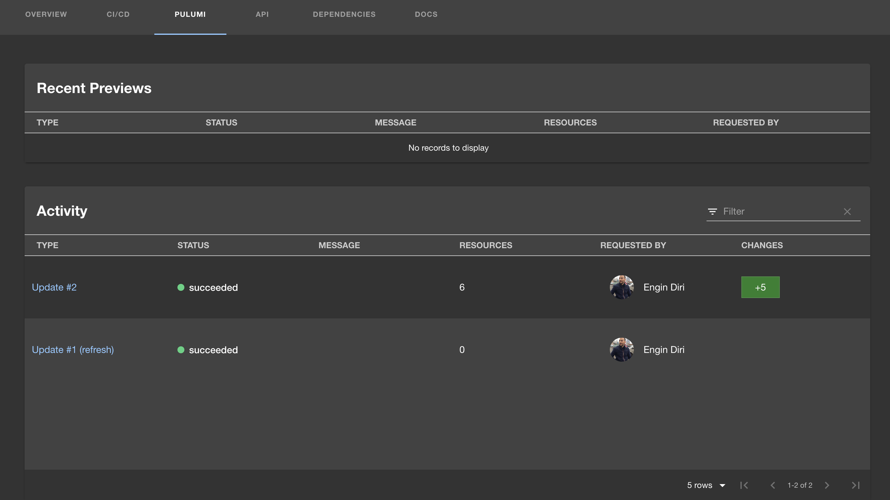

Over the last two years, we’ve seen a huge surge in adoption of Pulumi by __Platform Teams__ -- centralized teams within a business responsible for building out core cloud infrastructure and providing tools to the rest of the organization to maximize the productivity, cost efficacy, compliance and velocity of application and service delivery throughout the organization. These teams use Pulumi to manage their own cloud infrastructure complexity, to offer best practices components to their organizations, to enforce organizational policy, and to drive infrastructure delivery automation.

Today, we’re excited to announce a broad range of new features that extend [Pulumi Cloud’s support for Platform Teams](/product/internal-developer-platforms/), across the entire lifecycle of cloud delivery.

__Developer Portals__:  Every platform team we work with is looking to expose reusable cloud infrastructure components and templates via a developer portal of some kind. Many are building their own custom developer portals on top of Pulumi Automation API and Pulumi Deployments, but we also wanted to offer options for teams that cannot (or do not want to) build a custom solution.  Today, we are releasing two new options for Platform Teams:

* 🆕 Organization Templates and New Project Wizard:  Pulumi Cloud now supports registering your own custom templates for your organization, and enabling developers in your organization to provision them entirely via point-and-click in Pulumi Cloud with the new New Project Wizard.  This offers a great out-of-the box developer portal experience for any team using Pulumi Cloud.
* 🆕 Pulumi Backstage Plugin:  For teams using Backstage, they can now integrate Pulumi directly within their Backstage instance, via support for a new Pulumi plugin as well as new Pulumi scaffolder actions.
* 🆕 `pulumi new` support for private templates: By default, `pulumi new` provides a number of templates provided by Pulumi, but it can also use your own [private templates](/docs/cli/commands/pulumi_new/).

__Policy and Compliance__: Platform teams need robust and flexible solutions for establishing policy and compliance guardrails for their cloud infrastructure. Pulumi’s existing CrossGuard policy-as-code framework provides the richest option for defining and enforcing policy across all infrastructure in an organization, using the full capabilities of your favorite languages.  Today, we are extending that support with two important new features for platform teams:

* 🆕 Compliance Ready Policies:  New pre-built policy packs for for enforcing common security and compliance policies (PCI DSS, ISO 27001 and CIS) across a broad range of cloud providers (AWS, Azure, Google Cloud and Kubernetes), and dozens of services within each platform.
* 🆕 Remediation Policies: Pulumi Policy as Code now supports authoring policies which don’t just warn or error, but actually change the infrastructure directly to remediate compliance gaps. Remediation policies can be configured and applied across any subset of stacks within an organization.

__Deployments and Delivery__:  Managing the delivery of cloud infrastructure changes across a wide variety of environments is an essential component of a cloud platform, and we released [Pulumi Deployments](/product/pulumi-deployments) in preview last year to provide a rich solution for infrastructure delivery directly within Pulumi Cloud.  Today, we are making that support Generally Available (GA) along with a few key enhancements:

* 🆕 Deployments GA: Pulumi Deployments is now generally available, with pricing and support available across all Pulumi Cloud editions.
* 🆕 Deployments Support for GitHub Enterprise: Pulumi Deployments now supports integration with GitHub Enterprise as well as GitHub.com.
* 🆕 Org-Wide Deployments Overview Page: A new page where you can see all deployments across the organization, giving you a single pane of glass to manage company wide deployments.
* 🔜 Deployments Customer Managed Agents: Customers will soon be able to run deployments inside agents they run within their own infrastructure, for cases where this is required for unique compliance or security reasons.

Together with [Pulumi ESC](/blog/environments-secrets-configurations-management/) (Environments, Secrets and Configuration) which we announced yesterday, and the core Pulumi IaC infrastructure as code platform, these new features provide a rich collection of building blocks and out of the box experiences for empowering platform teams via Pulumi Cloud.  At every layer of the Platform Engineering stack, Pulumi and Pulumi Cloud offer key technologies to accelerate your Platform Engineering projects.


### Organization Templates and New Project Wizard

We’ve introduced a new wizard experience to create Pulumi projects into Pulumi Cloud, making it easier than ever to get started deploying new infrastructure with Pulumi.

The new project wizard allows anyone in your organization to pick a template they want to install, and walk through configuring the deployment of that template.  We’ve added support for configuring [Pulumi Deployments](/docs/pulumi-cloud/deployments/get-started/#new-project-wizard) automatically, so that the template can be deployed without needing the Pulumi CLI locally, or any other CI/CD configuration.  Just a few clicks and you have deployed your infrastructure.

We’ve also added integration with the newly released [Pulumi ESC](/docs/pulumi-cloud/deployments/get-started/#environments) so that you can set up environments (and the configuration and credentials needed to deploy to them) that users within your organization can deploy into, determine who can use which environments using RBAC, and then allow those users to deploy templates directly into the environments they can access -- no need to copy secrets, credentials or configuration around!


We’ve also added the ability for organizations to provide their own custom set of Organization Templates --- templates specific to their organization, which can live in either public or private Git repositories.  The Organization Template Source provided will populate the templates that are displayed to members in the New Project wizard experience.


Together, Organization Templates and the new New Project Wizard offer a foundational developer portal experience directly within the Pulumi Cloud console.  Users can come to Pulumi Cloud, select one of the pre-defined templates set up by their Platform Team, and then in a few clicks have it deployed into a predefined cloud environment.

The New Project wizard is available now for all Pulumi users, and Organization Templates are available to Pulumi Enterprise and Business Critical users.  Check out the [documentation](/docs/pulumi-cloud/developer-portals/templates) to get started.

### Backstage Plugin

We’ve seen many developer portal technologies rapidly growing in popularity over the last few years.  In particular, we’ve seen many Pulumi users adopting [Backstage](https://backstage.io/).  Last week we launched a new [Pulumi Backstage Plugin](/blog/pulumi-backstage-plugin/) to address the needs of organizations using Backstage and Pulumi together.

The new Pulumi tab gives you direct access to all Pulumi stack activity associated with your backstage projects that include Pulumi stacks.



The Pulumi Backstage Plugin also supports two new scaffolding actions, `pulumi:new` and `pulumi:up`, which can be used to template out new Pulumi projects and to trigger updates to Pulumi stacks, fully integrated into the Backstage scaffolding system.

```yaml
apiVersion: scaffolder.backstage.io/v1beta3
kind: Template
metadata:
  name: kubernetes-template
  title: Kubernetes Cluster
  description: |
    A template for creating a new Kubernetes Cluster.
  tags:
    - pulumi
    - kubernetes
spec:
  steps:
    - id: pulumi-new-component
      name: Cookie cut the component Pulumi project
      action: pulumi:new
      input:
        name: "${{ parameters.component_id }}-infrastructure"
        description: ${{ parameters.description | dump }}
        organization: ediri
        stack: ${{ parameters.stack }}
        template: "https://github.com/my-silly-organisation/microservice-civo/tree/main/infrastructure-${{ parameters.cloud }}-${{ parameters.language }}"
        config:
          "node:node_count": "${{ parameters.nodeCount }}"
        folder: .
```

Check out the [Pulumi Backstage Plugin](https://github.com/pulumi/pulumi-backstage-plugin) in the [Backstage Plugin directory](https://backstage.io/plugins/) or the [Roadie Pulumi Backstage Plugin guide](https://roadie.io/backstage/plugins/pulumi/) to get started today.

### Compliance Ready Policies

We first released our [CrossGuard](https://www.pulumi.com/docs/using-pulumi/crossguard/) policy-as-code framework nearly 4 years ago, and have seen many large organizations leverage its rich expressiveness, flexibility and early prevention features to enforce key compliance criteria for their organization.  Support in Pulumi Cloud for automatically enforcing these policies across all Pulumi updates within an organization allows platform teams to put compliance guardrails in place for users within their organization.

However, traditionally each organization has needed to build their own policies, resulting in some activation energy needed to start benefiting from CrossGuard.  As we’ve worked with many customers to build out their own internal compliance policies using CrossGuard, we've identified some common compliance standards and policies that we can offer directly as part of CrossGuard.

Today, we are making a large collection of new policies available for CrossGuard users.  These policies support many common compliance standards (PCI DSS, ISO 27001 and CIS) across a broad range of cloud providers (AWS, Azure, Google Cloud and Kubernetes), and dozens of services within each platform.

These policies are offered as a library, from which Platform Teams can enable the subset they want to apply.  For example:

```ts
import { PolicyPack } from "@pulumi/policy";
import { policyManager } from "@pulumi/compliance-policy-manager";

new PolicyPack("aws-iso27001-compliance-ready-policies-typescript", {
    policies:[
        ...policyManager.selectPolicies({
            vendors: ["aws"],
            services: ["ec2", "eks"],
            severities: ["critical", "high"],
            frameworks: ["iso27001"]
        }, "advisory"),
    ],
});
```

The new Policy Pack wizard also makes it easier than ever to create a new policy pack from the compliance-ready policies, and enable it within your organization.


Check out the [documentation](/docs/using-pulumi/crossguard/compliance-ready-policies) and [open source repository](https://github.com/pulumi/compliance-policies/) to get started with Compliance-Ready Policies today.

### Remediation Policies

Existing CrossGuard policies have always had the ability to be set to Advisory to emit a warning when they fail, or to Mandatory to prevent the Pulumi deployment from completing when they fail.  This enables strict prevention of non-compliant infrastructure deployments before they even get into production.

However, in many cases, it’s clear what change needs to be made to the infrastructure to make it compliant.  Today, we’ve launched new support in CrossGuard for Remediation Policies, a new kind of policy which actually fixes up the infrastructure to be compliant instead of just warning or erroring!

This is a magical experience for both policy authors and infrastructure engineers.



{}

```typescript
const s3NoPublicRead: ResourceValidationPolicy = {
    name: "s3-no-public-read",
    description: "Prohibits setting the publicRead or publicReadWrite permission on AWS S3 buckets.",
    enforcementLevel: "remediate",
    remediateResource: remediateResourceOfType(aws.s3.Bucket, (bucket, args) => {
        if (bucket.acl === "public-read" || bucket.acl === "public-read-write") {
            // Modify the ACL and return the new bucket state to use instead.
            bucket.acl = "private";
            return bucket;
        }
    }),
};
```

{}
{}

```python
def s3_no_public_read_remediator(args: ResourceValidationArgs):
    if args.resource_type == "aws:s3/bucket:Bucket" and "acl" in args.props:
        acl = args.props["acl"]
        if acl == "public-read" or acl == "public-read-write":
            # Modify the ACL and return the new bucket state to use instead.
            args.props["acl"] = "private
            return args.props

s3_no_public_read = ResourceValidationPolicy(
    name="s3-no-public-read",
    description="Prohibits setting the publicRead or publicReadWrite permission on AWS S3 buckets.",
    enforcement_level=EnforcementLevel.REMEDIATE,
    remediate=s3_no_public_read_remediator,
)
```

{}



Check out the [documentation](/docs/using-pulumi/crossguard/core-concepts/#resource-remediation) to get started adding remediation policies to your policy-as-code configuration today.

### Deployments GA

In the last year since we launched Pulumi Deployments in preview, we’ve seen incredible growth in usage and scale of Pulumi Deployments across the Pulumi user base.  Customers use Pulumi Deployments for a single built-for-purpose CI/CD solution for their Pulumi infrastructure delivery, but also leverage rich API-driven deployments, [Review Stacks](/blog/review-stacks/), Click-to-Deploy within the Pulumi Cloud Console, and much more.

As part of General Availability, we are announcing pricing for deployments at $0.01 per deployment minute.  The new pricing will be effective November 1st.  Individual Edition users get 500 minutes free per month, and Team Edition users get 3,000 minutes free per month. Full details of the pricing can be found on the [Pricing Page](/pricing).

In addition to pricing, we’re making available several new features in the Deployments platform.

The new Deployments pane in the Pulumi Cloud console provides a unified view across all deployments in your organization.  This includes in progress and queued deployments so that you can easily access any currently in flight deployments, as well as a full history of all deployments performed across all stacks you have access to within your organization.


And finally, we’re extending Pulumi Deployments to support additional key enterprise needs.  We recently added support for connecting Pulumi Deployments to GitHub Enterprise, and we will be delivering support for self-hosted Pulumi Deployments agents which can be run within your own infrastructure later this month.  You can [fill out this form](https://share.hsforms.com/1GEUed27WQquRcQxY-dKOlw2mxud) to register for the private preview of self-hosted agents today.

## Conclusion

Pulumi Cloud offers a rich and broad platform to support any platform team today.  Across the entire lifecycle of cloud infrastructure and application delivery, Pulumi Cloud supports platform teams in building cloud platforms for their organizations which empower developers via rich IaC components and developer portals, enable seamless delivery through Deployments and Automation API, provide robust compliance guardrails through Compliance-Ready Policies and Remediation Policies, and securely manage secrets and configuration across a variety of environments with Pulumi ESC.

It’s never been easier to build your internal developer platform with the help of Pulumi Cloud.
