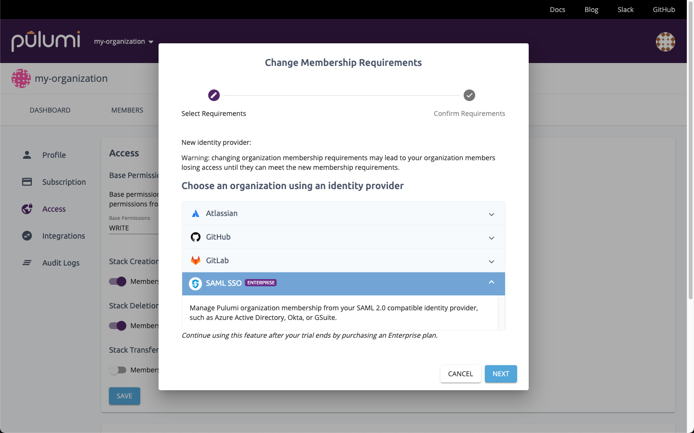

The Pulumi Service helps teams of all sizes deliver and manage cloud apps and infrastructure. In the console, everyone on the team can see the infrastructure the team is responsible for, when it was last deployed, how it’s configured, and more. They can see a full breakdown of the infrastructure as well, so they can understand how the team brings together individual cloud services to create their applications. When you bring your teams together on the Pulumi Service, you can provide a “single pane of glass” over all the infrastructure that you manage with Pulumi.

Most teams larger than a few people define their team members, and the groups they’re a part of, using an Identity Provider (IdP) like [Okta](https://www.okta.com/products/single-sign-on/), Microsoft’s [Azure Active Directory](https://azure.microsoft.com/en-us/services/active-directory/), or [Google Cloud Identity & Access Management](https://cloud.google.com/iam/). The Pulumi Service works seamlessly with these IdPs (and many more) by providing [Single Sign-On with SAML]() and [user and group synchronization via SCIM 2.0](). <!--more-->When you use both SAML SSO and SCIM, you can manage the users who should have access to Pulumi and the [Pulumi teams]() they belong to entirely from your IdP. Managing users and teams this way helps keep your organization more secure by ensuring a single point of control over the users who have access to manage and update your infrastructure. It also saves you time by centralizing all of your identity and access management workflows in your identity provider.

## SAML SSO

In a world of many cloud applications and service providers, IT departments can use single sign-on with SAML to make it easier for their employees to sign in and be productive. In addition, if an employee leaves, all of that employee’s access can be disabled from a single pane of glass, rather than having to manually update each application and service provider separately. The Pulumi Service's support for single sign-on with SAML provides this functionality. We support most IdPs that implement the SAML 2.0 specification.

To configure single sign-on with SAML for your Pulumi organization, use the guide that matches your IdP:

- [Okta]()
- [Azure Active Directory]()
- [Google Cloud Identity & Access Management]()
- [Generic guide (for all other IdPs)]()

## User and group synchronization via SCIM

After you’ve configured single sign-on with SAML, you can take it one step further by synchronizing your users and groups using [SCIM](https://developer.okta.com/docs/concepts/scim/). Synchronization extends the power of single sign-on by enabling organization administrators to use their IdP to manage the users who have access to the Pulumi Service and which Pulumi teams each user is a member of. Granting and revoking user seat licenses is seamless and easily provides the right level of permissions to critical infrastructure.

To configure user and group synchronization via SCIM, use the guide that matches your IdP:

- [Okta]()
- [Azure Active Directory]()

## Next steps

The Pulumi Cloud’s support for the SAML and SCIM standards for SSO, user synchronization, and group synchronization make it easy to ensure every team member has the right access and the right permissions. Here’s how to get started:

- If you’re an existing Pulumi customer, you can enable SAML [in your organization settings](https://app.pulumi.com/pulumi/settings/saml).
- If you’re new to Pulumi, [start your trial now](https://app.pulumi.com/site/trial) or [contact sales to request a demo]().
