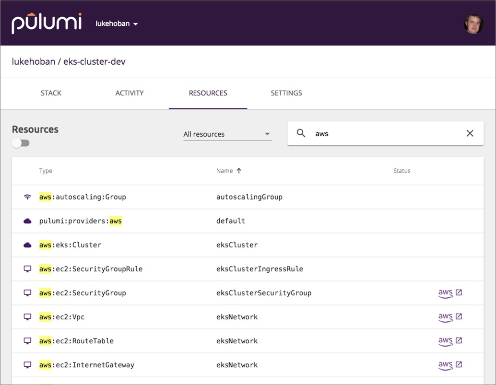

Provisioning, managing, and monitoring a Kubernetes cluster is
not easy. AWS now offers EKS to reduce that burden -- but
it's still difficult to get up and running. Pulumi's infrastructure as
code SDKs can help! We can provision an entire EKS cluster with a
single CLI command, thanks to [the `@pulumi/eks`
package](https://github.com/pulumi/pulumi-eks). Let's see how.
<!--more-->

{}
Updated January 2021 to include Python, .NET, and Go support.
{}

To get started, download the free and open source
[Pulumi SDK](), which includes
the `pulumi` CLI we'll use below. If you don't
have the AWS CLI installed and configured, [set that up too]().
You'll need AWS credentials to access your AWS account and
provision resources.

From here, there are two ways to proceed:

- Provision a new cluster with a single CLI command
- Use infrastructure as code to manage clusters ... including Kubernetes resources themselves!

## Installing Amazon EKS with Pulumi

With the Pulumi CLI installed and configured, a single command will
provision your cluster:

    $ pulumi new https://github.com/pulumi/apps/eks

This template will walk you through configuring a few settings
such as the region to deploy, the instance type, and
number of cluster nodes.

The CLI will first show you a preview of the AWS and Kubernetes
resources that will be deployed to create the cluster, before actually
performing any operation. Once you have reviewed and selected "Yes," the
cluster will begin deploying. The terminal output will look like this:


Following these steps will provide a complete managed Amazon EKS
cluster, configured similarly to the steps outlined in the
[Amazon EKS Getting Started guide](https://docs.aws.amazon.com/eks/latest/userguide/getting-started.html),
including optional support for Amazon EBS-backed StorageClasses and
access to the Kubernetes Dashboard. Pulumi replaces all of these tedious, manual
steps with a straightforward description of your desired state, and then makes it so!

Once the deployment is complete -- it will take 10-20 minutes for
AWS to provision these resources -- you can grab the
`kubeconfig.json` needed to work with this cluster and connect to it
with [kubectl](https://kubernetes.io/docs/tasks/tools/install-kubectl/):

    $ pulumi stack output kubeconfig > kubeconfig.json
    $ KUBECONFIG=./kubeconfig.json kubectl get nodes

## Reusable AWS EKS component

The Amazon EKS installer we just saw is built on top of a reusable
[eks.Cluster](https://github.com/pulumi/pulumi-eks) component that is
available in Pulumi's infrastructure as code solution. In fact, the
command above created an instance of this component with reasonable defaults. If you
prefer, you can do it by hand and programmatically. Here are examples
in each of Pulumi's supported languages:



{}

```typescript
import * as eks from "@pulumi/eks";

// Create an EKS cluster.
const cluster = new eks.Cluster("cluster", {
    instanceType: "t2.medium",
    desiredCapacity: 2,
    minSize: 1,
    maxSize: 2,
});

// Export the cluster's kubeconfig.
export const kubeconfig = cluster.kubeconfig;
```

{}

{}

```python
import pulumi
import pulumi_eks as eks

# Create an EKS cluster.
cluster = eks.Cluster(
    "cluster",
    instance_type="t2.medium",
    desired_capacity=2,
    min_size=1,
    max_size=2,
)

# Export the cluster's kubeconfig.
pulumi.export("kubeconfig", cluster.kubeconfig)
```

{}

{}

```csharp
using System;
using System.Threading.Tasks;
using Pulumi;
using Pulumi.Eks.Cluster;

class EksStack : Stack
{
    public EksStack()
    {
        // Create an EKS cluster.
        var cluster = new Cluster("cluster", new ClusterArgs
        {
            InstanceType = "t2.medium",
            DesiredCapacity = 2,
            MinSize = 1,
            MaxSize = 2,
        });

        // Export the cluster's kubeconfig.
        this.Kubeconfig = cluster.Kubeconfig;
    }

    [Output("kubeconfig")]
    public Output<string> Kubeconfig { get; set; }
}

class Program
{
    static Task<int> Main(string[] args) => Deployment.RunAsync<EksStack>();
}
```

{}

{}

```go
package main

import (
	"github.com/pulumi/pulumi-eks/sdk/go/eks/cluster"
	"github.com/pulumi/pulumi/sdk/v2/go/pulumi"
)

func main() {
    pulumi.Run(func(ctx *pulumi.Context) error {
    // Create an EKS cluster.
    cluster, err := cluster.NewCluster(ctx, "cluster",
        cluster.ClusterArgs{
            InstanceType:    pulumi.String("t2.medium"),
            DesiredCapacity: pulumi.Int(2),
            MinSize:         pulumi.Int(1),
            MaxSize:         pulumi.Int(2),
        },
    )
    if err != nil {
        return err
    }

    // Export the cluster's kubeconfig.
    ctx.Export("kubeconfig", cluster.Kubeconfig)

    return nil
    })
}
```

{}



## Adding resources, and deploying Helm charts

You can extend or modify this program to change the details of the
Amazon EKS cluster, or to install additional AWS or Kubernetes resources
to associate with the cluster. For example, if applications running in
the cluster need access to an Amazon S3 bucket, create a new
`Bucket` resource:



{}

```typescript
const bucket = new aws.s3.Bucket("assets");
```

{}

{}

```python
bucket = aws.s3.Bucket("assets")
```

{}

{}

```csharp
var bucket = new Aws.S3.Bucket("bucket");
```

{}

{}

```go
bucket, err := s3.NewBucket(ctx, "bucket", &s3.BucketArgs{})
```

{}



Or, to install Kubernetes applications automatically into the
Amazon EKS cluster (such as WordPress), add them using the Pulumi
Kubernetes provider pointing at the newly provisioned EKS cluster:



{}

```typescript
const wordpress = new k8s.helm.v3.Chart("wpdev", {
  version: "9.6.0",
  chart: "wordpress",
  fetchOpts: {
    repo: "https://charts.bitnami.com/bitnami",
  },
}, { providers: { kubernetes: cluster.provider }});
```

{}

{}

```python
wordpress = Chart(
    "wpdev",
    ChartOpts(
        chart="wordpress",
        version="9.6.0",
        fetch_opts=FetchOpts(
            repo="https://charts.bitnami.com/bitnami",
        ),
    ),
    opts=ResourceOptions(provider=cluster.provider),
)
```

{}

{}

```csharp
var wordpress = new Chart("wpdev", new ChartArgs
{
    Chart = "wordpress",
    Version = "9.6.0",
    FetchOptions = new ChartFetchArgs
    {
        Repo = "https://charts.bitnami.com/bitnami"
    }
}, new CustomResourceOptions
{
    Provider = cluster.Provider,
});
```

{}

{}

```go
wordpress, err := helm.NewChart(ctx, "wpdev", helm.ChartArgs{
    Chart:   pulumi.String("wordpress"),
    Version: pulumi.String("9.6.0"),
    FetchArgs: helm.FetchArgs{
        repo: pulumi.String("https://charts.bitnami.com/bitnami"),
    },
}, pulumi.Provider(cluster.Provider))
```

{}



Pulumi makes it possible to define the cluster, AWS resources, and
Kubernetes objects needed to bootstrap your entire Kubernetes
environment, all in one place. They can then be versioned together and
exact replicas of the environment can be created independently
for operations such as testing or disaster recovery.

As usual, by expressing these resources in code instead of in YAML, you
get many software engineering benefits: improved
tooling, the ability to refactor using your favorite IDE, the ability to
create and share reusable components, and strong
typing to validate correctness up front.

## What's happening under the hood?

To make this whole process buttery smooth, the Pulumi EKS component
takes care of setting up all the pieces needed for an Amazon EKS
cluster:

- Creating an EKS Service Role
- Optionally creating a new Virtual Private Cloud (VPC)
- Creating an Amazon EKS cluster
- Configuring a Kubernetes provider with access to the Amazon EKS
  cluster
- Launching worker nodes in an Auto Scaling group to join the cluster
- Installing a ConfigMap into the cluster to allow new Amazon EC2
  worker nodes to join
- Installing a StorageClass into the cluster to allow provisioning
  Amazon EBS-backed PersistentVolumes
- Constructing the `kubeconfig` needed to access the cluster
- Optionally installing additional Kubernetes YAML and/or Helm charts

This involves steps that provision resources in AWS, steps that
provision resources in Kubernetes, and other custom computation to
coordinate these steps. In addition, during the deployment Pulumi also
provides complex coordination between these different steps.

## Managing Pulumi Deployments

Once you have deployed your Amazon EKS cluster and Kubernetes resources
to AWS, you can manage the deployment on
[app.pulumi.com](https://app.pulumi.com/), including deep links into the
AWS console and Kubernetes dashboard to get real-time insights on your
cluster.



All of the provisioned resources across AWS and Kubernetes are available
from this single view, along with an audit history of deployments to
this stack. The stack exports are also published in this same dashboard,
so that key outputs, like your kubeconfig, are easily available and can be
shared with other users in your organization.

[Additional management features](), including
RBAC, CI/CD integrations, and rich resource graph visualization, are
also available via the [Pulumi app](https://app.pulumi.com),
including Team and Enterprise Editions for production teams of all
sizes.

## Get Started

We've seen how Pulumi takes care of the heavy lifting with AWS EKS so that
you don't have to. You can use Pulumi to easily deploy new clusters,
managed AWS resources, and Kubernetes apps, all with the same powerful toolchain. Support is
also available for Azure AKS, [Google GKE](),
DigitalOcean's Managed Kubernetes, and custom clusters (including Minikube).

For more information:

- [Get started with Pulumi and Kubernetes]()
- [Get started with Pulumi and AWS]()
