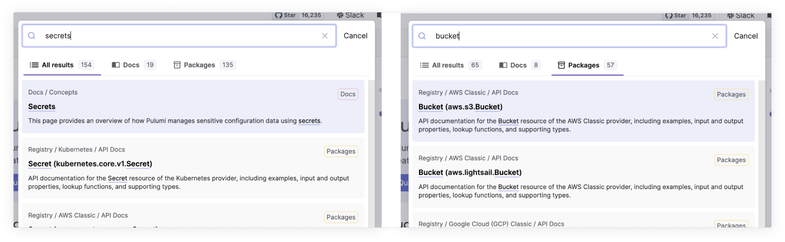
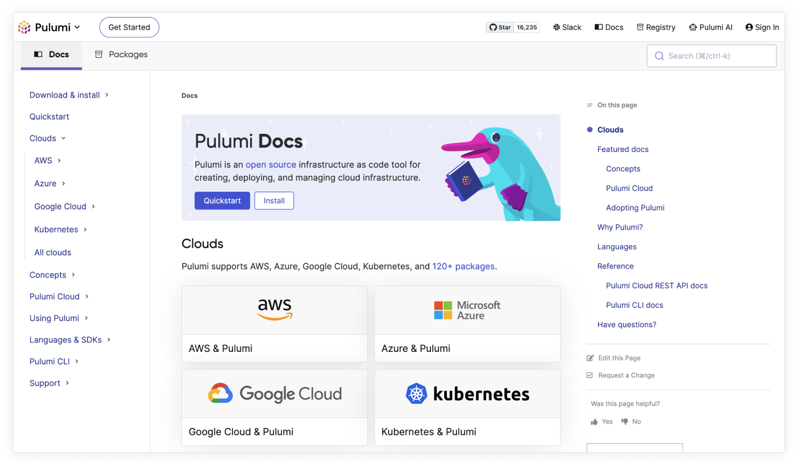
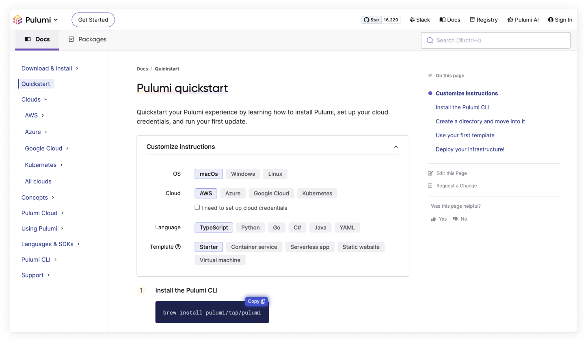
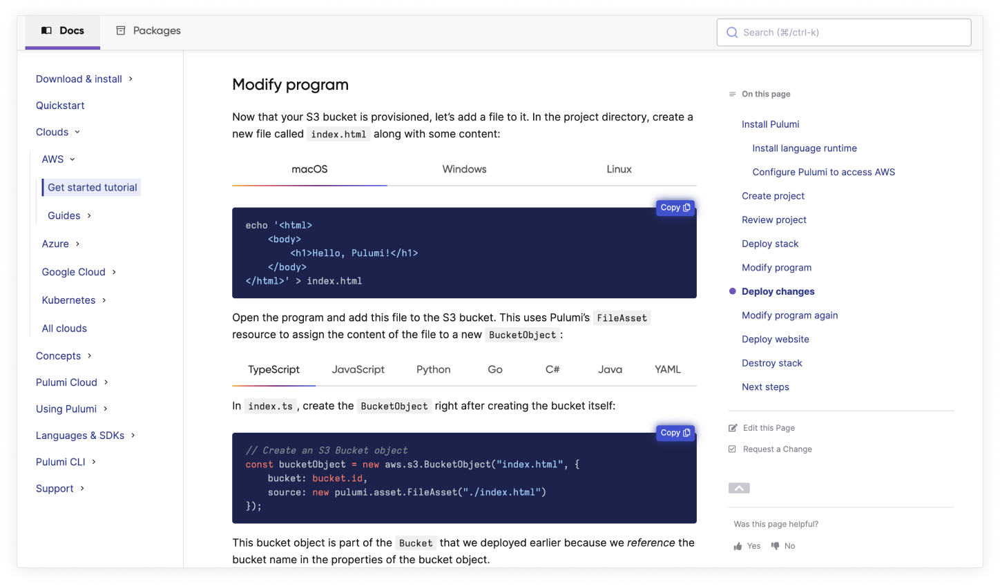
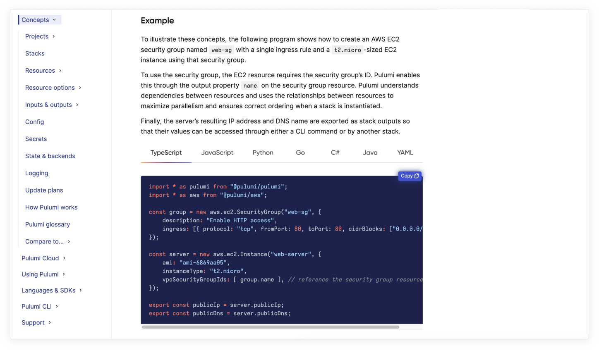
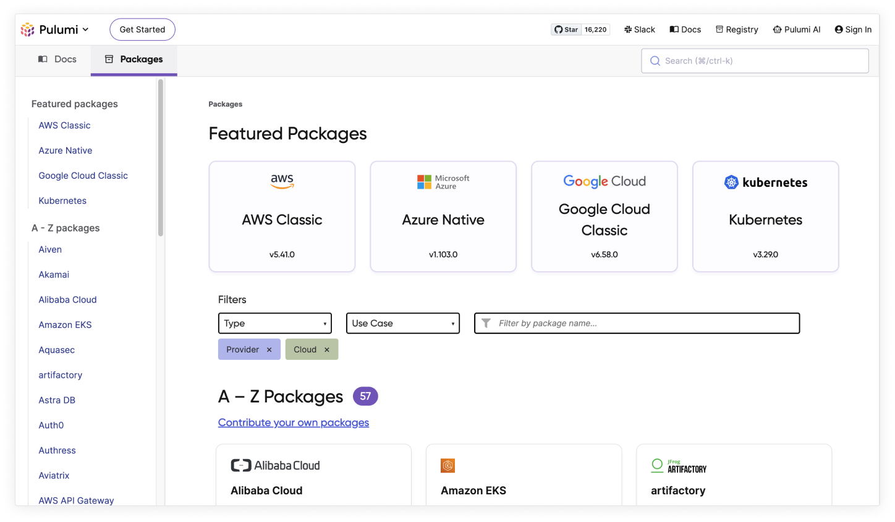

Engineers spend a lot of their valuable time searching documentation for answers. At Pulumi, we believe in exceptional documentation experiences that help people using Pulumi find what they need quickly and use it successfully. Today, we are announcing a set of improved Pulumi documentation experiences that collectively make it easier than ever to discover, learn and build cloud infrastructure with Pulumi.
<!--more-->

The improvements we've introduced to the Pulumi documentation experience focus on three areas - search, navigation and discoverability.  Together, they help every user of the Pulumi documentation find the answers they are looking for quickly, so they can solve their infrastructure as code use case and leverage Pulumi effectively in their projects. These changes also introduce new design patterns and user experience elements across previously independent parts of the Pulumi documentation experience, creating a more cohesive developer experience.

## Search

As of today, you can quickly and easily search for documentation across all of these types, and we will lead you to the documentation you are looking for to solve your problem. The new search clearly groups documentation by _Docs_ and _Packages_ with clear breadcrumbs to quickly get you to the right place.

## Unified navigation

We have unified navigation across both docs and packages and expect to add more content types to Pulumi Docs over the rest of the year. Enjoy easily switching between documentation types while having your left navigation and table of contents navigation remain consistent.

## Discoverability

In addition to search and navigation, folks must be able to discover new content that will help them even if they don't know that content exists. To that end, let's showcase a few types of Pulumi documentation:

### Quickstart experience

The [Pulumi quickstart](/docs/quickstart/) experience is for people new to Pulumi to get up and running quickly.

### Cloud get started tutorials

The [Pulumi cloud get started tutorials](/docs/clouds/) are for people who want a more detailed walkthrough when using Pulumi for the first time.

### Concept docs

The [Pulumi concept docs](/docs/concepts/) are where you can dive into Pulumi concepts. Learn how they work together and how to effectively use them to ship infrastructure.

### Packages

The [package documentation](/registry/) is where to find configuration and API documentation for Pulumi supported clouds, version control systems, databases, infrastructure monitoring, and networking tools. We support 119 providers today, and we add new providers every week!

Head to [Pulumi docs](/docs/), learn something new, and send us your feedback!
