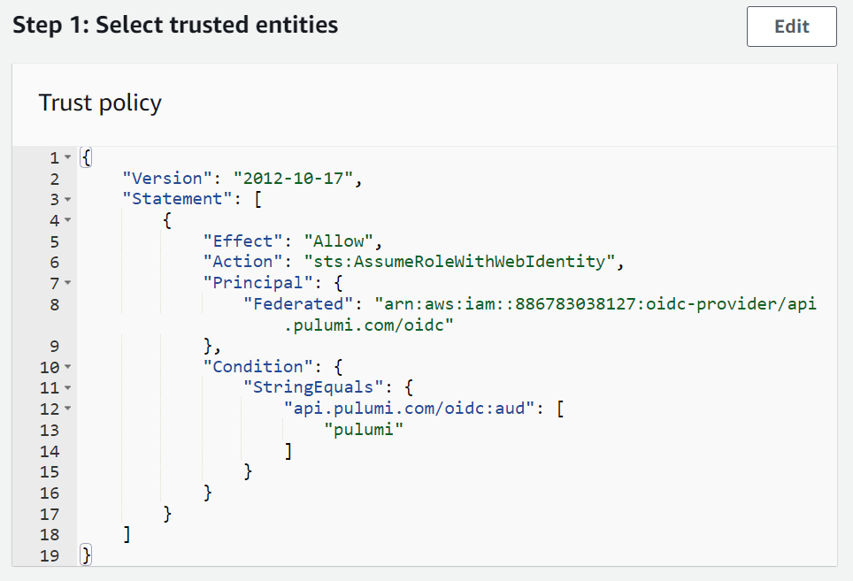

The `esc env run` command of [Pulumi ESC (Environments, Secrets, and Configuration)](https://www.pulumi.com/product/esc/) is your trusty sidekick in the relentless battle against one of the cloud realm's most notorious villains: credential mismanagement. Whether you’re a seasoned developer or just stepping into the cloud realm, you’ve likely encountered the frustrating, time-consuming error messages like "Invalid credentials" when your tokens or access keys go astray. It’s a common narrative that can halt progress in its tracks. But, this is an area where `esc env run` really shines.

<!--more-->

## The Power of Esc Env Run

In a world where cloud computing is the backbone of modern applications, managing environments and secrets is crucial. Pulumi ESC alleviates the maintenance burden, reduces costly mistakes, and streamlines your workflow by providing a centralized way to handle these critical aspects of cloud development. It's like having a Swiss Army knife in your toolkit, ready to tackle the challenges of cloud infrastructure.

Central to Pulumi ESC is the command `esc env run`. With a few keystrokes, this command empowers you to run AWS commands like `aws s3 ls` without the need to configure AWS credentials locally each time. Imagine the ease and time saved when you no longer have to chase down access tokens or juggle configuration files before accessing AWS resources. This isn’t just a neat feature; it’s a significant stride towards making your cloud interactions more efficient and less error-prone, and here’s why:

- **Seamless Command Execution** - The `esc env run` command lets you execute AWS commands effortlessly, freeing you from the intricacies of managing AWS credentials on your local machine. It allows you to focus solely on your task at hand, whether it's deploying infrastructure or interacting with cloud resources, without the overhead of credential setup and maintenance.

- **Enhanced Security** - One of the standout features of `esc env run` is its commitment to security. By eliminating the need to store sensitive information locally, it drastically reduces the risk of accidental exposure. Your credentials and secrets are securely managed within the Pulumi environment, safeguarding your cloud resources and data.

- **Streamlined Collaboration** - `esc env run` facilitates team collaboration by providing a consistent environment for all team members to run commands with. Everyone can access the same secure environment, eliminating the complexities of coordinating credentials and configurations across the team. This ensures a smoother development process with fewer hurdles.

As the saying goes, time is money. With Pulumi ESC, by spending a few minutes to download the ESC CLI, you're setting yourself up to save hours of troubleshooting and configuration management each month. The `esc env run` command is more than just a command; it’s your ticket to a smoother, more efficient cloud journey.

## Getting Started with Esc Env Run

Now that we've covered why `esc env run` is so valuable, let's dive into how you can start using this powerful feature. We'll walk you through the steps to run the `aws s3 ls` command without needing to configure AWS credentials locally.

### Step 1: Install and login to Pulumi ESC

To begin, you’ll need to [install Pulumi ESC](https://www.pulumi.com/docs/install/esc/). Once the installation is complete, run the `esc login` command and follow the steps to login to the CLI.

```
$ esc login
Manage your Pulumi ESC environments by logging in.
Run `esc --help` for alternative login options.
Enter your access token from https://app.pulumi.com/account/tokens
    or hit <ENTER> to log in using your browser                   :  
Logged in to pulumi.com as …
```

### Step 2: Create the OIDC configuration

While you can [manually set your credentials as secrets](https://www.pulumi.com/docs/esc-cli/commands/esc_env_set/) in your Pulumi ESC environment files, it isn’t a recommended best practice to create or maintain long-lived credentials for your cloud environments. A more secure and efficient alternative is to leverage yet another great feature of Pulumi ESC: dynamic credentials.

Pulumi ESC can dynamically generate credentials on your behalf each time you need to interact with your AWS environments. To do so, you'll need to configure OpenID Connect (OIDC) between Pulumi and AWS. On the AWS side, there are two resources you'll need to create:

- An IAM OIDC provider
- An IAM Role

Let's start by creating the OIDC provider resource. There are a number of ways you can do this in AWS, but we will demonstrate how to create it via the AWS console.


Please note that while we’re providing the steps and screenshots that are accurate as of the date of this post, AWS documentation is subject to change. For the most current and precise information, always refer to the [official AWS documentation](https://docs.aws.amazon.com/IAM/latest/UserGuide/id_roles_providers_create_oidc.html).


In the navigation pane of the [IAM console](https://console.aws.amazon.com/iam/), choose **Identity providers**, and then choose **Add provider**.



In the **Provider type** section, click the radio button next to **OpenID Connect**. For the **Provider URL**, provide the following URL:

```
https://api.pulumi.com/oidc
```

Then click the **Get thumbprint** button. The thumbprint value that you will be presented with is what you can use to verify the certificate of the provider i.e. Pulumi.


The AWS console generates the thumbprint value on your behalf. However, if you are creating the OIDC provider programmatically, you will need to generate this value yourself and provide the thumbprint value as a part of your resource definition. You can learn more about what a thumbprint is and how to generate/verify it by referring to the [relevant AWS documentation](https://docs.aws.amazon.com/IAM/latest/UserGuide/id_roles_providers_create_oidc_verify-thumbprint.html).


For the **Audience** field, provide the name of your Pulumi organization. Then scroll down to the bottom of the page and click **Add provider**.



You’ll see a notification at the top of your screen prompting you to assign an IAM role to your newly created provider. Click the **Assign role** button.

This will prompt you to either create a new role or use an existing role. For the purposes of this blog, we will select the **Create a new role** option and demonstrate how to configure it for use with Pulumi ESC.



This will then direct you to the IAM **Create role** page. The **Web identity** radio button should already be selected for you but if not, make sure that it is selected. Then scroll down and make sure that the following is selected in the **Web identity** section:

- the `api.pulumi.com/oidc` provider is selected under **Identity provider**
- the name of your Pulumi organization is selected under **Audience**



Click **Next** which will direct you to the **Add permissions** page. This is where you will select what permissions you will allow your Pulumi ESC environment to have in your AWS account. Since we want to interact with S3, let’s go ahead and select the **AmazonS3FullAccess** policy from the list. Then scroll down and click **Next**.



You will be directed to the last page of the wizard, where you can provide the name and an optional description for the role and review all of the role’s configuration details before creating it.



One area that we want to draw your attention to is the **Select trusted entities** section which is where the trust policy of the role is defined.



This definition currently allows any Pulumi service to assume this role, but only if the request comes from your organization. You can edit this policy to further limit access to this role to just the Pulumi ESC service, and you can make it even more granular by limiting access to a specific environment. This more detailed configuration is outside the scope of this blog post, but you can learn more about it by checking out the [relevant Pulumi documentation](https://www.pulumi.com/docs/pulumi-cloud/esc/providers/aws-login/#configuring-the-iam-role-and-trust-policy).

After creating your role, make sure to make a note of your role’s ARN value as you will need it in the next step.

### Step 3: Create a new environment

Now that we’ve created all the necessary AWS resources, let’s move over to the Pulumi side of things. You’ll first want to create a new environment in the [Pulumi Cloud](https://app.pulumi.com/). Make sure that you have the correct organization selected in the left-hand navigation menu. Then click the **Environments** link, and click the **Create environment** button. In the following pop-up, provide a name for your environment before clicking the  **Create environment** button.



### Step 4: Add the AWS provider integration

Once you’ve created your new environment, you will be presented with a split-pane editor view. You’ll want to clear out the default placeholder content in the editor on the left-hand side and replace it with the following code, making sure to provide the value of your IAM role ARN from the previous step:

```
values:
  aws:
    login:
      fn::open::aws-login:
        oidc:
          duration: 1h
          roleArn: <your-oidc-iam-role-arn>
          sessionName: pulumi-environments-session
  environmentVariables:
    AWS_ACCESS_KEY_ID: ${aws.login.accessKeyId}
    AWS_SECRET_ACCESS_KEY: ${aws.login.secretAccessKey}
    AWS_SESSION_TOKEN: ${aws.login.sessionToken}


```

The variables defined under the `environmentVariables` parameter above are the same environment variables that AWS uses when you’re locally authenticating using the AWS CLI. You can find out more about this provider definition and how it works in the Pulumi ESC documentation for [the AWS provider](https://www.pulumi.com/docs/pulumi-cloud/esc/providers/aws-login/#example) as well as the documentation for [projecting environment variables](https://www.pulumi.com/docs/pulumi-cloud/esc/environments/#projecting-environment-variables).

Scroll to the bottom of the page and click **Save**.



Step 5: Run your command

Now to the fun part! With your environment set up, try it out by listing all of the S3 buckets in your AWS account as shown below. Make sure to replace the placeholder text with the names of your own Pulumi organization and environment.

```
esc env run <your-pulumi-org-name>/<your-environment-name> -i aws s3 ls
```

Voila! You’ve just run an AWS command without any local AWS credential configuration. This is just the tip of the iceberg of how the `esc env run` command can be a game-changer in how you and your team manage and interact with cloud resources.


Manually navigating through the steps of configuring an OIDC provider in AWS can be a bit of a puzzle. However, we've got you covered! We've also crafted an automated [example](https://github.com/pulumi/examples/tree/master/aws-py-oidc-provider-pulumi-cloud) using Pulumi Infrastructure as Code (IaC). Dive in and explore how we've simplified the process!


## Real-World Use Case: Automated Data Backup

To further illustrate the power of Pulumi ESC, let's consider a real-world use case: automated data backup. Imagine you have a web application that generates daily logs stored in an S3 bucket. You want to schedule a daily backup job to copy these logs to a separate bucket without exposing your AWS credentials in your scripts or having to manually configure them each time.

With Pulumi ESC, you can create an environment, dynamically generate and securely store your AWS credentials, and schedule a daily backup job using a simple script that runs the `aws s3 cp` command. This ensures your backups are automated, secure, and easily maintainable, all thanks to Pulumi ESC.

## Conclusion

Pulumi ESC, and the `esc env run` command in particular, are designed to make your cloud journey smoother, more secure, and less daunting. So, the next time you find yourself drowning in a sea of cloud configurations, remember, with Pulumi ESC and a dash of code, you can say goodbye to manual configuration hassles and hello to efficient, secure, and scalable cloud development with Pulumi ESC. Check it out and let us know what you think!
