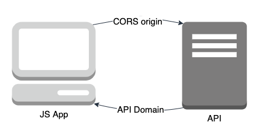

As part of our hackathon near the end of last year, we decided to explore solutions to a common problem when people are using Pulumi for their systems. A question that’s been asked in a few different forms is how to resolve circular dependencies between resources in a Pulumi program.

A simple example of this idea is a modern web application with a static front-end and an API, where the front-end needs to know the URL of the API to be able to call it and the API needs to know the source domain of the front-end to allow it access via CORS. As these two resources rely on one another to be created, they are circular dependencies.



For a deployable example, let’s build a serverless game of ping-pong—two functions that invoke one another until one misses!

```typescript
const ping = new CallbackFunction("ping", {
  callback: pingPongHandler,
  environment: {
    variables: {
      OPPONENT_FN_NAME: pong.name, // <-- Can't access `pong` yet!
    },
  },
});

const pong = new CallbackFunction("pong", {
  callback: pingPongHandler,
  environment: {
    variables: {
      OPPONENT_FN_NAME: ping.name,
    },
  },
});
```

Programming languages don’t let us create one object that takes a value from another object that doesn’t yet exist. Therefore, we can’t express a circular dependency in this way.

The simplest workaround for this error is to get a reference to our own stack, which contains the outputs from the previous deployment. Now, we set the reference to `pong` within `ping` from the output of the last deployment.

```typescript
const currentStack = new pulumi.StackReference(
  `acme-org/${pulumi.getProject()}/${pulumi.getStack()}`
);

const ping = new CallbackFunction("ping", {
  callback: pingPongHandler,
  environment: {
    variables: {
      OPPONENT_FN_NAME: currentStack
        .getOutput("pongName")
        .apply((pongName) => pongName ?? ""),
    },
  },
});

const pong = new CallbackFunction("pong", {
  callback: pingPongHandler,
  environment: {
    variables: {
      OPPONENT_FN_NAME: ping.name,
    },
  },
});

export const pingName = ping.name;
export const pongName = pong.name;
```

The downside of this approach is that we have to deploy twice to reach the desired state because we need the results of the previous deployment, though this approach might be fine for simple one-off circumstances.

How then could we make the process easier and clearer for users who need to resolve this kind of circular dependency regularly? We explored four options as part of the hackathon, so let’s go through each one, getting progressively closer to a possible solution.

## Option 1: State

Instead of referencing outputs directly from our stack’s previous deploy and manually deploying twice, we could introduce a special type called “State”.

The `State` object does 3 tasks:

1. Read the value from the previous deployment, or provide a default if it’s the first deployment.
2. Update the value in the stack state using a “set” method.
3. Automatically triggers another deployment if its value has changed.

```typescript
const pongName = new pulumi.State("pong-name", {
  initialValue: "",
});

const ping = new CallbackFunction("ping", {
  callback: pingPongHandler,
  environment: {
    variables: {
      OPPONENT_FN_NAME: pongName.value,
    },
  },
});

const pong = new CallbackFunction("pong", {
  callback: pingPongHandler,
  environment: {
    variables: {
      OPPONENT_FN_NAME: ping.name,
    },
  },
});

// Engine re-runs "up" if this changes the value
pongName.set(pong.name);
```

The first deployment will match the preview, but when triggering the re-deployment, we’re making a change that wasn’t in the first preview. This action could also result in a never-ending loop where every deployment makes another change to the state and triggers another deployment. So let’s explore a different option that might not have this issue.

## Option 2: Refs

This option looks almost identical to the “state” concept above, except we’re calling them references (refs):

```typescript
const pongName = new pulumi.Ref("pong-name", {
  initialValue: "",
});

const ping = new CallbackFunction("ping", {
  callback: pingPongHandler,
  environment: {
    variables: {
      OPPONENT_FN_NAME: pongName.value, // Special type the Pulumi engine will track
    },
  },
});

const pong = new CallbackFunction("pong", {
  callback: pingPongHandler,
  environment: {
    variables: {
      OPPONENT_FN_NAME: ping.name,
    },
  },
});

// Determine affected resources and re-update
pongName.set(pong.name);
```

The difference between refs and state is that, instead of triggering a whole re-deploy when the value changes, refs would be integrated into the dependency graph similarly to resources. When the value of the ref changes, we could internally work out which resources depend on that ref and change the target state for only those resources. This avoids the possibility of a never-ending update loop.

Both the “state” and “refs” approaches have the downside of not making the final outputs of the updated resource available to the rest of the program. The resource object would still have the values from after it first deployed. This means that other parts of the program might still deploy differently on subsequent deployments. Let’s explore another option that might address that problem.

## Option 3: Create patch resources

We could explicitly model the third step by using a new resource type suffixed with “patch”:

```typescript
const ping = new CallbackFunction("ping", {
  callback: pingPongHandler,
});

const pong = new CallbackFunction("pong", {
  callback: pingPongHandler,
  environment: {
    variables: {
      OPPONENT_FN_NAME: ping.name,
    },
  },
});

const pingPatch = new CallbackFunctionPatch("ping-patch", {
  id: ping.id,
  environment: {
    variables: {
      OPPONENT_FN_NAME: pong.name,
    },
  },
});
```

The provider presents pseudo-resources for update or patch operations. The `patch` resource is using the same underlying resource as the original resource. This option is a very flexible approach that could be implemented by providers right now. These patch resources could also be used for resources that exist outside the Pulumi stack. The drawback is that the `patch` operation has to be implemented in each provider individually, and it significantly increases the overall size of each provider and its associated SDK. We’re still evaluating whether this option would be a good one considering that size increase, which increases download times as an example impact, and the engineering resources to implement the change. We have one more option to consider, as well.

## Option 4: Allow a resource to update its goal state

When using the SDK, we could write something like the following code to create then update a little later on:

```typescript
const ping = new CallbackFunction("ping", {
  callback: pingPongHandler,
});

const pong = new CallbackFunction("pong", {
  callback: pingPongHandler,
  environment: {
    variables: {
      OPPONENT_FN_NAME: ping.name,
    },
  },
});

const updatedPing = ping.update({
  environment: {
    variables: {
      OPPONENT_FN_NAME: pong.name,
    },
  },
});
```

When declaring a resource in a Pulumi program, you’re essentially saying, “This is the state I want my resource to be in.” The update method returns a whole new copy of the resource with new properties containing the outputs of the update.

## What’s next?

The final option is quite close to a fully working solution, but there still remains a few tasks to complete before we could release it as a feature:

- Finalise what the internal messages between the Pulumi’s internal components should look like.
- Keep a record of circular dependencies in the stack state without causing knock-on issues elsewhere in Pulumi’s internal workings.
- Decide what should happen if an update triggers a replacement—if this is potentially valid behaviour or not. We should be able to generate the set of properties which are able to be updated without causing replacement and provide these properties to the user as the arguments for the update method to avoid these issues before execution of the program.

Some other ideas that would be interesting to explore in the future are as follows:

- How could we utilise patching of resources where a provider can support it?
- Could we delete a resource that was created earlier in the program to allow the creation of temporary resources?

This hackathon project has opened up a number of new pathways for us to explore. If you want to participate, we always welcome contributions in our open-source repos at [https://github.com/pulumi](https://github.com/pulumi). We hope you have enjoyed this dive into how our team explored this concept as part of the hackathon. We’ll be exploring more of the hackathon projects soon on the blog!
