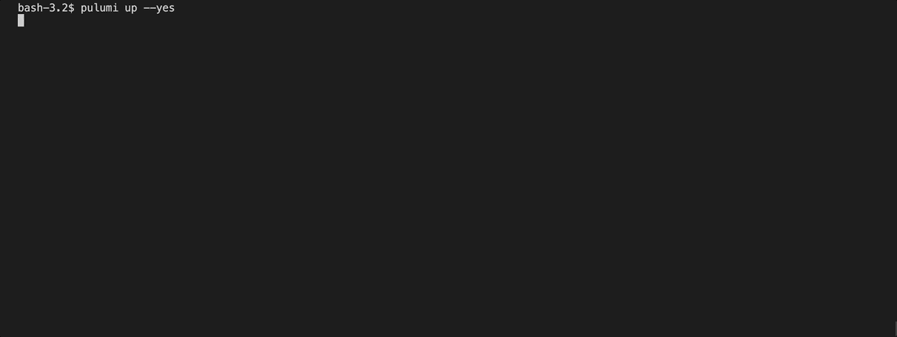

Kubernetes has been a significant focus of Pulumi since its very beginnings. Pulumi added support for installing [Helm charts](https://helm.sh/) way back in [2018]() and it has seen significant adoption by users since. However, Pulumi's current Chart integration lacks support for some increasingly common advanced features in Helm charts, e.g.:

1. Support for [Helm lifecycle hooks](https://helm.sh/docs/topics/charts_hooks/)
2. Handling sub-charts and [dependencies](https://helm.sh/docs/topics/charts/#chart-dependencies)

As Helm and its usage evolved over the years, Pulumi users using the `Chart` resource have often had to get very creative in order to get the desired functionality in their deployments.

Today we are excited to announce the **public preview** of a new [Helm Release]() resource starting with [v3.7.0](https://github.com/pulumi/pulumi-kubernetes/releases/tag/v3.7.0) of the Pulumi Kubernetes Provider and SDK in all Pulumi supported languages. This new resource provides Pulumi users more options to choose the right tool for their use-case. The rest of this blog post will highlight how this resource differs from the existing [Helm Chart]() component resource and describe how and when to use the new resource.

<!--more-->

{}
The existing [Helm Chart]() component resource, which extracts and converts Kubernetes resources into individual resources in the Pulumi program, will continue to be supported.
{}

## How is Helm Release resource different?

Pulumi's Helm Chart integration was implemented as a [Component Resource]() which effectively extracts the corresponding Kubernetes resources' manifests from the chart and installs them as if they were individually specified in the Pulumi user program. This allowed users to install community developed Helm charts, while providing fine-grained control over the respective Kubernetes resources installed in the process. For instance, the installed resources are subject to all policies specified through Policy-as-Code policy packs registered with Pulumi. Other users have used Pulumi's powerful transformation support to manipulate Helm charts to fit their desired needs before installing them in their environment.

In contrast, the new Helm Release resource uses the Helm SDK, bringing the full feature set of Helm directly to Pulumi users. This provides the following advantages:

### Helm Controls Lifecycle

Unlike the existing Chart component resource, Helm Release directly offloads all responsibility of orchestration and lifecycle management to Helm itself. This means Helm can invoke all necessary lifecycle hooks for the release as it would through the CLI. It also updates chart dependencies and correctly handles sub-chart values.

### Configurable Await Support

By default, Pulumi's Helm Release resource waits for all resources installed by the release to be available, up to a configurable timeout that defaults to *5 minutes*. With a sufficient timeout, the resource can be reliably passed to `dependsOn` clauses in subsequent resources to encode ordering requirements. In addition, users can also require waiting on all Helm hooks to complete by setting `jobAwait` to true. However, if desired, all await behavior can be disabled by setting `skipAwait` option to true. See the [SDK documentation]() for details for each of the above options.

### Helm State Management

The release's state is serialized and stored by Helm on the cluster. As a result, users can interact with the installed resource outside of Pulumi through the Helm CLI.

<br/>
While there are many positives, there are some significant limitations to highlight with this approach as well:

### Limited Transforms Support

Helm Release doesn't support the ability to write transformations for Helm-installed manifests inline in the Pulumi program as supported in Helm Charts. Instead, users can leverage Helm's [post-renderer](https://helm.sh/docs/topics/advanced/#post-rendering) specified through the `postRender` option for the Release resource to manipulate manifests.

### Limited Visibility

Secondly, only the Release resource and the relevant Kubernetes resources read back in the user program are part of Pulumi state. Other items installed by the chart are only controlled by Helm and are not visible and thus cannot be managed through Pulumi. However, the underlying rendered manifests and resource names will be accessible to users of the resource through the `manifest` and `resourceNames` fields as part of the deployment preview.

## How do I use it?

If you aren't already familiar with using Pulumi with Kubernetes, head on over to [Pulumi's getting started guide for Kubernetes]() first.

1. In your chosen Kubernetes Pulumi project, make sure the referenced version of the Pulumi-Kubernetes SDK is at least `v3.7.0`.
2. Helm Release support is configured to target the relevant cluster pointed to by the Kubernetes provider associated with it and no additional configuration is required by default. However, more advanced configuration options are supported, see the provider configuration [documentation]() for more details.
3. Refer to the instructions for your chosen language in the [resource documentation]() to create a Helm Release resource.

Lets look at a concrete example of Helm Release in action. In the following snippet we install [Redis](https://redis.io/) through a Helm Chart in each of the supported Pulumi languages using the new Helm Release resource:



{}

```typescript
import * as random from "@pulumi/random";
import * as pulumi from "@pulumi/pulumi";
import * as k8s from "@pulumi/kubernetes";

// Create a password
const pass = new random.RandomPassword("pass", {length:10});
const redisPassword = pass.result;

const namespace = new k8s.core.v1.Namespace("redis-ns");

const release = new k8s.helm.v3.Release("redis-helm", {
    chart: "redis",
    repositoryOpts: {
        repo: "https://charts.bitnami.com/bitnami",
    },
    version: "13.0.0",
    namespace: namespace.metadata.name,
    // Values from Chart's parameters specified hierarchically,
    // see https://artifacthub.io/packages/helm/bitnami/redis/13.0.0#parameters for reference.
    values: {
        cluster: {
            enabled: true,
            slaveCount: 3,
        },
        metrics: {
            enabled: true,
            service: {
                annotations: {
                    "prometheus.io/port": "9127",
                }
            },
        },
        global: {
            redis: {
                password: redisPassword,
            }
        },
        rbac: {
            create: true,
        }
    },
    // By default Release resource will wait till all created resources
    // are available. Set this to true to skip waiting on resources being
    // available.
    skipAwait: false,
});


// We can lookup resources once the release is installed. The release's
// status field is set once the installation completes, so this, combined
// with `skipAwait: false` above, will wait to retrieve the Redis master
// ClusterIP till all resources in the Chart are available.
const srv = k8s.core.v1.Service.get("redis-master-svc",
    pulumi.interpolate`${release.status.namespace}/${release.status.name}-master`);
export const redisMasterClusterIP = srv.spec.clusterIP;
```

{}

{}

```go
package main

import (
	"fmt"

	corev1 "github.com/pulumi/pulumi-kubernetes/sdk/v3/go/kubernetes/core/v1"
	"github.com/pulumi/pulumi-kubernetes/sdk/v3/go/kubernetes/helm/v3"
	"github.com/pulumi/pulumi-random/sdk/v4/go/random"
	"github.com/pulumi/pulumi/sdk/v3/go/pulumi"
)

func main() {
	pulumi.Run(func(ctx *pulumi.Context) error {

		namespace, err := corev1.NewNamespace(ctx, "redis-ns", nil)
		if err != nil {
			return err
		}

		redisPassword, err := random.NewRandomPassword(ctx, "pass", &random.RandomPasswordArgs{
			Length: pulumi.Int(10),
		})
		if err != nil {
			return err
		}

		rel, err := helm.NewRelease(ctx, "redis-helm", &helm.ReleaseArgs{
			Chart: pulumi.String("redis"),
			RepositoryOpts: helm.RepositoryOptsArgs{
				Repo: pulumi.String("https://charts.bitnami.com/bitnami"),
			},
			Version:   pulumi.String("13.0.0"),
			Namespace: namespace.Metadata.Name(),

            // Values from Chart's parameters specified hierarchically,
            // see https://artifacthub.io/packages/helm/bitnami/redis/13.0.0#parameters for reference.
			Values: pulumi.Map{
				"cluster": pulumi.Map{
					"enabled": pulumi.Bool(true),
				},
				"metrics": pulumi.Map{
					"enabled": pulumi.Bool(true),
					"service": pulumi.Map{
						"annotations": pulumi.StringMap{
							"prometheus.io/port": pulumi.String("9127"),
						},
						"type": pulumi.String("ClusterIP"),
					},
				},
				"global": pulumi.Map{
					"redis": pulumi.Map{
						"password": redisPassword.Result,
					},
				},
				"rbac": pulumi.BoolMap{
					"create": pulumi.Bool(true),
				},
			},

			// By default Release resource will wait till all created resources
			// are available. Set this to true to skip waiting on resources being
			// available.
			SkipAwait: pulumi.BoolPtr(false),
		})
		if err != nil {
			return err
		}

		// We can lookup resources once the release is installed. The release's
		// status field is set once the installation completes, so this, combined
		// with `skipAwait: pulumi.BoolPtr(false)` above, will wait to retrieve
        //  the Redis master ClusterIP till all resources in the Chart are available.
		svc := pulumi.All(rel.Status.Namespace(), rel.Status.Name()).
			ApplyT(func(r interface{}) (interface{}, error) {
				arr := r.([]interface{})
				namespace := arr[0].(*string)
				name := arr[1].(*string)
				svc, err := corev1.GetService(ctx,
					"redis-master-svc",
					pulumi.ID(fmt.Sprintf("%s/%s-master", *namespace, *name)),
					nil,
				)
				if err != nil {
					return "", nil
				}
				return svc.Spec.ClusterIP(), nil
			})
		ctx.Export("redisMasterClusterIP", svc)

		return nil
	})
}

```

{}

{}

```python
import pulumi
from pulumi import Output
from pulumi_random.random_password import RandomPassword
from pulumi_kubernetes.core.v1 import Namespace, Service
from pulumi_kubernetes.helm.v3 import Release, ReleaseArgs, RepositoryOptsArgs

namespace = Namespace("redis-ns")

redis_password = RandomPassword("pass", length=10)

release_args = ReleaseArgs(
    chart="redis",
    repository_opts=RepositoryOptsArgs(
        repo="https://charts.bitnami.com/bitnami"
    ),
    version="13.0.0",
    namespace=namespace.metadata["name"],

    # Values from Chart's parameters specified hierarchically,
    # see https://artifacthub.io/packages/helm/bitnami/redis/13.0.0#parameters
    # for reference.
    values={
        "cluster": {
            "enabled": True,
            "slaveCount": 3,
        },
        "metrics": {
            "enabled": True,
            "service": {
                "annotations": {
                    "prometheus.io/port": "9127",
                }
            },
        },
        "global": {
            "redis": {
                "password": redis_password.result,
            }
        },
        "rbac": {
            "create": True,
        },
    },
    # By default Release resource will wait till all created resources
    # are available. Set this to true to skip waiting on resources being
    # available.
    skip_await=False)

release = Release("redis-helm", args=release_args)

# We can lookup resources once the release is installed. The release's
# status field is set once the installation completes, so this, combined
# with `skip_await=False` above, will wait to retrieve the Redis master
# ClusterIP till all resources in the Chart are available.
status = release.status
srv = Service.get("redis-master-svc",
                  Output.concat(status.namespace, "/", status.name, "-master"))
pulumi.export("redisMasterClusterIP", srv.spec.cluster_ip)
```

{}

{}

```csharp
using Pulumi;
using System.Collections.Generic;
using Pulumi.Random;
using Pulumi.Kubernetes.Core.V1;
using Pulumi.Kubernetes.Types.Inputs.Helm.V3;
using Pulumi.Kubernetes.Helm.V3;

class MyStack : Stack
{
    public MyStack()
    {
        var ns = new Pulumi.Kubernetes.Core.V1.Namespace("redis-ns");
        var redisPassword = new RandomPassword("pass", new RandomPasswordArgs
        {
            Length = 10,
        });

        var releaseArgs = new ReleaseArgs
        {
            Chart = "redis",
            RepositoryOpts = new RepositoryOptsArgs
            {
                Repo = "https://charts.bitnami.com/bitnami",
            },
            Version = "13.0.0",
            Namespace = ns.Metadata.Apply(metadata => metadata.Name),
            // Values from Chart's parameters specified hierarchically,
            // see https://artifacthub.io/packages/helm/bitnami/redis/13.0.0#parameters
            // for reference.
            Values = new InputMap<object>
            {
                ["cluster"] = new Dictionary<string,object>
                {
                    ["enabled"] = true,
                    ["slaveCount"] = 3,
                },
                ["metrics"] = new Dictionary<string,object>
                {
                    ["enabled"] = true,
                    ["service"] = new Dictionary<string, object>
                    {
                        ["annotations"] = new Dictionary<string, string>
                        {
                            ["prometheus.io/port"] = "9127",
                        },
                    }
                },
                ["global"] = new Dictionary<string,object>
                {
                    ["redis"] = new Dictionary<string, object>
                    {
                        ["password"] = redisPassword.Result,
                    },
                },
                ["rbac"] = new Dictionary<string,object>
                {
                    ["create"] = true,
                }
            },
            // By default Release resource will wait till all created resources
            // are available. Set this to true to skip waiting on resources being
            // available.
            SkipAwait = false,
        };

        var release = new Release("redis-helm", releaseArgs);

        // We can lookup resources once the release is installed. The release's
        // status field is set once the installation completes, so this, combined
        // with `skip_await=False` above, will wait to retrieve the Redis master
        // ClusterIP till all resources in the Chart are available.
        var status = release.Status;
        var service = Service.Get("redist-master-svc", Output.All(status).Apply(
            s => $"{s[0].Namespace}/{s[0].Name}-master"));
        this.RedisMasterClusterIP = service.Spec.Apply(spec => spec.ClusterIP);
    }

    [Output]
    public Output<string> RedisMasterClusterIP { get; set; }
}

```

{}



Users of the existing Helm Chart resource will notice that we retained the hierarchical `values` specification experience and a similar means to configure the repository. The above example also highlights the await and resource lookup experience.

Rollout of the above program is shown in the slightly sped up gif below:


## Which Helm resource to use and when?

In summary, if your primary goal is to install Helm charts with configuration options natively supported by the chart, then Helm Release should be a good fit. If on the other hand you intend to manipulate Helm Charts through transformations (due to bugs in the charts or restrictions in your environment), then the experience is much richer with the Helm Chart resource.

If you intend to use Policy-as-Code to enforce resource policies at a Kubernetes resource granularity, then the Helm Chart component resource would be the preferred model to use.

Note that both resources can co-exist safely in the same program.

## What's next?

The new Helm Release resource is available in *preview* now. During the preview the resource may evolve rapidly and users are requested to not use it for critical infrastructure. We have already received valuable feedback to shape this resource and we look forward to hearing more from our users. Please reach out by filing or commenting on issues on [Github](https://github.com/pulumi/pulumi-kubernetes/issues) or asking questions on [Community Slack](https://slack.pulumi.com). Happy charting!
