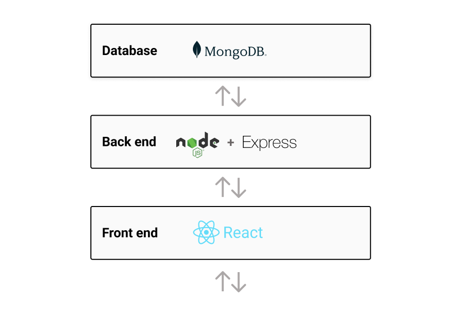
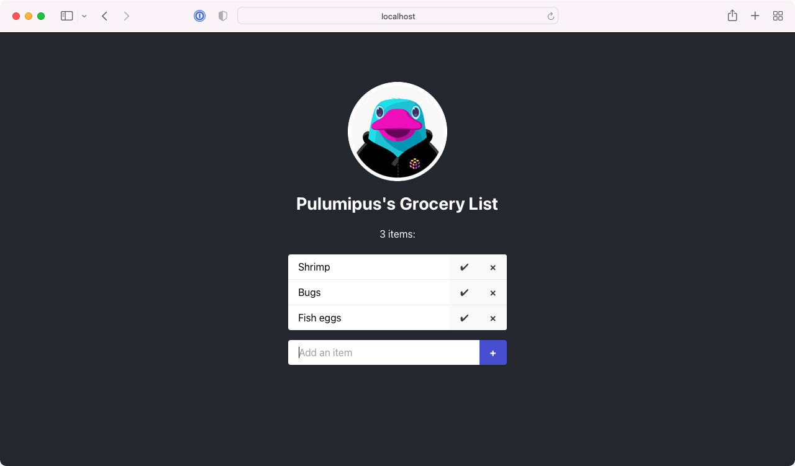
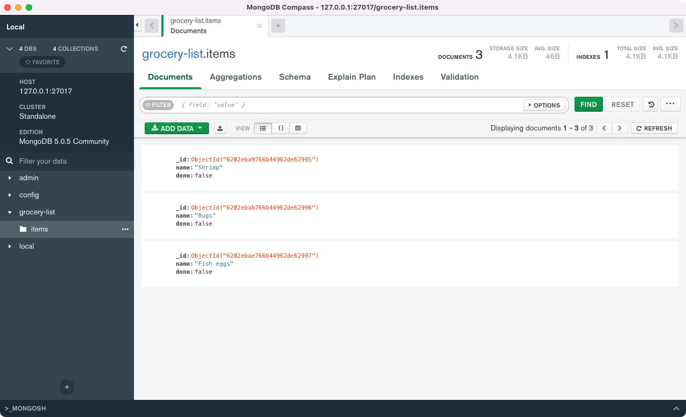
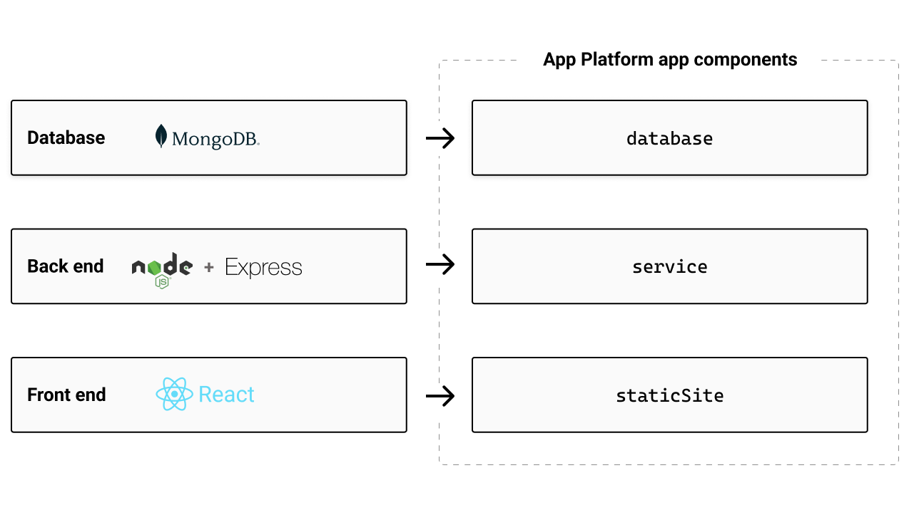
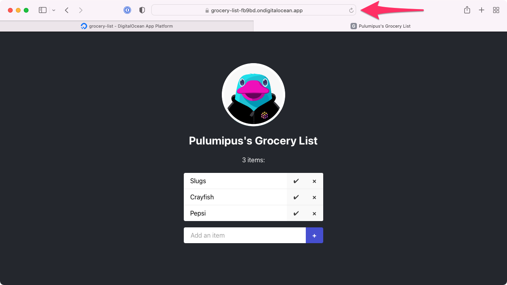
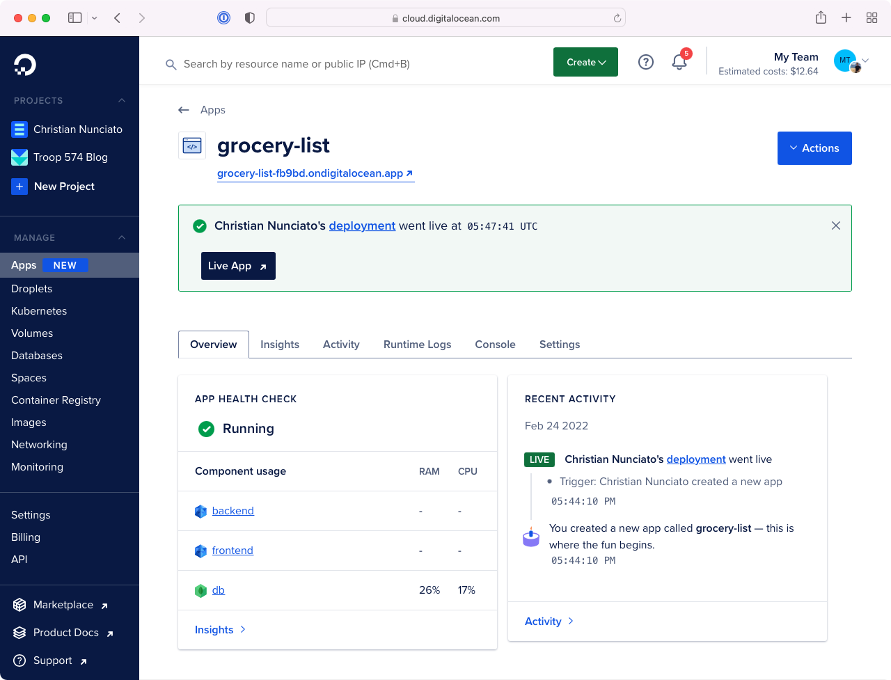
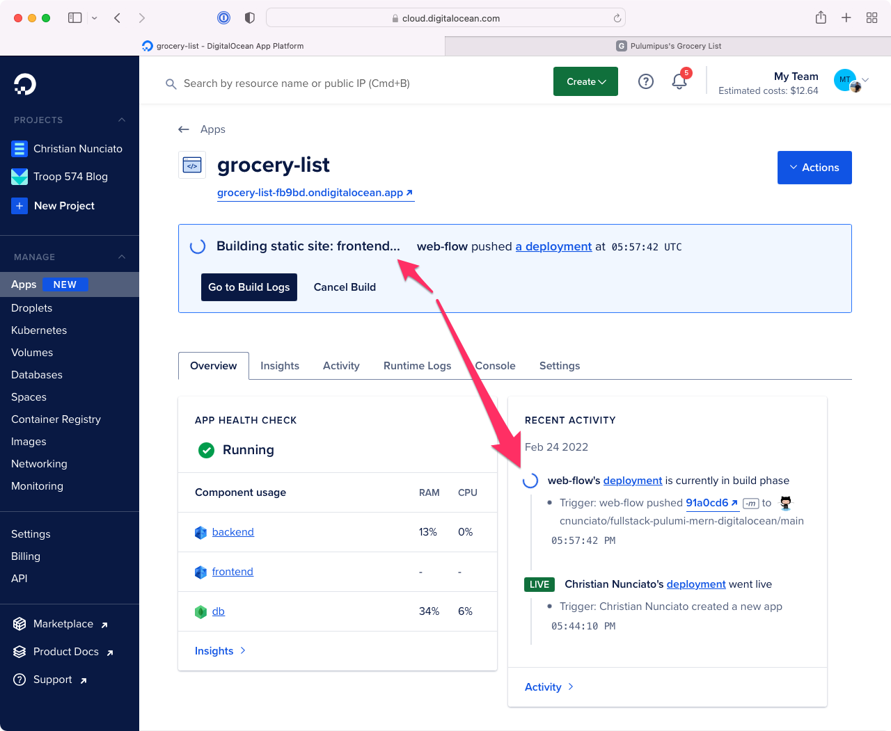

As a developer, I get lots of ideas for web apps---little things, mostly: nifty ways to keep track of my kids' allowances, habit trackers, shopping lists. Most of them, however, never see the light of day, and not just because I'm lazy; I also tend to get hung up trying to decide what to use for the technology stack.

<!--more-->

And as a JavaScript developer, I certainly have options---too many, in fact, and that's part of the problem. Having roughly a hundred and fifty million libraries and frameworks to choose from is definitely better than having none, but at the same time, all that choice can make the actual choosing rather difficult. Which is why, when I just want to get something done, I'll often reach for a combination of tools known as [the MERN stack](https://www.mongodb.com/mern-stack).

MERN-stack apps are three-tier web apps built with [MongoDB](https://www.mongodb.com/), [Express](https://expressjs.com/), [React](https://reactjs.org/), and [Node.js](https://nodejs.org/). You can read all about them [in the MongoDB docs](https://www.mongodb.com/mern-stack), but the gist is that they allow you use one language---JavaScript (or TypeScript, if you like)---to manage all three layers of the application stack: the front end as a single-page app built statically with React, the back end as a REST API managed with Express, and the database as a collection of JSON-like documents with MongoDB. MERN might not _always_ the right tool for the job, but for the kinds of apps I tend to find myself building, it generally works out pretty well.



Still, once I'm _finished_ building my app, I'm often faced with a whole other problem: figuring out how to get the app off of my laptop and onto the web.

The cloud hasn't made this an easy task for developers. Choosing a cloud provider, deciding which resources to use (and how to use them), setting up networking, debugging permissions, navigating billing, and all the rest, can be overwhelming---and that's before you've given a single thought to anything having to do with automation or infrastructure as code. What we want, I think, is to be able to focus on our apps, and we're ready to ship, push our code to a repository and wait patiently for a URL to emerge that we can paste into a browser and have everything _just work_.

Which is why I was so delighted when I discovered [DigitalOcean's App Platform](https://www.digitalocean.com/products/app-platform).

If you've used DigitalOcean before, you know it's all about making infrastructure more accessible to developers. What you may not know, though, or at least I didn't myself until recently, is that you can do a lot more with DigitalOcean than just [virtual machines](https://www.digitalocean.com/products/droplets). A [fairly new](https://www.digitalocean.com/blog/introducing-digitalocean-app-platform-reimagining-paas-to-make-it-simpler-for-you-to-build-deploy-and-scale-apps), fully-managed platform service (think [Heroku](https://heroku.com)), App Platform gives you a set of high-level abstractions built to align with the tiers of a typical web application, which means you can focus on what you care about most---your app---and leave the infrastructure and its management to someone else. It's a compelling option for anyone looking to deploy and manage any web application (MERN or otherwise), and as you'll see, with Pulumi and a little bit of code, you can easily do so without ever having to leave the comfort of your IDE.

So let's build ourselves a MERN app and deploy it on DigitalOcean with Pulumi. Given the goal is to focus primarily on the infrastructure and how to code it, we'll start with a pre-baked web application (a simple grocery list), and we'll map its tiers to App Platform constructs and wire everything up with Pulumi.

## First steps: setting up {#setting-up}

The code for this walkthrough is [available as a template repository on GitHub](https://github.com/cnunciato/fullstack-pulumi-mern-digitalocean), so if you want to follow along (and you should!), you should [grab a copy of your own](https://github.com/cnunciato/fullstack-pulumi-mern-digitalocean/generate) to work with by forking the repository or creating a new one from the template. Once you've done that, you should also:

* [Clone the repository](https://github.com/cnunciato/fullstack-pulumi-mern-digitalocean) to your local machine.
* [Install Pulumi]() and [Node.js](https://nodejs.org/).
* [Sign into DigitalOcean](cloud.digitalocean.com/) and obtain a [personal access token](https://cloud.digitalocean.com/account/api/tokens) with read-write permissions.
* Grant DigitalOcean access to your GitHub repository by [visiting the Apps page](https://cloud.digitalocean.com/apps), choosing Create App, and following the steps to install DigitalOcean's GitHub app.
* Optionally, if you'd like to develop the application locally as well, [install and configure MongoDB Community Edition](https://docs.mongodb.com/manual/tutorial/install-mongodb-on-os-x/).

One thing to note: Since we'll be provisioning real DigitalOcean resources, there's a chance you could incur a slight cost for what you use. However, as we'll be using the least expensive plan settings available, and tearing everything down when we're through, that cost shouldn't amount to more than a few pennies or so.

Let's get started.

## Cloning and inspecting the repository

Once you've cloned your copy of the template repository and navigated to the root, you'll see a couple of files and folders that look something like this:

```bash
├── frontend
├── backend
└── package.json
```

The `frontend` folder contains the React application, and its job is to render the list of groceries and give you something to interact with (to add items, check them off, delete them, and so on). The scaffolding for the app was generated with a tool called [Vite](https://vitejs.dev/), and all of its logic---form fields, click handlers, API calls, etc.---is contained in `src/App.tsx`.

The `backend` folder contains the Express application that defines the REST API. It sets up four API [routes](https://expressjs.com/en/guide/routing.html) to handle the [CRUD](https://en.wikipedia.org/wiki/Create,_read,_update_and_delete) operations you'd expect in an app like this one:

* `GET /api/items` fetches all items from the database and returns them as a JSON array.
* `POST /api/items` accepts a new item and writes it to the database.
* `PUT /api/items/:id` updates an existing item (to toggle its checked/unchecked status).
* `DELETE /api/items/:id` deletes an item from the database.

The back end supports three configurable properties as well, all of which are exposed as optional environment variables:

* `BACKEND_SERVICE_PORT`, which defaults to `8000`
* `BACKEND_ROUTE_PREFIX`, which defaults to `/api`
* `DATABASE_URL`, which defaults to `mongodb://127.0.0.1` for local development

## Running the application locally (optional)

You don't have to do this, but if you'd like to, here's how. After [installing MongoDB and starting the service](https://docs.mongodb.com/manual/administration/install-community/) (which should be listening by default on port `27107`), you can install all front-end and back-end dependencies and start the development server:

```bash
$ npm install
$ npm start
```

With the development server running, you can browse to <http://localhost:3000> and see the app:



The front-end and back-end dev servers are set up to compile your TypeScript to JavaScript automatically, and the front-end server is configured to proxy the back-end service (which runs at `http://localhost:8000`) at a root-relative path of `/api`. Proxying the API in this way lets you avoid having to wrestle with [CORS](https://developer.mozilla.org/en-US/docs/Web/HTTP/CORS)-related issues, and as you'll see when we deploy to DigitalOcean later, App Platform conveniently supports the same configuration out of the box.

Try adding a few items and marking them off, just to make sure everything's working as expected. If you've got a MongoDB client installed as well---I generally use [MongoDB Compass](https://www.mongodb.com/products/compass)---you should be able to find the `grocery-list` database and see the `items` collection filling up with delicious foods:



Now let's have a look at how to go about deploying this stuff.

## Charting a course

Earlier I mentioned that every cloud provider handles application deployment a little differently, sometimes in multiple ways, and that's true for DigitalOcean as well. You _could_ deploy the front end as a [DigitalOcean Space](https://www.digitalocean.com/products/spaces), or both the front end and back end (and even the database) as a [DigitalOcean Droplet](https://www.digitalocean.com/products/droplets). But given the shape of this application, the best fit is really is [App Platform](https://docs.digitalocean.com/products/app-platform/concepts/), for several reasons.

One is that because App Platform apps are comprised these high-level [_components_](https://docs.digitalocean.com/products/app-platform/concepts/)---abstractions like [static site](https://docs.digitalocean.com/products/app-platform/concepts/static-site/), [service](https://docs.digitalocean.com/products/app-platform/concepts/service/), and [database](https://docs.digitalocean.com/products/app-platform/concepts/database/)---it's pretty much purpose-built for an application like this one, and DigitalOcean customizes the deployment of each component based according to its type. Static websites are distributed and cached on DigitalOcean's CDN, services are packaged and delivered as containers (with its [Kubernetes](https://www.digitalocean.com/products/kubernetes) platform), and databases are deployed as configurable managed services. All of this means you're not only able to stay focused on the application itself, but you're able to scale each one of these components up or down however you like, and even delegate your front-end and back-end build processes to DigitalOcean to be handled in response to commits on one or more external Git repositories.

App Platform apps can be configured in one of two ways: manually, by configuring their components individually in the DigitalOcean web console, or programmatically, in the form of an App Platform [_spec_](https://docs.digitalocean.com/products/app-platform/concepts/app-spec/), a JSON document submitted over DigitalOcean's [REST API](https://docs.digitalocean.com/reference/api/api-reference/). In our case, we'll indirectly go the latter route, using Pulumi with the [DigitalOcean provider package]() to define an app spec comprised of three components:

* A `staticSite` component mapped to the `frontend` folder
* A `service` component mapped to the `backend` folder
* A `database` component mapped to a managed MongoDB cluster (which we'll also configure to be accessible only by the `service` component)



And once deployed, it'll all be available at a single DigitalOcean-provided URL.

Let's begin by creating new Pulumi project.

## Creating the project

In the root of the repository, make a new folder called `infra`, change to it, then run `pulumi new` using the `digitalocean` [project template](https://github.com/pulumi/templates):

{}

{}

```bash
$ mkdir infra && cd infra
$ pulumi new digitalocean-typescript
```

{}

{}

```bash
$ mkdir infra && cd infra
$ pulumi new digitalocean-python
```

{}

At the prompts, use the following values:

* For project name, use `grocery-list`
* For description, use `Deploying a MERN-stack app on DigitalOcean`
* For stack name, use `dev`, the default

When the command completes, you'll have a new [Pulumi stack](), but you'll still have a few things to configure. For one, the Pulumi DigitalOcean provider needs to be [configured]() to communicate with DigitalOcean on your behalf (to provision your app and its various resources). For this, you can use the access token you obtained [earlier](#setting-up) from the DigitalOcean console, and you can apply it by setting a single environment variable:

```bash
$ export DIGITALOCEAN_TOKEN="your-access-token"
```

Also, since one of our goals is to have App Platform deploy automatically on every GitHub commit, you'll need to tell DigitalOcean where to find the source code for your front- and back-end components. You _could_ bake these settings right into the Pulumi program itself, but it'd be better to apply them as stack-specific configuration settings, as that'd let you deploy to different stacks later (say, in CI) based on the branch of the commit. Everyone does this a little differently, so for now, let's configure the currently selected stack (which should be `dev`) to use the default branch of your GitHub repository:

```bash
$ pulumi config set repo "your-github-org/your-github-repo" # e.g., cnunciato/fullstack-pulumi-mern-digitalocean
$ pulumi config set branch "your-main-branch"               # e.g., main
```

With these values in place, you're ready to start writing the program.

{}
App Platform also supports GitLab and other Git-based repositories as well. See the [App Specification docs](https://docs.digitalocean.com/products/app-platform/references/app-specification-reference/) for details.
{}

## Writing the program

In your IDE of choice, open {} and replace the sample code with the following lines to import the Pulumi and DigitalOcean SDKs and the configuration values you just set, and add a line to specify the [DigitalOcean region](https://docs.digitalocean.com/products/platform/availability-matrix/) to deploy into:

{}

{}

```typescript
import * as pulumi from "@pulumi/pulumi";
import * as digitalocean from "@pulumi/digitalocean";

// Our stack-specific configuration.
const config = new pulumi.Config();
const repo = config.require("repo");
const branch = config.require("branch");

// The DigitalOcean region to deploy into.
const region = digitalocean.Region.SFO3;
```

{}

{}

```python
import pulumi
import pulumi_digitalocean as digitalocean

# Our stack-specific configuration.
config = pulumi.Config()
repo = config.require("repo")
branch = config.require("branch")

# The DigitalOcean region to deploy into.
region = digitalocean.Region.SFO3
```

{}

Next, add a few lines to [declare the managed MongoDB cluster](https://docs.digitalocean.com/products/databases/mongodb/how-to/create/). We'll use just one node for now---additional replica nodes can easily be added later by increasing the `nodeCount` value---and go with the least expensive [performance settings](https://www.digitalocean.com/pricing#managed-databases):

{}

{}

```typescript
// ...

// Our MongoDB cluster (currently just one node).
const cluster = new digitalocean.DatabaseCluster("cluster", {
    engine: "mongodb",
    version: "4",
    region,
    size: digitalocean.DatabaseSlug.DB_1VPCU1GB,
    nodeCount: 1,
});

// The database we'll use for our grocery list.
const db = new digitalocean.DatabaseDb("db", {
    name: "grocery-list",
    clusterId: cluster.id,
});
```

{}

{}

```python
# ...

# Our MongoDB cluster (currently just one node).
cluster = digitalocean.DatabaseCluster("cluster", digitalocean.DatabaseClusterArgs(
    engine = "mongodb",
    version = "4",
    region = region,
    size = digitalocean.DatabaseSlug.D_B_1_VPCU1_GB,
    node_count = 1
))

# The database we'll use for our grocery list.
db = digitalocean.DatabaseDb("db", digitalocean.DatabaseDbArgs(
    name = "grocery-list",
    cluster_id = cluster.id
));
```

{}

Now for the App Platform spec itself. Notice the `digitalocean.App` resource takes just one argument, `spec`, which defines all three of the components of the app: static site, service, and database. Both the static site and the service are configured to use the same GitHub repository (the `sourceDir` properties indicate their folders within the repository), and both are configured (via the `deployOnPush` flag) to be rebuilt and redeployed by DigitalOcean on every commit.

The service has a few additional settings that you can use to manage its runtime behavior and deployment topology as well. As in development, we'll configure the service to listen on port 8000 and be available at `/api`---the entire app will ultimately be proxied transparently by an [App Platform load balancer](https://docs.digitalocean.com/products/app-platform/concepts/load-balancer/)---and it'll be powered by just one container instance, again using the least expensive [performance settings](https://docs.digitalocean.com/products/app-platform/):

{}

{}

```typescript
// ...

// The App Platform spec that defines our grocery list.
const app = new digitalocean.App("app", {
    spec: {
        name: "grocery-list",
        region: region,

        // The React front end.
        staticSites: [
            {
                name: "frontend",
                github: {
                    repo,
                    branch,
                    deployOnPush: true,
                },
                sourceDir: "/frontend",
                buildCommand: "npm install && npm run build",
                outputDir: "/dist",
            }
        ],

        // The Express back end.
        services: [
            {
                name: "backend",
                github: {
                    repo,
                    branch,
                    deployOnPush: true,
                },
                sourceDir: "/backend",
                buildCommand: "npm install && npm run build",
                runCommand: "npm start",
                httpPort: 8000,
                routes: [
                    {
                        path: "/api",
                        preservePathPrefix: true,
                    },
                ],
                instanceSizeSlug: "basic-xxs",
                instanceCount: 1,

                // To connect to MongoDB, the service needs a DATABASE_URL, which
                // is conveniently exposed as an environment variable thanks to its
                // membership in this app spec (below). The CA_CERT value enables
                // a secure connection between API service and database.
                envs: [
                    {
                        key: "DATABASE_URL",
                        scope: "RUN_AND_BUILD_TIME",
                        value: "${db.DATABASE_URL}",
                    },
                    {
                        key: "CA_CERT",
                        scope: "RUN_AND_BUILD_TIME",
                        value: "${db.CA_CERT}",
                    },
                ],
            },
        ],

        // Include the MongoDB cluster as an integrated App Platform component.
        databases: [
            {
                // The name `db` defines the prefix of the tokens used (above) to
                // read the environment variables exposed by the database cluster.
                name: "db",

                // MongoDB clusters are only available in "production" mode.
                // https://docs.digitalocean.com/products/app-platform/concepts/database/
                production: true,

                // A reference to the `DatabaseCluster` we declared above.
                clusterName: cluster.name,

                // The engine value must be uppercase, so we transform it with JS.
                engine: cluster.engine.apply(engine => engine.toUpperCase()),
            }
        ]
    },
});
```

{}

{}

```python
# ...

# The App Platform spec that defines our grocery list.
app = digitalocean.App("app", digitalocean.AppArgs(
    spec = digitalocean.AppSpecArgs(
        name = "grocery-list",
        region = region,

        # The React front end.
        static_sites = [
            digitalocean.AppSpecStaticSiteArgs(
                name = "frontend",
                github = digitalocean.AppSpecJobGithubArgs(
                    repo = repo,
                    branch = branch,
                    deploy_on_push = True
                ),
                source_dir = "/frontend",
                build_command = "npm install && npm run build",
                output_dir = "/dist"
            )
        ],

        # The Express back end.
        services = [
            digitalocean.AppSpecServiceArgs(
                name = "backend",
                github = digitalocean.AppSpecJobGithubArgs(
                    repo = repo,
                    branch = branch,
                    deploy_on_push = True
                ),
                source_dir = "/frontend",
                build_command = "npm install && npm run build",
                run_command = "npm start",
                http_port = 8000,
                routes = [
                    digitalocean.AppSpecServiceRouteArgs(
                        path = "/api",
                        preserve_path_prefix = True
                    )
                ],
                instance_size_slug = "basic-xxs",
                instance_count = 1,

                # To connect to MongoDB, the service needs a DATABASE_URL, which
                # is conveniently exposed as an environment variable because the
                # database belongs to the app (see below). The CA_CERT allows for
                # a secure connection between API service and database.
                envs = [
                    digitalocean.AppSpecServiceEnvArgs(
                        key = "DATABASE_URL",
                        scope = "RUN_AND_BUILD_TIME",
                        value = "${db.DATABASE_URL}"
                    ),
                    digitalocean.AppSpecServiceEnvArgs(
                        key = "CA_CERT",
                        scope = "RUN_AND_BUILD_TIME",
                        value = "${db.CA_CERT}"
                    )
                ]
            )
        ],

        # Include the MongoDB cluster as an integrated App Platform component.
        databases = [
            digitalocean.AppSpecDatabaseArgs(
                # The `db` name defines the prefix of the tokens used (above) to
                # read the environment variables exposed by the database cluster.
                name = "db",

                # MongoDB clusters are only available in "production" mode.
                # https://docs.digitalocean.com/products/app-platform/concepts/database/
                production = True,

                # A reference to the managed cluster we declared above.
                cluster_name = cluster.name,

                # The engine value must be uppercase, so we transform it with Python.
                engine = cluster.engine.apply(lambda engine: engine.upper())
            )
        ]
    ),
))
```

{}

Technically that's all we need to configure the application---but it wouldn't be a bad idea to add one last thing.

By default, managed MongoDB clusters are configured to be publicly accessible---which is great if you need to be able to connect one yourself, but not so great as a strategy for preventing internet miscreants from doing the same. You can fix this easily by adding a `DatabaseFirewall` resource to declare the app as a [_trusted source_](https://docs.digitalocean.com/products/app-platform/how-to/manage-databases/), thereby rejecting all inbound traffic originating from elsewhere:

{}

{}

```typescript
// ...

// Adding a database firewall setting grants access solely to our app.
const trustedSource = new digitalocean.DatabaseFirewall("trusted-source", {
    clusterId: cluster.id,
    rules: [
        {
            type: "app",
            value: app.id,
        },
    ],
});
```

{}

{}

```python
# ...

# Adding a database firewall setting restricts access solely to our app.
trusted_source = digitalocean.DatabaseFirewall("trusted-source", digitalocean.DatabaseFirewallArgs(
    cluster_id = cluster.id,
    rules = [
        digitalocean.DatabaseFirewallRuleArgs(
            type = "app",
            value = app.id
        )
    ],
))
```

{}

And finally, add one last line to export the app URL, to be generated by DigitalOcean, as a Pulumi [stack output]():

{}

{}

```typescript
// ...

// The DigitalOcean-assigned URL for our app.
export const { liveUrl } = app;
```

{}

{}

```python
# ...

# The DigitalOcean-assigned URL for our app.
pulumi.export("liveUrl", app.live_url)
```

{}

With that, you're ready to deploy.

## Deploying

Quickly, to recap, here's what we've done so far:

* We took a pre-baked MERN app configured to run on `localhost`.
* We mapped the tiers of that app to their corresponding App Platform components.
* We wrote a Pulumi program to codify that mapping as an App Platform spec and a managed MongoDB cluster to go along with it.

When you deploy this app in a moment with [`pulumi up`](), Pulumi will provision a new MongoDB cluster (which usually takes a few minutes), and then once that's available, DigitalOcean will take our spec and use it to fetch the components of the app from GitHub at the specified branch and build them. From that point forward, any commit you make to that branch will trigger DigitalOcean to fetch, rebuild, and redeploy the app automatically.

Make sure you've installed the DigitalOcean GitHub app as described above---you should see it listed at <https://github.com/settings/installations>:


Now return to the command line and run `pulumi up`:

```bash
$ pulumi up

Previewing update (dev)

View Live: https://app.pulumi.com/cnunciato/grocery-list/dev/previews/605bf32a-95b1-4221-bc35-0e667b30f38a

     Type                                    Name              Plan
 +   pulumi:pulumi:Stack                     grocery-list-dev  create
 +   ├─ digitalocean:index:DatabaseCluster   cluster           create
 +   ├─ digitalocean:index:DatabaseDb        db                create
 +   ├─ digitalocean:index:App               app               create
 +   └─ digitalocean:index:DatabaseFirewall  trusted-source    create

Resources:
    + 5 to create

Do you want to perform this update?
> yes

Updating (dev)

View Live: https://app.pulumi.com/cnunciato/grocery-list/dev/updates/1

     Type                                    Name              Status
     pulumi:pulumi:Stack                     grocery-list-dev
 +   ├─ digitalocean:index:App               app               created
 +   └─ digitalocean:index:DatabaseFirewall  trusted-source    created

Outputs:
  + liveUrl: "https://grocery-list-fb9bd.ondigitalocean.app"

Resources:
    + 2 created
    3 unchanged

Duration: 2m30s
```

Again, it'll probably take a few minutes to get everything spun up for the first time, but when the process completes, you'll have a working app at the URL provided by DigitalOcean, emitted as a Pulumi stack output:

{}

```bash
$ open $(pulumi stack output liveUrl)
```

{}

{}

```bash
$ open $(pulumi stack output live_url)
```

{}



You should also be able to explore your shiny new grocery-list app in the DigitalOcean Console, with all three of its components (and their build-time and runtime logs!) now represented:



Now try making a commit to your repository (any commit will do, but ideally one to the `frontend` or `backend` folder), and watch as the app redeploys automatically:



And finally, try scaling the service by bumping the `instanceCount` from `1` to `2` in the code---or better, if you're up for it, making that value configurable by stack:

{}

{}

```diff
  const config = new pulumi.Config();
  const repo = config.require("repo");
  const branch = config.require("branch");
+ const serviceInstanceCount = config.requireNumber("service_instance_count");
  ...
        services: [
            digitalocean.AppSpecServiceArgs(
                ...
+               instanceCount: serviceInstanceCount,
```

{}

{}

```diff
  config = pulumi.Config()
  repo = config.require("repo")
  branch = config.require("branch")
+ service_instance_count = config.requireNumber("service_instance_count");
  ...
        services: [
            digitalocean.AppSpecServiceArgs(
                ...
+               instance_count: service_instance_count,
```

{}

```bash
$ pulumi config set service_instance_count 2

$ pulumi up

Updating (dev)

     Type                       Name              Status      Info
     pulumi:pulumi:Stack        grocery-list-dev
 ~   └─ digitalocean:index:App  app               updated     [diff: ~spec]

Outputs:
    liveUrl: "https://grocery-list-fb9bd.ondigitalocean.app"

Resources:
    ~ 1 updated
    4 unchanged

Duration: 1m27s
```

And when you're finished experimenting, you can tear everything down in just a few seconds with a [`pulumi destroy`]():

```bash
$ pulumi destroy

Destroying (dev)

     Type                                    Name              Status
 -   pulumi:pulumi:Stack                     grocery-list-dev  deleted
 -   ├─ digitalocean:index:DatabaseFirewall  trusted-source    deleted
 -   ├─ digitalocean:index:DatabaseDb        db                deleted
 -   ├─ digitalocean:index:App               app               deleted
 -   └─ digitalocean:index:DatabaseCluster   cluster           deleted

Resources:
    - 5 deleted

Duration: 19s
```

## Wrapping up, and next steps

Hopefully this gives you a sense of the kinds of things you can do with Pulumi and DigitalOcean---and I definitely encourage you to spend a little time with the [App Platform docs](https://docs.digitalocean.com/products/app-platform/) to dig a bit deeper into some of these concepts and explore a few others we weren't able to cover. You'll find the [full source for this walkthrough on GitHub](https://github.com/cnunciato/fullstack-pulumi-mern-digitalocean), of course, with [`finished` branch](https://github.com/cnunciato/fullstack-pulumi-mern-digitalocean/tree/finished) containing the completed Pulumi program for reference.

From here, you might think about:

* Adding a [`digitalocean.DnsRecord`]() to give your app a [custom domain name](https://docs.digitalocean.com/products/networking/dns/).

* Creating a second stack with [`pulumi stack init`]() and adjusting the program to make the source `branch` configurable---a `production` stack, say, designed to deploy in response to commits to a `release` branch.

* Using Pulumi's [GitHub Action]() to run previews and updates as part of a pull-request based workflow.

Happy coding!
