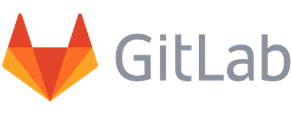
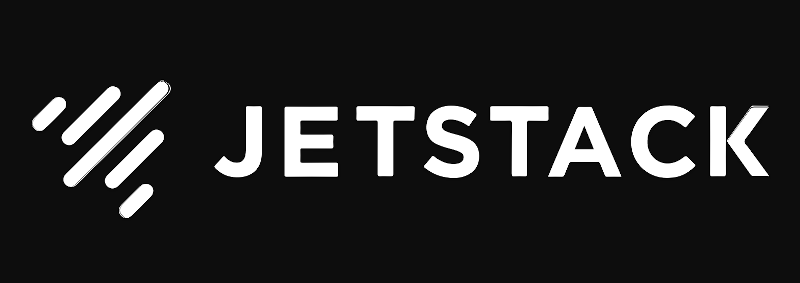
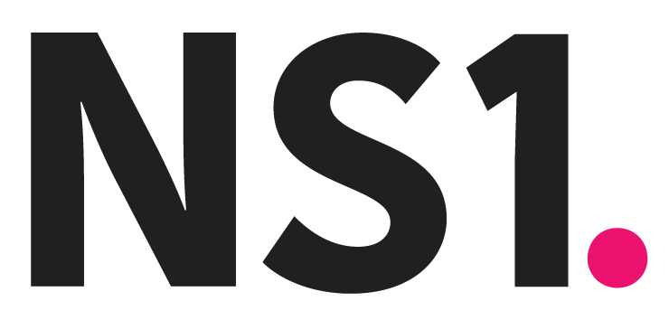

All software is cloud software. All modern applications interact with the cloud in some way, whether it's using cloud for storage, compute capabilities, or with rich cloud services for data, AI/ML, and so much more, to deliver amazing new experiences. As a result, all developers today are cloud developers, and infrastructure teams are key to enabling innovation across the entire organization. I had a great time telling this story at the [Cloud Engineering Summit](https://cloudengineeringsummit.com) today and wanted to take a moment to put pen to paper.

<!--more-->

## Introduction

The cloud is the world's biggest supercomputer. Although the cloud broke our architectures, workflows, and teams, we are now amidst a rennaisance of rebuilding new ways to create truly cloud-native applications and experiences.

We conceived of the Cloud Engineering Summit to celebrate this rennaisance. The talks throughout the day explore how we build _architectures_ and applications. We also explore how to operate those cloud architectures in a team setting through _workflows_ using automation and processes to build, deploy, and manage those applications and their infrastructure. Finally, _teams_ are working together more closely and in new ways in order to collaborate to deliver applications and infrastructure across all cloud engineering disciplines.

This is what we are calling *Cloud Engineering*: the next quantum leap in how we build cloud software. Cloud engineering means bringing the cloud closer to application development and infusing its capabilities to create new cloud-enabled experiences. Cloud engineering also means bringing more engineering practies to infrastructure, enabling us to leverage infrastructure as not just code but software. And finally, cloud engineering enables us to unlock collaboration, enabling the entire team to move faster with confidence.

## Cloud Engineering in Practice

When the cloud came along, our initial approach was to reuse the same application patterns from the Internet 1.0 era, starting with "lift and shift" and virtual machine-centric architectures. We've gone through at least two major sea changes since then, including the introduction of containers and serverless architectures, and if we were to start over with a blank slate today, we'd surely do things very differently.

In fact, the cloud effectively broke our existing approaches for architectures, workflows, and teams.

As the cloud incrementally broke these over the past decade, we invented best practices, tools, and techniques to cope with it. This led to DevOps and a fundamental change to how we worked together to build increasingly cloud-enabled software. DevOps started from a place of collaboration, bringing engineers and operations people closer together and was a very powerful precursor to what is now happening.

This is where cloud engineering now enters the picture. Instead of being _reactionary_ to change, we can now _proactively_ pursue approaches designed for the cloud. Instead of just coping, we can take a step back and reimagine new ways of doing things.

Cloud engineering takes the best practices from DevOps and extends them. There is no question that DevOps, despite its original intent, ended up more "opsy" than "devvy". With cloud engineering, application developers are now embracing the cloud and infusing cloud capabilities such as microservices and serverless into applications in fundamentally new ways, creating new application experiences for end users.

And at the same time, infrastructure experts, capabilities, and teams are key to enabling innovation more than ever before. During the cloud era, infrastructure became _programmable software_, which allows us to apply all the software engineering practices we know and love to infrastructure, including testing, refactoring, security, continuous delivery, and agile.

More cloud infrastructure capabilities have moved into application land, while at the same time more application development practices have moved into infrastructure land. What this means is that the whole team is collaborating more closely than ever before. Everyone is empowered to bring their unique skillsets to the table to enable moving faster and deliver amazing software capabilities, regardless of title &mdash; developer, DevOps, systems engineer, infrastructure architect, security engineer, etc. This is the modern cloud engineering organization.

### Cloud Engineering Architectures

Infrastructure used to be a tax, and IT a cost center, but cloud infrastructure is increasingly a competitive advantage that can transform entire business models. Just think of the many cloud era companies that are enabling new experiences thanks to the cloud &mdash; AirBnB, Amazon, Lyft, Spotify, and others. Zoom experienced a 20X increase in usage when COVID started and, because they architected their application for the cloud, they were able to scale and meet demand. Five to ten years ago, without cloud engineering, that wouldn't have been possible.

Zoom massively scaling is a great example of the difference between just tossing a traditional application into a virtual machine, versus fully embracing cloud capabilities as a foundational piece of the application's design. The ability to scale up elastically, and pay as you go, is an immense competitive advantage when designing applications to run on the cloud's planet-scale supercomputer.

This means that cloud infrastructure is a _superpower_ to be wielded and used for great things, not an afterthought. If only teams can figure out how to harness them, they can accomplish new business outcomes and reshape how applications work.

Application models have also evolved in ways that enable this new cloud engineering era. In the 2010s, you had XML web services and SOA, which was the precursor to microservices, and now with modern programming languages, the shift to distributed architectures is a lot easier. Asynchronous programming and concurrency models are pervasive on all of our modern languages and frameworks, and we can use those things to build truly distributed applications that are composed of many smaller pieces that communicate asynchronously and can scale on demand.

### Cloud Engineering Workflows

It's not just the application architectures that have changed; the way that we build, secure, test, ship, and manage those applications and their infrastructures have also fundamentally changed. This is what we call "workflows": the way in which we operationalize, and often continuously deliver, our cloud applications and infrastructure into our many dev, test, and production environments.

Infrastructure as code lets us declare infrastructure using "code" (although, in many cases, code is really just markup or "text"). We are only just now beginning to apply all the engineering practices that are available to developers when building infrastructure, with technologies like Pulumi that enable infrastructure as _software_. This includes leveraging great IDEs and tools, enabling higher levels of productivity. Instead of copying and pasting text, we have real patterns and best practices thanks to sharing and reuse.

Among the many things the cloud broke is the inner loop development cycle. We're often stepping into and out of our IDE, running command lines, pointing and clicking in the cloud console, and so on. The infrastructure as text world often means finding failures 10 minutes into a deployment, when it's too late, rather than finding errors interactively in your IDE. By embracing [infrastructure as software](), and the fact that infrastructure is moving closer to application architectures, our inner loop and great productivity is starting to be restored.

Treating infrastructure as software enables us to test infrastructure before it has been deployed, spin up ephemeral environments to exhaustively validate changes before attempting to deploy them, or even apply advanced forms of testing, such as chaos testing, to ensure applications function properly during a service outage, or fuzz testing, to ensure the application works in the face of randomized changes.

Security is a also a key cross-cutting concern but is still often overlooked during the inner loop of developing cloud software. The security perimeter for cloud software is no longer the four walls of the data center but has instead moved to software managed networks and firewalls. This changes the threat model and requires that teams adopt zero trust and principle of least privilege approaches, where applications, infrastructure, and team members have the least permissions possible to get the job done, minimizing the blast zone of possible incidents. We must also adopt approaches that ensure software is secure _before_ deploying, including applying policies that do things like preventing unintended Internet access to services, block S3 buckets and databases open to the Internet, and scan containers for known vulnerabilities.

Once you've shipped an application to production, the job has only just begun. Teams must adopt patterns and practices for how to monitor and react to situations that occur in their live environments. That often also includes testing and flighting changes in production. One approach is to adopt an "OODA loop" like approach, where OODA means Observe, Orient, Decide, Act. This is a decision-making framework that allows for rapid decision making with the context of a situation, and good analogy for how we maintain our cloud applications in the real world. How do we know something is wrong? How do we react? The old model of simply relying on performance counters, such as CPU or memory utilization, and highly structured logging, doesn't really work in the modern cloud era. Instead, teams are adopting observability, and a "log everything" approach, so that unstructured and semi-structured high-cardinality data is available at all times, enabling us to observe, debug problems in realtime as they occur, and make decisions and act when when things go wrong.

Continuous delivery is not a new idea, however, teams are now moving beyond just delivering applications towards shipping entire environments, packaging applications and infrastructure together. This enables all of the above practices, including security and testing, to apply to entire cloud application environments. Continuous delivery is also how application and infrastructure teams work more closer together, enabling teams to go from shipping features shipping quarterly, to monthly, to every week, to daily, to shipping features on every Git commit. Delivery and workflow are intertwined, and our cloud engineering brings them even closer together across the entire team.

### Cloud Engineering Teams

Cloud engineering teams are _empowered_: everybody brings their unique skills, as an expert in their domain, and collaborates to enable 1+1=3 outcomes. Cloud engineering is _not_ about "NoOps" or operations being less important than it was before. It is about recognizing that all of these skills are essential and that a cloud engineering team is the composition of all of these skillsets.

Application developers can focus on what they're great at: architecting, implementing, and delivering new functionality to their application's end users. Developers probably aren't going to want to suddenly go deep in what it takes to create and configure an AWS virtual private cloud, but they sure do want to tap into all of those amazing data and AI/ML services, and bring container and serverless architectures and continuous delivery into the inner loop of how they are building and shipping code. And there's just no way to ignore the runtime environment when it comes to debugging, performance tuning, scaling the application, and observability, just to name a few important facets.

Infrastructure and DevOps engineers likewise can also focus on what they're great at: building scalable, reliable, and cost-effective foundations that the entire organization runs on. Infrastructure teams can benefit from great productivity wins of great IDEs, tools, and true sharing and reuse of best practices. That's not to say suddenly infrastructure engineers need or want to learn everything there is to know about the latest application frameworks or patterns. But many of the foundations of DevOps, where we apply more software engineering and agile practices to how we ship infrastructure, including test driven infrastructure, have reshaped how infrastructure experts operate.

Security engineers are also empowered to be part of this entire lifecycle. This ensures that security isn't an afterthought, but instead, that security engineers have all the requisite insertion points into the application and infrastructure architectures and workflows, to ensure that solutions are secure on day one, and stay secure. Security engineering is a central part of how cloud engineering teams operate.

Finally, all of these modern cloud engineering practices have helped teams to cope in this suddenly all-remote COVID world. By embracing distributed architectures, automated workflows, and multi-faceted teams that collaborate closely, entire businesses have made the shift to all-remote and online collaboration much faster. Those teams practicing cloud engineering have had an easier time reacting to rapid change.

## Towards a Cloud Operating System

Today's cloud is comprised of 1,000s of building block services across a landscape of multiple cloud providers. AWS alone offers over 200 of these building blocks, and every SaaS infrastructure provider is part of the picture too. As we have seen above, this offers incredible capability, if teams can only figure out how to harness the power of those building blocks. It's not always easy but the cloud engineering practices above are key to getting started.

It does beg the question, however: If the cloud is a giant supercomputer, where is its _operating system_? When will we go beyond building blocks? In fact, we are well on our way.

Kubernetes gives us some fundamental operating system-like components &mdash; a scheduler, resource model, and a security model, for example &mdash; but a complete operating system must go well beyond this, including programming and application models, and many key facets of the cloud, including all those AWS building blocks, still live outside of the Kubernetes cluster (and likely always will).

What's the _user interface_ to this giant supercomputer supposed to look like? What's the human experience of using that computer? We've extended our previous experience from client-server desktop and Internet applications into the cloud, but it's just the start of how we interact with the cloud.

What does the developer's interface to that supercomputer, the _programming model_, look like? For now, YAML and tools like Terraform give us a way to configure the building blocks using low-level markup languages, but we need to go beyond this and leverage all the things we know and love about other operating system programming models. This includes using great languages and runtimes like TypeScript, Python, .NET, and Go. This is the approach we've taken with Pulumi to start creating richer developer experiences with respect to how we stitch together all those building blocks and build bigger things out of smaller things, but it is still early days here.

Finally, where is the _application model_? How do we reliably and repeatably install, version, secure, work with, and manage these cloud applications? Containers provide a building block for building and deploying applications in the cloud, Helm and ideas like CNAB provide an installation model, but it is a far cry from an "AppStore" experience that we get on other operating systems. The cloud supercomputer interface is very low-level and bottom-up compared to application models which approach the experience from a top-down perspective.

Despite the clear gaps, it is clear we've taken some major steps in the direction of a true cloud operating system.

## The Future of Cloud Engineering

As we've seen, the future of cloud engineering is already here in a very real way. The cloud is being infused into application development, we are increasingly treating cloud infrastructure as software, and teams are embracing new ways of working together.

We hope you enjoyed learning more about cloud engineering architectures, workflows, and teams. [Watch the Cloud Engineering Summit Keynote here](https://cloudengineeringsummit.com/talks/welcome-keynote/) or check out [one of the many amazing Cloud Engineering talks now](https://cloudengineeringsummit.com/schedule/)!

This event would not have been possible without the participation and support of our top sponsors:

    
    
    
    
    
    

