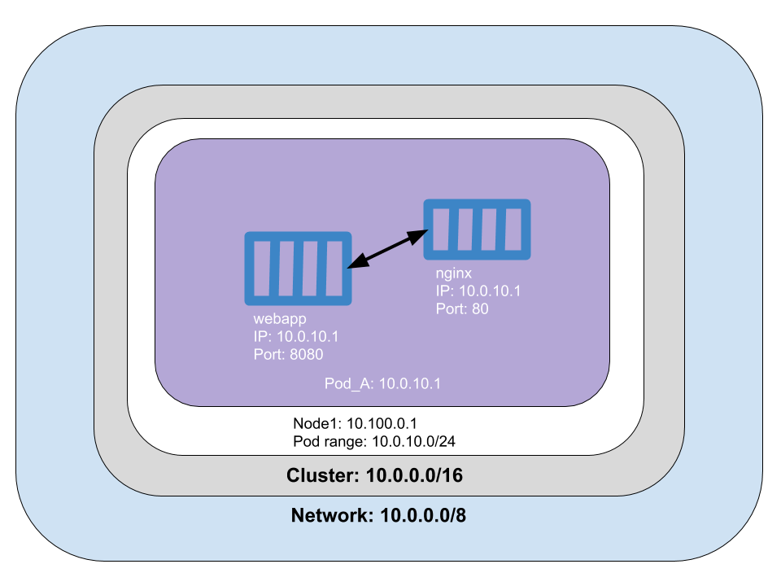
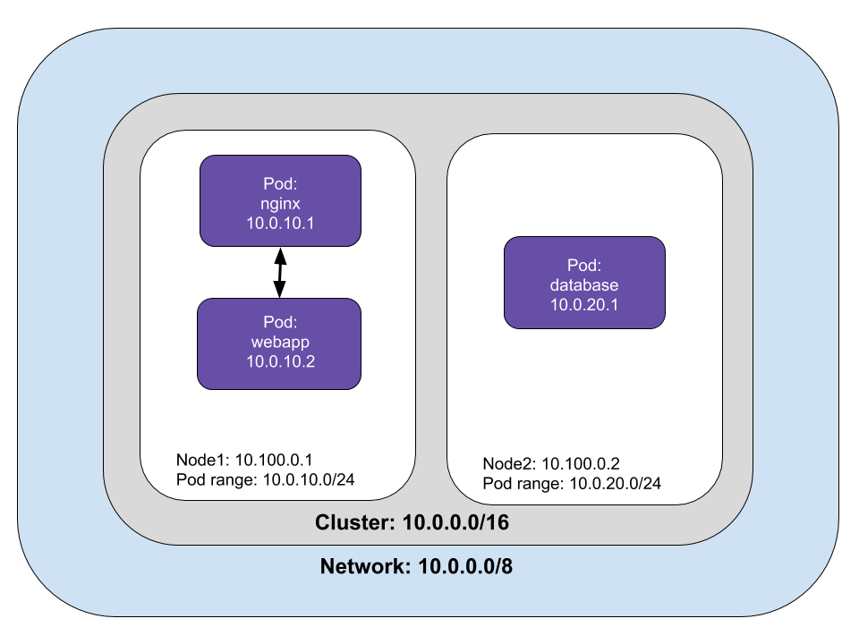
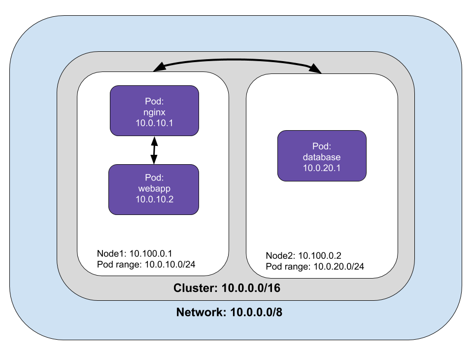
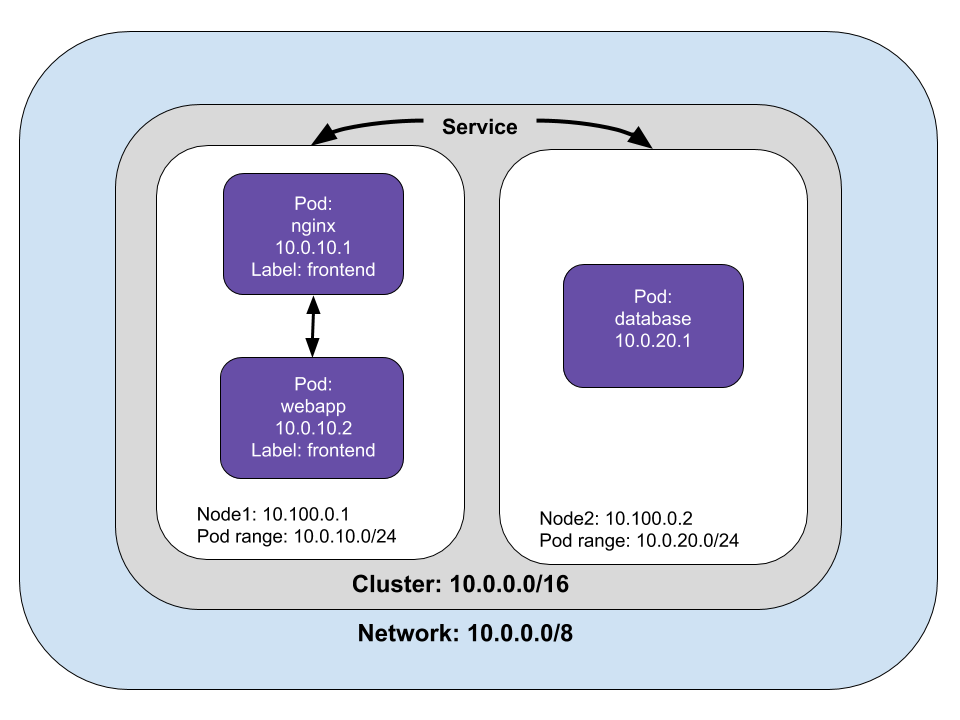
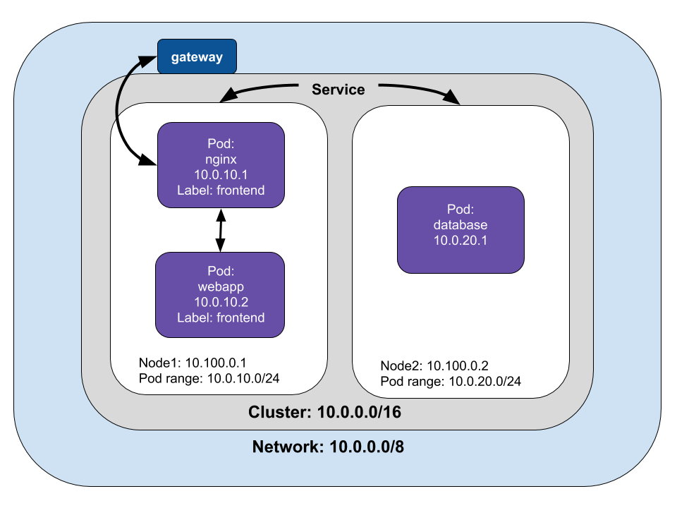

In previous installments, we examined how to deploy applications. However, we only touched on how applications talk to each other inside and outside the cluster. Whether you are building a modern application or modernizing a legacy application, understanding how resources and components talk to each other is essential. In this installment, we’ll examine networking in Kubernetes.

<!--more-->

Networking in a distributed environment can be complicated. Let’s use a hypothetical example of a web application deployed as microservices in Kubernetes. Containers must be able to communicate with each other; for example, we have a Java app running on Tomcat served by Nginx for the application’s frontend.

Pods must be able to connect to other pods. In our example, the frontend sends requests to a REST API connected to a database deployed as a StatefulSet in another Pod. Kubernetes assigns each Pod an IP address, which lets them send requests to each other.

However, as Pods are destroyed and created, the IP addresses will change. Kubernetes uses the Service object as an abstraction to define a logical set of Pods, [labels and selectors](https://kubernetes.io/docs/concepts/overview/working-with-objects/labels/) to access them.

Our web application also needs to be available outside the cluster. We'll examine how traffic receives and responds to requests outside the cluster.

## Container to container networking

A Pod is a logical host, and each Pod is assigned a network namespace, which is a logical networking stack that provides isolation between network devices. Containers in a Pod have the same IP address assigned to the Pod’s networking namespace, which means that containers within a Pod can communicate using *localhost*. In our example application, the nginx container at port 80 is a reverse proxy for the Java application at port 8080. At this point, neither the Java application nor the reverse proxy is available outside the cluster. We could define a [nodePort](https://kubernetes.io/docs/concepts/services-networking/service/#nodeport), a [LoadBalancer](https://kubernetes.io/docs/concepts/services-networking/service/#loadbalancer), or [Ingress](https://kubernetes.io/docs/concepts/services-networking/ingress/) to expose the pod outside of the cluster, but we’ll address that later.



What does this look like in code?

```ts
// Create the frontend Pod.
const pod = new k8s.core.v1.Pod("frontend", {
    spec: {
        restartPolicy: "OnFailure",
        containers: [
            {
                name: "nginx",
                image: "nginx",
                resources: {requests: {cpu: "50m", memory: "50Mi"}},
    ports: [{ containerPort: 80 }],
            },
            {
                name: "webapp",
                image: "java_app",
                resources: {requests: {cpu: "50m", memory: "50Mi"}},
    ports: [{ containerPort: 8080 }],
                command: [ "catalina.sh", "run"],
            }
        ],
    }
}, { provider: provider });

```

## Pod to Pod networking

In our the web application example, the REST microservice and the database are deployed in separate pods. The frontend pod sends requests to the REST microservice, which sends requests to the database and returns data to the frontend application.

Pods can communicate with any Pod on any Node without a NAT (Network Address Translation). Pod to Pod networking is accomplished through a virtual ethernet device on the Node. Each Pod connects to a virtual ethernet device (called *vethx*) that acts as a tunnel between the Pod and the Node. A network bridge (called *cbr0*) connects the Pod’s network stack to the Node’s network by creating a single aggregate network from multiple networks.



A Pod can communicate with Pods on different Nodes. If the Pod isn’t found on the Node, the network bridge goes to the cluster level to map the IP address ranges to nodes. Once the Pod with the matching address range is found, the request is sent to the target Pod. In our example, the  webapp sends a request to the database (10.0.20.1) on another node.



## Pod to Service networking

Pods are ephemeral, Kubernetes add or destroy pods when scaling up or down, applications crash, and runtimes reboot. Pod IP addresses are dynamic; Services are built to ensure that network traffic reaches the correct Pod by managing the state of Pods.

Kubernetes assigns a virtual IP address called a clusterIP when a Service is created. Multiple Pods can be associated with a service, and Kubernetes load-balances requests to Pods associated with a Service. Kubernetes keeps track of changing IP addresses through these three methods: [iptables](https://kubernetes.io/docs/concepts/services-networking/service/#proxy-mode-userspace), [IPVS](https://kubernetes.io/docs/concepts/services-networking/service/#proxy-mode-ipvs), and [DNS](https://kubernetes.io/docs/concepts/services-networking/service/#dns).

Let’s take a look at *iptables*, which is a common case. Each node has a [kube-proxy](https://kubernetes.io/docs/reference/command-line-tools-reference/kube-proxy/) which maintains a table of IP addresses for nodes. The table keeps track of how to reach Pods inside or outside your cluster. Kube-proxy watches for the addition and removal of Service and Endpoint objects, which are the list of addresses (IP and port) of endpoints that implement a Service.

Iptables use fewer system resources because traffic is handled by [Linux netfilter](https://www.netfilter.org/), a packet filtering framework inside the Linux kernel. This means that routing traffic doesn’t require switching between the user space where Kubernetes is running and makes use of the host system's kernel network stack, which also makes it more reliable.

In iptables mode, if the first Pod selected fails to respond, the connection fails. You can use readiness probes to tell kube-proxy which pods are healthy as in this [example]().

There are other methods of Pod to Service networking, such as:

- [userspace with kube-proxy](https://kubernetes.io/docs/concepts/services-networking/service/#proxy-mode-userspace).
- IP Virtual Server (IPVS), an in-cluster load balancer that uses more efficient hash tables that scale better than iptables.
- DNS running as a Kubernetes service

We’ve reviewed how packets are routed between Pods and Services, but how does this work in practice? A Service is a logical collection of pods with a policy that defines access among them. Pods are grouped into a Service with [labels and selectors](https://kubernetes.io/docs/concepts/overview/working-with-objects/labels/). In our web application example, we can label Pods with “webapp” and declare the service's selector.



Below is an example of how to create a service with code.

```ts
const frontendLabels = { app: "frontend" };
const frontendDeployment = new k8s.apps.v1.Deployment("frontend", {
    spec: {
        selector: { matchLabels: frontendLabels },
        replicas: 3,
        template: {
            metadata: { labels: frontendLabels },
            spec: {
                containers: [
                    {
                        name: "nginx",
                        image: "nginx",
                        resources: { requests: { cpu: "100m", memory: "100Mi" } },
                        env: [{ name: "GET_HOSTS_FROM", value: "env" }],
                        ports: [{ containerPort: 80 }],
                    },
                    {
                        name: "webapp",
                        image: "java_app",
                        resources: { requests: { cpu: "100m", memory: "100Mi" } },
                        env: [{ name: "GET_HOSTS_FROM", value: "env" }],
                        ports: [{ containerPort: 8080 }],
                    },

                ],
            },
        },
    },
});
const frontendService = new k8s.core.v1.Service("frontend", {
    metadata: {
        labels: frontendDeployment.metadata.labels,
        name: "frontend",
    },
    spec: {
        type: LoadBalancer,
        ports: [{ port: 80 },{ port:8080 }],
        selector: frontendDeployment.spec.template.metadata.labels,
    },
});

```

## Egress and Ingress

Egress is moving data and requests from the cluster to the Internet. Kubernetes can accomplish egress with an Internet gateway that routes packets from inside the cluster by performing network address translation (NAT). NAT maps a Node’s internal IP address to an external IP address on the public Internet.



However, Pods have their IP address that virtual machines or Nodes can’t reach. If we trace a packet's route, it starts from the Pod’s namespace and connects to root namespace of the Node via veth to the network bridge, cbr0. Iptables replaces the source IP of the Pod to the Node Ip address to get from the Node to the gateway. Changing the source IP is called a source NAT (SNAT), and it lets the packet travel from the Node to the Internet gateway.

Ingress is the process of routing Internet traffic to the Kubernetes cluster. There are two solutions for getting Internet traffic into your cluster: a Service LoadBalancer and an Ingress controller.

A Service load balancer is also called a Layer 4 LoadBalancer. The name refers to Layer 4, or the transport layer of the OSI network model. At Layer 4, the transport layer routes packets and resends them if they are not received. You can specify a LoadBalancer when creating a Service. The Service will advertise the IP address, and you can send traffic to LoadBalancer, which will route packets to the service.

Kubernetes can create a Service with an optional LoadBalancer.  When the Service is created, it advertises the IP address for the load balancer. As an end-user, you can start directing traffic to the load balancer to begin communicating with your Service.

The load balancer is not aware of Pods or containers, so it sends packets to the Nodes in the cluster. The iptables rules in each Node will send the packets to Pod. The Pod’s response uses  the Pod’s IP, but iptables rewrites the correct  IP on the return with NAT.

The other way of routing packets to a pod from a gateway is with a Layer 7 Ingress Controller. Layer 7 is the application layer of the OSI network model. Layer 7 Ingress works on the HTTP/HTTPS portion of the network stack. Similar to a Layer 4 LoadBalancer, it is part of a Service. You must open a port in the Service with the NodePort Service type, and Kubernetes will allocate a port from a specified range. Traffic routed to the Node’s port will be sent to the service by iptables rules.

An Ingress object exposes a Node’s port to the Internet. An Ingress load balancer maps HTTP requests to Kubernetes Services. The Ingress method differs depending on how the Kubernetes provider implements it. HTTP load balancers, like Layer 4 network load balancers, only understand Node IPs (not Pod IPs), so traffic routing uses the internal load-balancing in iptables installed on each Node by kube-proxy.

Within an AWS environment, the ALB Ingress Controller provides Kubernetes Ingress using Amazon’s Layer 7 Application Load Balancer. The following diagram details the AWS components this controller creates. It also demonstrates the route Ingress traffic takes from the ALB to the Kubernetes cluster. This process is similar to a Layer 4 Load Balancer, but the significant difference is that the Application Load Balancer is HTTP aware and can perform host or path based routing.

Building on the previous example, we can expose the frontend by adding the following.

```ts
export let frontendIp: pulumi.Output<string>;
frontendIp = frontend.status.loadBalancer.ingress[0].ip;
```

## Summary

The goal of this article is to provide an overview of the Kubernetes Networking model. The implementation of the Container Network Interface (CNI) varies from provider to provider. You can read more about [CNI implementations](https://kubernetes.io/docs/concepts/cluster-administration/networking/) on the Kubernetes documentation site.

Each article in this series is intended to be independent of each other. However, we build upon concepts introduced in previous articles. If some concepts or terminology are unfamiliar, I encourage reading the earlier articles:

- [Building a Kubernetes cluster on cloud providers]()
- [Basic application deployment]()
- [Advance application deployment and Helm charts]()
- [Stateful applications]()
