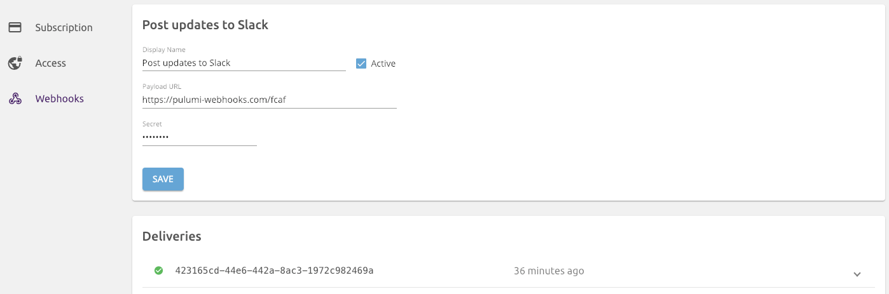

Today we are delighted to announce the availability of Webhooks on
[Pulumi](https://app.pulumi.com). Webhooks are a very common mechanism
to enable teams to be notified or react to events. In Pulumi's case,
this means: notifications of infrastructure changes (be it on
Kubernetes, AWS, or any other cloud); responding to those changes as
part of 'ChatOps'; or other build pipelines, to improve the delivery of
cloud native infrastructure.

Pulumi Webhooks are available for the Team and Enterprise editions of
Pulumi. If you're keen to try them out, start a trial of
[Team Edition here](https://app.pulumi.com/site/organizations/add).
<!--more-->

ChatOps --- the idea of conversation-driven collaboration --- is an
increasingly common pattern, and as such we've gotten a lot of requests
to integrate Pulumi with cloud services such as Slack, GitHub, and
Twillio to facilitate that. These requests are rooted in users wanting
to have more awareness of changes being made to their cloud
infrastructure or wanting to build extensions to automate continuous
delivery pipelines. Pulumi Webhooks offer the flexibility to design
these notification and response systems as required for your team.

## Using Pulumi Webhooks

You can attach webhooks directly to stacks or organizations. Stack
webhooks will send notifications whenever changes to a stack are made
(`pulumi up`) or simply previewed (`pulumi preview`). Webhooks attached
to an organization will be sent the events for every stack within the
organization.



When events occur, we'll send a HTTP `POST` request to any registered
listeners. Webhooks can then be used to send notifications to Slack or
SMS, start running automated tests, or maybe even update another stack!

We've been using Pulumi webhooks internally for raising awareness when
our test and production environments get updated. A common sight after
submitting some code is:


## Building a Pulumi Webhook handler using... Pulumi!

Pulumi is perfect for setting up cloud infrastructure, and so what
better tool to use for handling notifications from Pulumi than Pulumi!

In this example, we'll create a simple Pulumi program that stands up a
webhook handler that will receive webhook requests and echo them to
Slack. You can find the full code in the
[examples repo](https://github.com/pulumi/examples/), under
[aws-ts-pulumi-webhooks](https://github.com/pulumi/examples/tree/master/aws-ts-pulumi-webhooks).

The code is very straight forward, thanks to the the
[@pulumi/cloud](https://github.com/pulumi/pulumi-cloud) package.

```typescript
import * as pulumi from "@pulumi/pulumi";
import * as cloud from "@pulumi/cloud";

import * as slack from "@slack/client";

const config = new pulumi.Config();

const stackConfig = {
   slackToken: config.require("slackToken"),
   slackChannel: config.require("slackChannel"),
};

const webhookHandler = new cloud.HttpEndpoint("pulumi-webhook-handler");

webhookHandler.get("/", async (_, res) => {
   res.status(200).end("🍹 Pulumi Webhook Responder🍹");
});

webhookHandler.post("/", async (req, res) => {
   const webhookID = req.headers["pulumi-webhook-id"];
   const webhookKind = req.headers["pulumi-webhook-kind"];
   console.log(`Received webhook from Pulumi ${webhookID} [${webhookKind}]`);

   const payload = <string>req.body.toString();
   const prettyPrintedPayload = JSON.stringify(JSON.parse(payload), null, 2);
   const client = new slack.WebClient(stackConfig.slackToken);
   await client.chat.postMessage({
      channel: stackConfig.slackChannel,
      text: `Pulumi Service Webhook (`${webhookKind}`)` + "```" + prettyPrintedPayload + "```",
      as_user: true,
   });

   res.status(200).end(`posted to Slack channel ${stackConfig.slackChannel}`);
});
   
export const url = webhookHandler.publish().url; 
```

But to stand up the cloud application, we'll need to create the stack
and set some configuration. And finally deploy it using `pulumi up`.

    $ pulumi stack init pulumi-webhook-handler
    Created stack 'pulumi-webhook-handler'

    $ pulumi config set cloud:provider aws
    $ pulumi config set aws:region us-west-2
    $ pulumi config set slackChannel #ops-notificatinos
    $ pulumi config set slackToken ****** --secret

    $ pulumi up --yes
    Updating (robot-co/pulumi-webhook-handler):

    ... snip ...

    Outputs:
        url: "https://6tfwcc3vg3.execute-api.us-west-2.amazonaws.com/stage/"

    Resources:
        ~ 1 updated
        15 unchanged

    Duration: 4s

    Permalink: https://app.pulumi.com/robot-co/deploytron-9000/updates/6

The stack emits the URL to the webhook handler in the stack's outputs.
That URL is what will receive and process Pulumi webhooks.

With the infrastructure in-place, we just need to register the webhook
on the Pulumi Cloud Console. Organization administrators can do so under
the organization's **SETTINGS** tab.


That's it! As stacks are created, updated, and so on, the webhook
handler will be notified and you can start building any custom actions
you can think of.

For our initial release, there are four kinds of webhook events. But
we'll quickly be expanding coverage in the coming weeks.

| **Event Type**                    | **Trigger**
| --------------------------------- | ----------------------------------
| `stack`                           | Fired whenever a stack is created or deleted within an organization.
| `team`                            | Fired when a team is created, updated, or deleted within an organization.
| `stack_update`                    | Fired when a stack is updated. (Be it from `pulumi up`, `pulumi refresh`, or `pulumi destroy`.)
| `stack_preview`                   | Fired whenever changes to a stack  are previewed.                    

## Tell us what you think

Get started with Pulumi Webhooks on the [Pulumi app](https://app.pulumi.com), and let us know how you're using them so
we can continue to extend their capabilities. We'd love to hear your
ideas, as well as any feedback you have on the
[Pulumi Community Slack](https://slack.pulumi.io).

