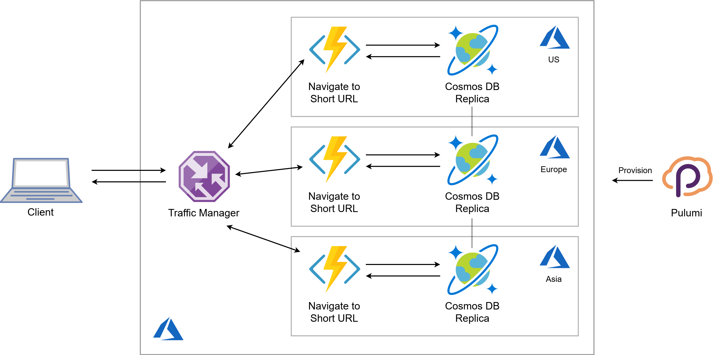

Pulumi is excellent at connecting multiple cloud components into a
cohesive application. In my [previous post](),
I introduced the way to mix JavaScript or TypeScript serverless
functions directly into the cloud infrastructure programs.

Today, I will build a serverless application with both the data store
and the HTTP endpoint located close to end users to ensure prompt
response time. The entire application runs on top of managed Azure
services and is defined as a single Pulumi program in TypeScript.
<!--more-->

## Baseline

I'm going to build a URL shortener: a simple HTTP endpoint which accepts
a shortcode in the URL and then redirects a user to the full URL
associated with the given short code.

I start simple and make a non-distributed version of the application
first. It consists of two main components: a Cosmos DB container to
store URL mappings and two Azure Functions to handle HTTP requests:


Let's define this infrastructure in a Pulumi program.

### Cosmos DB Collection

Arguably, Cosmos DB is overkill in such a simple scenario: we just need
a key-value store, so Table Storage would suffice. However, Cosmos DB
comes handy at the multi-region setup later on.

Next to a standard resource group definition, I create a Cosmos DB
account with location set to a single region and `Session` consistency
level:

```typescript
import * as pulumi from "@pulumi/pulumi";
import * as azure from "@pulumi/azure";
import * as cosmos from "@azure/cosmos";

const location = "westus"; // To be changed to multiple configurable locations

let resourceGroup = new azure.core.ResourceGroup("UrlShorterner", {
    location,
});

let cosmosdb = new azure.cosmosdb.Account("UrlStore", {
    resourceGroupName: resourceGroup.name,
    location,
    geoLocations: [{ location, failoverPriority: 0 }],
    offerType: "Standard",
    consistencyPolicy: {
        consistencyLevel: "Session",
        maxIntervalInSeconds: 5,
        maxStalenessPrefix: 100,
    },
});
```

Cosmos DB has a hierarchical structure of Accounts, Databases, and
Containers. Unfortunately, Cosmos DB containers can't be defined as
Pulumi resources yet. As a workaround, I defined a helper function
`getContainer` to create a database and a container using Cosmos SDK,
see
[here](https://github.com/pulumi/examples/blob/master/azure-ts-serverless-url-shortener-global/cosmosclient.ts).

### Function App

Serverless Azure Functions are going to handle the HTTP layer in my
application. I use the technique of [serverless functions as callbacks]()
to define Azure Functions inline inside my Pulumi program:

```typescript
const fn = new azure.appservice.HttpEventSubscription("GetUrl", {
    resourceGroup,
    location,
    route: "{key}",
    callback: async (_, request: azure.appservice.HttpRequest) => {
        const endpoint = cosmosdb.endpoint.get();
        const masterKey = cosmosdb.primaryMasterKey.get();

        const container = await getContainer(endpoint, masterKey);
        
        const key = request.params['key'];
        try {
            const response = await container.item(key.toString()).read();       
            return {
                status: 301,
                headers: { "location": response.body.url },
                body: '',
            };
        } catch (e) {
            return { status: 404, body: 'Short URL not found' }
        
    
});

export const url = fn.url;
```

I supply the template `{key}` as `route` parameter so that the function
accepts wildcard URLs and extract the wildcard value as a `key`
parameter available inside the `request` object. Then, I use the
received key to look up the full URL. The URL is returned to the client
as a header of the `301` Redirect response. `404` Not Found is returned
in case the requested document does not exist---the naughty Cosmos SDK
throws an error in this scenario.

Note how the Cosmos DB parameters `endpoint` and `primaryMasterKey` are
used directly inside the function. There is no need to manage the keys
manually or explicitly put them into application settings: the generated
keys are injected into the code at the time of deployment. In practice,
a better idea is to store the key in a KeyVault and read it via
application settings, but I'll leave this for a separate article.

A function to add a URL to the database looks quite similar to the
above:

```typescript
const fn = new azure.appservice.HttpEventSubscription("AddUrl", {
    resourceGroup,
    methods: ["POST"],
    callback: async (_, request: azure.appservice.HttpRequest) => {
        const endpoint = cosmosdb.endpoint.get();
        const masterKey = cosmosdb.primaryMasterKey.get();
        const container = await getContainer(endpoint, masterKey, location);

        await container.items.create(request.body);
        return { status: 200, body: 'Short URL saved' };
    
});
export const addEndpoint = fn.url;
```

The key differences are:

- Using `POST` as the accepted HTTP method
- Creating a new item in Cosmos DB
- Using `request.body` as the payload to save

I might need to add some validation in a real application---skipped for
now.

### Trying It Out

Now, when a user navigates to an address like
`https://geturl-xyz.azurewebsites.net/api/URLKEY`, they get redirected
to the full URL associated with the key. The URL is not quite short yet,
but we could make it so with a custom domain configuration.

Presumably, we expect our URL shortener to be popular around the world.
Therefore, one key aspect is to make sure that the service responds fast
and enables a smooth user experience. Let's measure the response time of
our first version from different spots around the world:

| Location | Response time
|---|---
| San Francisco |133 ms
| New York  | 272 ms
| London    | 383 ms
| Frankfurt | 420 ms
| Tel-Aviv  | 470 ms
| Hong-Kong | 437 ms
| Brisbane  | 449 ms

The further we get from the West US region, the slower the responses
become.

How can we do better?

## Bring Compute and Data Closer to Users

It's hard to beat the speed of light, so if we want to respond fast, we
need to bring both code and data close to any target user.

Luckily, the most involved aspect of that---the data distribution---can
be handled by Cosmos DB multi-region accounts. We need to take care of
deploying the code in multiple locations and routing the traffic to the
nearest one. Here is the plan:



I don't care too much about the latency of Add URL function, so I left
it out of the picture.

### Configuring the locations

The above picture shows three Azure regions, but since I'm using a
general-purpose programming language, I can handle any number of
locations in the same way. Actually, I put the list of target regions in
Pulumi config file and read it at execution time:

```typescript
const config = new pulumi.Config();
const locations = config.require("locations").split(',');
const primaryLocation = locations[0];
```

The order of regions defines the priority.

### Multi-region Cosmos DB Account

Since `locations` is a simple array, I can `map` this array to produce
the array of `geoLocations` to be set for my Cosmos DB:

```typescript
let cosmosdb = new azure.cosmosdb.Account("url-cosmos", {
    location: primaryLocation,
    geoLocations: locations.map((location, failoverPriority) => ({
        location,
        failoverPriority
    })),
    /* ... other properties stay the same ... */
```

Right here, the full power of a programming language at my fingertips!

### Multi-region Serverless App

> Azure Traffic Manager is a DNS-based traffic load balancer that
> enables you to distribute traffic optimally to services across global
> Azure regions while providing high availability and responsiveness.

Sounds like what I need for my global application! Let's define a
Traffic Manager profile:

```typescript
const profile = new azure.trafficmanager.Profile("UrlShortEndpoint", {
    resourceGroupName: resourceGroup.name,
    trafficRoutingMethod: 'Performance',       
    dnsConfigs: [{
        relativeName: "shorturls",
        ttl: 60,
    }],
    monitorConfigs: [{
        protocol: 'HTTP',
        port: 80,
        path: '/api/ping',
    }]
});
```

I set the routing method to Performance:

> Select Performance when you have endpoints in different geographic
> locations and you want end users to use the "closest" endpoint in
> terms of the lowest network latency.

Now, I need to create a Function App in each of the target regions.
That's easy to achieve with a `for..of` loop:

```typescript
for (const location of locations) {
    const fn = new azure.appservice.HttpEventSubscription(`GetUrl-${location}`, {
        resourceGroup,
        location,
        route: "{key}",
        callback: /* ... the function stays the same ... */
    });
}
```

Finally, I set up an Endpoint for each Function App to bind them to the
Traffic Manager. I do so in the same loop as above:

```typescript
for (const location of locations) {
    const fn = new azure.appservice.HttpEventSubscription(`GetUrl-${location}`, {
        /* ... function definition as shown above ... */
    });

    const app = fn.functionApp;

    new azure.trafficmanager.Endpoint(`tme${location}`, {
        resourceGroupName: resourceGroup.name,
        profileName: profile.name,
        type: 'azureEndpoints',
        targetResourceId: app.id,
        target: app.defaultHostname,
        endpointLocation: app.location,
    });
}
```

I assign the properties of each Function App to the corresponding
Endpoint with a simple object initializer expression.

Everything is in place. I can export the Traffic Manager endpoint:

```typescript
export const endpoint = pulumi.interpolate `http://${profile.fqdn}/api/{key}`;
```

Time to re-run the latency tests.

## Results

I deployed the distributed infrastructure to five Azure regions: West
US, East US, West Europe, East Asia, and Australia East. The results are
shown in the table below, next to the values from the initial run:

| Location       | Single region  | Multiple regions
|--------------- |--------------- |------------------
| San Francisco  | 133 ms         | 140 ms
| New York       | 272 ms         | 152 ms
| London         | 383 ms         | 150 ms
| Frankfurt      | 420 ms         | 130 ms
| Tel-Aviv       | 470 ms         | 307 ms
| Hong-Kong      | 437 ms         | 149 ms
| Brisbane       | 449 ms         | 529 ms

We got a much smoother distribution of response time. There's no region
close enough to Tel-Aviv, so its latency is still high-ish. I checked
Brisbane, and the traffic was somehow directed to the East US region, so
the latency hasn't improved at all. For today, I guess I'll stick to the
hypothesis "Australian internet is slow" and advise to always test your
target scenarios without trusting the providers blindly.

More importantly, I walked you through a scenario of developing an
end-to-end application with Pulumi. I highlighted the power of
leveraging familiar techniques coming from the TypeScript realm. You can
find the full code in [Pulumi examples](https://github.com/pulumi/examples/tree/master/azure-ts-serverless-url-shortener-global).

Cloud brings superpowers to developer's hands. You just need to use
those efficiently.
