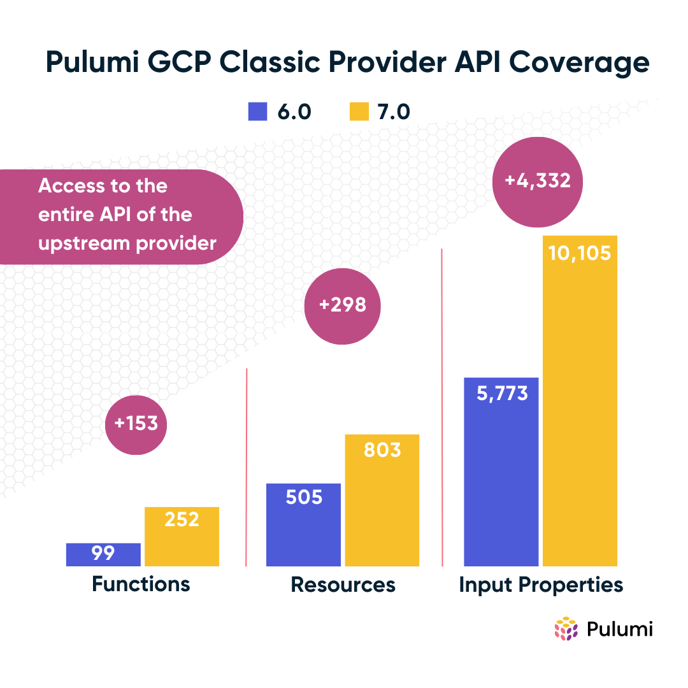

The latest major release of the Pulumi Google Cloud Classic Provider is available now! This [7.0 release](https://github.com/pulumi/pulumi-gcp/releases/tag/v7.0.0) contains the latest upstream changes to keep you up-to-date along with a highly requested bug fix, keeping your journey in managing Google Cloud resources fresh and smooth.

The Pulumi Google Cloud Classic provider can be used to provision any of the cloud resources available in the upstream provider. It is part of the suite of [Pulumi official providers](https://www.pulumi.com/docs/intro/cloud-providers/), which means that it is officially maintained and supported by Pulumi. The provider is also open source and available on [GitHub](https://github.com/pulumi/pulumi-gcp) for you to contribute to and improve.

<!--more-->

## Looking back

It's been almost 2 years since the last major release of the Google Cloud provider, version 6.0, which was released in November 2021. Since then, we've been hard at work improving the provider and adding new features. Here are some of the highlights:

### Coverage and Growth

The Google Cloud provider now supports 250+ functions, 800+ resources, 10,000+ input properties. It continues to grow in coverage and features while staying up-to-date with the latest upstream changes. The chart below shows the growth of the provider in the last 2 years.



### New Modules

Version 6.0 of the Google Cloud provider introduced support for several new modules, including:

- [Alloy DB](https://www.pulumi.com/registry/packages/gcp/api-docs/alloydb/)
- [Assured Workloads](https://www.pulumi.com/registry/packages/gcp/api-docs/assuredworkloads/)
- [Backup Disaster Recovery](https://www.pulumi.com/registry/packages/gcp/api-docs/backupdisasterrecovery/)
- [BeyondCorp](https://www.pulumi.com/registry/packages/gcp/api-docs/beyondcorp/)
- [BigLake](https://www.pulumi.com/registry/packages/gcp/api-docs/biglake/)
- [BigQuery Analytics Hub](https://www.pulumi.com/registry/packages/gcp/api-docs/bigqueryanalyticshub/)
- [Certificate Manager](https://www.pulumi.com/registry/packages/gcp/api-docs/certificatemanager/)
- [Cloud Deploy](https://www.pulumi.com/registry/packages/gcp/api-docs/clouddeploy/)
- [Cloud IDS](https://www.pulumi.com/registry/packages/gcp/api-docs/cloudids/)
- [Database Migration Service](https://www.pulumi.com/registry/packages/gcp/api-docs/databasemigrationservice/)
- [Dataflow](https://www.pulumi.com/registry/packages/gcp/api-docs/dataflow/)
- [Dataform](https://www.pulumi.com/registry/packages/gcp/api-docs/dataform/)
- [DataPlex](https://www.pulumi.com/registry/packages/gcp/api-docs/dataplex/)
- [Datastream](https://www.pulumi.com/registry/packages/gcp/api-docs/datastream/)
- [Edge Network](https://www.pulumi.com/registry/packages/gcp/api-docs/edgenetwork/)
- [GKE Backup](https://www.pulumi.com/registry/packages/gcp/api-docs/gkebackup/)
- [GKE On-Prem](https://www.pulumi.com/registry/packages/gcp/api-docs/gkeonprem/)
- [Looker](https://www.pulumi.com/registry/packages/gcp/api-docs/looker/)
- [Network Connectivity](https://www.pulumi.com/registry/packages/gcp/api-docs/networkconnectivity/)
- [Network Security](https://www.pulumi.com/registry/packages/gcp/api-docs/networksecurity/)
- [Network Services](https://www.pulumi.com/registry/packages/gcp/api-docs/networkservices/)
- [VMware Engine](https://www.pulumi.com/registry/packages/gcp/api-docs/vmwareengine/)
- [Workstations](https://www.pulumi.com/registry/packages/gcp/api-docs/workstations/)

If you haven't used these modules yet, now is a great time to try them out! Check out the [Pulumi Registry](https://www.pulumi.com/docs/intro/cloud-providers/google-cloud/) for more information on how to get started or ask [Pulumi AI](https://www.pulumi.com/ai) to create a new project for you.

## Service Account Rename

This release includes a fix for the [naming of the Service Account resource](https://github.com/pulumi/pulumi-gcp/issues/722). For consistency and ease of use, `serviceAccount` has been renamed to `serviceaccount`. Node.js, Python, and .Net programs do not require any updates as the resource name has been aliased. However updates are required for Go, Java, and YAML to adjust the import paths and resource type.



{}

```diff
- import "github.com/pulumi/pulumi-gcp/sdk/v6/go/gcp/serviceAccount"
+ import "github.com/pulumi/pulumi-gcp/sdk/v7/go/gcp/serviceaccount"
```

{}

{}

```diff
- import com.pulumi.gcp.serviceAccount.*;
+ import com.pulumi.gcp.serviceaccount.*;
```

{}

{}

```diff
- type: gcp:serviceAccount:Account
+ type: gcp:serviceaccount:Account
```

{}



## Labels Rework

Upstream changes for provider, resource, and data source labels are included in this release. You can find more information about this change in the [upstream documentation](https://registry.terraform.io/providers/hashicorp/google/latest/docs/guides/version_5_upgrade#provider-level-labels-rework)

<!-- TODO -->



{}

```typescript

```

{}

{}

```python

```

{}

{}

```go

```

{}

{}

```csharp

```

{}

{}

```java

```

{}

{}

```yaml

```

{}



## Upgrading

Upgrading from the previous version of the Google Cloud provider is straightforward. Simply update the version in your dependency manifest file, install the new package based on your language and package manager, then run `pulumi up` to migrate your existing stack. For Go programs, you will need to update specific imports within your program as well. This information is also available in our [migration guide](https://www.pulumi.com/registry/packages/gcp/how-to-guides/7-0-migration) in the Pulumi Registry.



{}

```diff
- "@pulumi/gcp": "^6.0.0"
+ "@pulumi/gcp": "^7.0.0"
```

{}

{}

```diff
- pulumi_gcp>=6.0.0,<7.0.0
+ pulumi_gcp>=7.0.0,<8.0.0
```

{}

{}

```diff
- require github.com/pulumi/pulumi-gcp/sdk/v6/go/pulumi v6.0.0
+ require github.com/pulumi/pulumi-gcp/sdk/v7/go/pulumi v7.0.0
```

{}

{}

```diff
- <PackageReference Include="Pulumi.Gcp" Version="6.*" />
+ <PackageReference Include="Pulumi.Gcp" Version="7.*" />
```

{}

{}

```diff
- com.pulumi:pulumi-gcp:6.0.0
+ com.pulumi:pulumi-gcp:7.0.0
```



## Wrapping Up

As always, we welcome your feedback and contributions in the [Pulumi Community Slack](https://slack.pulumi.com/), [GitHub repository](https://github.com/pulumi/pulumi-gcp), and [Pulumi Community Discussions](https://github.com/pulumi/pulumi/discussions).

New to Pulumi? Signing up is easy and free. [Get started today](https://app.pulumi.com/signup)!

Happy coding!
