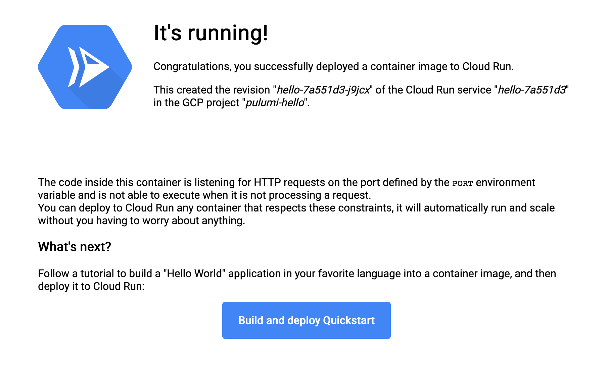
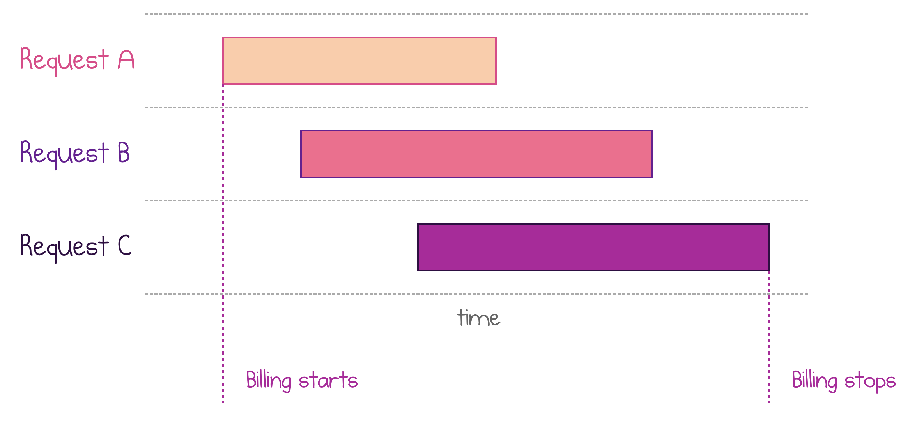

Google [Cloud Run](https://cloud.google.com/run/) is the latest addition to the serverless compute family. While it may look similar to existing services of public cloud, the feature set makes Cloud Run unique:

- Docker as a deployment package enables using any language, runtime, framework, or library that can respond to an HTTP request.
- Automatic scaling, including scale to zero, means you pay for what you consume with no fixed cost and no management overhead.
- HTTP load-balancing out of the box simplifies the usage.

Cloud Run is targeted very specifically at stateless web applications. It uses ephemeral containers, and each execution is limited to 15 minutes.

Today, we will deploy our first Cloud Run services with Pulumi. Then, we'll discuss pricing and compare Cloud Run to the competition.

## Hello Cloud Run

We'll start by deploying a pre-built container image provided by Google to a Cloud Run service.

To follow along, create a new Pulumi project with the [Get Started with Google Cloud](https://www.pulumi.com/docs/get-started/gcp/) guide.

### Enable Cloud Run for the project

As with any other service of Google Cloud, you need to enable it for the target project before the first deployment. You can do so with the `gcp.projects.Service` resource:

```ts
const enableCloudRun = new gcp.projects.Service("EnableCloudRun", {
    service: "run.googleapis.com",
});
```

Note: If you destroy the Pulumi stack and delete the `projects.Service` resource, the Cloud Run service will be disabled again. If you use Cloud Run in multiple Pulumi stacks, you should move the service management to a central location, i.e., a shared stack.

### Choose a location

Cloud Run is a regional service: all container instances run in a single location of your choice.

Set the region setting to one of the currently supported locations: `us-central1` (Iowa), `us-east1` (South Carolina), `europe-west1`( Belgium), or `asia-northeast1` (Tokyo).

```
pulumi config set gcp:region <region>
```

Then, the program can read the value and reuse it for all resources:

```ts
// Location to deploy Cloud Run services
const location = gcp.config.region || "us-central1";
```

### Deploy a Cloud Run service

Google provides a pre-deployed "Hello Cloud Run" image at `gcr.io/cloudrun/hello`. The following resource deploys that image to your GCP project with the default settings.

```ts
const helloService = new gcp.cloudrun.Service("hello", {
    location,
    template: {
        spec: {
            containers: [
                { image: "gcr.io/cloudrun/hello" },
            ],
        },
    },
}, { dependsOn: enableCloudRun });
```

### Expose unrestricted HTTP access

By default, Google does not expose HTTP endpoints of a Cloud Run service to the Internet. To make it publicly available, you should grant the `roles/run.invoker` role to `allUsers`.

```ts
const iamHello = new gcp.cloudrun.IamMember("hello-everyone", {
    service: helloService.name,
    location,
    role: "roles/run.invoker",
    member: "allUsers",
});
```

Note that the Contributor role is required for the user who executes Pulumi deployment to grant the access.

### Try it out

Each Cloud Run service automatically gets a run.app subdomain. You can export the exact URL as a Pulumi output.

```ts
// Export the URL
export const helloUrl = helloService.status.url;
```

Run `pulumi up` to deploy all the resources.

```
$ pulumi up
...
Outputs:
  ~ helloUrl: "https://hello-585ad15-q4wszdxb2a-ew.a.run.app"
```

Navigate to the URL to see the welcome screen:



Congratulations, your first Cloud Run service is up and running. Now, it's time to deploy some custom code.

## Deploy a Custom Application

Cloud Run can run any Docker container so that you can write the application code in a language of your choice. I picked Ruby as an example of a language that is not supported by Cloud Functions.

### Create a Ruby web app

Let's create an `app` subfolder and place all application files there. The first file app.rb is a Hello World web application in Ruby.

```rb
require 'sinatra'

set :bind, '0.0.0.0'

get '/' do
  target = ENV['TARGET'] || 'Pulumi'
  "Hello #{target}!\n"
end
```

[Gemfile](https://github.com/pulumi/examples/blob/master/gcp-ts-cloudrun/app/Gemfile) and [Gemfile.lock](https://github.com/pulumi/examples/blob/master/gcp-ts-cloudrun/app/Gemfile.lock) files configure the required gems (packages).

### Define a Docker image

`Dockerfile` defines the container image to deploy. It is based on a generic Ruby image, copies the application files, and runs the web application.

```dockerfile
# Use the official lightweight Ruby image.
FROM ruby:2.7-slim

# Install production dependencies.
WORKDIR /usr/src/app
COPY Gemfile Gemfile.lock ./
ENV BUNDLE_FROZEN=true
RUN bundle install

# Copy local code to the container image.
COPY . ./

# Run the web service on container startup.
CMD ["ruby", "./app.rb"]
```

Note that nothing in this web application is specific to Cloud Run.

### Build and publish the Docker image

Cloud Run can only deploy images from Google Cloud Registry (GCR). Therefore, our Pulumi program needs to build the Docker image with the sample Ruby application and push it to GCR.

Run `gcloud auth configure-docker` in your command line to configure your local Docker installation to use GCR endpoints.

Run `npm i @pulumi/docker` to install the Pulumi Docker SDK. Then, add the `docker.Image` resource to the Pulumi program.

```ts
const myImage = new docker.Image("ruby-image", {
    imageName: pulumi.interpolate`gcr.io/${gcp.config.project}/my-ruby-app:v1.0.0`,
    build: {
        context: "./app",
    },
});
```

Pulumi takes care of building the image in the `app` folder and uploading it to GCR.

### Deploy to Cloud Run

Now, you can deploy another Cloud Run service and point it to the custom image.

```ts
const rubyService = new gcp.cloudrun.Service("ruby", {
    location,
    template: {
        spec: {
            containers: [{
                image: myImage.imageName,
                resources: {
                    limits: {
                        memory: "1Gi",
                    },
                },
            }],
            containerConcurrency: 50,
        },
    },
}, { dependsOn: enableCloudRun });
```

This snippet illustrates two additional configuration values. The memory limit defines the amount of RAM available to each container. Container concurrency defines how many requests each container instance may process in parallel at any given time. Both parameters influence the price of the deployment, as explained in the Pricing section below.

Currently, it’s not possible to use partial vCPU or multiple vCPUs per instance: your instance has always one vCPU assigned. You can adjust the memory from 128Mb to 2Gb.

Finally, don't forget to enable unrestricted access and export the public URL.

```ts
const iamRuby = new gcp.cloudrun.IamMember("ruby-everyone", {
    service: rubyService.name,
    location,
    role: "roles/run.invoker",
    member: "allUsers",
});

export const rubyUrl = rubyService.status.url;
```

After deploying the program, you should be able to access the application with an HTTP call.

```
$ curl "$(pulumi stack output rubyUrl)"
Hello Pulumi!
```

You can find the complete example in the Pulumi examples [Github repository](https://github.com/pulumi/examples/blob/master/gcp-ts-cloudrun).

## Pricing

Cloud Run pricing is entirely consumption-based. After you exhaust the free tier, you start paying for four components, combined:

- Per CPU time ($24.00 / million seconds)
- Per memory consumption ($2.50 / million GB-seconds)
- Per request ($0.40 / million requests)
- Egress traffic, same as any other Google Cloud usage

Both time-based measurements are rounded up to the nearest 100 ms. All the provisioned memory is charged, the actual Mb/Gb consumption doesn't matter.

It's important to understand that the CPU and memory metrics are calculated per active instance (host, provisioned container), not per request. Each Cloud Run instance can handle multiple requests concurrently. Overlapping executions aren't double charged: billable time begins with the start of the first request and ends at the end of the last request.

The following picture illustrates the pricing for three executions running on the same container host.



Multiple requests can share the allocated CPU and memory, so it makes sense to set the concurrency setting as high as possible for a given application (but not higher). This model is a big difference to Cloud Functions, which are charged for each request independently.

## Comparing Cloud Run to Other Services

Despite the existence of multiple services that look somewhat similar, Cloud Run is unique in its capabilities.

### Google Cloud Functions

[Google Cloud Functions](https://cloud.google.com/functions/) (GCF) service deploys snippets of code as functions, while Cloud Run deploys a web application packaged as a Docker image. Currently, GCF only supports three runtimes (Node.js, Python, and Go), while Cloud Run can run practically any language and any runtime.

GCF has a notion of events and triggers: it can natively integrate with Pub/Sub, Cloud Storage, Cloud Firestore. Cloud Run is all about handling HTTP requests: Any connection to another service has to go via HTTP.

### AWS Fargate

[AWS Fargate](https://aws.amazon.com/fargate/) deploys container images. It requires an ECS cluster to run on and imposes more configuration burden on the user, including networking, load balancing, auto-scaling, and service discovery. Pulumi Crosswalk for AWS [can help](https://www.pulumi.com/docs/guides/crosswalk/aws/ecs/) with these tasks.

Fargate is capable of hosting long-running workloads. Therefore, Fargate's scaling model is not tied to individual requests, and there is no scale-to-zero out of the box.

With Cloud Run, there's no notion of a cluster to manage, the scaling and billing models are based on individual requests. However, the workloads are HTTP-only, with a maximum duration of 15 minutes per call.

### Azure Container Instances

[Azure Container Instances](https://azure.microsoft.com/en-us/services/container-instances/) (ACI) can also run arbitrary containers and has built-in HTTP endpoints. However, there's no auto-scaling: you get a single host for each instance. Also, there's no load balancing capability across multiple instances.

Cloud Run is elastically scalable, which positions it much better to host applications with variable workloads.

## Conclusion

Cloud Run is a service with a unique combination of serverless ease of use and pricing with the full power of container deployments. It is easier to manage than Fargate, has automatic scaling missing from ACI, and greater flexibility compared to GCF. With concurrent requests model, Cloud Run is well-positioned to be significantly cheaper than Cloud Functions for some scenarios.

If you are excited, follow the example to [Get Started with Cloud Run and Pulumi](https://github.com/pulumi/examples/blob/master/gcp-ts-cloudrun).
