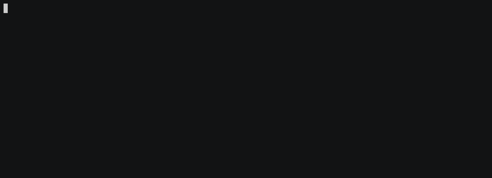

Back in September 2021 we announced [public preview]() for the Helm Release resource in Pulumi's Kubernetes provider. Over the last few months, we have had a very encouraging uptake in usage and several meaningful discussions with users in the community that have helped shape improvements to this resource. Thanks to this collaboration, we are now pleased to announce that the [Helm Release]() resource is now **GA** (generally available) starting in [v3.15.0](https://github.com/pulumi/pulumi-kubernetes/releases/tag/v3.15.0) of the Pulumi Kubernetes Provider and SDK in all Pulumi supported languages. We are excited to offer yet another tool to Pulumi users to effectively manage their Kubernetes footprint.
<!--more-->

{}
The existing [Helm Chart]() component resource will continue to be supported.
{}

## What is the Helm Release resource?

The Kubernetes provider has supported a means to deploy [Helm Charts](https://helm.sh/) since [2018]() through the [Chart]() resource. This resource simulates Helm installation by resolving the templates for underlying resources from the chart and installing them on the target Kubernetes environment directly.

In contrast, the new [Helm Release]() resource uses the Helm SDK natively to perform all Helm operations. This comes with some inherent advantages:

1. Support for the full spectrum of Helm features
2. Ability to import existing Helm releases into Pulumi state
3. Interact with the installed Helm Release through the Helm CLI

## Which Helm Resource Should I Choose?

Both the `Chart` and `Helm Release` resource are complimentary with their own pros and cons. Depending on your use case, one might be a better fit than the other. We now have a [guide to help you choose]() the right resource for your use case.

## How Do I Get Started?

If you aren't already familiar with using Pulumi with Kubernetes, head on over to [Pulumi's getting started guide for Kubernetes]() first.

1. In your chosen Kubernetes Pulumi project, make sure the referenced version of the Pulumi-Kubernetes SDK is at least `v3.15.0`.
2. Like other Kubernetes resources managed by Pulumi, the target cluster for Helm Release is configured with a [Provider](). The default options work for typical cases, and we also provide [advanced configuration options]() for private registries, etc.
3. Refer to the instructions for your chosen language in the [resource documentation]() to create a Helm Release resource.

Let's look at a concrete example of Helm Release in action. In the following snippet we install [Redis](https://redis.io/) using the new Helm Release resource:



{}

```typescript
import * as random from "@pulumi/random";
import * as pulumi from "@pulumi/pulumi";
import * as k8s from "@pulumi/kubernetes";

// Create a password
const pass = new random.RandomPassword("pass", {length:10});
const redisPassword = pass.result;

const namespace = new k8s.core.v1.Namespace("redis-ns");

const release = new k8s.helm.v3.Release("redis-helm", {
    chart: "redis",
    repositoryOpts: {
        repo: "https://charts.bitnami.com/bitnami",
    },
    version: "13.0.0",
    namespace: namespace.metadata.name,
    // Values from Chart's parameters specified hierarchically,
    // see https://artifacthub.io/packages/helm/bitnami/redis/13.0.0#parameters for reference.
    values: {
        cluster: {
            enabled: true,
            slaveCount: 3,
        },
        metrics: {
            enabled: true,
            service: {
                annotations: {
                    "prometheus.io/port": "9127",
                }
            },
        },
        global: {
            redis: {
                password: redisPassword,
            }
        },
        rbac: {
            create: true,
        }
    },
    // By default Release resource will wait until all created resources
    // are available. Set this to true to skip waiting on resources being
    // available.
    skipAwait: false,
});


// We can look up resources once the release is installed. The release's
// status field is set once the installation completes, so this, combined
// with `skipAwait: false` above, will wait to retrieve the Redis master
// ClusterIP until all resources in the Chart are available.
const srv = k8s.core.v1.Service.get("redis-master-svc",
    pulumi.interpolate`${release.status.namespace}/${release.status.name}-master`);
export const redisMasterClusterIP = srv.spec.clusterIP;
```

{}

{}

```go
package main

import (
	"fmt"

	corev1 "github.com/pulumi/pulumi-kubernetes/sdk/v3/go/kubernetes/core/v1"
	"github.com/pulumi/pulumi-kubernetes/sdk/v3/go/kubernetes/helm/v3"
	"github.com/pulumi/pulumi-random/sdk/v4/go/random"
	"github.com/pulumi/pulumi/sdk/v3/go/pulumi"
)

func main() {
	pulumi.Run(func(ctx *pulumi.Context) error {

		namespace, err := corev1.NewNamespace(ctx, "redis-ns", nil)
		if err != nil {
			return err
		}

		redisPassword, err := random.NewRandomPassword(ctx, "pass", &random.RandomPasswordArgs{
			Length: pulumi.Int(10),
		})
		if err != nil {
			return err
		}

		rel, err := helm.NewRelease(ctx, "redis-helm", &helm.ReleaseArgs{
			Chart: pulumi.String("redis"),
			RepositoryOpts: helm.RepositoryOptsArgs{
				Repo: pulumi.String("https://charts.bitnami.com/bitnami"),
			},
			Version:   pulumi.String("13.0.0"),
			Namespace: namespace.Metadata.Name(),

            // Values from Chart's parameters specified hierarchically,
            // see https://artifacthub.io/packages/helm/bitnami/redis/13.0.0#parameters for reference.
			Values: pulumi.Map{
				"cluster": pulumi.Map{
					"enabled": pulumi.Bool(true),
				},
				"metrics": pulumi.Map{
					"enabled": pulumi.Bool(true),
					"service": pulumi.Map{
						"annotations": pulumi.StringMap{
							"prometheus.io/port": pulumi.String("9127"),
						},
						"type": pulumi.String("ClusterIP"),
					},
				},
				"global": pulumi.Map{
					"redis": pulumi.Map{
						"password": redisPassword.Result,
					},
				},
				"rbac": pulumi.BoolMap{
					"create": pulumi.Bool(true),
				},
			},

			// By default Release resource will wait until all created resources
			// are available. Set this to true to skip waiting on resources being
			// available.
			SkipAwait: pulumi.BoolPtr(false),
		})
		if err != nil {
			return err
		}

		// We can look up resources once the release is installed. The release's
		// status field is set once the installation completes, so this, combined
		// with `skipAwait: pulumi.BoolPtr(false)` above, will wait to retrieve
        //  the Redis master ClusterIP until all resources in the Chart are available.
		svc := pulumi.All(rel.Status.Namespace(), rel.Status.Name()).
			ApplyT(func(r interface{}) (interface{}, error) {
				arr := r.([]interface{})
				namespace := arr[0].(*string)
				name := arr[1].(*string)
				svc, err := corev1.GetService(ctx,
					"redis-master-svc",
					pulumi.ID(fmt.Sprintf("%s/%s-master", *namespace, *name)),
					nil,
				)
				if err != nil {
					return "", nil
				}
				return svc.Spec.ClusterIP(), nil
			})
		ctx.Export("redisMasterClusterIP", svc)

		return nil
	})
}

```

{}

{}

```python
import pulumi
from pulumi import Output
from pulumi_random.random_password import RandomPassword
from pulumi_kubernetes.core.v1 import Namespace, Service
from pulumi_kubernetes.helm.v3 import Release, ReleaseArgs, RepositoryOptsArgs

namespace = Namespace("redis-ns")

redis_password = RandomPassword("pass", length=10)

release_args = ReleaseArgs(
    chart="redis",
    repository_opts=RepositoryOptsArgs(
        repo="https://charts.bitnami.com/bitnami"
    ),
    version="13.0.0",
    namespace=namespace.metadata["name"],

    # Values from Chart's parameters specified hierarchically,
    # see https://artifacthub.io/packages/helm/bitnami/redis/13.0.0#parameters
    # for reference.
    values={
        "cluster": {
            "enabled": True,
            "slaveCount": 3,
        },
        "metrics": {
            "enabled": True,
            "service": {
                "annotations": {
                    "prometheus.io/port": "9127",
                }
            },
        },
        "global": {
            "redis": {
                "password": redis_password.result,
            }
        },
        "rbac": {
            "create": True,
        },
    },
    # By default Release resource will wait until all created resources
    # are available. Set this to true to skip waiting on resources being
    # available.
    skip_await=False)

release = Release("redis-helm", args=release_args)

# We can look up resources once the release is installed. The release's
# status field is set once the installation completes, so this, combined
# with `skip_await=False` above, will wait to retrieve the Redis master
# ClusterIP until all resources in the Chart are available.
status = release.status
srv = Service.get("redis-master-svc",
                  Output.concat(status.namespace, "/", status.name, "-master"))
pulumi.export("redisMasterClusterIP", srv.spec.cluster_ip)
```

{}

{}

```csharp
using Pulumi;
using System.Collections.Generic;
using Pulumi.Random;
using Pulumi.Kubernetes.Core.V1;
using Pulumi.Kubernetes.Types.Inputs.Helm.V3;
using Pulumi.Kubernetes.Helm.V3;

class MyStack : Stack
{
    public MyStack()
    {
        var ns = new Pulumi.Kubernetes.Core.V1.Namespace("redis-ns");
        var redisPassword = new RandomPassword("pass", new RandomPasswordArgs
        {
            Length = 10,
        });

        var releaseArgs = new ReleaseArgs
        {
            Chart = "redis",
            RepositoryOpts = new RepositoryOptsArgs
            {
                Repo = "https://charts.bitnami.com/bitnami",
            },
            Version = "13.0.0",
            Namespace = ns.Metadata.Apply(metadata => metadata.Name),
            // Values from Chart's parameters specified hierarchically,
            // see https://artifacthub.io/packages/helm/bitnami/redis/13.0.0#parameters
            // for reference.
            Values = new InputMap<object>
            {
                ["cluster"] = new Dictionary<string,object>
                {
                    ["enabled"] = true,
                    ["slaveCount"] = 3,
                },
                ["metrics"] = new Dictionary<string,object>
                {
                    ["enabled"] = true,
                    ["service"] = new Dictionary<string, object>
                    {
                        ["annotations"] = new Dictionary<string, string>
                        {
                            ["prometheus.io/port"] = "9127",
                        },
                    }
                },
                ["global"] = new Dictionary<string,object>
                {
                    ["redis"] = new Dictionary<string, object>
                    {
                        ["password"] = redisPassword.Result,
                    },
                },
                ["rbac"] = new Dictionary<string,object>
                {
                    ["create"] = true,
                }
            },
            // By default Release resource will wait until all created resources
            // are available. Set this to true to skip waiting on resources being
            // available.
            SkipAwait = false,
        };

        var release = new Release("redis-helm", releaseArgs);

        // We can look up resources once the release is installed. The release's
        // status field is set once the installation completes, so this, combined
        // with `skip_await=False` above, will wait to retrieve the Redis master
        // ClusterIP until all resources in the Chart are available.
        var status = release.Status;
        var service = Service.Get("redist-master-svc", Output.All(status).Apply(
            s => $"{s[0].Namespace}/{s[0].Name}-master"));
        this.RedisMasterClusterIP = service.Spec.Apply(spec => spec.ClusterIP);
    }

    [Output]
    public Output<string> RedisMasterClusterIP { get; set; }
}

```

{}



Users of the existing Helm Chart resource will notice that we retained the hierarchical `values` specification experience and a similar means to configure the repository. The above example also highlights the await and resource lookup experience.

Rollout of the above program is shown in the slightly sped up gif below:


## What's New Since the Preview Announcement?

Thanks to our community of early adopters, we received excellent feedback on the new resource which helped us make significant improvements since our initial preview. Apart from several robustness improvements, some major callouts include:

* Honor namespace specification for all resources installed by Helm Release [[#1747](https://github.com/pulumi/pulumi-kubernetes/pull/1747)]
* Make `values` optional [[#1761]](https://github.com/pulumi/pulumi-kubernetes/pull/1761)
* Make `RepositoryOpts` optional [[#1806]](https://github.com/pulumi/pulumi-kubernetes/pull/1806)
* Suppport local charts [[#1809]](https://github.com/pulumi/pulumi-kubernetes/pull/1809)
* Add import support [[#1818]](https://github.com/pulumi/pulumi-kubernetes/pull/1818)
* Support loading values from yaml files [[#1828]](https://github.com/pulumi/pulumi-kubernetes/pull/1828)

## Where Can I Learn More?

You can learn more about Helm Release from the following sources:

1. The `Helm Release` [API Reference docs]() are an excellent starting point to learn more about the API in each of the supported languages along with code samples.
2. Our guide on [choosing between the Chart and Release resource for your use case]()
3. One of our sample projects where you can see the Helm `Release` resource in action in any one of Pulumi's supported languages:
   * [TypeScript]()
   * [Python]()
   * [C#]()
   * [Go]()

If you have questions or run into issues, please don't hesitate to reach out by filing issues on [Github](https://github.com/pulumi/pulumi-kubernetes/issues) or asking questions on [Community Slack](https://slack.pulumi.com). Happy charting!
