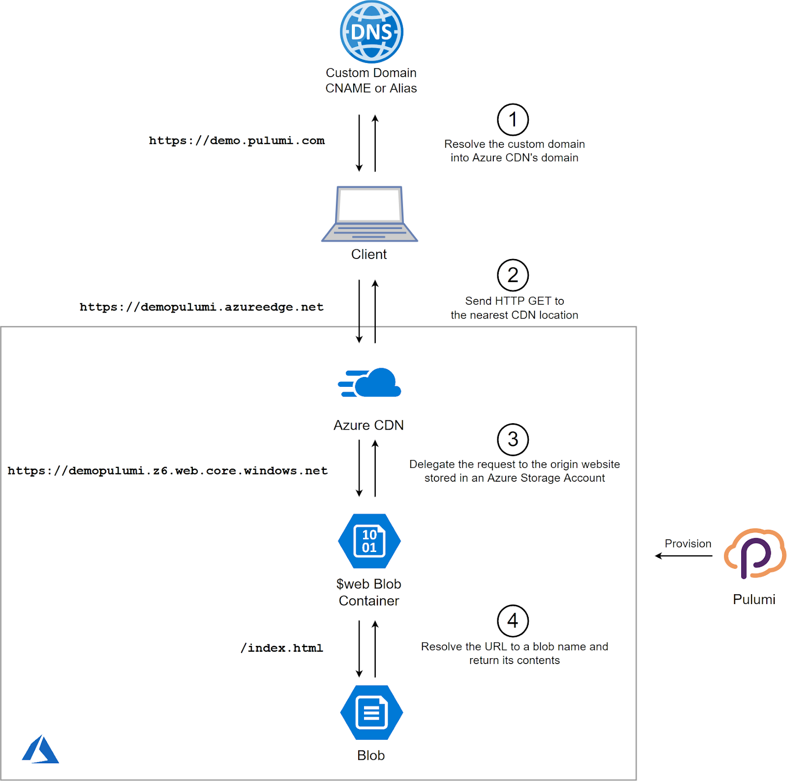

Static websites are back in the mainstream these days. Website
generators like Jekyll, Hugo, or Gatsby, make it fairly easy to combine
templates and markdown pages to produce static HTML files. Static assets
are the simplest thing to serve and cache, so the whole setup ends up
being fast and cost-efficient.

Many platforms offer services to host such static websites. This post
explains the steps to create the infrastructure to do so on Microsoft
Azure.

Setting up the infrastructure to serve a static website doesn't sound
like it would be all that difficult, but when you consider HTTPS
certificates, content distribution networks, and attaching it to a
custom domain, integrating all the components can be quite daunting.

Fortunately, this is a task where Pulumi shines. Pulumi's code-centric
approach not only makes configuring cloud resources easier to do and
maintain, but it also eliminates the pain of integrating multiple
services.

## Overview

Our goal is to create a static website with a custom domain -- I'll use
an imaginary `demo.pulumi.com` for this article. In 2019, my website has
to support HTTPS, so we need to create a custom TLS certificate too.

The final solution consists of several Azure services:

-   Static files will be stored in a **Blob Container** inside a
    **Storage Account**
-   The Storage Account will have **Static Website feature** enabled to
    have some basic URL rewrite rules
-   We'll put an **Azure CDN Endpoint** in front of the container to
    support the custom domain over TLS
-   Azure CDN will self-manage the TLS certificate
-   Our custom DNS provider will have the rule to point to the CDN
    endpoint (that's a manual step)

The diagram below outlines the interaction of these components:



Let's break down how to configure each component using Pulumi.

## Resource Group

Let's start a new Pulumi program, import the Pulumi packages, and define
a new resource group:

```typescript
import * as pulumi from "@pulumi/pulumi";
import * as azure from "@pulumi/azure";

const resourceGroup = new azure.core.ResourceGroup("demo-rg", {
    location: azure.WestEurope,
});
```

## Storage Account

The Storage Account will contain our static website's assets:

```typescript
const storageAccount = new azure.storage.Account("demopulumi", {
    resourceGroupName: resourceGroup.name,
    accountReplicationType: "LRS",
    accountTier: "Standard",
    accountKind: "StorageV2",
});
```

The only trick here is to make sure that the account kind is V2;
otherwise, it won't support the static website feature.

## Static Website Hosting in Azure Storage

Any storage container could be exposed as a web endpoint. However,
that's not flexible enough. The URL would always include the container
name and the exact file name, so the user would have to ask for
`https://demo.pulumi.com/containername/index.html` instead of simply
`https://demo.pulumi.com/`.

Enabling Static Website Hosting in Azure Storage improves this
experience. A dedicated container **`$web`** gets automatically created,
which also has special treatment for `index` and `404` documents.

The bad news is that Static Website Hosting is not a part of Azure
Resource Manager API, and therefore, it's not available out-of-the-box
in ARM templates, Terraform, or Pulumi. We can enable this feature with
Azure CLI, so the solution is to create a dynamic Pulumi resource which
enables Pulumi experience while delegating the work to the CLI. You can
find the full source code for the dynamic resource in [this example](https://github.com/pulumi/examples/blob/master/azure-ts-static-website/staticWebsite.ts),
but the usage is quite trivial:

```typescript
const staticWebsite = new StorageStaticWebsite("demopulumi-static",
    { accountName: storageAccount.name },
    { parent: storageAccount });

// Web endpoint to the website
export const staticEndpoint = staticWebsite.endpoint;
```

The last line exports the static website endpoint. It will look
something like
`https://demopulumi01234abc.z6.web.core.windows.net/`---no custom domain
yet, but already functional---once we deploy some static files in there.

## Static Files

Now, it's time to upload the static files to the `$web` Blob Container.

For this demo, I've created a folder `wwwroot` with two files in it:
`index.html` and `404.html`. I can upload those files with the following
Pulumi snippet:

```typescript
["index.html", "404.html"].map(name =>
    new azure.storage.Blob(name, {
        name,
        resourceGroupName: resourceGroup.name,
        storageAccountName: storageAccount.name,
        storageContainerName: staticWebsite.webContainerName,
        type: "block",
        source: `./wwwroot/${name}`,
        contentType: "text/html",
    })
);
```

In practice, your static website might contain hundreds or thousands of
files. At that point, you might want to split the file upload operation
from Pulumi and do it as a separate step in your CI/CD pipeline.

## Azure CDN

To make the static website files available over our custom domain and
HTTPS, we need to create an Azure CDN Endpoint and to point it to the
storage account:

```typescript
const cdn = new azure.cdn.Profile("demo-cdn", {
    resourceGroupName: resourceGroup.name,
    sku: "Standard_Microsoft",
});

const endpoint = new azure.cdn.Endpoint("demo-cdn-ep", {
    name: "demopulumi",
    resourceGroupName: resourceGroup.name,
    profileName: cdn.name,
    isHttpAllowed: true,
    isHttpsAllowed: true,
    originHostHeader: staticWebsite.hostName,
    origins: [{
        name: "blobstorage",
        hostName: staticWebsite.hostName,
    }],
});

// CDN endpoint to the website. Allow it some time after the deployment to get ready.
export const cdnEndpoint = pulumi.interpolate`https://${endpoint.hostName}/`;
```

I specified an explicit name for the CDN Endpoint: `demopulumi`. This
name has to be globally unique because it is a part of the endpoint URL
`https://demopulumi.azureedge.net`. Please pick a custom name before
running the program.

I pointed the CDN origin to the static website name with
`staticWebsite.hostName`. As usual, it's easy to link resources in
Pulumi code!

You might need to wait a few minutes before your content is visible as
the CDN configuration is not immediately executed. I've set
`isHttpAllowed` to `true` because HTTP is available sooner than HTTPS;
feel free to switch it off for your production configuration.

## Configure a Domain DNS Rule

You've probably registered your domain with some third-party provider.
Follow the instructions of your provider to configure a CNAME rule for
the website's DNS. For a custom domain `demo.pulumi.com`, the CNAME
entry `demo` would be linked to the endpoint `demopulumi.azureedge.net`.

CNAME entries don't support "naked" domains like `pulumi.com`. If you
want to set up a top-level domain to be served from the static Azure
website, you'd have to use an [Alias DNS record](https://support.dnsimple.com/articles/alias-record/), which
isn't supported by some DNS providers. Please check with your provider
for available options.

The following step assumes that a CNAME record is configured; otherwise,
it would fail with a validation error.

## Custom Domain and TLS

The final step is to point our custom domain to the CDN endpoint and
provision a TLS certificate to enable HTTPS support. Once again, these
operations are not parts of the ARM API surface, so another [dynamic resource](https://github.com/pulumi/examples/blob/master/azure-ts-dynamicresource/cdnCustomDomain.ts)
was created to support them.

The usage is quite straightforward, just make sure to use your own
domain in the following snippet:

```typescript
const customDomain = new CDNCustomDomainResource("cdn-custom-domain", {
    resourceGroupName: resourceGroup.name,
    // Ensure that there is a CNAME record for demo pointing.pulumi.com to demopulumi.azureedge.net.
    // You would do that in your domain registrar's portal.
    customDomainHostName: "demo.pulumi.com",
    profileName: cdn.name,
    endpointName: endpoint.name,
    // This will enable HTTPS through Azure's one-click automated certificate deployment.
    // The certificate is fully managed by Azure from provisioning to automatic renewal
    // at no additional cost to you.
    httpsEnabled: true,
}, { parent: endpoint });
```

## Bring It Live!

And we are done! Run `pulumi up` and make sure that all resources get
created successfully.

Start testing with `staticEndpoint`---it's the first one to become
available. `cdnEndpoint` might return some `404`'s at first, be
patient. Then, try your custom domain with `HTTP`. Finally, the TLS
certificate takes quite a while to be registered, so come back in an
hour or so to test `HTTPS`.

While a "static website" may sound simple, we went through a rather
complicated process to wire all the components together. Some Azure
services and features are more straightforward to automate than others,
but in the end, we combined all of them into one cohesive Pulumi program
to host a static website, served over HTTPS and from a worldwide CDN.
That's the power of a general-purpose programming language applied to
the task of sophisticated infrastructure automation. Once the reusable
components are in place, reliable and reproducible deployments become a
reality.
