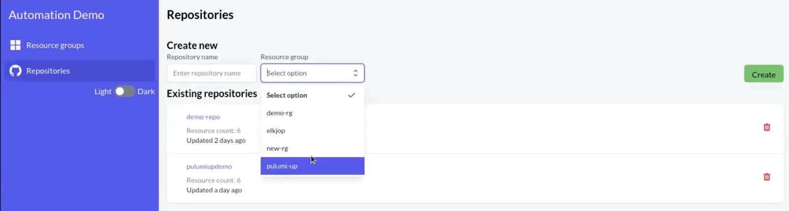
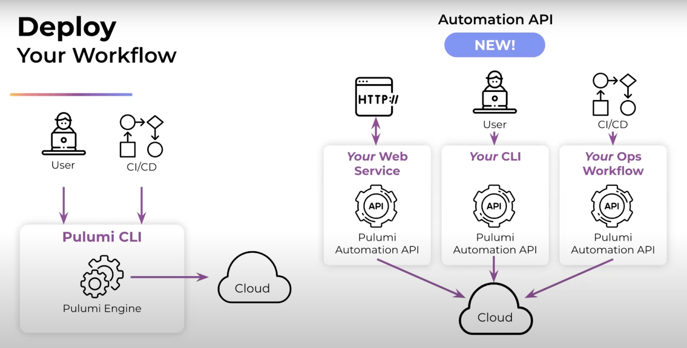
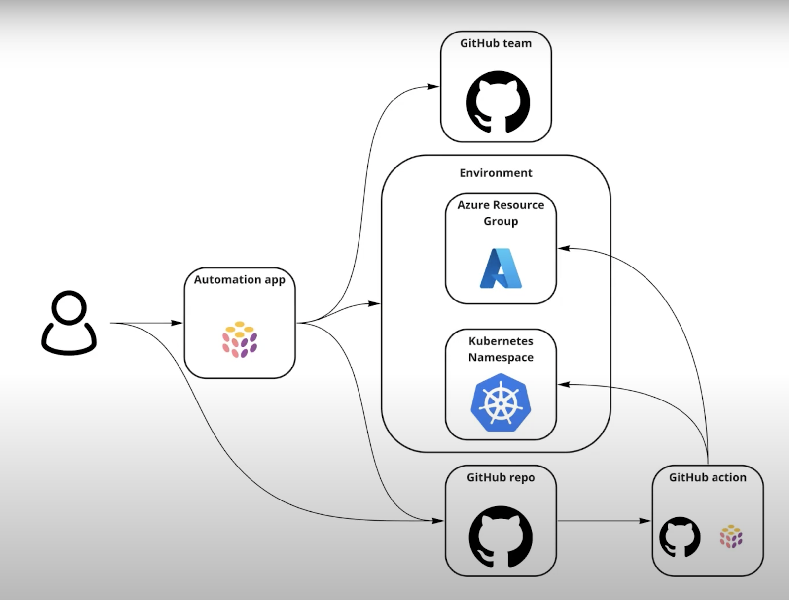

At PulumiUP 2022, Tomas Jansson, software architect at Elkjøp Nordic, gave a presentation on how to enable developers to self-service infrastructure by using Pulumi’s [Automation API]().

Elkjøp Nordic is the leading consumer electronics retailer in the Nordics. The company sells consumer electronics, mobile phones, computers, white goods, domestic appliances, and services linked to these products both directly to consumers and to businesses. It is an omnichannel retailer and serves customers both online and through more than 400 stores. Elkjøp has retail outlets in Norway, Sweden, Finland and Denmark, and franchise operations in Greenland and Faroe Islands.

To support the company’s modernization strategy, Tomas developed a self-service infrastructure platform that would enable any developer to easily provision cloud infrastructure that uses approved resources and security practices. The goal was to empower teams at Elkjøp to increase their development velocity by using the cloud, while maintaining guardrails that uphold security and compliance.

Watch the full presentation below or read on to learn the highlights of his presentation:



## The Problem: Balancing Agility and Governance

To achieve his goals, Tomas knew he had to solve the problem of balancing freedom with control. On the one hand, he wanted to foster the creativity of his developers and encourage innovation. He wanted his team to feel they were trusted and had the room to create the best solutions they could. On the other hand, he knew he had to maintain some control. Elkjøp needed to keep its applications secure. It also needed good governance so that teams can keep track of who is making changes. Tomas also wanted to limit the impact of deploying untested code. Code that was still being developed needed to be confined to the developer’s own environment. Finding the right balance between independence and control was paramount. Tomas believed this would result in great software and in developers who would enjoy their work.

## The Solution: A Self-Service Infrastructure Platform

Tomas’ solution was to build a self-service infrastructure platform. Self-service infrastructure makes it possible for developers to easily access the infrastructure they need while limiting access to resources they don’t need. In effect, self-service infrastructure is a walled garden. Within the garden, developers have all the freedom they need. However, nothing they do affects what’s outside the wall. Code that causes unintended changes only affects them and no one else.

Tomas built an application that provides a “walled garden” of self-service infrastructure. Developers can create the environments they need, including an Azure resource group and a Kubernetes namespace, all through a graphical user interface. Developers can define whether the environment is for development, test or production. They can also assign values, such as which team members should have admin privileges to the associated GitHub repositories or who can contribute. From there, the platform handles provisioning and configuring all of these resources.

Here is an example that shows how a developer can create a repository simply by selecting a few parameters from a drop-down list.

Tomas determined that the best way to implement self-service infrastructure was with Pulumi and its [Automation API](). By using Pulumi, he could use standard programming languages to define infrastructure while using familiar software tools like IDEs and test frameworks. Pulumi also natively supports Azure and Kubernetes with 100% coverage of each provider’s APIs and same-day access to new features and updates. Finally, the Pulumi Automation API would enable him to program infrastructure automation directly into his application.

The Pulumi Automation API is a programmatic interface for running Pulumi programs without the Pulumi CLI. Automation API encapsulates the functionality of the CLI (`pulumi up`, `pulumi preview`, `pulumi destroy`, `pulumi stack init`, etc.) but with more flexibility since infrastructure operations can be controlled programmatically.

## How the self-service infrastructure platform was built

Here is the workflow for the Elkjøp self-service infrastructure platform.

The self-service platform is a web application that runs the Pulumi Automation API on the server side. The application uses Pulumi to provision and configure every environment resource such as Azure resource groups, Kubernetes namespaces, service principals, and Kubernetes service accounts. Each environment comes with a Git repository that's used by developers to manage their deployments. The Git repositories are the locus of each environment because they store everything needed to deploy changes such as infrastructure code and environment credentials.

Using the Pulumi Automation API, the application creates an Azure resource group, a team in both Azure AD and GitHub, and a new GitHub repository. The application then grants administrative access to the GitHub repo to members of the AD group. In addition to creating a Git repository for each environment, the application uses stack references for each Azure environment to inject the associated credentials into the GitHub Secret Store. These credentials are scoped to each GitHub environment so that developers can only work in their own environment. If a team has multiple environments, each environment has its own credentials so developers can’t, for example, deploy from a test environment to a production environment. Secrets are managed through the [Pulumi Service]().

Every new repository comes with Pulumi programs that developers can use to deploy their application. GitHub Actions initiate the deployment. When an action triggers, Pulumi reads the credentials that were generated by the self-service application, allowing Pulumi to deploy new Kubernetes or Azure resources to the environment.

## Watch the demo

To illustrate how Elkjøp’s self-service platform works, Tomas presented a simplified demo application that’s based on Elkjøp’s production platform. The code for the application is available at <https://github.com/mastoj/pulumi-automation-demo>.

The demo is a TypeScript application that includes an API that provisions Azure and GitHub resources. Pulumi Automation API code is used to deploy new stacks by calling handler code, which is a Pulumi program that defines resources and outputs. The handler code can create Azure resource groups or GitHub repositories, and stack references are used so that outputs generated by the Azure resources can be stored in GitHub (e.g., resource group credentials).

Ready to dive into how this works in detail? Watch the demo in the video below starting around 10:20.



## Next steps

After watching the [demo](https://youtu.be/aoa_O-rh5KE?list=PLyy8Vx2ZoWlpcvhSsUXdT5CXjRwAaM_My&t=620) of a self-service infrastructure platform, you can try it out for yourself by checking out the [demo code](https://github.com/mastoj/pulumi-automation-demo). You can also learn more about [Pulumi Automation API]() in our [documentation]().

If you’re new to Pulumi, then follow our [getting started guide]().
