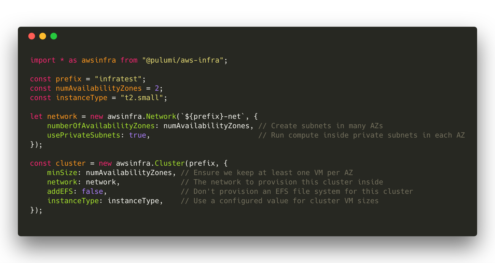
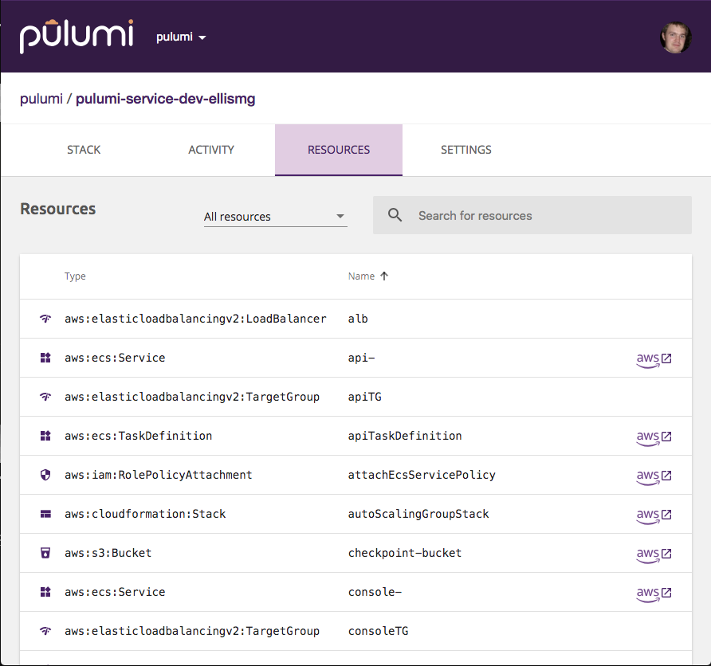
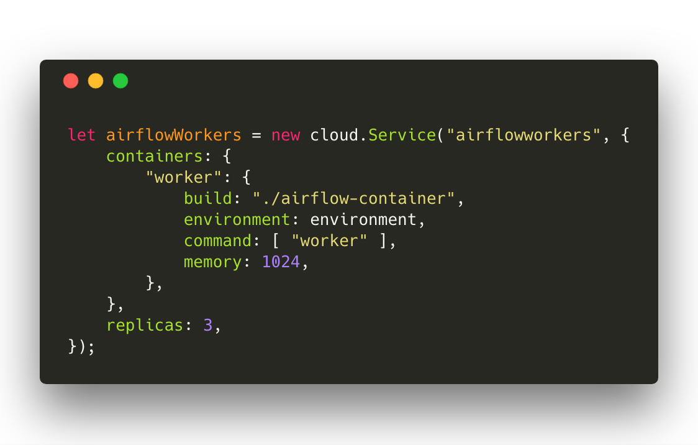
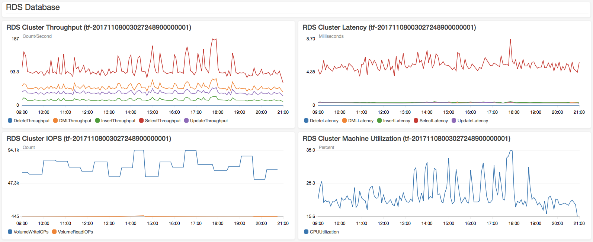
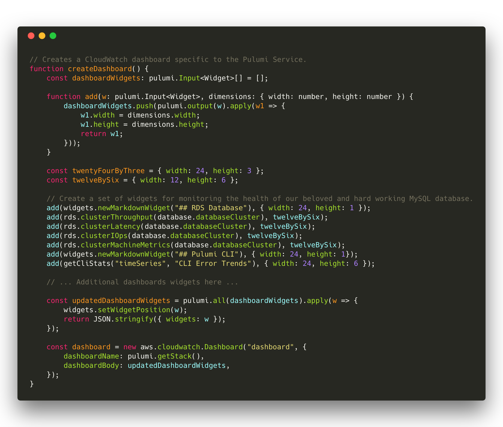
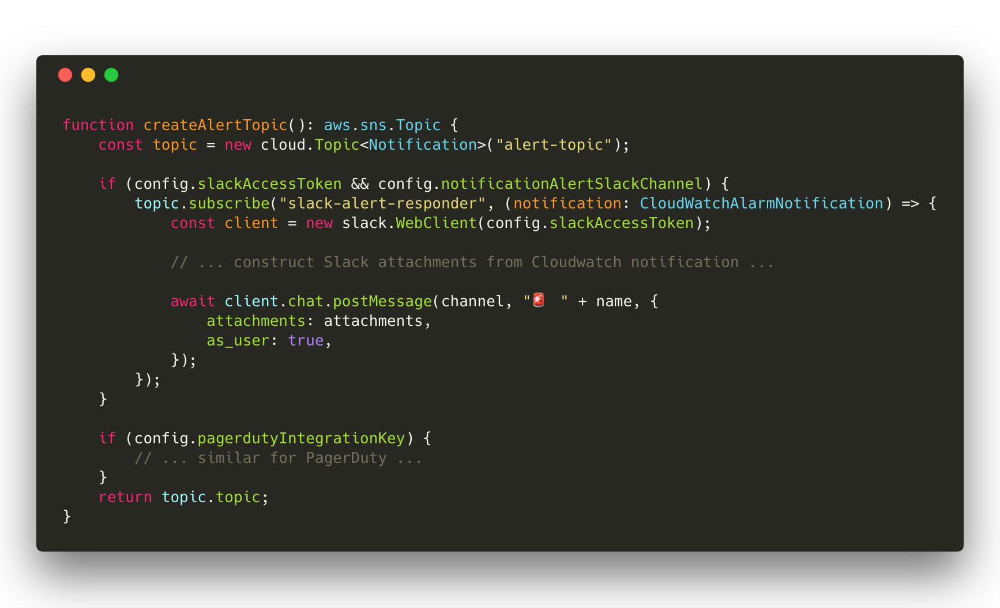
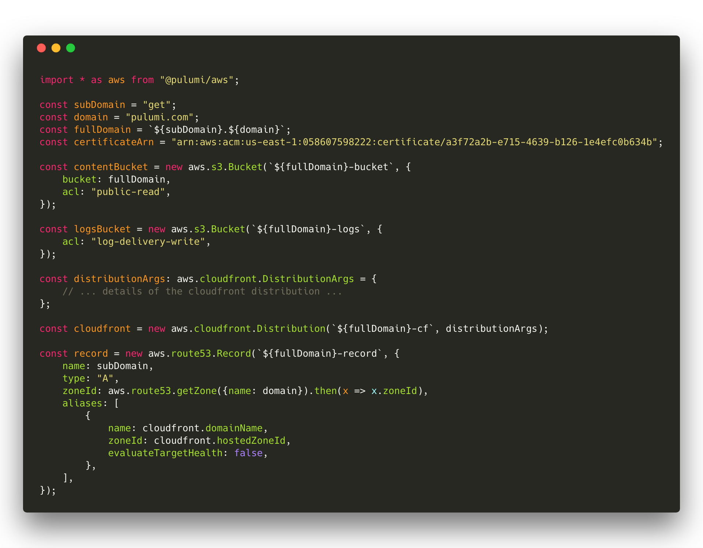
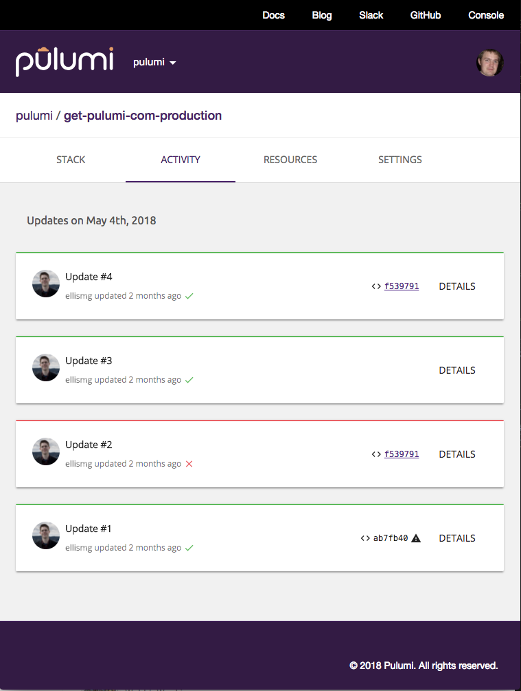

Here at Pulumi we are (perhaps unsurprisingly!) huge fans of using
Pulumi to manage our cloud infrastructure and services. We author our
infrastructure in strongly-typed programming languages, which allows us
to to benefit from rich tooling - documenting and factoring our
infrastructure using the same software engineering practices we apply to
our application code. This also allows us to create reusable
abstractions which accelerate our ability to deliver new features and
services, and our ability to standardize and refactor infrastructure
patterns across our services with relative ease. 

Like other users, we use Pulumi at a variety of levels of abstraction.
We use Pulumi for raw infrastructure provisioning, defining the core
networking layer for our AWS-based backend infrastructure. And we use
Pulumi to define how our application services are deployed into ECS
using just a few lines of code. Pulumi hosts and manages static content
for [www.pulumi.com](https://www.pulumi.com/) and [get.pulumi.com](https://get.pulumi.com).
We use Pulumi to
define the CloudWatch dashboards connected to our infrastructure. And
for monitoring, Pulumi defines metrics and notifications/alarms in
PagerDuty and Slack.

Best of all, we've been able to take things we've learned from these use
cases, and others we've worked with beta users on over the last few
months (thank you!), and factor common patterns out into reusable
libraries like `@pulumi/aws-infra` and `@pulumi/cloud` for ourselves and
others to build upon.

In this post, we'll do a deeper dive into each of these use cases,
highlighting unique aspects of how we use Pulumi itself, and some of our
engineering processes around how we integrate Pulumi into the rest of
our toolchain.
<!--more-->

## Infrastructure

Our backend infrastructure that supports
<https://app.pulumi.com> and the Pulumi CLI is fairly
typical of a cloud service/application building on AWS. Those who have
done this before will be familiar with the combination of AWS VPC, EC2,
ASG, ALB, ECS, S3, Aurora, CloudFront and Route53 that powers the core
of many AWS-based web applications.

We started off building this infrastructure last year - before we even
had completed support for managing AWS resources in Pulumi! As a result,
we brought this up initially using CloudFormation. Moving this to Pulumi
was an amazing experience. We immediately brought more engineering
rigour to the codebase, factoring and decomposing functionality in
clearer ways, extracting out useful patterns into named functions, using
loops and conditionals instead of copy/paste, and getting completion
lists and on-the-fly error checking from within our development tools.

Equally important, authoring our infrastructure in Pulumi gave us the
ability to factor out reusable abstractions. We found that our own VPC
definition was something that many early customers we worked with also
needed - so we factored it out into `new awsinfra.Network`. We found
that standing up an ECS cluster was another big pile of AWS resources
that are commonly needed, but can be configured with a much smaller
space of configuration values in the common case, so we factored out
`new awsinfra.Cluster`.

Defining infrastructure in Pulumi made it easy to stand up many
instances of our service, including per-developer stacks, with just
`pulumi stack init my-developer-stack` and `pulumi update`. The ability
to build reusable components which can be multi-instantiated into the
same target cloud is critical here, and something that Pulumi takes care
of by default. Within minutes, a developer can have an isolated copy of
our full infrastructure stood up, which can be used to test out and
quickly iterate on changes. This includes not just the basic
infrastructure, but also provisioning of DNS entries in Route53 and
creation of custom CloudWatch dashboards (see more on this below).

We have three shared environments - **development**, **staging** and
**production** - each an isolated environment with separate
configuration. For these shared environments we drive deployments of the
Pulumi programs that define the infrastructure above via our CI/CD
pipeline. Pulumi can be integrated into any existing CI/CD pipeline or
toolchain, via direct use of `pulumi preview` and `pulumi update` as
part of build and deployment stages. This allows us to reliably deliver
a known desired state for each target environment, and to promote
changes between environments with just a `git merge`.

## API and App Services

Most of our backend application services are developed in Go, and we
deploy them onto our production infrastructure as container images.
However, instead of building separate CI pipelines for our container
images and the infrastructure they need to function correctly (ECS
Service, Application Load Balancer, ECR Repository, etc.), we drive the
deployment of both infrastructure and application code via a single
Pulumi program. This allows our application code to version along with
its supporting infrastructure - when we need to expose a new port for
example, we can make the changes to both application code and load
balancer as part of a single commit, and promote it through CI as an
atomic action. We have found this to significantly simplify the delivery
of containerized services on AWS, as well as making it easy to stand up
new services into our existing shared networking and cluster
infrastructure.

Again, we found this to be a common pattern as we worked with other
early customers, and factored out a library to simplify deployment of
containerized services into a production deployment on AWS as part of
the `cloud.Service` API in `@pulumi/cloud`. Here's an example of using
an application service defined in the `./airflow-container` folder (with
a `Dockerfile`) into an ECS cluster. This one declaration will provision
a scaled-out ECS Service for running the container images, a ECR
repository to store the image, optionally a load balancer if ports were
exposed, and each `pulumi update` will build the container image, push
it to the private repository, and turn-over each service task to use the
new image. All of that workflow complexity is abstracted away behind a
simple API and a single CLI command.

## Metrics, Alarms and Dashboards

We also use Pulumi to define a few less traditional parts of our
infrastructure - including our metrics, dashboards and alarming
infrastructure on top of AWS CloudWatch.

Defining and versioning this along with our infrastructure has
significant benefits: new features are built with metrics, dashboards
and alarms lit up from the get-go, developers get a full set of
dashboards as part of their personal isolated development environments,
and promotions from development to staging to production can verify not
just physical infrastructure, but also that alarms and dashboards are
behaving as expected prior to pushing code to production. Here's a
sample of our CloudWatch dashboards:

We build up AWS resources representing CloudWatch dashboards using a
compositional framework shown below. As this example shows, bringing
software engineering approaches to infrastructure as code can lead to
new approaches to how code is authored and factored - and ultimately to
the creation of higher level frameworks for building domain-specific
cloud infrastructure - in this case, CloudWatch dashboards.

The same metrics that power these dashboards are also used to power
notifications and alarms. In these cases, we want to define both the
infrastructure for the alarm - the SNS topics and registration of those
topics with CloudWatch - as well as the small piece of code that fires
off Pagerduty and Slack notifications on notifications being pushed to
that SNS topic - all in one codebase. This ensures that we can version
these together, and that we can deploy both consistently as part of
updates. To do this, we include the event handlers for these
infrastructure events directly inline in our Pulumi programs. Note in
the code snippet below how we define the infrastructure for a `Topic`,
and then conditionally wire up event handlers on that topic, including
the code to execute at runtime on these events directly in our Pulumi
program. This code can even reach out and reference configuration used
to provision our Pulumi deployment - key to enabling this to be deployed
seamlessly into a variety of different development environments.

## Static Content

We serve three properties as static content from S3, each described
using Pulumi. One of these is
[https://get.pulumi.com](https://get.pulumi.com/) which hosts downloads
of our `pulumi` CLI installer. It's a very simple program, and even
better - it's open source at <http://github.com/pulumi/get.pulumi.com>.
It combines AWS S3, CloudFront and Route53.

This infrastructure is deployed and managed using the Pulumi console at
[app.pulumi.com](https://app.pulumi.com/), allowing us to track the
history of deployments and changes to the infrastructure and quickly
jump in to the resources defined by this stack in the AWS console.

## Conclusion

Treating cloud infrastructure as software has changed how we think about
infrastructure engineering. Using Pulumi for both traditional cloud
infrastructure as well as to get application code and supporting service
infrastructure into production provides a simple workflow and the
ability to create simple high-level APIs to make new services easy to
define and deploy.

Try out Pulumi yourself today!
