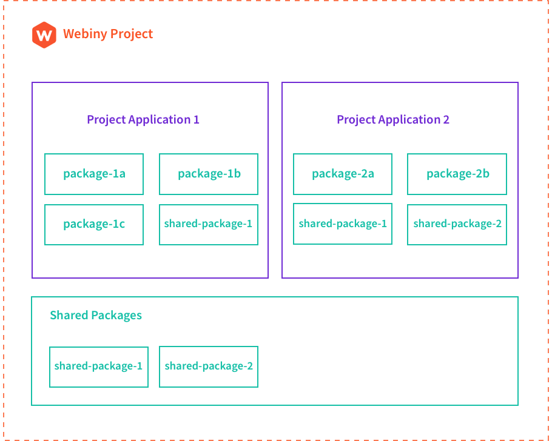

Building an open-source framework for building serverless applications has many challenges, one of which is deploying cloud infrastructure resources. In this article, learn how Webiny uses Pulumi to enable its users to easily deploy and develop applications built on top of serverless cloud technologies.

<!--more-->

## What is Webiny?

[Webiny](https://www.webiny.com?utm_source=Pulumi&utm_medium=blog-post&utm_campaign=webiny-blog-promotion&utm_content=how-webiny-built-framework-with-pulumi&utm_term=W00646) is an open-source framework for building serverless applications, completely written in TypeScript.

In other words, it is a framework that enables developers to architect, build, and deploy solutions on top of the serverless cloud infrastructure, like [AWS Lambda](https://aws.amazon.com/lambda/), [Amazon DynamoDB](https://aws.amazon.com/dynamodb/), [Amazon S3](https://aws.amazon.com/s3/), and others. Some examples of what you can build with Webiny today are:

- full-stack applications
- websites
- REST and GraphQL APIs
- microservices

With the framework, Webiny also built a content management system called the [Webiny Serverless CMS](https://www.webiny.com/serverless-cms?utm_source=Pulumi&utm_medium=blog-post&utm_campaign=webiny-blog-promotion&utm_content=how-webiny-built-framework-with-pulumi&utm_term=W00647). It is free, open-source, and by default, included with every new Webiny project.

Finally, it’s worth mentioning that, at the moment, Webiny exclusively works with [AWS](https://aws.amazon.com/). But, bringing Webiny to other cloud providers like [Microsoft Azure](https://azure.microsoft.com/en-us/) and [Google Cloud Platform (GCP)](https://cloud.google.com/) is definitely something we’ll be looking at in the future.

## Building the Framework - The Challenge

Building a serverless framework certainly has its challenges. One of which is the deployment of cloud infrastructure, which, in the world of serverless, is one of the fundamental operations developers need to do, even while the application is still in development.

Before the [version 5 release](https://www.webiny.com/blog/webiny-v5-the-big-update?utm_source=Pulumi&utm_medium=blog-post&utm_campaign=webiny-blog-promotion&utm_content=how-webiny-built-framework-with-pulumi&utm_term=W00648), Webiny relied on an infrastructure provisioning technology called [Serverless Components](https://github.com/serverless/components/) (not to be confused with [Serverless Framework](https://www.serverless.com/)). Using a concept of components, it is a system that enables developers to deploy ready-made blocks of cloud infrastructure resources configured for a specific use-case. Some examples of components are [Website](https://github.com/serverless/components/tree/v1/templates/website), [REST API](https://github.com/serverless/components/tree/v1/templates/backend-monolith), a [Full Stack Application](https://github.com/serverless/components/tree/v1/templates/fullstack-application), and more.

At the time, it seemed that the overall developer experience and the simplicity of the Serverless Components product was the right choice for our users. So, we decided to go with it.

But, over time, we noticed several things that, unfortunately, made us question our decision. And if I were to choose the top four, I’d mention the following.

### 1. Hard to Customize

While the idea around components for different use-cases certainly sounded interesting, ultimately, it was not ideal for Webiny. We frequently received questions regarding further component configuration and customization, which was not easy to perform.

“How do I configure a different database?”, “How do I set a VPC?”, “How do I set up a specific configuration parameter for my S3 bucket?” were just some of the questions we received. The answer almost always included us having to implement support for a particular feature. To some degree, this worked, but it was really us patching the holes, which we knew would only get us so far.

### 2. Using YAML Instead of Code

At Webiny, we believe [cloud engineering](https://www.pulumi.com/cloud-engineering/) and infrastructure-as-code is the future, so, naturally, we wanted our users to use familiar code (ideally TypeScript) and development tools to define their cloud infrastructure. Within Serverless Components, the components are configured via YAML files, of which we were never really big fans, simply because of the fact that writing code instead of configurations gives more flexibility to developers.

### 3. Vendor Lock-In

Vendor lock-in was introduced at a later stage of the Serverless Components product development. Essentially, to deploy a component, the user is now forced to use a proprietary service that comes with it. And while, among other things, the service enables much faster deployments, from our perspective, we saw this as an additional point of friction for our users. Ideally, users should be able to set up Webiny with only an AWS account.

### 4. Lack of Support for Other Cloud Providers

At the time, Serverless Components’ support for different cloud providers just wasn’t there. This would be a major roadblock for us as we get to multi-cloud integration.

## Discovering Pulumi

Once we realized Serverless Components wasn’t an ideal solution for Webiny, we started looking for an alternative.

The key features that we were looking for were the following:

- open-source
- use code (preferably TypeScript) to create cloud infrastructure resources
- cloud infrastructure code should be flexible, meaning, users should be able to make adjustments to it
- support for multiple cloud providers is a must
- no vendor lock-in

So, the search began, and soon enough, we discovered Pulumi. And as it turned out, it not only checked all the boxes we had initially listed but much more:

- different options when it comes to storing cloud infrastructure state files: a managed SaaS ([pulumi.com](https://app.pulumi.com/signin)) with a console and self-hosted, (for example [Amazon S3](https://aws.amazon.com/s3/))
- ability to deploy cloud infrastructure into multiple environments using its concept of [stacks](https://www.pulumi.com/docs/intro/concepts/stack/)
- advanced features like [Policy as Code](https://www.pulumi.com/docs/guides/crossguard/get-started/) and [watch mode](https://www.pulumi.com/docs/reference/cli/pulumi_watch/)
- great documentation
- a vibrant community of developers and a responsive team behind the product

I probably forgot to mention a thing or two here, but most certainly, at this point, we were ready to make a move and start experimenting with Pulumi.

## Integrating Pulumi with Webiny

For us, the integration of Pulumi with Webiny consisted of three steps:

1. figure out how to integrate Pulumi's programming model with Webiny
2. integrate Pulumi CLI into Webiny CLI
3. figure out the optimal way of handling cloud infrastructure state files

Let's see how we tackled each of these three steps.

### Integrating Pulumi's Programming Model With Webiny

In terms of [project organization](https://www.webiny.com/docs/key-topics/project-organization/project-applications-and-packages?utm_source=Pulumi&utm_medium=blog-post&utm_campaign=webiny-blog-promotion&utm_content=how-webiny-built-framework-with-pulumi&utm_term=W00649), every Webiny project consists of two key concepts: packages and project applications (or just applications).

Packages are just regular NPM packages, or in other words, folders with a `package.json` manifest file and some code. On the other hand, project applications are higher-level organizational units formed from one or more packages that form applications, as the name itself suggests. Applications consist of both application code and cloud infrastructure needed to run them.



A single Webiny project can contain multiple project applications, where each one has its own independent set of necessary cloud infrastructure resources that need to be deployed.

As an example, a default Webiny project includes three project applications:

- **API** - essentially, represents your GraphQL HTTP API
- **Admin Area** - the Admin Area (React) application
- **Website** - the public website, a (React) application with static site generation (SSG) in the cloud

If we were to compare these by the complexity of the necessary cloud infrastructure to deploy, the Admin Area is the simplest. It only relies on a single [Amazon S3](https://aws.amazon.com/s3/) bucket and an [Amazon Cloudfront](https://aws.amazon.com/cloudfront/) distribution. On the other hand, the API project application is the most complex one as it needs to deploy multiple [AWS Lambda](https://aws.amazon.com/lambda/) functions, [Amazon DynamoDB](https://aws.amazon.com/dynamodb/) tables, Amazon S3 buckets, and more.

Ultimately, we decided that each project application should be a [Pulumi project](https://www.pulumi.com/docs/intro/concepts/project/#projects). With this approach, we gave developers the ability to both define and deploy respective cloud infrastructures independently. And, with the concept of [stacks](https://www.pulumi.com/docs/intro/concepts/stack/), they are also able to deploy them into multiple environments, which we’ll show in a moment.

### Pulumi CLI and Webiny CLI

Once we understood how to use Pulumi concepts with Webiny's project organization, the next step was integrating the [Pulumi CLI](https://www.pulumi.com/docs/reference/cli/) with the [Webiny CLI](https://www.webiny.com/docs/key-topics/webiny-cli?utm_source=Pulumi&utm_medium=blog-post&utm_campaign=webiny-blog-promotion&utm_content=how-webiny-built-framework-with-pulumi&utm_term=W00650).

And although the Pulumi CLI is great, we still wanted to keep it super simple for the user and make the overall developer experience as straightforward and unified as possible. For starters, we didn’t want our users to install the Pulumi CLI manually. We wanted it to happen automatically.

We’ve created our version of the [Pulumi SDK](https://github.com/webiny/webiny-js/tree/next/packages/pulumi-sdk), which lets us use the Pulumi CLI more programmatically. It also enables us to make the Pulumi CLI download experience as smooth as possible. Essentially, whenever a user runs a deployment-related command, all of the necessary Pulumi CLI binaries and plugins are downloaded and stored inside the project’s node_modules folder.

> Although we could’ve saved us some time by using Pulumi’s [Automation API](https://www.pulumi.com/docs/guides/automation-api/) (instead of creating the mentioned Pulumi SDK), at the time, the Automation API was still in preview and not generally available. And since the setup we already had was working well, we decided to keep it and hopefully revisit the Automation API integration in the future.

Once we had that in place, we were ready for the next step, exposing a couple of fundamental deployment-related commands via the Webiny CLI. The following examples show us some of the commands users can use:

```bash
# Deploys a project application (internally runs "pulumi up")
webiny deploy {PROJECT_APPLICATION_FOLDER} --env {ENVIRONMENT}

# Previews a project application deployment (internally runs "pulumi preview")
webiny deploy {PROJECT_APPLICATION_FOLDER} --env dev --{ENVIRONMENT}

# Destroys cloud infrastructure resources previously deployed within
# the specified project application (internally runs "pulumi destroy")
webiny destroy {PROJECT_APPLICATION_FOLDER} --env {ENVIRONMENT}

# Starts watching specified project application and continuously deploys
# changes to the cloud (internally runs "pulumi watch")
webiny watch {PROJECT_APPLICATION_FOLDER} --env {ENVIRONMENT}
```

Note the `--env` argument appended to each command. With it and Pulumi’s concept of stacks, users can easily deploy their project applications into multiple environments.

### Cloud Infrastructure State Files

The last piece of the puzzle was storing cloud infrastructure state files. Here we went with the following approach.

For local development, users’ cloud infrastructure state files are stored locally within their Webiny project using the [Local Filesystem Backend](https://www.pulumi.com/docs/intro/concepts/state/#logging-into-the-local-filesystem-backend), which we’ve seen worked great for developers.

On the other hand, for ephemeral environments spawned in CI/CD or long-lived environments like staging or production, through our [documentation](https://www.webiny.com/docs/key-topics/ci-cd/cloud-infrastructure-state-files#using-different-backends), we advise our users to use centralized and remote storage by using backends like [Amazon S3](https://www.pulumi.com/docs/intro/concepts/state/#logging-into-the-aws-s3-backend) and even [Pulumi Service (pulumi.com)](https://www.pulumi.com/docs/intro/concepts/state/#logging-into-the-pulumi-service-backend). Both backends have their pros and cons, and we let the users choose the one they want to use.

## Show Me the Code

Let’s take a look at how it all works in the actual code.

As mentioned, by default, every Webiny project comes with three project applications: API, Admin Area, and Website, which are located in the [`api`](https://github.com/webiny/webiny-js/tree/next/packages/cwp-template-aws/template/api), [`apps/admin`](https://github.com/webiny/webiny-js/tree/next/packages/cwp-template-aws/template/apps/admin), and [`apps/website`](https://github.com/webiny/webiny-js/tree/next/packages/cwp-template-aws/template/apps/website) folders, respectively:

```bash
.
├── api # API
│   ├── code
│   ├── pulumi
│   ├── Pulumi.yaml
│   ├── tsconfig.json
│   └── webiny.application.ts
├── apps
│   ├── admin # Admin Area
│   │   ├── code
│   │   ├── pulumi
│   │   ├── Pulumi.yaml
│   │   ├── tsconfig.json
│   │   └── webiny.application.ts
│   └── website # Website
│       ├── code
│       ├── pulumi
│       ├── Pulumi.yaml
│       ├── tsconfig.json
│       └── webiny.application.ts
└── (...)
```

As we can see, every project application follows the same general organization. The two folders in each project are:

- `code` - contains application code (one or more packages)
- `pulumi` - contains cloud infrastructure (Pulumi) code

Furthermore, if we opened each of these `pulumi` folders, we’d see different cloud infrastructure resources clearly defined via multiple TypeScript classes. As a simple example, if we were to open the [`apps/admin/pulumi`](https://github.com/webiny/webiny-js/tree/next/packages/cwp-template-aws/template/apps/admin/pulumi) (Admin Area) folder, we’d find the following three files:

- [`app.ts`](https://github.com/webiny/webiny-js/blob/next/packages/cwp-template-aws/template/apps/admin/pulumi/app.ts) - deploys an [Amazon S3](https://aws.amazon.com/s3/) bucket that hosts the Admin Area (React) application
- [`cloudfront.ts`](https://github.com/webiny/webiny-js/blob/next/packages/cwp-template-aws/template/apps/admin/pulumi/cloudfront.ts) - deploys an [Amazon CloudFront](https://aws.amazon.com/cloudfront/) distribution for improved availability
- [`index.ts`](https://github.com/webiny/webiny-js/blob/next/packages/cwp-template-aws/template/apps/admin/pulumi/index.ts) - the Pulumi entrypoint file, imports classes defined within separate files

This code organization makes it much easier for developers to grasp the overall cloud infrastructure. It also makes it easier for them to adjust the code to their needs eventually.

A more complex example is the cloud infrastructure code in the API project application ([`api/pulumi`](https://github.com/webiny/webiny-js/tree/next/packages/cwp-template-aws/template/api)), which deploys many different cloud infrastructure resources, like [AWS Lambda functions](https://www.pulumi.com/docs/reference/pkg/aws/lambda/), [DynamoDB tables](https://www.pulumi.com/docs/reference/pkg/aws/dynamodb/), [ElasticSearch clusters](https://www.pulumi.com/docs/reference/pkg/aws/elasticsearch/), [VPCs](https://www.pulumi.com/docs/reference/pkg/aws/ec2/), and more.

But I will leave this up to you to check out, as pasting multiple chunks of code here might not be that productive.

Instead, I wanted to focus on a couple of other interesting and useful features that Pulumi and the infrastructure-as-code approach enabled us to create.

### **API** Project Application - Different `dev` and `prod` Stacks

As mentioned, the API project application contains many different cloud infrastructure resources. But, as it turns out, when it comes to active development, we don’t have to unleash the full potential of the cloud, like we’re doing in staging and production environments.

For example, it probably makes no sense to deploy an [Amazon ElasticSearch](https://aws.amazon.com/elasticsearch-service/) cluster into multiple availability zones (AZs) in most cases. A single AZ is enough for development purposes.

Another good example are [VPCs](https://aws.amazon.com/vpc/) and potentially [NAT Gateways](https://docs.aws.amazon.com/vpc/latest/userguide/vpc-nat-gateway.html). Again, for development purposes, in most cases, we could probably get away without these too.

These extra resources make it slower to perform deployments from developers' machines and  incur extra costs for an organization because developers are deploying more resources, some of which are charged hourly.

So, with that in mind, we split the API project application’s cloud infrastructure into two stacks - the [`dev`](https://github.com/webiny/webiny-js/tree/next/packages/cwp-template-aws/template/api/pulumi/dev) and [`prod`](https://github.com/webiny/webiny-js/tree/next/packages/cwp-template-aws/template/api/pulumi/prod). And, as you might’ve already guessed, only the `prod` variant will deploy absolutely all necessary cloud infrastructure resources.

What is even more interesting is the fact that this can be achieved with a simple if statement, which we placed in the [`index.ts`](https://github.com/webiny/webiny-js/blob/next/packages/cwp-template-aws/template/api/pulumi/index.ts#L10-L16) entrypoint file:

```typescript
// (...)

export = async () => {
    // (...)

    // WEBINY_ENV represents the environment which was passed upon running
    // the `webiny deploy` command. This is inserted automatically by the
    // Webiny CLI.
    if (process.env.WEBINY_ENV === "prod" || process.env.WEBINY_ENV === "staging") {
        // Import "prod" resources config and initialize resources.
        return await import("./prod").then(module => module.default());
    }

    // Import "dev" resources config and initialize resources.
    return await import("./dev").then(module => module.default());
};
```

#### Automatic Tagging of Cloud Infrastructure Resources

Another useful feature is the automatic tagging of the deployed cloud infrastructure resources. In other words, every *taggable* cloud infrastructure resource will be tagged with `WbyProjectName` and `WbyEnvironment` tags. For developers, this makes it much easier to see all of the deployed resources within their Webiny project.

We created a `tagResources` function, which essentially registers a global stack transformation via [`pulumi.runtime.registerStackTransformation`](https://www.pulumi.com/docs/reference/pkg/nodejs/pulumi/pulumi/runtime/#registerStackTransformation) function to achieve this.

It is also applied in the same [`index.ts`](https://github.com/webiny/webiny-js/blob/next/packages/cwp-template-aws/template/api/pulumi/index.ts#L4-L8) entrypoint file we saw in the previous section:

```typescript
import { tagResources } from "@webiny/cli-plugin-deploy-pulumi/utils";

export = async () => {
    // Add tags to all resources that support tagging.
    tagResources({
        WbyProjectName: process.env.WEBINY_PROJECT_NAME as string,
        WbyEnvironment: process.env.WEBINY_ENV as string
    });

    // (...)
};
```

#### Protect Feature

Finally, to protect our users from accidental deletions of mission-critical cloud infrastructure resources, we’ve used Pulumi’s [protect](https://www.pulumi.com/docs/intro/concepts/resources/#protect) feature:

> The protect option marks a resource as protected. A protected resource cannot be deleted directly. Instead, you must first set `protect: false` and run `pulumi up`. Then you can delete the resource by removing the line of code or by running `pulumi destroy`. The default is to inherit this value from the parent resource and `false` for resources without a parent.

So, for Webiny users, we’ve made sure that this feature is automatically enabled for resources like [DynamoDB tables](https://github.com/webiny/webiny-js/blob/next/packages/cwp-template-aws/template/api/pulumi/prod/dynamoDb.ts#L27), [Cognito User Pools](https://github.com/webiny/webiny-js/blob/next/packages/cwp-template-aws/template/api/pulumi/prod/cognito.ts#L70), [Elasticsearch Cluster](https://github.com/webiny/webiny-js/blob/next/packages/cwp-template-aws/template/api/pulumi/prod/elasticSearch.ts#L41), and similar.

## Future Plans

With the [Webiny v5](https://www.webiny.com/blog/webiny-v5-the-big-update?utm_source=Pulumi&utm_medium=blog-post&utm_campaign=webiny-blog-promotion&utm_content=how-webiny-built-framework-with-pulumi&utm_term=W00648), we managed to introduce many significant improvements to both the Webiny Serverless Application Framework and Webiny Serverless CMS. However, we still have a lot of new cool things to unravel.

Webiny aims to be a multi-cloud compatible solution, and this is something Pulumi will significantly assist us with because deploying to multiple cloud providers is supported.

With that, we would also like to create various project templates, which would, for example, enable users to quickly start working on a new GraphQL or REST HTTP API, a simple React application, a microservice, and more. All of these require specific cloud infrastructure resources to be deployed, and again, this is where Pulumi will make our users' lives much easier.

Finally, I already mentioned the [Automation API](https://www.pulumi.com/automation/) as something that we might look into in the future, as it seems it’s something that can be seamlessly integrated with Webiny.

## Conclusion

For Webiny, choosing Pulumi as the default [infrastructure as code]() framework was certainly a big leap in the right direction.

It enabled us to leave the complexities of cloud infrastructure deployments to a product and company whose primary focus is exactly that. And this is what ultimately helped us completely focus on what we care about the most - creating an awesome serverless application framework.
