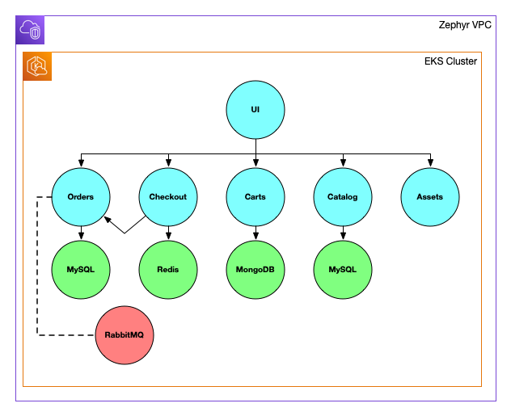

This is the first in a series of blog posts that explores how a fictional company---Zephyr Archaeotech Emporium---uses Pulumi to manage their online retail store. This post explores a couple common questions that users ask when working with Pulumi; specifically, where should I store my Pulumi code? And how do I support multiple environments with Pulumi? This post will provide some guidance and recommended practices around these topics, using Zephyr and their online store as the use case.<!--more-->

The ultimate goal of this series is to discuss recommended practices for using Pulumi to manage a fairly complex containerized application. However, it's important to note that these recommended practices will emerge over the course of the series---not all immediately, and not all in the beginning. This is a deliberate decision to allow you to see how Zephyr's use of Pulumi evolves as the company grows and their online retail store application changes to accommodate their growth.

Here are links to all the blog posts in the series:

* **IaC Recommended Practices: Code Organization and Stacks** (this post)
* [IaC Recommended Practices: Developer Stacks and Git Branches](/blog/iac-recommended-practices-developer-stacks-git-branches/)
* [IaC Recommended Practices: Structuring Pulumi Projects](/blog/iac-recommended-practices-structuring-pulumi-projects/)
* [IaC Recommended Practices: Using Stack References](/blog/iac-recommended-practices-using-stack-references/)
* [IaC Recommended Practices: RBAC and Security](/blog/iac-recommended-practices-rbac-and-security/)
* [IaC Recommended Practices: Using Automation API](/blog/iac-recommended-practices-using-automation-api/)
* [IaC Recommended Practices: Wrapping Up](/blog/iac-recommended-practices-wrapping-up)

## Setting up the scenario

Zephyr is short for Zephyr Archaeotech Emporium, the fictional company in our scenario. Zephyr is an online retailer that specializes in the sale of "rare arcane artifacts and replicas." Over the past few years, the company has experienced a significant increase in its online presence, making it easier for customers to purchase unique and mysterious items. Zephyr's collection includes a variety of rare and unusual objects that are difficult to find elsewhere, making it a popular destination for collectors, enthusiasts, and adventurers.

## Reviewing the application

Zephyr's application is the second generation of their online store. Their first generation was a monolith that they manually deployed. It was sufficient in Zephyr's early days, but as word about Zephyr spread and the volume of traffic to their online store increased, Zephyr found it increasingly difficult to deploy small, incremental changes to the store's code. As a result, the velocity of their development efforts slowed. In preparation for the next phase of their growth---driven by robust sales of arcane artifacts---Zephyr's team evaluated a number of different architectures that would enable them to increase development velocity and give them greater flexibility in scaling different aspects of their online store. In the end, they settled on a containerized architecture deployed to Kubernetes because some of the existing team was already familiar with these technologies.

Here's a diagram of their second-generation application architecture:

As you can see in the diagram, the application has been broken down into microservices. The UI service communicates with other backend services via HTTP APIs; the various backend services communicate with various databases like MySQL and Redis for data persistence and/or caching. The backend services are responsible for implementing the functionality of a typical e-commerce site like orders, checking out, and managing the inventory catalog. While the choice of Kubernetes does afford Zephyr some much-needed functionality---like the ability to easily scale different services within the application---it also brings with it an added level of complexity that did not exist with their previous monolithic architecture. The Kubernetes manifest to deploy their application tops out at just over 1,000 lines of YAML!

{}
Astute readers may note that Zephyr's application looks very similar to [this application](https://github.com/aws-containers/retail-store-sample-app/); in truth, this series uses a fork of the AWS Containers retail store example as the application in this fictional scenario. (Many thanks to the AWS Containers DA team for their hard work here!) This is an admittedly over-engineered application, but it does afford the opportunity to address a range of customer scenarios in this blog series.
{}

## Deploying the application with Pulumi

As part of the switch to their new architecture, Zephyr decided they wanted to use Pulumi to manage both the infrastructure and the application deployment. Why Pulumi? Zephyr’s team recognized that moving to microservices on Kubernetes was going to make it more difficult to create reproducible, consistent implementations of their application. Zephyr's team also knew that adopting infrastructure as code would help them with fast and repeatable deployments with little additional complexity. An added bonus was being able to use programming languages they already knew.

As they prepared to embark on using Pulumi, a couple of questions came up for the Zephyr team:

* **Where should they store their Pulumi code?** The ability for Zephyr's developers to use a full programming language to manage the infrastructure and deployment of their online store is a huge plus, but should this code go in the same repository as their application code? Or a different repository?
* **How do they address the need for multiple environments?** It's clear to the Zephyr development team that they'll need multiple instances of the online store (for things like testing, QA, or development). What's the best way to handle this when using Pulumi?

Let's examine each of these issues in a bit more detail, and see how Zephyr chose to proceed.

### Storing their Pulumi code

When it comes to answering the question of where to store Pulumi code relative to the application(s) it supports, there are two basic options:

1. **In the same repository as your application code:** This approach has the advantage of being simpler, but may not offer the necessary flexibility when dealing with multiple teams or varying levels of access control.
2. **In a separate repository from your application code:** Using a separate repository adds some complexity, but does provide greater flexibility to more easily address a variety of organizational requirements and varying levels of access control.

So which approach is best? That will depend on a number of different factors, many of which are outlined in the [organizing projects & stacks documentation](/docs/using-pulumi/organizing-projects-stacks/). Some other factors that users need to take into consideration include:

* Who is responsible for maintaining the code? If the application code and the Pulumi code are managed by different teams, then using separate repositories may be the best approach.
* What sort of access controls are needed? If the organization needs different access controls for the application code and the Pulumi code, then separate repositories are generally needed.
* What is the relationship between the infrastructure resources managed by Pulumi and the applications? If the infrastructure is "shared," meaning it is used by multiple applications, then keeping the Pulumi code in a separate repository may be preferred. If the infrastructure is dedicated to a specific application, then keeping the application code and the Pulumi code together may be preferred.
* What about CI/CD? If an organization will use CI/CD, that may affect how you organize your code. (This is something we'll delve into more deeply later in this series.)

It's worth stressing that the answers to these questions may change over time as organizations grow and their applications evolve. Addressing that change and its effects on an organization's Pulumi projects and stacks is something we'll be discussing later in this series.

{}
The discussion above is working from the assumption that Pulumi users will store their Pulumi code in a version control system, like Git. Strictly speaking, using a version control system isn't required for Pulumi to function (there is one exception we'll touch on later in this series when we discuss [Pulumi Deployments](https://www.pulumi.com/docs/pulumi-cloud/deployments/)), but we **very strongly** recommend that all users use Pulumi in conjunction with version control.
{}

In the case of Zephyr, their team felt like a monorepo approach (storing Pulumi code and application code together) was most appropriate for their specific requirements. Zephyr is a relatively small organization with a single team of developers that are responsible for managing both the cloud infrastructure as well as the development and deployment of the online store application. Zephyr's team also decicded to use a single Pulumi project---for now. (Be sure to follow this blog series to see how that evolves, and why!)

### Addressing the need for multiple environments

The second question Zephyr encountered is how to handle the need for multiple instances of their application. In addition to a production instance---which is the instance behind Zephyr's public-facing online store---Zephyr also felt they needed an environment for the developers to use in testing changes to the online store.

This use case---needing to have multiple, separate instances of the infrastructure and applications created by a single Pulumi program---is exactly what [Pulumi stacks](https://www.pulumi.com/docs/concepts/stack/) were designed to address. Each stack is a separate instance of the resources created by a Pulumi program within a project. Further, each stack has its own independent state, and each stack has its own configuration values. Stacks can be short-lived (meaning the associated resources are also short-lived), or stacks can be long-lived. Aside from the cloud resources created by the Pulumi program, stacks are lightweight and simple to create or delete.

Zephyr decided to initially start with two stacks: a production stack (named "prod") and a development stack (named "dev"). As you'll observe throughout this series, this is a decision that is easily adjusted over time as your organization's requirements change.

## Viewing the first iteration of Zephyr's code

You can view the first iteration of Zephyr's Pulumi and application code---the iteration that corresponds to the decisions described in this blog post---by navigating to [this GitHub repository](https://github.com/pulumi/zephyr-app/). From the branch/tag dropdown, switch from the `main` branch to viewing the [`blog/original`](https://github.com/pulumi/zephyr-app/tree/blog/original/) branch.

From that GitHub repository, you can also choose to deploy the Pulumi code yourself. Full instructions for deploying the code are found in the repository.

## Summarizing recommended practices

This article introduced you to Zephyr, the fictional company for this blog series, and reviewed the application architecture for Zephyr's online store (a containerized application running on Kubernetes). Throughout the blog series, this application serves as the use case around which various recommended practices are discussed.

In this post the following recommended practices were covered:

1. **Use version control for your Pulumi code.** Although it isn't strictly required in many cases, a number of the benefits of adopting infrastructure as code are lost without the use of version control.
2. **Place your Pulumi code into version control repositories in a way that aligns with organizational requirements.** There is no "right" or "wrong" approach; choose the approach that enables you to satisfy your organization's requirements around access control, code/repo ownership, and other organizational requirements.
3. **Leverage Pulumi stacks to create multiple instances of cloud resources with a single Pulumi program.** Pulumi stacks were created to address the need for organizations to create multiple instances of cloud resources, each with its own state and its own set of configuration data, from a single Pulumi program.

For now, Zephyr has decided to go with a monorepo approach---a single repository that contains both their application code and the Pulumi code to manage the infrastructure resources. All of the resources are defined in a single Pulumi project, with multiple stacks that correspond to development and production environments. Over the course of this series, we'll see how Zephyr's use of Pulumi changes as Zephyr grows and their application evolves.

The next Zephyr blog post will examine how the Zephyr team adjusts their use of stacks and Git branches to support developer productivity. Stay tuned!
