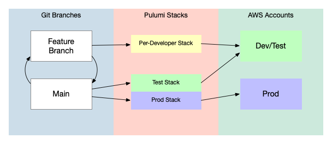

In the [first post](/blog/iac-recommended-practices-code-organization-and-stacks/) of this series, we introduced Zephyr, a fictional company that uses Pulumi to manage its online retail store. Following on from that post, which discusses code organization and stacks, this post explores two more questions users frequently ask when working with Pulumi in teams --- namely, How can I best enable multiple developers to collaborate on a Pulumi project? And how can I use Git and Git branching to support this kind of collaboration? In this post, we'll provide some guidance and recommended practices around these topics, using Zephyr and its online store as the use case.

The ultimate goal of this series is to discuss recommended practices for using Pulumi to manage a fairly complex containerized application. However, it's important to note that these recommended practices will emerge over the course of the series --- not all immediately, and not all in the beginning. This is a deliberate decision to allow you to see how Zephyr's use of Pulumi evolves as the company grows and its retail application changes to accommodate its growth.

Here are links to all of the posts in the series:

* [IaC Recommended Practices: Code Organization and Stacks](/blog/iac-recommended-practices-code-organization-and-stacks/)
* **IaC Recommended Practices: Developer Stacks and Git Branches** (this post)
* [IaC Recommended Practices: Structuring Pulumi Projects](/blog/iac-recommended-practices-structuring-pulumi-projects/)
* [IaC Recommended Practices: Using Stack References](/blog/iac-recommended-practices-using-stack-references/)
* [IaC Recommended Practices: RBAC and Security](/blog/iac-recommended-practices-rbac-and-security/)
* [IaC Recommended Practices: Using Automation API](/blog/iac-recommended-practices-using-automation-api/)
* [IaC Recommended Practices: Wrapping Up](/blog/iac-recommended-practices-wrapping-up)

## Catching up with Team Zephyr

When we [last met up](/blog/iac-recommended-practices-code-organization-and-stacks/) with the Zephyr team, they were off and running, managing their newly refactored online store, Zephyr Archaeotech Emporium, with a single Pulumi [project](/docs/concepts/projects/) and two Pulumi [stacks](/docs/concepts/stack/) --- one for development (`dev`) and another for production (`prod`). The team had chosen to use one Git repository (a monorepo) to manage the code for the online store and its infrastructure after refactoring the store into a set of containerized microservices deployed with Kubernetes on [Amazon EKS](https://docs.aws.amazon.com/eks/latest/userguide/what-is-eks.html).

{}
For a snapshot of the code as it was at the end of the first post in the series, see the [`blog/original`](https://github.com/pulumi/zephyr-app/tree/blog/original) branch of the [`pulumi/zepyhr-app`](https://github.com/pulumi/zephyr-app) repository on GitHub.
{}

Up to now, the two-stack approach has worked well for the team. It's allowed them to focus on building new features, integrating those features into the shared `dev` environment by developing and testing locally (which we'll cover in a future post) and merging their [feature branches](https://www.atlassian.com/git/tutorials/comparing-workflows/feature-branch-workflow) regularly into the base branch, `main`, using standard GitHub pull-request workflows. Around once a day, as the team's changes are merged into `main`, the team lead (and original author of the Pulumi program) deploys them into the `dev` environment with Pulumi with the following commands:

```bash
git pull origin main
cd infra
pulumi stack select zephyr/dev
pulumi up
```

This builds new container images for any services whose code has changed since the last stack update, pushes those images to [Amazon ECR](https://docs.aws.amazon.com/AmazonECR/latest/userguide/what-is-ecr.html), and updates the EKS cluster to deploy the services automatically.

Then, around once a week, as new features are ready for customers, the team lead deploys the `main` branch of the repository into production similarly:

```bash
git pull origin main
cd infra
pulumi stack select zephyr/prod
pulumi up
```

The deployment process is still a bit more manual than the team would like --- but since updates typically take only a few minutes, the team lead is generally satisfied with the status quo.

A few more details worth noting out about Team Zephyr's current setup:

* Both of the project's stack-configuration files, `Pulumi.dev.yaml` and `Pulumi.prod.yaml`, are checked into version control. This is safe and considered good practice (even with [secrets](https://www.pulumi.com/docs/concepts/secrets/)) because it allows the team to review or change the configuration of a given stack easily by viewing or editing the code in each file.

* The `main` branch is the only long-lived branch in the repository; all others (e.g., developers' feature branches) are deleted once they're merged into `main`.

* Thanks to this workflow, the application deployed into the `dev` environment tracks closely with the latest code in the `main` branch. As such, the `dev` stack serves as a kind of pre-prod or integration environment that not only allows the team to dogfood new features as they're added, but also to catch bugs or other regressions before they escape into production. When things do go wrong, the team can review the list of recent stack updates to identify the source of the defect and get it fixed.

* Zephyr is using the Pulumi Service backend with a single organization (that everyone on the team belongs to) and separate AWS accounts for the `dev` and `prod` environments. Everyone on the team has read/write access to the AWS account used for development, but only the team lead has access to the AWS account used for production.

## First growing pains

Life for Team Zephyr was good --- for a while.

Then one day during a particularly active sprint, a developer who'd started working on an improvement to the checkout process realized it might benefit from an updated version of Redis, which appeared to be presently [pinned at 6.0 in the Pulumi program](https://github.com/pulumi/zephyr-app/blob/e61b5b02b0eebe14782fba8ee0343952353c9fd0/infra/index.ts#L1045):

```typescript
// ...
const checkoutRedisDeployment = new k8s.apps.v1.Deployment("checkout-redis-deployment", {
    spec: {
        template: {
            spec: {
                containers: [{
                    image: "redis:6.0-alpine",
                    // ...
```

A quick glance at the `dev` and `prod` stacks in the Pulumi Service confirmed this was the case.

After a quick spike to validate the enhancement locally, the developer felt confident that a Redis upgrade was the way to go --- but since the deployed version of Redis would ultimately dictate the code that'd have to be written to finish the feature for real, they couldn't really be sure without testing the theory with a full deployment. What they really wanted was to be able to deploy a Redis upgrade, along with the associated code changes, into an AWS environment as much like production as possible --- the `dev` environment, say --- without having to go through the process of making a pull request, getting it merged, and waiting for the team lead to deploy the `dev` stack only to realize later that the change didn't actually work as expected, and be forced to revert.

In situations like these, it can be tempting to suggest that the developer simply pick up and use the `dev` stack --- especially on small, fast-moving teams like Zephyr's where everyone already has access to the Pulumi stack and the shared cloud environment. Indeed, Pulumi makes this sort of thing easy: to deploy their local changes into the `dev` environment, our developer need only check out their feature branch, select the `dev` stack, run `pulumi up`, and then wait a few moments for the changes to be deployed:

```bash
cd infra
pulumi stack select zephyr/dev
pulumi up
```

This approach definitely works --- but it presents at least a few problems:

1. The team would lose all of the practical benefits of having the `dev` stack track closely with the latest content in `main`.

2. The team lead's deployment of `main` into `dev` later that day would overwrite the developer's own feature-branch deployment. There's a good chance the lead would notice the diff of the deployment preview and deduce that someone else on the team had possibly deployed into `dev` out of band:

    ```diff
      kubernetes:apps/v1:Deployment (create):
      spec: {
          template: {
              spec: {
                  containers: [
                      [0]: {
    -                     image: "redis:6.0-alpine"
    +                     image: "redis:7.0-alpine"
                          ...
                      }
                  ]
              }
          }
      }
      ...
    ```

    But if they didn't, the developer's ad-hoc deployment would be lost. At best, it'd force both team members to drop what they were doing and get in touch to figure out what to do next. At worst, it could lead to confusion and the potential for shipping untested code.

3. In addition to raising the risk of developers overwriting each other's work, active collaboration the same stack increases the likelihood of deployment conflicts. On the one hand, this is a good thing in that Pulumi prevents same-stack updates from running concurrently:

    ```
    $ pulumi up
    error: [409] Conflict: Another update is currently in progress.
    ```

    But on the other, it's a not-so-good thing in that it's a reduction in development velocity: The update that can't run because another update is in progress is an update that will have to wait until sometime later. The more often this happens, the longer it ultimately takes for the team to get the validation it needs to keep moving forward.

So facing these issues, what should the Zephyr team do? The `dev` stack had originally been created for rapid development --- and that worked well, when there was only one developer working on infrastructure. With several, however, things clearly get complicated. Should the team be using a `dev` stack at all? If so, how? And if not, what should they be doing instead?

## Stepping back to reassess

With what we've learned so far, we can return to the questions we raised at the beginning of this post and begin to sketch out a few recommendations for Team Zephyr. Those questions, again, were:

* **How can I best enable multiple developers to collaborate on a Pulumi project?** For Zephyr, an ideal answer to this question would give every member of the team the ability to iterate on both application and infrastructure code concurrently, deploying as often as needed without having to worry about disrupting the work or the velocity of anyone else on the team.

* **How can I use Git and Git branching to support this collaboration?** So far, the feature-branch/pull-request workflow has been serving the Zephyr team well. Should they continue on the same path, merging frequently to `main` and deploying to `dev` and `prod` from there? Or is there some alternative workflow that might serve the team better, either now or at some time in the future?

Let's answer these questions now by taking a look at how the Zephyr team handled them.

### Using developer stacks

We've seen a few ways that having multiple developers share a single stack for ad-hoc deployment can lead to various problems. But we've also seen at least one situation in which being able to run ad-hoc deployments --- without the risk of colliding with existing environments --- can be quite valuable. In fact there are many reasons you might want to do this --- and fortunately Pulumi makes it quite easy to do so.

The recommended practice is to allow developers to create and manage their own Pulumi stacks. In this workflow, developers working on feature branches are able to iterate freely on both application and infrastructure, deploying as often as necessary into a shared cloud environment (typically a sandbox environment, isolated from production) and destroying cloud infrastructure when it's no longer needed.

For the developer, the typical workflow looks something like this:

1. Check out a new feature branch
2. Make changes to application and/or infrastructure code
3. Select your personal developer stack with `pulumi stack select`
4. Deploy your stack into your team's shared cloud environment with `pulumi up`
5. Commit your code and submit a pull request, optionally including a link either to the Pulumi update (e.g., when using the Pulumi Service) or to certain key resources belonging to the stack --- for example, an application's primary HTTP endpoint

The benefits of a workflow like this one are many:

* No more resource-naming collisions. Because Pulumi names cloud resources [uniquely by default](/docs/concepts/resources/names/#autonaming), no two stacks will ever produce cloud resources with the same names.
* No more deployment conflicts. When every developer has a stack of their own, they can deploy to the sandboxed environment as often as necessary, without having to wait for another deployment to finish first.
* Everyone on the team has their own production-like environment to use for end-to-end testing.



For Zephyr, the quickest path to adopting this workflow was to use the `dev` stack as a foundation for new developer stacks. To do that, team members simply ran the following Pulumi commands:

```bash
pulumi stack init zephyr/developer-name --copy-config-from zephyr/dev
pulumi up
```

Developer stacks are considered ephemeral, so they're torn down with `pulumi destroy` when not in use in order to cut down on cost. Stack configuration files (e.g., `Pulumi.developer-name.yaml`) are checked into version control and stored alongside other stacks like `Pulumi.dev.yaml` and `Pulumi.prod.yaml`.

### Keeping feature-branch workflows

We've also seen that the Zephyr team's existing Git workflow (short-lived feature branches merged frequently into a long-lived base branch) has worked well for them --- and it turns out this workflow also works well when combined with the use of developer stacks.

For example, after creating and deploying a new stack to validate and test the proposed Redis upgrade, our Zephyr developer simply included a link to the application (deployed with their dev stack) in the associated GitHub pull request. Reviewers were then able to follow the link to the online store to see the effects of the shopping-cart change firsthand, which meant they were able to approve and get the change merged quickly and confidently knowing it'd work when deployed into production.

### Naming stacks clearly

Lastly, having adopted the use of developer stacks, the Zephyr team realized the name "dev" probably didn't work quite as well as it once had for the `dev` stack. Since the stack and its long-running deployment had essentially been serving (and continued to serve) as an environment for testing changes before releasing them into production, the team decided to rename the `dev` stack `test` instead. To do that, they simply ran:

```bash
pulumi stack select zephyr/dev
pulumi stack rename zephyr/test
```

## Viewing the second iteration of Zephyr's code

You can view the second iteration of Zephyr's Pulumi and application code --- the iteration that corresponds to the decisions described in this blog post --- by navigating to [this GitHub repository](https://github.com/pulumi/zephyr-app/). From the branch/tag dropdown, switch from the `main` branch to the [`blog/dev-stacks`](https://github.com/pulumi/zephyr-app/tree/blog/dev-stacks) branch.

From that GitHub repository, you can also choose to deploy the Pulumi code yourself. Full instructions for deploying the code are found in the repository.

## Summarizing recommended practices

In this post, we covered several new recommended practices for working collaboratively with Pulumi, all aimed at optimizing for high team and developer velocity:

* **Use short-lived feature branches** and merge them frequently into a single base branch.
* **Deploy the base branch regularly into a long-running pre-prod environment** to continuously test the integration of the components of the system.
* **Enable developers to create and use dev stacks of their own** as sandboxes for development, testing, and collaboration.
* **Name your stacks clearly** and in alignment with the environments they deploy into --- `test`, `staging`, `production`, etc.

The next Zephyr blog post will dive into how the Zephyr team structures their Pulumi projects. Stay tuned!
