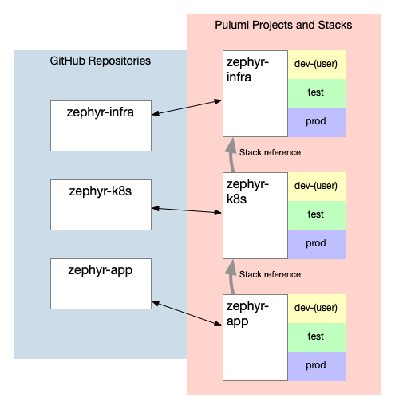

This post continues our series of blog posts focused on IaC recommended practices. In earlier posts, we introduced Zephyr Archaeotech Emporium, the fictional company that sits at the center of this series, and discussed Zephyr's primary use case for Pulumi: managing their online retail store. You read how Zephyr's initial use of Pulumi changed to incorporate the use of short-lived per-developer stacks. Later, as Zephyr continued to grow, you saw how Zephyr restructured their Pulumi projects and stacks, and incorporated the use of Stack References. This post is a complement to the post on structuring Pulumi projects, concentrating on the use of role-based access control (RBAC) and security in Zephyr's multi-project configuration.<!--more-->

The ultimate goal of this series is to discuss recommended practices for using Pulumi to manage a fairly complex containerized application. You've seen these recommended practices emerge over the course of the series---not all immediately, and not all right away. Structuring the blog series in this way is a deliberate decision; many recommended practices are "point in time" recommendations: they are context-dependent and the recommendations for any given company, like Zephyr, may change as the company and its needs change.

For ease of navigation, here are links to all the blog posts in the series (any entries listed below that aren't linked haven't yet been published; this list will get updated as new posts go live):

* [IaC Recommended Practices: Code Organization and Stacks](/blog/iac-recommended-practices-code-organization-and-stacks/)
* [IaC Recommended Practices: Developer Stacks and Git Branches](/blog/iac-recommended-practices-developer-stacks-git-branches/)
* [IaC Recommended Practices: Structuring Pulumi Projects](/blog/iac-recommended-practices-structuring-pulumi-projects/)
* [IaC Recommended Practices: Using Stack References](/blog/iac-recommended-practices-using-stack-references/)
* **IaC Recommended Practices: RBAC and Security (the post you're reading)**
* [IaC Recommended Practices: Using Automation API](/blog/iac-recommended-practices-using-automation-api/)
* IaC Recommended Practices: Adding Pulumi Deployments
* IaC Recommended Practices: Refactoring for Reuse

## Recapping what's happened so far

So far, you've read about how Zephyr started out with a single project and a single Git repository. Adding short-lived per-developer stacks, as described in the post on [recommended practices for developer stacks and Git branches](/blog/iac-recommended-practices-developer-stacks-git-branches/), didn't really impact this structure. However, as the company grew, Zephyr's project and Git repository structure evolved into its current form:

* The "zephyr-infra" project handles base infrastructure (VPC and related constructs).
* The "zephyr-k8s" project automates the Kubernetes platform layer, building atop the base infrastructure components supplied by the "zephyr-infra" project.
* Finally, the "zephyr-app" project handles the deployment of the online retail store application onto Kubernetes, layering on top of the platform provided by the "zephyr-k8s" project.

You can review the reasons for this structure in the post on [recommended practices for structuring Pulumi projects](/blog/iac-recommended-practices-structuring-pulumi-projects/). One of the reasons listed in the third Zephyr blog post was security:

> ...security is a factor that affects how projects and stacks should be structured. In Zephyr's case, the ability for one team to affect another team's resources was present when everything was a single project. With multiple projects, Zephyr can use stack permissions and role-based access control (RBAC) in Pulumi Cloud to appropriately control _who_ can affect _what_.

The last part of that quote---the part about being able to "appropriately control _who_ can affect _what_"---is another way of describing what's known as [the principle of least privilege](https://en.wikipedia.org/wiki/Principle_of_least_privilege). If you're unfamiliar with this term, we recommend following the link and getting more information, because the principle of least privilege stands at the core of all the recommended practices you'll read in this post.

{}
Pulumi supports a number of self-managed backends, including Amazon S3 (and S3-compatible servers like Minio or Ceph), Azure Blob Storage, and Google Cloud Storage. The RBAC functionality described in this post applies only to the managed Pulumi Cloud backend.
{}

## Understanding the RBAC building blocks in Pulumi Cloud

To understand how to secure your Pulumi projects and stacks in Pulumi Cloud, it is important to first explain the basic building blocks you'll use:

* _Organization:_ An organization represents a customer/company within Pulumi Cloud. Generally speaking, a single company like Zephyr is represented by a single organization.
* _Member:_ Each member represents a user account that is part of an organization. In Zephyr's case, each Zephyr employee that needs to interact with Pulumi is a member of Zephyr's organization in Pulumi Cloud.
* _Team:_ A team is a grouping of members, and is the primary component involved in assigning per-stack permissions in Pulumi Cloud's RBAC model. How you structure teams within your organization will depend on a great many different factors we'll explore in this post.
* _Stack:_ A stack is a separate instance of the resources created by a Pulumi program within a project. Each stack has its own independent state and its own configuration values. With respect to RBAC, each stack is a separate entity to which one or more teams can be granted permission. In Zephyr's case, there is a long-lived production stack for each of the separate projects, and a persistent (or long-lived) test stack for each of the separate projects. There are also the per-developer stacks, which are typically short-lived.

This diagram, also used in the post on [recommended practices for stack references](/blog/iac-recommended-practices-using-stack-references/), shows the stacks and projects for Zephyr's online store:

Now, how are these different components assembled together? At its most basic level, you would use teams to group members together, and then assign stack permissions to the team. This diagram helps illustrate the idea:

A couple of important points emerge from the above diagram:

1. The relationship between stacks and teams is _many-to-many_. That is, any given stack can have many teams assigned permissions, and any given team may be assigned permissions to many stacks.
2. Similarly, the relationship between teams and members is also _many-to-many_ (any given team can---and almost always will---have multiple members, and any given member can be part of multiple teams at the same time).

## Assembling security for your stacks

The first, and perhaps the most important, recommended practice with regards to securing your stacks is **to actually use Pulumi Cloud's RBAC functionality**. While this may seem obvious, there are practical implications to this statement that are useful to explore.

Pulumi Cloud has the ability to set a _default stack permission_ for all members of an organization. In the screenshot below, you can see that the default permission has been set to Write:

In this configuration, you are effectively disabling Pulumi Cloud's RBAC functionality. Permissions in Pulumi Cloud are _additive_; that is, permissions only state what you can do, not what you can't do. Therefore, if the default stack permission is set to Write, then assigning a team read-only permissions to a stack has no effect---because members of that team can read from the stack (by virtue of their inclusion in a team) _and_ can write to the stack (by virtue of the default stack permission). The team members' read-only permission is _added_ to the default stack permission for their effective permission.

For this reason, Pulumi recommends **setting the default stack permission to Read or None.** Setting it to Read means that all members of the organization can see and read from stacks that aren't their own, but can't change or modify the others stacks. Setting it to None means that members have permissions to their own stacks by default---gaining any form of access to stacks other than their own requires being added to a team that has permissions to those stacks.

When it comes to assigning a team access to a stack, there are three options:

* Stack reader (read-only access; also called "Stack reader access" in some areas of the Pulumi Cloud UI)
* Stack editor (read/write access, but can't delete the stack; also called "Stack write access" in the Pulumi Cloud UI)
* Stack admin (full access; you may also see it called "Stack admin access")

{}
When the "Allow organization members to create stacks and transfer stacks to this organization" is checked, like in the screenshot above, then the user (organization member) that creates a stack automatically becomes the stack admin for that stack. The user's ability to delete the stack, however, is affected by the "Allow stack admins to delete stacks" setting.
{}

Full details on what each of these permissions grants is detailed in [the projects and stacks documentation](/docs/pulumi-cloud/projects-and-stacks/) (see the "Stack Permissions" section). In accordance with the principle of least privilege, Pulumi recommends you **grant the minimum level of access necessary** in order for a user (organization member) to meet their job responsibilities. You accomplish this by adding the member to a team, and then granting the team the minimum level of necessary access. _You can't assign stack permissions directly to users._

Because team membership is central to the use of stack permissions, Pulumi has several ways to make it easier to manage the relationship between teams and stacks:

1. You can use the Pulumi Cloud user interface to assign a team access to a stack.
2. You can use Pulumi Cloud's REST API to control team access to stacks.
3. You can use the Pulumi Cloud provider for Pulumi to programmatically manage team access to a stack using Pulumi itself.
4. You can use the `--teams` flag to `pulumi stack init` to assign stack editor access to one or more teams when you create the stack.

In general, Pulumi recommends **declaratively managing your Pulumi Cloud RBAC configuration** with the Pulumi Cloud provider (formerly known as the Pulumi Service provider), unless you have specific requirements that would prevent it. However, be aware that the Pulumi Cloud provider doesn't allow you to change a member's role in an organization (every member is either a "member" or an "admin" within an organization); that would have to be done via the Pulumi Cloud user interface or REST API.

Pulumi also recommends **using the `--teams` flag with `pulumi stack init` to ensure that new stacks are properly assigned team permissions upon creation.** You can then go back and fine-tune those team permissions---which are set to "Stack editor" or "Stack write access" when you use the `--teams` flag---using a Pulumi program with the Pulumi Cloud provider. Alternately, teams can use a team access token when creating a new stack, and that will also grant the team permission to the newly-created stack.

Finally, Pulumi recommends **allowing users to create their own stacks.** Otherwise, only an organization admin would be allowed to create new stacks, and this is likely to cause a bottleneck in provisioning cloud infrastructure---one of the very issues that infrastructure as code tools like Pulumi are attempting to solve! (It may be necessary in some cases to restrict this functionality, such as in certain highly regulated industries or verticals.) Preventing users from creating their own stacks would also prevent the use of per-developer stacks like Zephyr uses, which as you've seen can be enormously helpful in accelerating development and deployment velocity.

## Inspecting Zephyr's implementation

Zephyr's RBAC implementation in Pulumi Cloud is represented in part by a diagram that you also saw earlier in this post:

Zephyr set the organization default stack permission to Read. This enabled teams to read all stacks, and enabled the continued use of stack references without any additional configuration. Teams were created to grant "Stack editor" (also called "Stack write access") to stacks based on the overall organizational structure of the company. Thus, the Platform team gained access to the non-production `zephyr-infra` and `zephyr-k8s` stacks, while the Application team was given access to the non-production `zephyr-app` stacks. However, only members of the Production team were given access to the production stacks in all three projects, ensuring that access to update those stacks---and thus the actual resources running Zephyr's online store---remained relatively controlled.

## Summarizing recommended practices

The post covered the following recommended practices for securing your stacks in Pulumi Cloud:

* **Use Pulumi Cloud's RBAC functionality by setting your organization's default stack permissions to Read or None.** This is generally the safest way to implement the principle of least privilege, unless you have a good use case for allowing all organization members full write access to all stacks.
* When assigning team permissions, **grant the minimum level of access necessary.** If a user isn't responsible for making updates to a stack, then give that user stack reader permission through a team membership (remember that you can't assign stack permissions directly to organization members, you have to use a team). Keep in mind, though: if the organization level stack permission has been set to Read, then members already have the equivalent of stack reader permissions on all stacks, so creating a team to grant stack reader permission is unnecessary and superfluous.
* **Declaratively manage your Pulumi Cloud RBAC configuration** where possible using the Pulumi Cloud provider from within a Pulumi program.
* **Use the `--teams` flag with `pulumi stack init` to ensure that teams have stack permissions upon stack creation.** You can also use a team acess token to accomplish the same result.
* **Allow users to create their own stacks.** Generally, turning this functionality off (found in the Settings &gt; Access Management screen of Pulumi Cloud) will end up creating a bottleneck, as only organization admins would be allowed to create new stacks.

In the next IaC Recommended Practices post, the focus is on [Automation API](/automation/). Stay tuned to see how Zephyr uses Automation API to further streamline and automate the deployment of their cloud resources!
