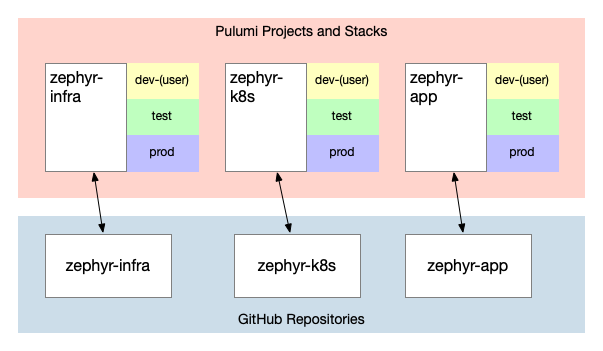

This is the third post in a series of blog posts focused on Zephyr Archaeotech Emporium---our fictional company---and their use of Pulumi to manage their online retail store. In the first post, you saw how Zephyr initially decided to go with a single Pulumi project for managing deployments of their online retail store application. In this post, you'll see how Zephyr's use of Pulumi changes as their company grows and evolves.<!--more-->

The [first blog post](/blog/iac-recommended-practices-code-organization-and-stacks/) in the Zephyr series specifically mentions that the series will show "how Zephyr's use of Pulumi evolves as the company grows and their online retail store application changes to accommodate their growth." While the ultimate goal of this series is to discuss recommended practices for using Pulumi to manage a fairly complex containerized application, it's important to note that many recommended practices are "point in time" recommendations: best practices are context-dependent and the recommended practices for a given organization will change as the company and its infrastructure needs also change. This blog post is an example of that evolution in action: the practices that worked well for Zephyr while they were smaller and had smaller infrastructure and less teams working on that infrastructure are no longer ideal as the company has grown.

Here are links to all the blog posts in the series (entries below that are not linked are planned but haven't yet been published---this will get updated as new posts are published):

* [IaC Recommended Practices: Code Organization and Stacks](/blog/iac-recommended-practices-code-organization-and-stacks/)
* [IaC Recommended Practices: Developer Stacks and Git Branches](/blog/iac-recommended-practices-developer-stacks-git-branches/)
* **IaC Recommended Practices: Structuring Pulumi Projects** (this post)
* [IaC Recommended Practices: Using Stack References](/blog/iac-recommended-practices-using-stack-references/)
* [IaC Recommended Practices: RBAC and Security](/blog/iac-recommended-practices-rbac-and-security/)
* [IaC Recommended Practices: Using Automation API](/blog/iac-recommended-practices-using-automation-api/)
* IaC Recommended Practices: Adding Pulumi Deployments
* IaC Recommended Practices: Refactoring for Reuse

## Catching up with Zephyr

As a result of launching its online presence, Zephyr saw amazing success. The market for arcane artifacts and novel curiosities is booming, and Zephyr is becoming a leader in this market. Funded by this success, Zephyr has grown rapidly. Along with this growth, Zephyr's software engineering and IT teams also grew and expanded. Fortunately, Zephyr's [use of per-developer stacks with short-lived ephemeral Git branches](/blog/iac-recommended-practices-developer-stacks-git-branches/) positioned the development teams well for this growth.

{}
For a look at the state of Zephyr's Pulumi code as it stood as of the end of the second post in the series, see the [`blog/dev-stacks`](https://github.com/pulumi/zephyr-app/tree/blog/dev-stacks) branch of the [`pulumi/zephyr-app`](https://github.com/pulumi/zephyr-app) repository on GitHub.
{}

Naturally this growth has resulted in some separation of duties. The IT team now has responsibility for the infrastructure that supports the online retail store. Within that team, some team members are focused on "core" infrastructure, while other team members are focused only on Kubernetes (a natural decision given Zephyr's use of Kubernetes in their architecture). The application team continues to remain responsible for the online store application itself.

This left Zephyr again asking some questions about the best path forward:

* **Should they use a single project, or multiple projects?** Zephyr had used a single Pulumi project up until now, but growth and organizational change meant they wanted to make sure they were using Pulumi in a way that best reflected their needs. What are the advantages and disadvantages of each approach?
* **If multiple projects, how many projects?** What's the best way to determine how many projects are needed? What factors play a role in this decision?

## Structuring Pulumi projects

One project, or multiple projects? And if multiple projects, how many projects? These are the core questions the Zephyr needed to resolve. In the end, there are a number of key factors that determine the answers to these questions:

* **Use case:** Zephyr has only a single application (so far!), but in situations where there are multiple applications then keeping those applications (and sometimes their associated infrastructure, depending on other factors) in separate Pulumi projects is generally recommended. In some ways, "use case" is an aggregation of other factors---a new application with a distinct set of resources that do not share a lifecycle with existing resources and are potentially managed by a different team.
* **Company/department/team structure:** How a company/department/team is organized should certainly be taken into account when structuring your Pulumi projects. In Zephyr's early days with Pulumi, a single team managed everything so a single project was fine. Now with multiple teams, Zephyr will likely find using multiple projects to be more effective.
* **Security:** Closely related to the previous bullet, security is a factor that affects how projects and stacks should be structured. In Zephyr's case, the ability for one team to affect another team's resources was present when everything was a single project. With multiple projects, Zephyr can use stack permissions and role-based access control (RBAC) in Pulumi Cloud to appropriately control _who_ can affect _what_. (The IaC Recommended Practices blog post [on RBAC and security](/blog/iac-recommended-practices-rbac-and-security/) discusses this topic in more detail.)
* **The relationship between resources:** The relationships between resources---such as which resources are dependent upon other resources---is another factor that feeds into your Pulumi project structure. A "shared infrastructure layer" is often best handled in a separate project of its own, but may pull in resources that might otherwise have been kept with an application in its own project. (In some respects, this is a "counter-balance" to the first bullet point.) On the other hand, resources that belong exclusively to a specific application or function might be best bundled in the same Pulumi project.
* **Resource lifecycle:** Do resources have a shared lifecycle, meaning they are always created, updated, or deleted together? If so, then those resources should be placed in the same project. If the resources do have a shared lifecycle, then placing them in the same project simplifies lifecycle management. A great example of resources with a shared lifecycle would be a Kubernetes Deployment and the associated Kubernetes Service.
* **Change rate of resources:** Some resources may change very infrequently. Consider the example of an AWS VPC and associated objects. Once it is created, it may not change for extended periods of time, if ever. On the other hand, some resources may change frequently (in other words, these resources have a high change rate). A fast-moving software development team may revise the Kubernetes Deployment regularly to pull in a new container image with updated code. In a single project, combining resources that have a high change rate with resources that have a low change rate may be suboptimal.
* **Blast radius:** Finally, there is the consideration of what happens in the event of human error, and limiting the "blast radius." With a single project, _all_ the resources in that project are within the blast radius---all of them could potentially be affected in the event of human error. Using separate Pulumi projects can limit the blast radius. It's not something that should drive the decision all by itself, but it _is_ a factor to be considered.

Now that you have an idea of some of the factors that affect how users structure their Pulumi projects, what are the advantages and disadvantages of each approach?

For single projects, the key advantage is _simplicity._ There's no denying that a single project is simpler and less complex than working with multiple projects. This advantage, though, is also the key disadvantage. A single project does not afford the flexibility to let different teams manage different aspects of the infrastructure, for example, nor does it offer the ability to split resources that don't have a shared lifecycle. And, as mentioned earlier, blast radius is a concern.

For multiple projects, the key advantage is _flexibility._ It's true that the added flexibility comes at the cost of some added complexity (a future post will explore one aspect of that added complexity in the form of StackReferences). However, you gain the ability to separate infrastructure resources according to team ownership/responsibility, relationship to other resources (i.e., grouping resources in a "shared infrastructure layer"), or any of the other dimensions mentioned above.

In some ways, the decision points for single vs. multiple projects are analogous to the decision points for monolith vs. microservice: independent scaling and flexibility versus simplicity.

_In general, most customers end up using multiple Pulumi projects per use case._ As you've seen, though, there are a number of factors that influence that decision and will affect how many projects end up in use.

## Moving forward with Zephyr

Zephyr had a number of factors in play, not the least of which was the organizational change resulting from their growth and success. In the end, Zephyr decided to restructure their use of Pulumi for the online retail store into three separate projects:

* An infrastructure project: This project handled the AWS VPC and related infrastructure resources.
* A platform project: This project managed the Kubernetes cluster(s).
* An application project: This project handled the actual online retail store itself.

{}
You can use a combination of code refactoring and `pulumi import` to assist in the process of restructuring Pulumi projects, but it some cases it may be easier to create new infrastructure and migrate over to it.
{}

In [the first Zephyr post](/blog/iac-recommended-practices-code-organization-and-stacks/), you read about some of the options for where to store Pulumi code relative to the applications it supports. At that time, Zephyr had decided to go with what's called a monorepo approach, meaning that the Pulumi code was stored in the same repository as the application code. In conjunction with the project reorganization, Zephyr also decided to change how their code was organized:

* Code for the infrastructure project moved to a separate "zephyr-infra" repository
* A new "zephyr-k8s" repository housed the code for the platform project
* The code for the online retail store application itself remained in the same "zephyr-app" repository

Note that relocating code (to a different GitHub repository or different filesystem location within a repository) generally has no impact on Pulumi. As long as the project name and stack name do not change, then changing the filesystem location won't affect anything---keeping in mind, of course, that filesystem paths and such may need to be adjusted in code to account for any such changes.

After restructuring their projects, Zephyr's arrangement of Pulumi projects and stacks, along with their associated GitHub repositories, looks something like this:

These repositories are available for you to review on GitHub ([zephyr-infra](https://github.com/pulumi/zephyr-infra), [zephyr-k8s](https://github.com/pulumi/zephyr-k8s), and [zephyr-app](https://github.com/pulumi/zephyr-app)); use the branch/tag selector to find the `blog/multi-project` branch in each repository to see the state of the code as of this blog post. Be aware that the process for standing up the Zephyr online store is now a bit more complex; check the instructions in each repository for more details if you'd like to give these projects a spin.

## Summarizing recommended practices

This post covered the following recommended practices for working with Pulumi:

* **Use multiple Pulumi projects** when you need the added flexibility that multiple Pulumi projects offer.
* **Align your Pulumi projects** according to external factors like company/department/team structure, resource dependencies, lifecycle, and use case/application.
* **Change the filesystem location** for Pulumi code as needed without impacting the resources managed by that code, as long as the Pulumi project name and stack name don't change.

The next post will focus on some specific technical details related to Zephyr's project reorganization; specifically, how they used StackReferences to share information between their Pulumi projects. Stay tuned!
