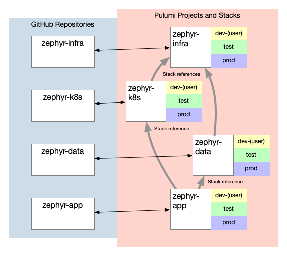

Welcome to the sixth post in our series of blog posts focused on infrastructure as code (IaC) recommended practices. So far in this series, you've seen how Zephyr Archaeotech Emporium---the fictional company at the center of this series---uses Pulumi to manage their online retail store. You read how Zephyr's initial use of Pulumi changed to use short-lived per-developer stacks. Later, as Zephyr continued to grow, you saw how Zephyr restructured their Pulumi projects and stacks, incorporated Stack References, and used Pulumi Cloud's role-based access control (RBAC) functionality to control access to their stacks. This post focuses on how Zephyr takes advantage of the [Pulumi Automation API](/docs/using-pulumi/automation-api/concepts-terminology) to bring an even greater level of orchestration to the stacks that represent their online store.<!--more-->

The ultimate goal of this series is to discuss recommended practices for using Pulumi to manage a fairly complex containerized application. These practices have unfolded organically, as a direct response to Zephyr's evolving needs. The aim is to demonstrate that recommended practices (or best practices) are not set in stone, but are rather "point in time" recommendations that adapt as your company grows.

For ease of navigation, here are links to all the posts in the series:

* [IaC Recommended Practices: Code Organization and Stacks](/blog/iac-recommended-practices-code-organization-and-stacks/)
* [IaC Recommended Practices: Developer Stacks and Git Branches](/blog/iac-recommended-practices-developer-stacks-git-branches/)
* [IaC Recommended Practices: Structuring Pulumi Projects](/blog/iac-recommended-practices-structuring-pulumi-projects/)
* [IaC Recommended Practices: Using Stack References](/blog/iac-recommended-practices-using-stack-references/)
* [IaC Recommended Practices: RBAC and Security](/blog/iac-recommended-practices-rbac-and-security/)
* **IaC Recommended Practices: Using Automation API** (you are here)
* [IaC Recommended Practices: Wrapping Up](/blog/iac-recommended-practices-wrapping-up)

## Reviewing the state of Pulumi at Zephyr

Over the course of this series, you've seen how Zephyr's use of Pulumi has grown and changed. For the sake of completeness, here's a quick recap:

* Zephyr started with a single project in a single repository with two stacks, one for production and one for testing. _(Details are available in [the first blog post](/blog/iac-recommended-practices-code-organization-and-stacks/) in the series.)_
* To unlock developer velocity, Zephyr quickly added per-developer stacks. _(You can read about per-developer stacks in [the second post](/blog/iac-recommended-practices-developer-stacks-git-branches/) in the series.)_
* As Zephyr grew and expanded, their single Pulumi project grew into three different Pulumi projects: one for base infrastructure, one for their Kubernetes platform, and one for the online store application. _(The [third post in the series](/blog/iac-recommended-practices-structuring-pulumi-projects/) describes the reasoning for adopting multiple projects.)_
* Accompanying the switch to multiple projects, Zephyr implemented stack references (to pass information between stacks in different projects) and applied role-based access control (RBAC) to the stacks in Pulumi Cloud. _(Refer back to [the fourth post](/blog/iac-recommended-practices-using-stack-references/) and [the fifth post](/blog/iac-recommended-practices-rbac-and-security/) in the series for more details on each of these areas.)_

{}
To see the state of Zephyr's Pulumi implementation before the changes described in this article, please look at the `blog/multi-project` branch in each of the GitHub repositories (`zephyr-infra`, `zephyr-k8s`, and `zephyr-app`).
{}

Since we last checked in on Zephyr, one significant change has emerged. As traffic to the Zephyr online store continued to increase, Zephyr's operations team was finding it difficult to scale the relational databases running on Kubernetes (specifically, the orders and catalog databases). After evaluating their options, the team decided to migrate to [Amazon Aurora](https://aws.amazon.com/rds/aurora/) with MySQL compatibility. Using the considerations outlined for structuring Pulumi projects, they decided to create a fourth Pulumi project, named "zephyr-data", to manage the data infrastructure for the online store. Initially, this data infrastructure project manages only the Aurora clusters and database instances for the orders and catalog databases.

Because Zephyr was already using a modular approach to their overall application stack, inserting a new project for managing the online store's data layer involved only minimal changes:

* A new Pulumi program had to be written. This new program used stack references to leverage the existing infrastructure created by the base infrastructure stack and allowed traffic to the databases from the security group created by the Kubernetes platform stack. You'll find this new program in [the `zephyr-data` repository](https://github.com/pulumi/zephyr-data/) on GitHub (look in the `blog/automation-api` branch).
* The Pulumi program for the Kubernetes platform stack only needed to export the security group created for the cluster nodes.
* The Pulumi program for deploying the online store microservices referenced the database endpoints created by the new data infrastructure stack, and no longer spun up containerized instances of MariaDB for the orders and catalog databases.

The resulting four project architecture looks like this:



{}
To see the state of the code after the changes described above---the addition of the `zephyr-data` project and the changes to use Amazon Aurora---please review the `blog/automation-api` branch in each of the Zephyr repositories.
{}

Using a modular approach with multiple projects has its benefits. However, one of the trade-offs of splitting your IaC code into separate Pulumi projects is some additional relative complexity. With additional complexity comes additional room for error. To stand up a production-like environment, developers now had to stand up four different stacks (base infrastructure, Kubernetes platform, data infrastructure, and online store) in a specific order. If a user gets the order wrong, then the online store won't come up properly.

With only four projects, this is not an insurmountable challenge by any stretch. However, what if it was 10 projects? Or 15 projects? Those numbers are not out of reach! Right now Zephyr has a single project to deploy all the various services involved for the online store. What if the application team decides to split up that project so that individual services can be deployed independently of each other? (After all, being able to deploy microservices independently of one another is one of the benefits of such an architecture.)

The Zephyr team started asking some questions: How can we make this process simpler? How can we remove room for error? How can we prepare our teams for greater scale?

## Taking automation further

The challenges facing the Zephyr teams are not unique to Zephyr. Many IaC vendors recommend using a modular approach. Unfortunately, most IaC products rely on less-than-ideal approaches---like Bash scripts or Makefiles---to "stitch" together the different modules.

In some cases, organizations can use existing build automation tools and CI/CD pipelines to assist. What's really needed, though, is a way to programmatically control the IaC tooling, and that's what Pulumi's Automation API is. The Pulumi Automation API allows Zephyr's teams to use a general purpose programming language to automate Pulumi operations like performing an update, refreshing the stack state, or destroying a stack. Like Pulumi itself, the Pulumi Automation API supports multiple languages and supports multiple state backends, including Pulumi Cloud. Further, there is **no requirement** that Pulumi Automation API programs are written in the same language as the Pulumi programs they automate. In the case of Zephyr, which thus far has chosen to use TypeScript for their Pulumi programs, this means they are free to use any supported language for their Pulumi Automation API programs.

When the Zephyr team started evaluating options for simplifying the deployment of their online store and associated infrastructure, they decided to move forward with the Pulumi Automation API for these reasons:

* Tight integration with Pulumi and Pulumi Cloud
* Support for Pulumi Deployments (something we'll examine in the next blog post)
* Support for a broad range of programming languages, just like Pulumi itself
* No requirement to use the same language as the Pulumi programs being automated (in fact, a Pulumi Automation API program could automate multiple programs written in different supported languages!)

Let's take a look at Zephyr's initial foray into using Pulumi Automation API.

## Digging into Zephyr's Automation API Program

{}
You can view the Pulumi Automation API program that Zephyr wrote in the `local-source` directory of [the `pulumi/zephyr-automation` repository](https://github.com/pulumi/zephyr-automation/) on GitHub, in the `blog/automation-api` branch.
{}

Zephyr's team decided to write their Pulumi Automation API program in Golang. One of the first things you'll note about the Pulumi Automation API program is that it looks more like a "regular" Go program than a typical Pulumi Go program.

For example, a typical Pulumi Automation API program written in Go starts out like any other Go program:

```go
func main() {
    // All your Go code is here
}
```

In a typical Pulumi Go program, on the other hand, the `main()` function starts off with a `pulumi.Run` call, like this:

```go
func main() {
    pulumi.Run(func(ctx *pulumi.Context) error {
       // All the Pulumi Go code is here
    })
}
```

The easiest way to understand this difference is to consider the way each program is invoked. A Pulumi Automation API program written in Go is executed by running `go run main.go`, like running any other Go program. In contrast, a Pulumi Go program is invoked by the `pulumi` CLI.

Zephyr's Automation API program [starts out](https://github.com/pulumi/zephyr-automation/blob/blog/automation-api/local-source/main.go#L34-L40) with checking for a command-line argument to indicate the desired mode of the operation---should it be creating/updating resources, or destroying resources? In a standard Pulumi Go program, this would be determined by the invocation of the `pulumi` CLI (for example, whether you ran `pulumi up` or `pulumi destroy`). Here, though, that falls to the user to check:

```go
// Determine mode of operation; default is to refresh/update
destroy := false
argsWithoutProg := os.Args[1:]
if len(argsWithoutProg) > 0 {
	if argsWithoutProg[0] == "destroy" {
		destroy = true
	}
}
```

Next, the program [reads some configuration data](https://github.com/pulumi/zephyr-automation/blob/blog/automation-api/local-source/main.go#L42-L53) from a YAML configuration file; this configuration data includes things like the relative file system location of the Pulumi programs that this Automation API program is going to execute:

```go
// Get configuration data
data, err := os.ReadFile("config.yaml")
if err != nil {
	fmt.Printf("Error reading configuration file: %v\n", err)
	os.Exit(1)
}
var env Environment
err = yaml.Unmarshal(data, &env)
if err != nil {
	fmt.Printf("Error parsing configuration information: %v\n", err)
	os.Exit(1)
}
```

Separating configuration from code in this manner allows you to use the language's existing ability to create binary executables that can be easily distributed to your teams. For example, Zephyr has the option of running `go build` to create a binary executable for distribution to internal teams.

From there, the Automation API program gets into [setting up the stacks](https://github.com/pulumi/zephyr-automation/blob/blog/automation-api/local-source/main.go#L58-L92) it will use:

```go
// Set up base stack
baseStackName := auto.FullyQualifiedStackName(env.Organization, env.BaseProject.Name, env.StackName)
baseStack, err := auto.UpsertStackLocalSource(ctx, baseStackName, env.BaseProject.Location)
if err != nil {
	fmt.Printf("Failed to create or select %s stack: %v\n", env.BaseProject.Nickname, err)
	os.Exit(1)
}
fmt.Printf("Successfully created/selected %s stack\n", env.BaseProject.Nickname)
```

In this particular program, Zephyr decided to start with a _local workspace._ (You can read a bit more about workspaces in the context of  Pulumi Automation API [in the docs](/docs/using-pulumi/automation-api/getting-started-automation-api/#associate-with-a-stack).) This is reflected in the use of the `UpsertStackLocalSource` method shown above, which will create or select a stack for a Pulumi program found in a local filesystem location.

Users can also use `UpsertStackInlineSource`, which embeds the Pulumi program into the Automation API program as a function. There are trade-offs to each approach:

* Using local source (i.e., the Pulumi program is stored outside of the Automation API program) has the benefit of allowing users to independently revise the Pulumi program or the Automation API program; this may be the ideal approach where organizations have separate teams that will create, manage, or maintain the Automation API programs. In Zephyr's case, where there is a platform team, this made a lot of sense for them. This does also mean, as you might guess, that the Pulumi programs must be reachable by the Automation API program (this typically means users need to clone down the appropriate repositories to their system first).
* Using inline source (where the Pulumi program is embedded in the Automation API program) may be a better fit when there is a single team managing or maintaining both the Pulumi program(s) as well as the Automation API program(s), or when---for whatever reason---these programs should not be revised independently of one another. This has the benefit of removing the need for users to clone or copy separate Pulumi programs onto their system before being able to use the Automation API program.

After all four stacks---base, platform, data, and app---have been set up for use within the Pulumi Automation API program, then comes the "real work": performing operations on those stacks. To reduce duplicate code, the Zephyr program makes use of three functions:

1. The `refreshStack` function (starting on [line 199](https://github.com/pulumi/zephyr-automation/blob/blog/automation-api/local-source/main.go#L199-L216) of `main.go`) performs the equivalent of a `pulumi refresh` against a stack.
2. The `updateStack` function (starting on [line 218](https://github.com/pulumi/zephyr-automation/blob/blog/automation-api/local-source/main.go#L218-L234) of `main.go`) performs an update against the stack. This is like running `pulumi up` against a stack.
3. Finally, the `deleteStack` function (starting on [line 236](https://github.com/pulumi/zephyr-automation/blob/blog/automation-api/local-source/main.go#L236-L252) of `main.go`) destroys the resources in a stack. This equates to running `pulumi destroy` against a stack.

Using these functions, [lines 94 through 197](https://github.com/pulumi/zephyr-automation/blob/blog/automation-api/local-source/main.go#L94-L197) perform the key task of taking action to stand up or tear down the Zephyr online store and all associated infrastructure. If the user passes the parameter "destroy" on the command line (meaning the Pulumi Automation API program is invoked using `go run main.go destroy`), then it will tear down the stacks. Otherwise, the Pulumi Automation API program will perform a refresh and then an update---much the same way that the `pulumi` CLI itself behaves.

Along the way, you can see the Pulumi Automation API program passing configuration values to the stacks being orchestrated (this is [lines 177 through 182](https://github.com/pulumi/zephyr-automation/blob/blog/automation-api/local-source/main.go#L177-L182), for example):

```go
// Set config values for app stack
appStack.SetConfig(ctx, "platformOrgName", auto.ConfigValue{Value: env.Organization, Secret: false})
appStack.SetConfig(ctx, "dataOrgName", auto.ConfigValue{Value: env.Organization, Secret: false})
appStack.SetConfig(ctx, "platformProjName", auto.ConfigValue{Value: env.PlatformProject.Name, Secret: false})
appStack.SetConfig(ctx, "dataProjName", auto.ConfigValue{Value: env.DataProject.Name, Secret: false})
appStack.SetConfig(ctx, "platformStackName", auto.ConfigValue{Value: env.StackName, Secret: false})
appStack.SetConfig(ctx, "dataStackName", auto.ConfigValue{Value: env.StackName, Secret: false})

```

Among other things, this means you can take your existing Pulumi programs, and---without making any changes---orchestrate them using an Automation API program! Further, in reviewing the code shown above, you can see that the Pulumi Automation API ties into [Pulumi's secrets functionality](/docs/concepts/secrets/).

In the end, using Pulumi's Automation API enabled Zephyr's platform team to simplify the workflow for standing up the online store application and all of its associated infrastructure into a simple and straightforward process:

1. Developers ensure they have cloned the appropriate source repositories onto their system.
2. Developers run `go run main.go` (or `go run main.go destroy`) to stand up or tear down the online store and all associated infrastructure.

{}
Although Zephyr uses multiple GitHub repositories, the Pulumi Automation API has no requirements for multiple repositories. You could use a monorepo, if that better suits your particular requirements.
{}

## Summarizing recommended practices

This post discussed the following recommended practices when using Pulumi Automation API:

* **Use the Automation API to orchestrate operations on multiple stacks.** In cases where you've split Pulumi projects (per the recommendations in [the post on structuring Pulumi projects](/blog/iac-recommended-practices-structuring-pulumi-projects/)), you've introduced a potential opportunity for using Automation API to orchestrate operations. This is a great counter-balance to offset the relative increase in complexity that comes from breaking large Pulumi projects into smaller, more focused Pulumi projects.
* **Separate configuration from code.** This is already a generally-accepted recommendation in most programming circles, and it applies to Automation API programs as well. Doing so enables you, if you wish, to distribute binary artifacts to teams instead of requiring them to execute the source code of your Automation API programs.
* **Use local source to decouple Automation API programs from Pulumi programs when separate teams are involved.** When separate teams are creating, managing, or maintaining the Automation API programs and the Pulumi programs, using local source instead of inline source enables the teams to operate somewhat independently.
* **When there is a single team managing both Automation API programs and Pulumi programs, use inline source.** This is also true when, perhaps due to compliance or regulatory concerns, the Automation API program should be more tightly coupled to the Pulumi programs it is automating.

The Zephyr series wraps up in the next post, where we summarize all our recommendations so far. We'll also take a look at areas of potential future growth for the team at Zephyr. Don't miss it!
