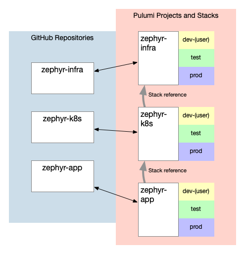

This is the fourth post in a series of blog posts focused on Zephyr Archaeotech Emporium---our fictional company---and their use of Pulumi to manage their online retail store. In the first three posts, you saw how Zephyr's initial use of Pulumi changed as the company grew, and how the use of short-lived per-developer stacks helped Zephyr's application development team meet the demands of a fast-growing company. This post is a complement to the earlier post on structuring Pulumi projects, discussing how Zephyr uses Stack References to link their projects together and sharing some recommended practices around the use of Stack References.<!--more-->

As you may have read in earlier Zephyr posts, the ultimate goal of the Zephyr series is to share recommended practices on the use of Pulumi to manage your infrastructure and application resources (using a fictional company and a somewhat complex containerized application as the use case). The series exposes those recommended practices over time---not all right away, and not without also discussing the context for the recommendations. This is deliberate, demonstrating how "point-in-time" recommendations change based on the needs of the company and its requirements.

Here are links to all the blog posts in the series (entries not linked below are planned but haven't yet been published; this list will get updated as new posts go live):

* [IaC Recommended Practices: Code Organization and Stacks](/blog/iac-recommended-practices-code-organization-and-stacks/)
* [IaC Recommended Practices: Developer Stacks and Git Branches](/blog/iac-recommended-practices-developer-stacks-git-branches/)
* [IaC Recommended Practices: Structuring Pulumi Projects](/blog/iac-recommended-practices-structuring-pulumi-projects/)
* **IaC Recommended Practices: Using Stack References** (you are here)
* [IaC Recommended Practices: RBAC and Security](/blog/iac-recommended-practices-rbac-and-security/)
* [IaC Recommended Practices: Using Automation API](/blog/iac-recommended-practices-using-automation-api/)
* IaC Recommended Practices: Adding Pulumi Deployments
* IaC Recommended Practices: Refactoring for Reuse

## Reviewing Zephyr's current status

This post continues the previous post in the series. Zephyr's infrastructure footprint and Pulumi codebase is the same; that is, Zephyr now has _three_ Pulumi projects (zephyr-infra, zephyr-k8s, and zephyr-app). Each of these projects handles a different aspect of Zephyr's online store:

* The "zephyr-infra" project handles base infrastructure (VPC and related constructs).
* The "zephyr-k8s" project handles the Kubernetes platform layer, building atop the infrastructure components provided by the "zephyr-infra" project.
* The "zephyr-app" project handles the deployment of the online store services onto Kubernetes, layering on top of the platform provided by the "zephyr-k8s" project.

The reasons for this structure are explained in [the third Zephyr blog post](/blog/iac-recommended-practices-structuring-pulumi-projects/). For Zephyr, it came down to supporting multiple teams and allowing the application to evolve independently of the infrastructure that supports it.

{}
You can continue to use the `blog/multi-project` branch in the GitHub repositories to see the state of Zephyr's code and projects for this blog post.
{}

It's clear that there are dependencies across projects: The `zephyr-k8s` project needs to know the VPC ID and the subnet IDs from the `zephyr-infra` project. Similarly, the `zephyr-app` project needs to have access to the Kubernetes cluster details from the `zephyr-k8s` project. As the Zephyr team went about building the code that's now in use in their multi-project architecture, they needed to decide how best to handle these cross-project dependencies. The Zephyr team knew that hard-coding output values from one project as configuration values in another stack wasn't the ideal way (and in fact Pulumi **strongly** recommends against hard-coding output values), but what was the best solution to use? The answer to that question is _stack references_.

## Linking stacks with stack references

Stack references allow you to access output values from one stack in another stack. In other words, stack references offer a way to programmatically "link" stacks in different projects for the purpose of sharing information. You can find more details [in the documentation on stack references](/docs/concepts/stack/#stackreferences).

Using stack references, the Zephyr team can make the necessary connections they need:

* The code handling the Kubernetes cluster can reference the VPC ID and subnet IDs from the base infrastructure layer.
* Similarly, the code that is responsible for deploying the online store services can reference the necessary Kubernetes connection details (the Kubeconfig) for the Kubernetes cluster.

You can see how the Zephyr team did this for their projects, including code samples, toward the end of this post (in the section titled "Examining Zephyr's use of stack references"). This graphical representation also illustrates Zephyr's current repository and project structure as well as the stack references:



It's worthwhile to note that any information that needs to be accessible from another stack via a stack reference must be exported as a stack output in the source stack. If you don't mark it as a stack output, then it can't be used in a stack reference. Adding stack outputs after the fact requires little effort and has no impact on existing infrastructure.

Also, any value retrieved via a stack reference is treated as [a Pulumi Output](/docs/concepts/inputs-outputs/), and therefore may require some extra work to transform values (such as the use of `Output.apply`). The recent addition of `OutputDetails` support in Pulumi---you can read more about `OutputDetails` [in this blog post announcing the functionality](/blog/stack-reference-output-details/)---helps considerably in this situation. Some SDKs also have language-specific mechanisms that can help; for example, using Go's `.AsStringArrayOutput()` method on a `StackReference.GetOutput` statement makes referencing subnet IDs from other project much easier.

While stack references are conceptually straightforward and not difficult to implement, there are some recommended practices to be mindful of regarding the use of stack outputs and stack references:

1. When it comes to stack outputs, **export what is needed.** If it needs to be accessed from outside the stack, export it; otherwise, don't. Why? Stack outputs form the application programming interface (API) by which other Pulumi programs interact with this Pulumi program. Like in any API implementation, expose what the user cares about or is likely to need, and leave the rest as an implementation detail. You can add more stack outputs after the fact with only minimal code changes, and as has been mentioned already this is done with a quick `pulumi up` that has no affect on existing infrastructure (you're modifying the stack object itself).
2. **Be judicious in your use of stack references.** This is sort of the "flip side" of the previous bullet. If you need to reference an output from another stack, then do so; otherwise, don't. If you find yourself needing lots of stack references, then the way in which you've structured your projects may need to be re-examined so as to minimize the coupling between projects. Additionally, there is a potential "speed of light" concern here; if where you are executing your Pulumi code is across a high-latency link from where you store your Pulumi state, stack references will be affected by that latency.
3. **If you need to expose lots of outputs on a stack, consider exporting a structured data object.** It's possible to construct a JSON object (or dict or struct, depending on your language) to hold all the stack outputs, and then export that object. Then a stack reference can read that object, resulting in a single call to the backend. Be aware, though, that you'll need to write the necessary code to understand/import/unmarshall that JSON object in the referring stack, so there is a small amount of extra work required in this situation.
4. In line with parameterizing as much of your code as possible, **also be sure to parameterize your stack references.** A stack reference is built using an organization name, a project name, and a stack name. Don't hardcode these values; instead, use configuration values to allow the users to specify from which source stack(s) the values will be referenced. You'll see an example of that in the next section.
5. **Plan for handling cascading stack updates.** If a stack has outputs being consumed via stack references, what happens when those stack outputs change? The Pulumi Service [supports webhooks](/docs/pulumi-cloud/webhooks/) that can help, and Pulumi is currently exploring options for having Pulumi Deployments help with this (see [this GitHub issue](https://github.com/pulumi/service-requests/issues/181)). In practice this should be uncommon, and frequent occurrences may be a good indicator that your resource partitioning (how resources are split among multiple projects) needs to be adjusted.

One thing not listed above is security---and that's because a later post in the series focuses on this topic. You'll want to keep the security of your stacks in mind when planning for the use of stack references. The teams managing the stacks where the stack references exist will need at least read-only access to the stacks where the outputs exist. (For more on this front, refer to [the IaC Recommended Practices post on RBAC and security](/blog/iac-recommended-practices-rbac-and-security/).)

## Examining Zephyr's use of stack references

With these recommended practices in mind, you can examine the Zephyr team's implementation to see how they put these recommendations into action.

* In the code for the base infrastructure stack, you can see that Zephyr [exported the essential values](https://github.com/pulumi/zephyr-infra/blob/blog/multi-project/index.ts#L14-L17) needed by the Kubernetes platform stack:

    ```typescript
    // Export some values for use elsewhere
    export const vpcId = eksVpc.vpcId;
    export const privSubnetIds = eksVpc.privateSubnetIds;
    export const pubSubnetIds = eksVpc.publicSubnetIds;
    ```

* In the Kubernetes platform stack, the Zephyr team [parameterized the values](https://github.com/pulumi/zephyr-k8s/blob/blog/multi-project/index.ts#L10-L12) needed for the stack reference. This particular approach, by the way, is key to preserving [the per-developer stacks](/blog/iac-recommended-practices-developer-stacks-git-branches/) to which the Zephyr team has grown accustomed (each developer needs to specify the correct organization, project, and stack name):

    ```typescript
    // Grab some configuration values
    // Some code omitted here
    const infraOrgName = config.require("infraOrgName");
    const infraProjName = config.require("infraProjName");
    const infraStackName = config.require("infraStackName");

    // Create a StackReference to get information from base stack
    const infraSr = new pulumi.StackReference(`${infraOrgName}/${infraProjName}/${infraStackName}`);
    ```

* As with the base infrastructure stack, [only the key value needed by other stacks](https://github.com/pulumi/zephyr-k8s/blob/blog/multi-project/index.ts#L36-L37) is exported (in this case, the Kubeconfig required to access this cluster):

    ```typescript
    // Export some values for use elsewhere
    export const kubeconfig = eksCluster.kubeconfig;
    ```

* Finally, in the application stack, the [stack reference values are again parameterized](https://github.com/pulumi/zephyr-app/blob/blog/multi-project/infra/index.ts#L7-L9), and the Kubeconfig---necessary for the application stack to deploy onto the provisioned Kubernetes cluster---is [referenced via a stack reference](https://github.com/pulumi/zephyr-app/blob/blog/multi-project/infra/index.ts#L11-L13):

    ```typescript
    // Grab some configuration values
    const config = new pulumi.Config();
    const k8sOrgName = config.require("k8sOrgName");
    const k8sProjName = config.require("k8sProjName");
    const k8sStackName = config.require("k8sStackName");

    // Create a StackReference to get Kubeconfig from base stack
    const kubeSr = new pulumi.StackReference(`${k8sOrgName}/${k8sProjName}/${k8sStackName}`);
    ```

{}
All of the GitHub links in the paragraphs above reference the `blog/multi-project` branch in each repository, which has the code as of this blog post (and the earlier blog posts).
{}

## Summarizing recommended practices

This post covered the following recommended practices for working with Pulumi:

* **Export the minimum of what's needed** from your stacks. It's not difficult to add stack outputs later, and you can do it with no impact to existing infrastructure.
* **Be judicious in the use of stack references.** Reducing stack references where possible helps keep projects from becoming overly coupled together, much in the same way as minimizing stack outputs.
* **Use a structured data object for large numbers of values that need to be referenced.** This enables Pulumi to retrieve all the data with a single call, but be aware you'll need to write extra code to understand the data structure in the referring stack.
* **Parameterize your stack references.** Don't hardcode organization, project, or stack name values. Instead, pass these in as configuration values (with default values applied, where applicable).
* **Plan to build mechanisms to handle cascading stack updates.** Using the Pulumi Service's webhook functionality can be useful here. Frequent instances of cascading updates might be an indicator that your project structure needs to be revisited for optimal resource partitioning.

The next post in the IaC recommended practices series focuses on security and role-based access control (RBAC)---a topic you won't want to miss! Before then, the next visit to the "Zephyr universe" will be to take a look at an oft-overlooked use case for Pulumi: local testing. Come see how to use Pulumi to automate local testing for development!
