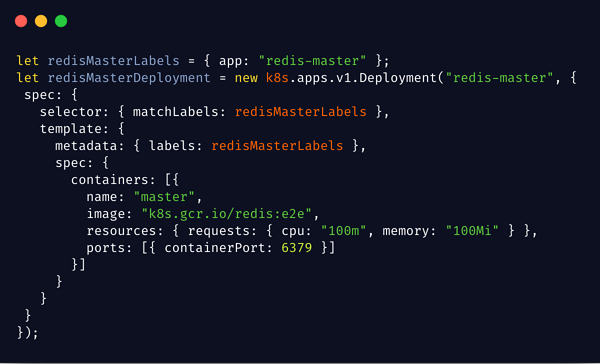
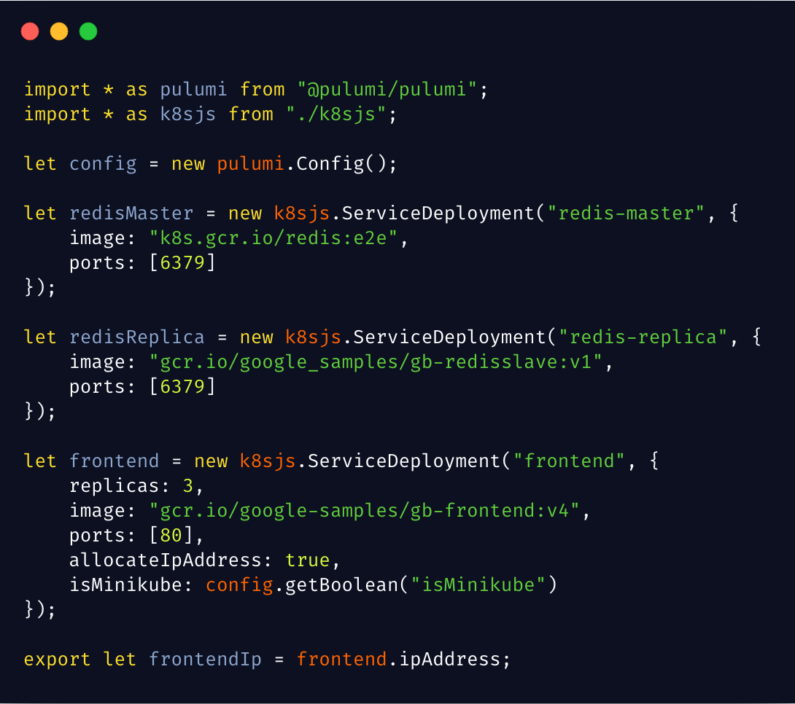

The Kubernetes landscape is constantly evolving as end users and
developers search for the right tools, approaches, and abstractions to
help them manage Cloud Native infrastructure in production. Last Friday,
we were honored to have Joe Beda
[show where Pulumi fits in on his TGIKlivestream](https://www.youtube.com/watch?v=ILMK65YVSKw),
highlighting how to use your favorite language and consistent workflows to create,
deploy, and manage cloud resources across multiple clouds and
Kubernetes.

Last week Heptio (now part of VMWare)
[announced](https://blogs.vmware.com/cloudnative/2019/02/05/welcoming-heptio-open-source-projects-to-vmware/)
that work on [ksonnet](https://github.com/ksonnet), a project launched
by Heptio, Box, Microsoft, and Bitnami, will stop. We're sad to see
ksonnet winding down, but are thankful for the collaborative exchange of
ideas between projects, and are excited to see continued investment in
VMWare/Heptio's other projects. The good news is that, if you liked
ksonnet, we're confident that you'll love Pulumi. In this post, we'll
tell you why.
<!--more-->

## Recap of ksonnet's Approach

In the [original ksonnet launch post](https://blog.heptio.com/ksonnet-intro-43f6183a97a6), Joe Beda
describes the "wall of YAML" that we face when creating and configuring
Kubernetes systems. This intimidates new users, making for a steep
learning curve, while also leading to thankless boilerplate and
copy-and-paste for the most experienced users. Systems like Helm have
attempted to solve the problem by adding templates to YAML.

ksonnet, instead, introduced a new DSL -- based on work from Google on
the [Jsonnet language](https://jsonnet.org/) (itself influenced by
experience internally on Borg) -- with more "language like"
functionality, that could generate configuration. The result was a
feature set that included:

- Local variables
- Functions and lambdas
- Modules and imports
- Mixins
- Configuration concatenation and merging
- Template parameterization

The idea is that you can author richer configuration in ksonnet, and
from that, simply generate and apply stock Kubernetes configuration,
without Kubernetes needing to know about ksonnet.

## Recap of Pulumi's Approach

Pulumi was inspired by many of the same challenges as ksonnet, but from
a slightly broader perspective. As we surveyed the landscape of
configuration languages, we found a bewildering array of them: plenty of
stock YAML, but also JSON and YAML with "built-in" templating mechanisms
(AWS CloudFormation and Azure Resource Manager Templates), templating
systems bolted on top of JSON and YAML (Helm Charts), and new DSLs
(Terraform), to name just a few. To add to the complexity, many
engineers have to stitch multiple of them together or regularly switch
between different dialects in an increasing multi-cloud environment.

Instead of creating another DSL, we wondered: Why not use languages
we're already familiar with? Is there some inherent reason that's
incompatible with configuration languages? The answer was no, it seemed
to us. While Infrastructure-as-Code is based on the idea of a
declarative goal state, we realized that it's possible to use imperative
languages to create that state.

By using languages like JavaScript, TypeScript, Python, and Go, we would
immediately see many benefits:

- All of the powerful language capabilities they already have
  (including the ksonnet list)
- Instant access to entire package ecosystems (NPM, PyPI, etc)
- Great IDE support, including integrated API documentation, syntax
  highlighting, statement completion, inline errors, and refactoring
- Ability to test, lint, and statically analyze code using existing
  tools

But we didn't want to just generate configuration files. There are
systems out there that generate a configuration from languages like
Python. In our experience, the underlying configuration system and its
limitations always leaks through, quickly ruining the ease-of-use
benefits. So, we built an engine that has a full cloud object model
across providers, can diff resources, applies updates using robust
Infrastructure-as-Code techniques, and provides rich status reporting.

## A short tour of Pulumi for ksonnet users

Just like in ksonnet, Pulumi provides access to the complete raw
Kubernetes API, so you can do everything that Kubernetes supports - but
using programming languages that provide completion lists, error
checking, inline documentation, and basic features like variables and
control flow.  Here's an example of part of a
[direct port of the Guestbook example to Pulumi](https://github.com/pulumi/examples/tree/master/kubernetes-ts-guestbook/simple): 

Also like in ksonnet, in Pulumi we can introduce additional features
like modules/imports, components, functions, and more to structure our
code and increase the level of abstraction that we work at as we author
our Kubernetes configuration.  This example shows the Guestbook app
[re-written using higher-level components in Pulumi](https://github.com/pulumi/examples/blob/master/kubernetes-ts-guestbook/components/index.ts),
and you can see similar approaches to those used in the
[similar example with ksonnet](https://github.com/ksonnet/ksonnet/blob/master/examples/guestbook.jsonnet)...
and just using TypeScript instead of bespoke DSL:

Unlike with ksonnet though, Pulumi programs are deployed using the
`pulumi` CLI, which provides rich feedback on the progress a deployment
is making toward being complete (as well as feedback when things go
wrong!).

And finally, a major area where Pulumi goes beyond ksonnet in scope, it
works with public and private cloud resources as well as
Kubernetes, enabling deployment of Kubernetes resources and
AWS/Azure/GCP resources using a single deployment workflow. For example,
you can
[stand up a managed Kubernetes cluster and deploying a Helm chart to it](https://github.com/pulumi/examples/blob/master/azure-ts-aks-mean/index.ts).

[

Another fun example is
[provisioning and consuming an Azure CosmosDB from within your Kubernetes app](https://github.com/pulumi/examples/tree/master/azure-ts-aks-mean).

## Learn More

If you'd like to learn about Pulumi and how to manage your
infrastructure and Kubernetes through code, [click here to get started today](). Pulumi is open source and free to
use.

If you'd like to go deeper on certain topics, here are some additional
resources to check out:

- [Overview of Pulumi Kubernetes Scenarios]()
- Tutorial: Create a Kubernetes cluster on a cloud provider
  [Amazon EKS](),
  [Google GKE](), or
  [Azure AKS](https://github.com/pulumi/examples/tree/master/azure-ts-aks-mean)
- Tutorial: [Operate and deploy to a Kubernetes cluster]()
- Docs: [Pulumi docs](), including an
  [overview of the programming model]()
- Video: [Watch Joe Beda take Pulumi for a spin in last week's TGIK](https://www.youtube.com/watch?v=ILMK65YVSKw)

As always, you can check out our code on
[GitHub](https://github.com/pulumi), follow us on
[Twitter](https://twitter.com/pulumicorp), subscribe to our [YouTube
channel](https://www.youtube.com/channel/UC2Dhyn4Ev52YSbcpfnfP0Mw), or
join our [Community Slack](https://slack.pulumi.io/) channel if you have
any questions, need support, or just want to say hello.

If you'd like to chat with our team, or get hands-on assistance with
migrating your existing configuration code (including ksonnet programs)
to Pulumi, please don't hesitate to [drop us a line]().
