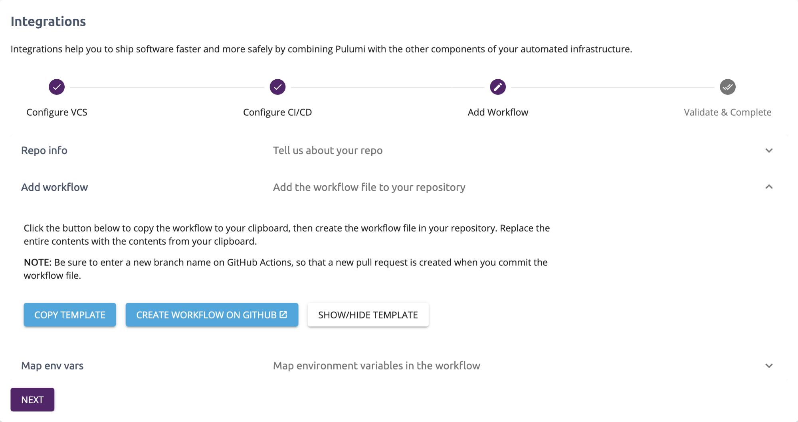

[GitHub Actions](https://github.com/features/actions) help automate tasks within your software development life cycle. At Pulumi, we use GitHub Actions internally as part of every build/release cycle, and we run these tasks many, many times per day. This helps us to automate our CI/CD process and eliminate manual steps. Pulumi and many of our customers also deliver infrastructure resources as part of a CI/CD process: delivering infrastructure and applications in a single, integrated pipeline.

<!--more-->

## Better Automation with GitHub Actions and Pulumi

Today, we’re pleased to announce that Pulumi is available as a verified [GitHub Action in the GitHub Marketplace](https://github.com/marketplace/actions/pulumi-cli-action). It’s now easier than ever to start automating your infrastructure deployments with Pulumi and GitHub Actions. [Our new guide shows you how to get started with GitHub Actions and Pulumi]().  Here are just a few great examples of how to use the Pulumi GitHub Action that will simplify your cloud engineering tasks:

### Master Builds

```yaml
name: Pulumi
on:
  push:
    branches:
      - master
jobs:
  up:
    name: Update
    runs-on: ubuntu-latest
    steps:
      - uses: actions/checkout@v1
      - uses: pulumi/actions@v1
        with:
          command: up
        env:
          PULUMI_ACCESS_TOKEN: ${{ secrets.PULUMI_ACCESS_TOKEN }}
```

### Pull Request Builds

```yaml
name: Pulumi
on:
  - pull_request
jobs:
  preview:
    name: Preview
    runs-on: ubuntu-latest
    steps:
      - uses: actions/checkout@v2
      - uses: pulumi/actions@v1
        with:
          command: preview
        env:
          PULUMI_ACCESS_TOKEN: ${{ secrets.PULUMI_ACCESS_TOKEN }}
          GITHUB_TOKEN: ${{ secrets.GITHUB_TOKEN }}
          IS_PR_WORKFLOW: true
          COMMENT_ON_PR: 1
```

## Announcing the New Pulumi CI/CD Integration Assistant

We often hear from developers who want to setup CI/CD automation for their stacks but don’t have the time to figure out how to configure a working pipeline. Today, we are happy to announce the launch of the [CI/CD Integration Assistant]() to make setting up CI/CD automation more straightforward. You can easily get started using popular CI/CD services without the hassle of the initial setup.

The integration assistant guides you with instructions based on your preferred CI/CD service and provides the customized pipeline configuration for CI/CD services that you can add to your Version Control System (VCS) repository.

We are super excited to offer [GitHub Actions](https://github.com/features/actions) support as part of the CI/CD Integration Assistant and other popular tools like Azure Pipelines and more.
If you’d like to request support for more CI/CD services, please use [this convenient template](https://github.com/pulumi/ci-workflow-templates/issues/new?assignees=&labels=&template=ci-cd-request.md&title=%5BNEW+CI+REQUEST%5D) on the Pulumi GitHub repo.



## Managing Your Infrastructure with a VCS

You may already be familiar with Git-based services such as [GitHub](https://github.com/), Bitbucket, and GitLab. Adding your code to a central VCS allows you to secure your codebase against failures and boost team collaboration. When you add an automated CI/CD pipeline, your team will deliver software safely and efficiently by ensuring that automated tests are passed prior to every deployment. This process is valuable for application code and infrastructure code.

The Assistant also goes beyond helping you get started with an automated pipeline. It works throughout the Pulumi Service providing hints for configuring a VCS for projects that are not already configured. It can also help identify updates to stacks that were not run in an automated pipeline (in the activity tab). These additions will help you quickly identify the stacks where best practices are not followed and take corrective actions.
You can access the Assistant in the Integrations option of your stack’s settings page to help you through the whole process of configuring a VCS to setting up a working automated pipeline.

Learn more about the [CI/CD Integration Assistant in our user guide]().

We are eager to hear your feedback on how we can improve your experience with this feature. If you haven’t already signed up for our [Community Slack](https://slack.pulumi.com/), it’s quick and easy! You can join in on conversations you like and get help from other community members, as well as the Pulumi Team. That’s it for now! 👋
