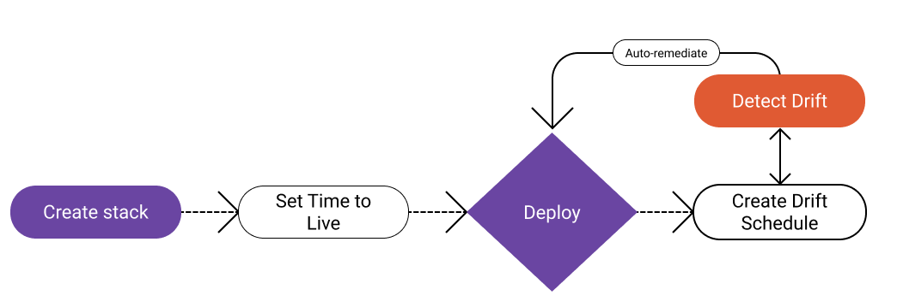

Today we announced a new wave of Infrastructure Lifecycle Management capabilities in Pulumi Cloud. These build upon and extend our rich Pulumi Deployments foundation for deployment orchestration and workflow. This is an exciting, customer-driven release, with new features that help with Day 2 operations and management.

These new features are:

- [Drift Detection and Remediation](/blog/drift-detection) - Continuously detect and remediate drift
- [Time-to-Live Stacks](/blog/ttl) - Clean up stale infrastructure automatically
- [Scheduled Deployments](/blog/scheduled-deployments) - Automate recurring workflows on a schedule
- [Free Deployments Minutes](/blog/deploy-minutes-included) - Use all of the above for free, no matter your tier!

We built these features based on customer feedback, and our 2,500+ customers are excited:

> "At Oleria, we understand the importance of addressing issues with privacy, security, and data integrity. Earning and maintaining our trust isn’t just a responsibility but a fundamental aspect of our mission," said Jim Alkove, CEO of Oleria.  "Pulumi also understands how these attributes affect cloud infrastructure. Our team is excited to use these new capabilities, giving us even more confidence as we enable our customers to securely manage access to decentralized SaaS applications, adaptively and intelligently."

These advanced features are available today in the Enterprise and Business Critical editions of Pulumi Cloud. These features together enable an end-to-end experience for managing the lifecycle and consistency of your cloud infrastructure to ensure enterprises have the capabilities needed to operate at scale.

### Infrastructure Lifecycle Management Capabilities - Excelling at Day 2 and Beyond

So, why infrastructure lifecycle management?

Infrastructure as Code (IaC) is table stakes for our customers. It helps to ensure Day 1, 2, and beyond cloud practices are robust, secure, and dependable. However, operational realities mean that sometimes teams need more flexibility than what strict IaC and Git-driven deployments offer.

For example, maybe you need to break glass and interact with the AWS console directly to open up SSH to an EC2 instance in order to debug a gnarly issue. Or maybe you need to scale up your Auto Scaling group (ASG) temporarily while a live-site incident of unexpected traffic peaks plays out. Or maybe someone added tags to your resource without knowing it was under the management of Pulumi. This can lead to drift, where your IaC configuration no longer matches reality, and reality no longer matches your IaC. This is where Drift Detection and Remediation comes in to automatically report on and reconcile it.

Alternatively, you may want to enable self-service infrastructure provisioning for your entire team, including developers and data scientists, who are not infrastructure experts. But what if they forget to wind things down when they’re done? You are left spending valuable money and resources managing infrastructure that’s no longer needed. Time-to-Live Stacks automatically reclaim such ephemeral infrastructure, enabling self-serve with confidence.

Next up, we often want to deploy on a Git commit, which Pulumi Deployments already handles. However, what if we want more flexibility around how and when deployments occur? For instance, perhaps you're a retailer who doesn’t want to deploy on Black Friday. Or maybe you prefer to deploy at set times throughout the week rather than on every Git commit. This is where Scheduled Deployments comes in, to give us flexible cron-based scheduling of deployments.

Finally, we want everyone to be able to kick the tires with all of the above, no commitments needed. That’s why we’re also announcing today that all users – individuals, teams, and enterprises alike – get an allotment of free monthly deployment minutes to use all of this.

Get started now for free at [app.pulumi.com](https://app.pulumi.com). We can’t wait to hear what you think!

Happy cloud spelunking.
