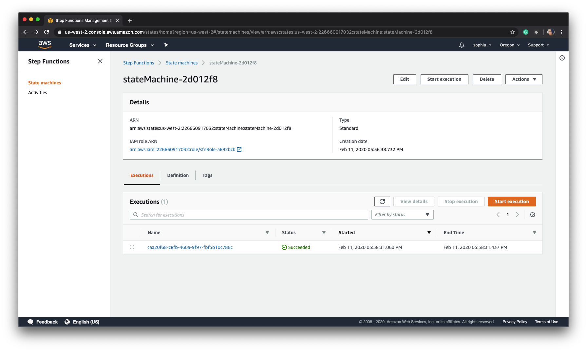
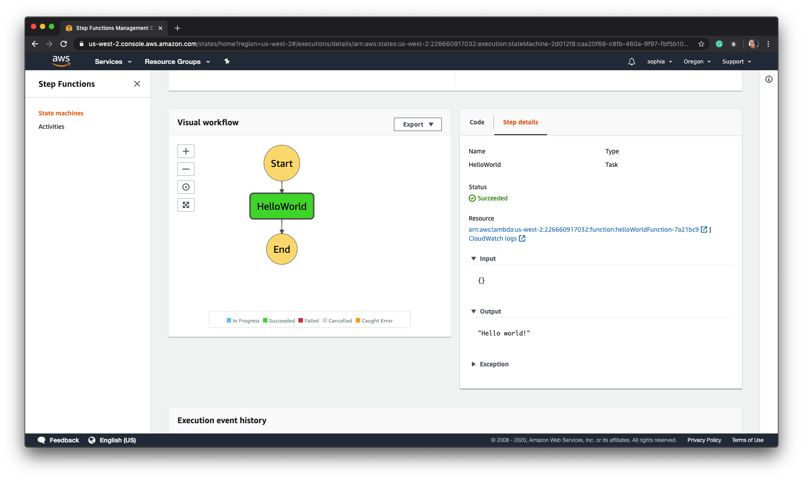
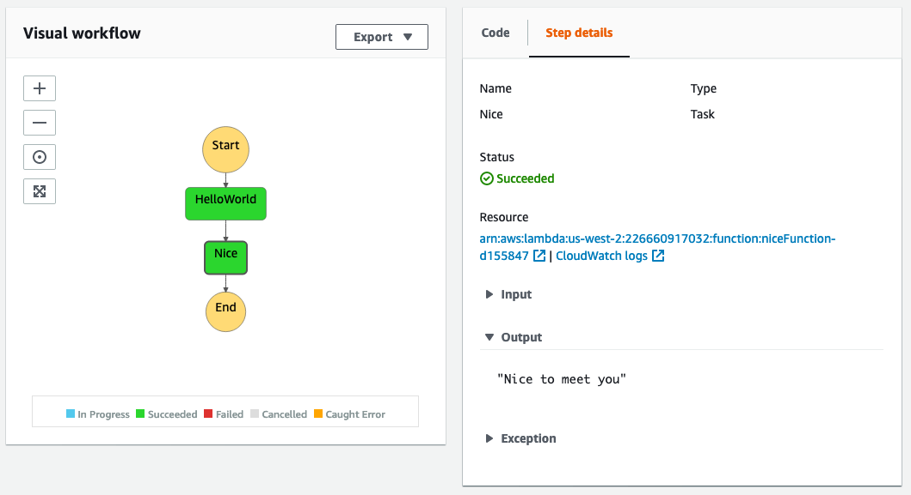

[AWS Step Functions](https://aws.amazon.com/step-functions/) lets you build applications by connecting AWS services. Daisy-chaining steps into a workflow simplifies application development by creating a state machine diagram which shows how services are connected to each other in your application. We'll go into the details of creating a lambda function, IAM roles and policies, and creating a workflow. Once we have the example deployed, we'll walk through the process of adding another function and step to the workflow. Included in the walkthrough is a discussion of one of the aspects of the Pulumi programming model. The goal of this article is to provide a foundation for building your application using serverless workflows.

<!--more-->

## Just the basics

Let’s start with a hello world function in an AWS Lambda. You can start the [example from Github](https://github.com/pulumi/examples/tree/master/aws-py-stepfunctions") by clicking on the `Deploy with Pulumi` button. A new project page is created automatically in Pulumi console, click on `Create Project` to get started. Follow the steps to copy the project locally. As with any Python project, we recommend creating a virtual environment to store project-specific dependencies.

```bash
$ python3 -m venv venv
$ source venv/bin/activate
$ pip3 install -r requirements.txt
```

Before we run the example, let’s look at the code. A step function is made up of a lambda function and a state machine that runs the function. We first need to define the permissions for the code. Both the lambda and the state machine require an [IAM execution role](https://docs.aws.amazon.com/IAM/latest/UserGuide/id_roles.html) and [IAM access policy](https://docs.aws.amazon.com/IAM/latest/UserGuide/access_policies.html) to access AWS services and resources. The `iam.py` module establishes the roles and policies and the AWS region, which are imported in `__main__,py`.

The lambda returns “Hello world!”  when called.  Note that the handler is the name of the module, `hello`, and the name of the function, `handler`.

```python
hello_world_fn = lambda_.Function('helloWorldFunction',
   role=iam.lambda_role.arn,
   runtime="python3.7",
   handler="hello.handler",
   code=pulumi.AssetArchive({
       '.': pulumi.FileArchive('./step_hello')
   })
)
```

The state machine controls the workflow. It executes using the IAM role we defined and has all the permissions necessary to execute the tasks defined. The `definition` specifies the start state and all the other states. In our case, there’s only one state, `HelloWorld`.

```python
state_defn = state_machine = sfn.StateMachine('stateMachine',
   role_arn=iam.sfn_role.arn,
   definition=hello_world_fn.arn.apply(lambda arn: """{
       "Comment": "A Hello World example of the Amazon States Language using an AWS Lambda Function",
       "StartAt": "HelloWorld",
       "States": {
           "HelloWorld": {
               "Type": "Task",
               "Resource": "%s",
               "End": true
           }
       }
   }""" % arn)
)

```

To run the example run and select `yes`.

```bash
$ pulumi up
Previewing update (dev):

     Type                     Name                  Plan
     pulumi:pulumi:Stack      stepfunctions-py-dev
 +   ├─ aws:iam:Role          lambdaRole            create
 +   ├─ aws:iam:Role          sfnRole               create
 +   ├─ aws:iam:RolePolicy    lambdaRolePolicy      create
 +   ├─ aws:iam:RolePolicy    sfnRolePolicy         create
 +   ├─ aws:lambda:Function   helloWorldFunction    create
 +   └─ aws:sfn:StateMachine  stateMachine          create

Outputs:
  + state_machine_arn: output<string>

Resources:
    + 6 to create
    1 unchanged

Do you want to perform this update?
  yes
> no
  details
```

Select `yes` to run the example, but note that the function doesn’t specify where to return `Hello world!`. We can execute the function from the AWS cli,  but to see how it works, we’ll need to launch the  [AWS Console](https://console.aws.amazon.com/states/home#/statemachines/).

Call the function first.

```bash
aws stepfunctions start-execution --state-machine-arn $(pulumi stack output state_machine_arn)
```

Then check the AWS console to see if the lambda was executed.



Clicking on the `Name` displays the step details, which include the input and out, i.e., ‘Hello world!’



The AWS console provides a graph of your workflow and the details of each step. Clicking on `Output` shows “Hello world” meaning that the call to the lambda function was successful.

## Add another step

Now that we have a basic flow, let’s add another step. To keep it simple we’ll create another simple function that returns “Nice to meet you.” To do this, make a file called `nice.py` and add the function.

```bash
def handler(event, context):
   return "Nice to meet you"

```

We will also need to import `Output` from pulumi along with the other imports. We’ll use it later.

```python
from pulumi import Output
```

Next, add the new lambda function, `nice_fn`. Note that we can reuse the same IAM role and policy we use in the `hello_world_fn` function.

```python
nice_fn = lambda_.Function('niceFunction',
   role=iam.lambda_role.arn,
   runtime="python3.7",
   handler="nice.handler",
   code=pulumi.AssetArchive({
       '.': pulumi.FileArchive('./step_hello')
   })
)
```

Finally, we need to update the state machine with a new workflow that includes our new function. The state machine takes three arguments, a name, an IAM role, and the workflow as a JSON document. The code to get the ARN names is Pulumi specific and requires an explanation if you are not familiar with the [Pulumi programming model]().

Instance properties of a resource are called outputs, which behave much like [promises](https://en.wikipedia.org/wiki/Futures_and_promises). This method is necessary because outputs may not be fully available until a resource is fully provisioned. To get the value of a resource, Pulumi has the `apply` method, which has a call back that receives the raw value and computes a new output. `Apply` is how we get the lambda ARN names in the workflow document. The [Output.all]() method joins a list of Outputs that we can apply to a Python lambda.

We add a new step function by changing the `HelloWorld` step to call the ‘Nice’ step with the tag `”Next” : “Nice”`. We add the “Nice” step and end the workflow. Here’s how the state machine is configured when adding another step.

```python
state_defn = state_machine = sfn.StateMachine('stateMachine',
   role_arn=iam.sfn_role.arn,
   definition=Output.all(hello_world_fn.arn,nice_fn.arn).apply(lambda args: """{
       "Comment": "A Hello World example of the Amazon States Language using an AWS Lambda Function",
       "StartAt": "HelloWorld",
       "States": {
           "HelloWorld": {
               "Type": "Task",
               "Resource": "%s",
               "Next": "Nice"
               },
           "Nice": {
                 "Type": "Task",
                 "Resource": "%s",
                 "End": true
                 }
            }
   }""" % (args[0], args[1]) )
)

```

Run `pulumi up` to update the deployment and call it using the AWS client again.

```bash
aws stepfunctions start-execution --state-machine-arn $(pulumi stack output state_machine_arn)
```

You can see the results in the AWS Console. The workflow graph shows the new step, and the output from `nice_fn` is “Nice to meet you.”



## What’s next

This example is just a simple workflow intended as an introduction. In future articles, we’ll expand on this basic model to include custom lambda functions and  AWS services. If python isn’t your preferred programming language, this example is also available in [typescript](https://github.com/pulumi/examples/tree/master/aws-ts-stepfunctions). Additionally, check out the [examples repository](https://github.com/pulumi/examples") to see what you can build next.
