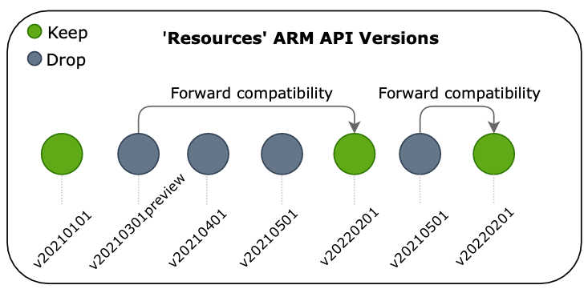

{}
The Pulumi Azure Native Provider 2.0 is currently available in beta.
{}

We are thrilled to announce the highly anticipated beta release of the Pulumi Azure Native Provider 2.0, a significant upgrade to our infrastructure as code (IaC) solution for Microsoft Azure. This release brings a host of exciting features and improvements that will enhance your experience with managing Azure resources and empower you to build robust and scalable cloud infrastructure more efficiently.

<!--more-->

At Pulumi, we understand the importance of keeping up with the ever-evolving cloud landscape. The Pulumi Azure Native Provider 2.0 represents our commitment to providing you with the best tools to harness the full power of Microsoft Azure while providing you with same-day access to the entire [Azure API surface](https://docs.microsoft.com/en-us/rest/api/azure/). Let's dive into some of the key enhancements in this release:

## Reduced SDK Size for Faster Deployments

We've listened to your feedback and have made significant optimizations to the Azure Native Provider SDKs. With careful fine-tuning and restructuring, we have achieved a remarkable decrease in SDK size of up to 60% <!-- TODO: Get latest size updates on alpha.3 once released -->. This improvement translates into faster deployment times, reduced resource consumption, and an overall smoother experience when working with the provider.

So, how did we accomplish this? For starters, we've removed all deprecated ARM API resources <!-- TODO: Link to list of deprecated resources --> up to the 2.0 release date. The bigger impact was made by identifying and removing all forward-compatible resource versions. That is to say we've exluded any redundant versions and kept the latest version until breaking changes. Where that version is not the current latest and new default, the explicit versions are still available.



## Refreshed Default Resource Versions

In the latest release, we have refreshed the default resource versions to align with the latest ARM API versions from Microsoft. With our continued committment to same-day access to Azure API surface, you always have access to the most up-to-date features and capabilities offered by Azure resources. By leveraging the latest resource versions, you can take advantage of the latest and most desired features directly from Azure while building your infrastructure with Pulumi.

If you would like to upgrade to 2.0, but continue using the same ARM API version that was used in your 1.0, you can do that by specifying the compatible explicit version available in the 2.0 provider. Shown below are examples of how that change might look.



{}

```typescript
- import { EventSubscription } from "@pulumi/azure-native/eventgrid";
+ import { EventSubscription } from "@pulumi/azure-native/eventgrid/v20200601";
```

{}
{}

```python
- from pulumi_azure_native import eventgrid
+ from pulumi_azure_native.eventgrid import v20200601 as eventgrid20200601
```

{}
{}

```csharp
- using EventGrid = Pulumi.AzureNative.EventGrid;
+ using EventGrid20200601 = Pulumi.AzureNative.EventGrid.V20200601;
```

{}
{}

```go
- import eventgrid "github.com/pulumi/pulumi-azure-native-sdk/eventgrid/v2"
+ import eventgrid20200601 "github.com/pulumi/pulumi-azure-native-sdk/eventgrid/v2/v20200601”
```

{}
{}

```yaml
- type: azure-native:eventgrid:Topic
+ type: azure-native:eventgrid/v20200601:Topic
```

{}


## Expanded Resource Coverage

We're excited to introduce [over 100 new Azure resources](link TODO) in this release, expanding the coverage of our Azure Native Provider bringing the total to over ### <!-- TODO get most recent number -->. With this extensive collection of resources at your disposal, you can now easily provision and manage an even broader range of Azure services using Pulumi. Whether you're working with virtual machines, databases, networking, or any other Azure service, the Azure Native Provider has you covered.

## Resolved Tite Case Inconsistency

In our commitment to excellence, we have [resolved title case inconsistencies](https://github.com/pulumi/pulumi-azure-native/pull/2366) across resource types and properties in the Azure Native Provider. All previous resource names have been aliased, so no additional modifications are required for existng Pulumi programs. This enhancement ensures a unified and predictable experience while switching between Azure and Pulumi resource references, making it easier for you to navigate and understand the provider's capabilities.

## Simplified User Assigned Identity Inputs

We have simplified the representation of user assigned identity inputs by recognizing them as string arrays. This change provides a more intuitive and clear approach when configuring user assigned identities for your Azure resources. You can now reference these as `#TODO example reference` without jumping through any hoops.

## Migrating from 1.0 to 2.0

We recommend you update to the [latest version of Azure Native 1.0](https://github.com/pulumi/pulumi-azure-native/releases/tag/v1.103.0) prior to moving to 2.0. This will enable you to adress existing deprectations and see the recommended subsitutions ahead of the major version upgrade. Head over to the [migration guide](link TODO) which outlines the necessary steps to update your existing Pulumi projects and ensuring a smooth migration experience.

Current users of the Pulumi Azure Classic Provider can follow the [classic to native migration guide](https://www.pulumi.com/registry/packages/azure-native/from-classic/) to take advantage of all the latest and greatest features available in Pulumi the Azure Native Provider.

While you can immediately start leveraging the improved performance, you may need to make some changes in order to continue using specific ARM API resource versions or user assigned identity inputs. Use the Pulumi Azure Native Provider documenation within your IDE to determine the explicit version that is available and fully compatible.

<!-- TODO MAYBE Add code snippet of a before and after short program from default to calling an explicit verison and updating userassigned identities -->

The Pulumi Azure Native Provider 2.0 beta is available today for all supported Pulumi programming languages, including TypeScript, Python, .NET, Java, YAML, and Go. To learn more about the Pulumi Azure Native Provider 2.0 and explore its capabilities, check out our [updated documentation](https://www.pulumi.com/registry/packages/azure-native-v2/) and resources. We value your feedback and encourage you to reach out in community slack or [open an issue](https://github.com/pulumi/pulumi-azure-native) for any questions or suggestions.

Try out the Pulumi Azure Native Provider 2.0 beta today and take the next step in your journey with infrastructure as code on Microsoft Azure!
