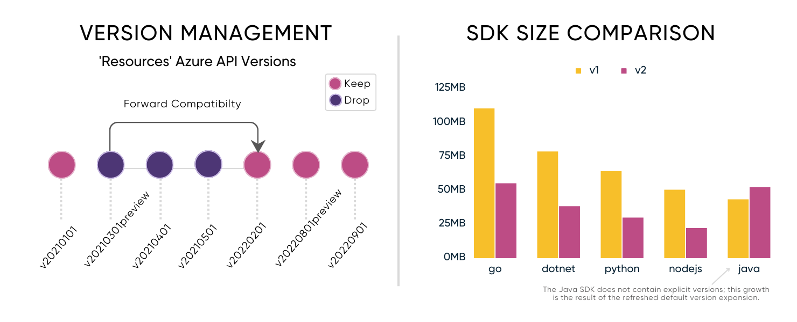
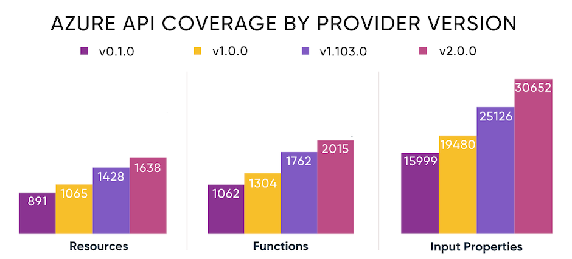

{}
The Pulumi Azure Native Provider 2.0 is currently available in beta.
{}

We are thrilled to announce the [beta release](https://github.com/pulumi/pulumi-azure-native/releases/tag/v2.0.0-beta.1) of the Pulumi Azure Native Provider 2.0, a significant upgrade to Pulumi's native provider for Microsoft Azure. The Azure Native provider offers the most complete support for Azure possible - with same day access to the entire surface area of the Azure features from Azure Resource Manager. Every property of each module is always represented in the SDKs. The 2.0 release brings a host of exciting features and improvements for performance and usability that will enhance your experience with managing Azure resources and empower you to build robust and scalable cloud infrastructure more efficiently.

<!--more-->

At Pulumi, we understand the importance of keeping up with the ever-evolving cloud landscape. The Pulumi Azure Native Provider 2.0 represents our commitment to providing you with the best tools to harness the full power of Microsoft Azure. With automatic generation from Azure API specs, we are able to provide you with same-day access to the entire [Azure API surface](https://docs.microsoft.com/en-us/rest/api/azure/) including all available properties. Let's dive into some of the key enhancements in this release:

## Reduced SDK Size for Faster Development

We've listened to your feedback and have made significant optimizations to the Azure Native Provider SDKs. With careful fine-tuning and restructuring, we have achieved a significant decrease in size of over 50% for SDKs with multi-versioned modules. This improvement translates into faster development times, reduced resource consumption, and an overall smoother experience when working with the provider.

So, how did we accomplish this? For starters, we've removed all deprecated Azure API modules up to the 2.0 release date. The bigger impact was made by identifying and removing all forward-compatible module versions. That is to say we've excluded any redundant versions and kept only the versions that introduce breaking changes. Where these versions are not the current latest and new default, they remain available as explicit versions.

You may be wondering about the significance between explicit and default versions. Well, when Azure releases new features they often create a new version of a service. These versions are named using dates such as "2021-01-02" or "2022-05-08-preview". There's many versions of each module in the SDK, so we pick a version of each module for the top-level default. To learn more about module versions, visit the [Azure Native Version Guide](https://www.pulumi.com/registry/packages/azure-native/version-guide/).



## Refreshed Default Module Versions

In the latest release, we have refreshed the default module versions to align with the latest Azure API versions from Microsoft. With our continued commitment to same-day access to Azure API surface, you always have access to the most up-to-date features and capabilities offered by Azure modules. By leveraging the latest module versions, you can take advantage of the latest and most desired features directly from Azure while building your infrastructure with Pulumi.

If you would like to upgrade to 2.x, but continue using the same Azure API version that was used in your 1.x, you can do that by specifying the compatible explicit version available in the 2.x provider. Shown below are examples of how that change might look.



{}

```typescript
- import { EventSubscription } from "@pulumi/azure-native/eventgrid";
+ import { EventSubscription } from "@pulumi/azure-native/eventgrid/v20200601";
```

{}
{}

```python
- from pulumi_azure_native import eventgrid
+ from pulumi_azure_native.eventgrid import v20200601 as eventgrid20200601
```

{}
{}

```csharp
- using EventGrid = Pulumi.AzureNative.EventGrid;
+ using EventGrid20200601 = Pulumi.AzureNative.EventGrid.V20200601;
```

{}
{}

```go
- import eventgrid "github.com/pulumi/pulumi-azure-native-sdk/eventgrid/v2"
+ import eventgrid20200601 "github.com/pulumi/pulumi-azure-native-sdk/eventgrid/v2/v20200601”
```

{}
{}

```yaml
- type: azure-native:eventgrid:Topic
+ type: azure-native:eventgrid/v20200601:Topic
```

{}


## Expanded Top-Level Default Module Coverage

We're excited to expand our top-level default version coverage by 226 resources, 274 functions, and 5526 input properties in this release, bringing the total to 1,637, 2,015, and 30,652 respectively. With this extensive collection of modules at your disposal, you can easily provision and manage the full range of Azure services using Pulumi. Whether you're working with virtual machines, databases, networking, or any other Azure service, the Azure Native Provider has you covered.



## Resolved Title Case Inconsistency

For a consistent and predictable experience across the provider, we have resolved [an issue with title case inconsistencies](https://github.com/pulumi/pulumi-azure-native/pull/2366) across module types and properties. All previous module names have been aliased, so no additional modifications are required for existing Pulumi programs. This enhancement ensures a unified and predictable experience while switching between Azure and Pulumi module references, making it easier for you to navigate and understand the provider's capabilities.

## Simplified User Assigned Identity Inputs

We have simplified the representation of user assigned identity inputs by recognizing them as string arrays. This change provides a more intuitive and clear approach when configuring user assigned identities for your Azure modules. You can now reference these as `UserAssignedIdentities: [exampleUserAssignedIdentity.id]` without jumping through any hoops.

```typescript
import * as resources from "@pulumi/azure-native/resources";
import * as managedidentity from "@pulumi/azure-native/managedidentity";
import * as storage from "@pulumi/azure-native/storage";

// Create a resource group
const resourceGroup = new resources.ResourceGroup("my-resource-group");

// Create a user-assigned managed identity
const userAssignedIdentity = new managedidentity.UserAssignedIdentity("my-user-assigned-identity", {
    resourceGroupName: resourceGroup.name,
});

// Create a storage account that references the user-assigned managed identity
const storageAccount = new storage.StorageAccount("mystorageaccount", {
    resourceGroupName: resourceGroup.name,
    kind: "StorageV2",
    location: resourceGroup.location,
    identity: {
        type: "UserAssigned",
        userAssignedIdentities: [userAssignedIdentity.id],
    },
    sku: {
        name: "Standard_LRS",
    },
});
```

Before this change, the identity block would need to use an apply as follows:

```
user_assigned_identity.id.apply(lambda id: {id: {}})
```

## Migrating from 1.x to 2.x

We recommend you update to the [latest version of Azure Native 1.x](https://github.com/pulumi/pulumi-azure-native/releases/tag/v1.103.0) prior to moving to 2.x. This will enable you to address existing deprecations and see the recommended substitutions ahead of the major version upgrade. Head over to the [migration guide](https://www.pulumi.com/registry/packages/azure-native/#migration) which outlines the necessary steps to update your existing Pulumi projects and ensuring a smooth migration experience.

Current users of the Pulumi Azure Classic Provider can follow the [classic to native migration guide](https://www.pulumi.com/registry/packages/azure-native/from-classic/) to take advantage of all the latest and greatest features available in Pulumi the Azure Native Provider.

While you can immediately start leveraging the improved performance, you may need to make some changes in order to continue using specific Azure API module versions or user assigned identity inputs. Use the Pulumi Azure Native Provider documentation within your IDE to determine the explicit API version that is available and fully compatible with your existing deployment.

The Pulumi Azure Native Provider 2.0 beta is available today for Pulumi programs using TypeScript, Python, .NET, and Go. To learn more about the Pulumi Azure Native Provider 2.0 and explore its capabilities, check out our [updated documentation](https://www.pulumi.com/registry/packages/azure-native-v2/) and resources. We value your feedback and encourage you to reach out in community slack or [open an issue](https://github.com/pulumi/pulumi-azure-native) for any questions or suggestions.

Try out the Pulumi Azure Native Provider 2.0 beta today and take the next step in your journey with infrastructure as code on Microsoft Azure!
