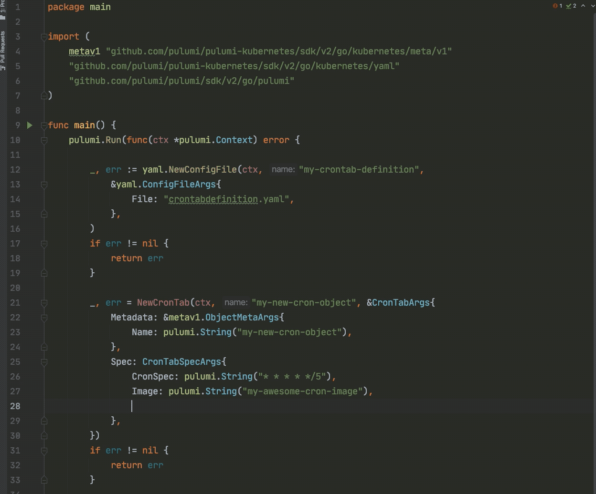

[CustomResource]s in Kubernetes allow users to extend the API with their types. These types are defined using
[CustomResourceDefinition]s (CRDs), which include an OpenAPI schema. This extensibility is quite useful but comes at the
cost of complex YAML definitions. Our new [crd2pulumi] tool takes the pain out of managing CustomResources by
generating types in the Pulumi-supported language of your choice!

<!--more-->

Pulumi already supports the management of CRDs and their associated CustomResources using the [apiextensions package].
However, these SDK resources are untyped since every schema is, well, custom. While this is fine for simple CRDs, it
quickly becomes unwieldy for real-world CRDs like [cert-manager] or [Istio]. These CRDs contain thousands of lines of
complex YAML schemas, making it difficult to write CustomResources that adhere to those specs. Programming languages
offer a better path forward. Instead of wrangling error-prone YAML definitions, using types in a programming language
lets you use IDE type checking and autocomplete features!

## Getting Started with crd2pulumi

Let's test `crd2pulumi` on the example [CronTab CRD] specified in the Kubernetes Documentation.

```yaml
apiVersion: apiextensions.k8s.io/v1
kind: CustomResourceDefinition
metadata:
  # name must match the spec fields below, and be in the form: <plural>.<group>
  name: crontabs.stable.example.com
spec:
  # group name to use for REST API: /apis/<group>/<version>
  group: stable.example.com
  # list of versions supported by this CustomResourceDefinition
  versions:
    - name: v1
      # Each version can be enabled/disabled by Served flag.
      served: true
      # One and only one version must be marked as the storage version.
      storage: true
      schema:
        openAPIV3Schema:
          type: object
          properties:
            spec:
              type: object
              properties:
                cronSpec:
                  type: string
                image:
                  type: string
                replicas:
                  type: integer
  # either Namespaced or Cluster
  scope: Namespaced
  names:
    # plural name to be used in the URL: /apis/<group>/<version>/<plural>
    plural: crontabs
    # singular name to be used as an alias on the CLI and for display
    singular: crontab
    # kind is normally the CamelCased singular type. Your resource manifests use this.
    kind: CronTab
    # shortNames allow shorter string to match your resource on the CLI
    shortNames:
    - ct
```

Copy this definition into a file called `crontab.yaml` and then run `crd2pulumi` to generate types for your language of
choice.



{}

```sh
$ crd2pulumi --nodejsPath ./crontabs crontabs.yaml
```

```typescript
import * as crontabs from "./crontabs"
import * as pulumi from "@pulumi/pulumi"

// Register the CronTab CRD.
const cronTabDefinition = new crontabs.stable.CronTabDefinition("my-crontab-definition")

// Instantiate a CronTab resource.
const myCronTab = new crontabs.stable.v1.CronTab("my-new-cron-object",
{
    metadata: {
        name: "my-new-cron-object",
    },
    spec: {
        cronSpec: "* * * * */5",
        image: "my-awesome-cron-image",
        replicas: 3,
    }
})

```

{}

{}

```sh
$ crd2pulumi --pythonPath ./crontabs crontabs.yaml
```

```python
import pulumi_kubernetes as k8s
import crontabs.pulumi_crds as crontabs


# Register the CronTab CRD.
crontab_definition = k8s.yaml.ConfigFile("my-crontab-definition", file="crontabs.yaml")

# Instantiate a CronTab resource.
crontab_instance = crontabs.stable.v1.CronTab(
    "my-new-cron-object",
    metadata=k8s.meta.v1.ObjectMetaArgs(
        name="my-new-cron-object"
    ),
    spec=crontabs.stable.v1.CronTabSpecArgs(
        cron_spec="* * * */5",
        image="my-awesome-cron-image",
        replicas=3,
    )
)

```

{}

{}

```sh
$ crd2pulumi --dotnetPath ./crontabs crontabs.yaml
```

```csharp
using Pulumi;
using Pulumi.Kubernetes.Yaml;
using Pulumi.Kubernetes.Types.Inputs.Meta.V1;

class MyStack : Stack
{
    public MyStack()
    {
    // Register a CronTab CRD.
    var cronTabDefinition = new Pulumi.Kubernetes.Yaml.ConfigFile("my-crontab-definition",
        new ConfigFileArgs{
            File = "crontabs.yaml"
        }
    );

    // Instantiate a CronTab resource.
    var cronTabInstance = new Pulumi.Crds.Stable.V1.CronTab("my-new-cron-object",
        new Pulumi.Kubernetes.Types.Inputs.Stable.V1.CronTabArgs{
            Metadata = new ObjectMetaArgs{
                Name = "my-new-cron-object"
            },
            Spec = new Pulumi.Kubernetes.Types.Inputs.Stable.V1.CronTabSpecArgs{
                CronSpec = "* * * * */5",
                Image = "my-awesome-cron-image",
                Replicas = 3
            }
        });
    }
}

```

{}

{}

```sh
$ crd2pulumi --goPath ./crontabs crontab.yaml
```

```go
package main

import (
	crontabsv1 "crds-go-final/crontabs/stable/v1"

    metav1 "github.com/pulumi/pulumi-kubernetes/sdk/v2/go/kubernetes/meta/v1"
    "github.com/pulumi/pulumi-kubernetes/sdk/v2/go/kubernetes/yaml"
	"github.com/pulumi/pulumi/sdk/v2/go/pulumi"
)

func main() {
	pulumi.Run(func(ctx *pulumi.Context) error {
        // Register the CronTab CRD.
        _, err := yaml.NewConfigFile(ctx, "my-crontab-definition",
            &yaml.ConfigFileArgs{
                File: "crontabs.yaml",
            },
        )
        if err != nil {
            return err
        }

        // Instantiate a CronTab resource.
		_, err = crontabsv1.NewCronTab(ctx, "my-new-cron-object", &crontabsv1.CronTabArgs{
			Metadata: &metav1.ObjectMetaArgs{
				Name: pulumi.String("my-new-cron-object"),
			},
			Spec: crontabsv1.CronTabSpecArgs{
				CronSpec: pulumi.String("* * * * */5"),
				Image:    pulumi.String("my-awesome-cron-image"),
				Replicas: pulumi.IntPtr(3),
			},
		})
		if err != nil {
			return err
		}

		return nil
	})
}

```

{}



As you can see, the `v1.CronTab` object is strongly-typed. So if you try to set replicas to a string or add an
unsupported argument, your IDE will immediately warn you!



## Cert Manager Example

Now let's examine a [real-world cert-manager example]. In this case, the CRD is over 1200 lines
of YAML, but `crd2pulumi` generates a nice interface so that we don't have to worry about it. Here's
what it looks like to create a `Certificate` CustomResource using our new types.



{}

```sh
$ crd2pulumi --nodejsPath ./certificates certificate.yaml
```

```typescript
import * as certificates from "./certificates"

// Register the Certificate CRD.
new certificates.certmanager.CertificateDefinition("certificate");

// Instantiate a Certificate resource.
new certificates.certmanager.v1beta1.Certificate("example-cert", {
    metadata: {
        name: "example-com",
    },
    spec: {
        secretName: "example-com-tls",
        duration: "2160h",
        renewBefore: "360h",
        commonName: "example.com",
        dnsNames: [
            "example.com",
            "www.example.com",
        ],
        issuerRef: {
            name: "ca-issuer",
            kind: "Issuer",
        }
    }
});

```

{}

{}

```sh
$ crd2pulumi --pythonPath ./certificates certificate.yaml
```

```python
import pulumi_kubernetes as k8s
import certmanager.pulumi_crds as certmanager


# Register the Certificate CRD.
_ = k8s.yaml.ConfigFile("my-certificate-definition", file="certificate.yaml")

# Instantiate a Certificate resource.
_ = certmanager.certmanager.v1beta1.Certificate(
    "example-cert",
    metadata=k8s.meta.v1.ObjectMetaArgs(
        name="example-com"
    ),
    spec=certmanager.certmanager.v1beta1.CertificateSpecArgs(
        secret_name="example-com-tls",
        duration="2160h",
        renew_before="360h",
        common_name="example.com",
        dns_names=[
            "example.com",
            "www.example.com"
        ],
        issuer_ref=certmanager.certmanager.v1beta1.CertificateSpecIssuerRefArgs(
            name="ca-issuer",
            kind="Issuer"
        )
    )
)

```

{}

{}

```sh
$ crd2pulumi --dotnetPath ./certificates certificate.yaml
```

```csharp
using Pulumi;
using Pulumi.Kubernetes.Yaml;
using Pulumi.Kubernetes.Types.Inputs.Meta.V1;

class MyStack : Stack
{
    public MyStack()
    {
        // Register a Certificate CRD.
        var certificateDefinition = new Pulumi.Kubernetes.Yaml.ConfigFile("my-certificate-definition",
            new ConfigFileArgs{
                File = "certificate.yaml"
            }
        );

        // Instantiate a Certificate resource.
        var certificateInstance = new Pulumi.Crds.Certmanager.V1Beta1.Certificate("example-cert",
            new Pulumi.Kubernetes.Types.Inputs.Certmanager.V1Beta1.CertificateArgs{
                Metadata = new ObjectMetaArgs{
                    Name = "example-com"
                },
                Spec = new Pulumi.Kubernetes.Types.Inputs.Certmanager.V1Beta1.CertificateSpecArgs{
                    SecretName = "example-com-tls",
                    Duration = "2160h",
                    RenewBefore = "360h",
                    CommonName = "example.com",
                    DnsNames = {
                        "example.com",
                        "www.example.com"
                    },
                    IssuerRef = new Pulumi.Kubernetes.Types.Inputs.Certmanager.V1Beta1.CertificateSpecIssuerRefArgs{
                        Name = "ca-issuer",
                        Kind = "Issuer"
                    }
                }
            }
        );  
    }
}

```

{}

{}

```sh
$ crd2pulumi --goPath ./certificates certificate.yaml
```

```go
package main

import (
	certv1b1 "crds-go-final/certificates/certmanager/v1beta1"

	metav1 "github.com/pulumi/pulumi-kubernetes/sdk/v2/go/kubernetes/meta/v1"
	"github.com/pulumi/pulumi-kubernetes/sdk/v2/go/kubernetes/yaml"
	"github.com/pulumi/pulumi/sdk/v2/go/pulumi"
)

func main() {
	pulumi.Run(func(ctx *pulumi.Context) error {
		// Register the Certificate CRD.
		_, err := yaml.NewConfigFile(ctx, "my-certificate-definition",
			&yaml.ConfigFileArgs{
				File: "certificate.yaml",
			},
		)
		if err != nil {
			return err
		}

		// Instantiate a Certificate resource.
		_, err = certv1b1.NewCertificate(ctx, "example-cert", &certv1b1.CertificateArgs{
			Metadata: &metav1.ObjectMetaArgs{
				Name: pulumi.String("example-com"),
			},
			Spec: certv1b1.CertificateSpecArgs{
				SecretName:  pulumi.String("example-com-tls"),
				Duration:    pulumi.String("2160h"),
				RenewBefore: pulumi.String("360h"),
				CommonName:  pulumi.String("example.com"),
				DnsNames: pulumi.StringArray{
					pulumi.String("example.com"),
					pulumi.String("www.example.com"),
				},
				IssuerRef: certv1b1.CertificateSpecIssuerRefArgs{
					Name: pulumi.String("ca-issuer"),
					Kind: pulumi.String("Issuer"),
				},
			},
		})
		if err != nil {
			return err
		}

		return nil
	})
}

```

{}



Kubernetes can be complex, but Pulumi gives you the tools you need to manage it successfully. With Pulumi superpowers
at your fingertips, you can stop worrying about YAML indentation, and get back to solving the problems you care about!

## Learn More

If you'd like to try `crd2pulumi` today, head to the [release page] and download the appropriate binary for your
operating system.

If you'd like to learn about Pulumi and how to manage your
infrastructure and Kubernetes through code, [get started today](). Pulumi is open
source and free to use.

For further examples on how to use Pulumi to create Kubernetes
clusters, or deploy workloads to a cluster, check out the rest of the
[Kubernetes tutorials]().

As always, you can check out our code on
[GitHub](https://github.com/pulumi), follow us on
[Twitter](https://twitter.com/pulumicorp), subscribe to our [YouTube
channel](https://www.youtube.com/channel/UC2Dhyn4Ev52YSbcpfnfP0Mw), or
join our [Community Slack](https://slack.pulumi.com/) channel if you have
any questions, need support, or just want to say hello.

<!-- markdownlint-disable url -->
[apiextensions package]: 
[crd2pulumi]: https://github.com/pulumi/crd2pulumi
[cert-manager]: https://github.com/jetstack/cert-manager/tree/master/deploy/crds
[CronTab CRD]: https://kubernetes.io/docs/tasks/extend-kubernetes/custom-resources/custom-resource-definitions/#create-a-customresourcedefinition
[CustomResource]: 
[CustomResourceDefinition]: 
[Istio]: https://github.com/istio/istio/tree/0321da58ca86fc786fb03a68afd29d082477e4f2/manifests/charts/base/crds
[real-world cert-manager example]: https://docs.cert-manager.io/en/release-0.7/tasks/issuing-certificates/index.html#creating-certificate-resources
[release page]: https://github.com/pulumi/crd2pulumi/releases
<!-- markdownlint-enable url -->
