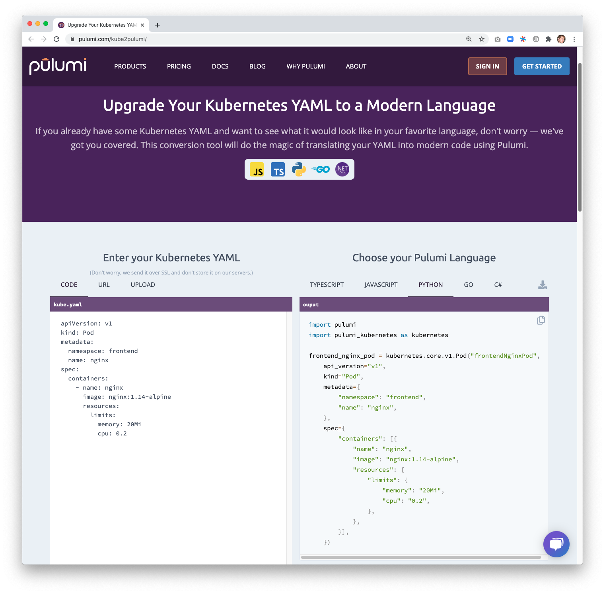

Kubernetes users often joke about being "YAML engineers," and the pile of YAML seems to get deeper every day. Today,
we're pleased to announce [kube2pulumi], a tool to automatically convert Kubernetes manifests into modern code! Instead
of manipulating YAML directly, you can take advantage of the rich ecosystem of programming language tools to
supercharge your productivity.

<!--more-->

Using programming languages to manage Kubernetes resources has many benefits: strong typing, linting, auto-completion,
refactoring, testing, and the ability to use standard language features like variables, loops, conditions, and
abstraction. Pulumi also supports [Helm], [Kustomize], and [YAML], but these tools don't take full advantage of the
programming language. With `kube2pulumi`, you can realize these benefits without manual conversion work upfront.

If you want to try it out right now in your browser, head over to our [Kubernetes to Pulumi Converter]!
[]()

Otherwise, keep reading as we check out an example of `kube2pulumi` in action, and then take a closer look at the
generated code.

## Getting Started with kube2pulumi

Let's start with a simple example: converting a Namespace. Here's the YAML manifest:

```yaml
apiVersion: v1
kind: Namespace
metadata:
  name: foo
```

`kube2pulumi` will generate any Pulumi-supported language, so choose whichever one you like!



{}

Here, we choose TypeScript and select our YAML manifest.

```sh
$ kube2pulumi typescript -f namespace.yaml
Conversion successful! Generated File: namespace.ts
```

```typescript
import * as pulumi from "@pulumi/pulumi";
import * as kubernetes from "@pulumi/kubernetes";

const fooNamespace = new kubernetes.core.v1.Namespace("fooNamespace", {
    apiVersion: "v1",
    kind: "Namespace",
    metadata: {
        name: "foo",
    },
});
```

{}

{}

Here, we choose Python and select our YAML manifest.

```sh
$ kube2pulumi python -f namespace.yaml
Conversion successful! Generated File: `__main__.py`
```

```python
import pulumi
import pulumi_kubernetes as kubernetes

foo_namespace = kubernetes.core.v1.Namespace("fooNamespace",
    api_version="v1",
    kind="Namespace",
    metadata={
        "name": "foo",
    })
```

{}

{}

Here, we choose C# and select our YAML manifest.

```sh
$ kube2pulumi csharp -f namespace.yaml
Conversion successful! Generated File: Program.cs
```

```csharp
using Pulumi;
using Kubernetes = Pulumi.Kubernetes;

class MyStack : Stack
{
    public MyStack()
    {
        var fooNamespace = new Kubernetes.Core.V1.Namespace("fooNamespace", new Kubernetes.Types.Inputs.Core.V1.NamespaceArgs
        {
            ApiVersion = "v1",
            Kind = "Namespace",
            Metadata = new Kubernetes.Types.Inputs.Meta.V1.ObjectMetaArgs
            {
                Name = "foo",
            },
        });
    }

}
```

{}

{}

Here, we choose Go and select our YAML manifest.

```sh
$ kube2pulumi go -f namespace.yaml
Conversion successful! Generated File: main.go
```

```go
package main

import (
        corev1 "github.com/pulumi/pulumi-kubernetes/sdk/v2/go/kubernetes/core/v1"
        metav1 "github.com/pulumi/pulumi-kubernetes/sdk/v2/go/kubernetes/meta/v1"
        "github.com/pulumi/pulumi/sdk/v2/go/pulumi"
)

func main() {
        pulumi.Run(func(ctx *pulumi.Context) error {
                _, err := corev1.NewNamespace(ctx, "fooNamespace", &corev1.NamespaceArgs{
                        ApiVersion: pulumi.String("v1"),
                        Kind:       pulumi.String("Namespace"),
                        Metadata: &metav1.ObjectMetaArgs{
                                Name: pulumi.String("foo"),
                        },
                })
                if err != nil {
                        return err
                }
                return nil
        })
}
```

{}

{}

## Multi-resource Example

That's pretty cool but doesn't show off the full power of `kube2pulumi`. Let's try a more realistic conversion
scenario. Our newly announced [Pulumi Kubernetes Operator] requires a few different resources to install: a Service
Account, Role, RoleBinding, and Deployment, totaling about [130 lines of YAML]. Let's try converting that directory
to some real code!

```sh
$ ls operator
operator.yaml  role.yaml  role_binding.yaml  service_account.yaml
```

```sh
$ kube2pulumi typescript -d operator
Conversion successful! Generated File: operator/main.ts
```

```typescript
import * as pulumi from "@pulumi/pulumi";
import * as kubernetes from "@pulumi/kubernetes";

const pulumi_kubernetes_operatorDeployment = new kubernetes.apps.v1.Deployment("pulumi_kubernetes_operatorDeployment", {
    apiVersion: "apps/v1",
    kind: "Deployment",
    metadata: {
        name: "pulumi-kubernetes-operator",
    },
    spec: {
        replicas: 1,
        selector: {
            matchLabels: {
                name: "pulumi-kubernetes-operator",
            },
        },
        template: {
            metadata: {
                labels: {
                    name: "pulumi-kubernetes-operator",
                },
            },
            spec: {
                serviceAccountName: "pulumi-kubernetes-operator",
                imagePullSecrets: [{
                    name: "pulumi-kubernetes-operator",
                }],
                containers: [{
                    name: "pulumi-kubernetes-operator",
                    image: "pulumi/pulumi-kubernetes-operator:v0.0.2",
                    command: ["pulumi-kubernetes-operator"],
                    args: ["--zap-level=debug"],
                    imagePullPolicy: "Always",
                    env: [
                        {
                            name: "WATCH_NAMESPACE",
                            valueFrom: {
                                fieldRef: {
                                    fieldPath: "metadata.namespace",
                                },
                            },
                        },
                        {
                            name: "POD_NAME",
                            valueFrom: {
                                fieldRef: {
                                    fieldPath: "metadata.name",
                                },
                            },
                        },
                        {
                            name: "OPERATOR_NAME",
                            value: "pulumi-kubernetes-operator",
                        },
                    ],
                }],
            },
        },
    },
});
const pulumi_kubernetes_operatorRole = new kubernetes.rbac.v1.Role("pulumi_kubernetes_operatorRole", {
    apiVersion: "rbac.authorization.k8s.io/v1",
    kind: "Role",
    metadata: {
        name: "pulumi-kubernetes-operator",
    },
    rules: [
        {
            apiGroups: [""],
            resources: [
                "pods",
                "services",
                "services/finalizers",
                "endpoints",
                "persistentvolumeclaims",
                "events",
                "configmaps",
                "secrets",
            ],
            verbs: [
                "create",
                "delete",
                "get",
                "list",
                "patch",
                "update",
                "watch",
            ],
        },
        {
            apiGroups: ["apps"],
            resources: [
                "deployments",
                "daemonsets",
                "replicasets",
                "statefulsets",
            ],
            verbs: [
                "create",
                "delete",
                "get",
                "list",
                "patch",
                "update",
                "watch",
            ],
        },
        {
            apiGroups: ["monitoring.coreos.com"],
            resources: ["servicemonitors"],
            verbs: [
                "get",
                "create",
            ],
        },
        {
            apiGroups: ["apps"],
            resourceNames: ["pulumi-kubernetes-operator"],
            resources: ["deployments/finalizers"],
            verbs: ["update"],
        },
        {
            apiGroups: [""],
            resources: ["pods"],
            verbs: ["get"],
        },
        {
            apiGroups: ["apps"],
            resources: [
                "replicasets",
                "deployments",
            ],
            verbs: ["get"],
        },
        {
            apiGroups: ["pulumi.com"],
            resources: ["*"],
            verbs: [
                "create",
                "delete",
                "get",
                "list",
                "patch",
                "update",
                "watch",
            ],
        },
    ],
});
const pulumi_kubernetes_operatorRoleBinding = new kubernetes.rbac.v1.RoleBinding("pulumi_kubernetes_operatorRoleBinding", {
    kind: "RoleBinding",
    apiVersion: "rbac.authorization.k8s.io/v1",
    metadata: {
        name: "pulumi-kubernetes-operator",
    },
    subjects: [{
        kind: "ServiceAccount",
        name: "pulumi-kubernetes-operator",
    }],
    roleRef: {
        kind: "Role",
        name: "pulumi-kubernetes-operator",
        apiGroup: "rbac.authorization.k8s.io",
    },
});
const pulumi_kubernetes_operatorServiceAccount = new kubernetes.core.v1.ServiceAccount("pulumi_kubernetes_operatorServiceAccount", {
    apiVersion: "v1",
    kind: "ServiceAccount",
    metadata: {
        name: "pulumi-kubernetes-operator",
    },
});
```

## Superpowers

Now that we've got some Kubernetes resources defined in real code, we can start working on them like any other software
project. First, we define a variable for the operator name and then swap out hardcoded string references to the other
resource names. With these changes, it doesn't require any thought to keep these resources in sync! You can later decide
to change the name in one place, and every other reference will update automatically as well.

```typescript
const operatorName = "pulumi-kubernetes-operator";

const pulumi_kubernetes_operatorServiceAccount = new kubernetes.core.v1.ServiceAccount("pulumi_kubernetes_operatorServiceAccount", {
    apiVersion: "v1",
    kind: "ServiceAccount",
    metadata: {
        name: operatorName,
    },
});
const pulumi_kubernetes_operatorRoleBinding = new kubernetes.rbac.v1.RoleBinding("pulumi_kubernetes_operatorRoleBinding", {
    kind: "RoleBinding",
    apiVersion: "rbac.authorization.k8s.io/v1",
    metadata: {
        name: operatorName,
    },
    subjects: [{
        kind: "ServiceAccount",
        name: pulumi_kubernetes_operatorServiceAccount.metadata.name,
    }],
    roleRef: {
        kind: "Role",
        name: pulumi_kubernetes_operatorRole.metadata.name,
        apiGroup: "rbac.authorization.k8s.io",
    },
});
```

This simple refactoring is just the tip of the iceberg. At this point, you could:

- wrap these resources in a class to abstract away the low-level details
- add configuration values to the stack to make it easy to tweak certain values
- or even add custom logic for Pulumi to run after a particular resource is created

Pulumi gives you Kubernetes superpowers, and you decide how to use them!

## Learn More

If you'd like to learn about Pulumi and how to manage your
infrastructure and Kubernetes through code, [get started today](). Pulumi is open
source and free to use.

For further examples on how to use Pulumi to create Kubernetes
clusters, or deploy workloads to a cluster, check out the rest of the
[Kubernetes tutorials]().

As always, you can check out our code on
[GitHub](https://github.com/pulumi), follow us on
[Twitter](https://twitter.com/pulumicorp), subscribe to our [YouTube
channel](https://www.youtube.com/channel/UC2Dhyn4Ev52YSbcpfnfP0Mw), or
join our [Community Slack](https://slack.pulumi.com/) channel if you have
any questions, need support, or just want to say hello.

<!-- markdownlint-disable url -->
[kube2pulumi]: https://github.com/pulumi/kube2pulumi
[Kustomize]: 
[Helm]: 
[Kubernetes to Pulumi Converter]: 
[Pulumi Kubernetes Operator]: 
[YAML]: 
[130 lines of YAML]: https://github.com/pulumi/pulumi-kubernetes-operator/tree/master/deploy/yaml
<!-- markdownlint-enable url -->
