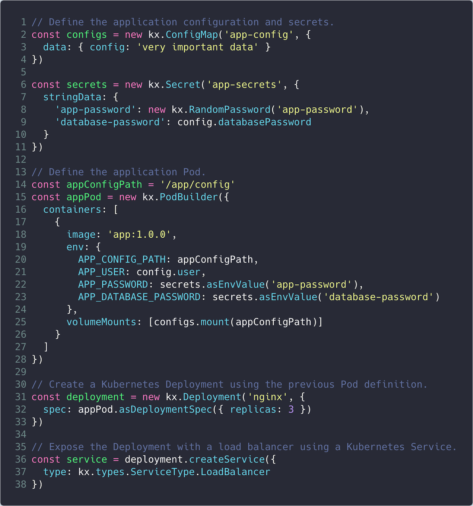
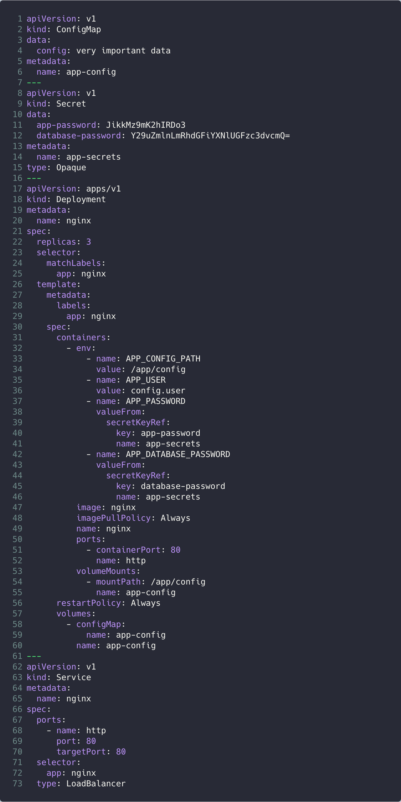

Kubernetes provides a rich, standards-based API that works across cloud and on-premise
infrastructure. However, many of the API fields are deeply nested and require users
to specify the same values redundantly across different resources. While this
explicit specification is necessary for Kubernetes to operate, this often leads users to
copy-paste existing code to manage the boilerplate.

Today, as part of our [Crosswalk for Kubernetes announcement][crosswalk-announce-blog],
we’re introducing the [Kubernetes Extensions (kx) library][kx-repo] for Pulumi. kx is
designed to simplify the declaration of Kubernetes resources, and make the API easier for
everyone to use.

## Kubernetes YAML: The cloud assembly language

With great power comes great complexity. The sheer number of Kubernetes configuration
options can be overwhelming to users. YAML was not designed for programming, yet
Kubernetes users often joke about being “YAML architects.”

Kubernetes YAML has been compared to an assembly language. We find this analogy to
be particularly apt: it gives users complete control over the system, although it is
closely tied to low-level implementation details.

Most Kubernetes applications require users to define several different resource
types, and then manually tie them together with text string references. The API
for each of these resource types is complex and deeply nested, so users often
rely on copy-pasted examples and frequent examination of the API spec. Wouldn't
it be nice if there was a way to go above these low-level implementation details,
and get back to thinking about your application?

The advent of high level programming languages completely changed the face of
computing. Rather than being closely tied to the details of the underlying
hardware, programmers could now focus on higher level concerns, like solving
business problems.

## Raising the Bar

kx mirrors the advantages of high-level programming languages, abstracting away
the low-level details so that you can focus on more important things!

kx is designed to reduce complexity, with the ability to drop down to the raw API
when necessary. This design provides a simple interface for the majority of cases,
while still providing access to the full set of tools required for production apps.

Two primary goals for kx are terse resource declarations, and the ability to compose
resources effortlessly as you build out applications on Kubernetes.

To illustrate this point, let’s check out a representative example of a real Kubernetes
application, including a ConfigMap, Secret, Deployment, and Service.

| Using kx              | Equivalent YAML                   |
| :-------------------: | :-------------------------------: |
|  |  |

> This code is available [here](https://gist.github.com/lblackstone/ae56b7a5c58986b51a2e7f3e595b6a56)

Needless to say, it requires significantly more effort to understand and maintain the
YAML version. Even including comments, the kx version is 50% shorter by only including
information that is relevant to the application.

kx is [available today][kx-repo] in developer preview. We invite you to try it out and
let us know what you think!

## Learn more

If you'd like to learn about Pulumi and how to manage your
infrastructure and Kubernetes through code,
[click here to get started today](). Pulumi is open
source and free to use.

As always, you can check out our code on
[GitHub](https://github.com/pulumi), follow us on
[Twitter](https://twitter.com/pulumicorp), subscribe to our
[YouTube channel](https://www.youtube.com/channel/UC2Dhyn4Ev52YSbcpfnfP0Mw), or
join our [Community Slack](https://slack.pulumi.com/) channel if you have
any questions, need support, or just want to say hello.

<!-- markdownlint-disable url -->
[crosswalk-announce-blog]: 
[kx-repo]: https://github.com/pulumi/pulumi-kubernetesx
<!-- markdownlint-enable url -->
