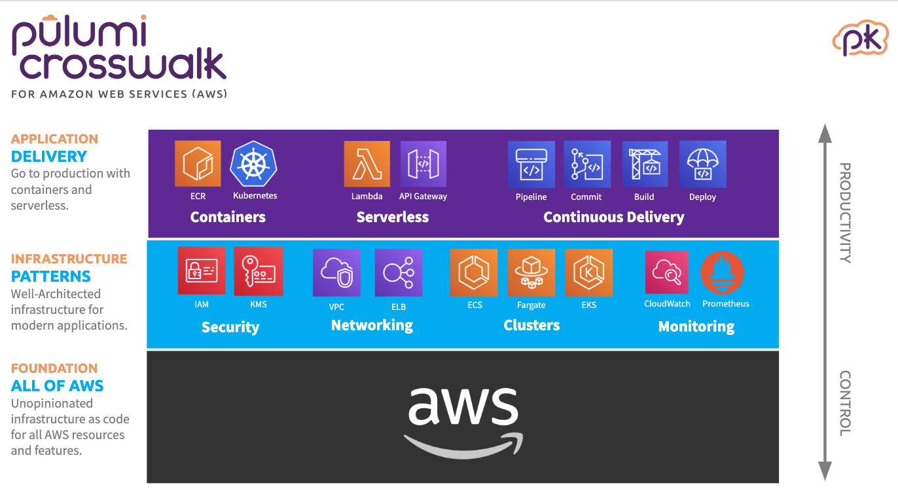

Amazon Web Services provides an incredible platform for developers to
build cloud-native applications, and is used by millions of customers of
all sizes. The building block services that AWS offers enable teams to
offload undifferentiated heavy-lifting to AWS. To maximally benefit from
these services though, cloud engineering teams must learn how to compose
all of these building blocks together to build and deliver their own
applications. Today, this is still too hard. Getting from your laptop to
a production-ready AWS deployment frequently takes days or weeks instead
of minutes or hours. And AWS building block services frequently leave
you to re-implement (and re-discover) best-practices instead of
providing these as smart defaults.

[Pulumi Crosswalk for AWS]() is a
new open source library of infrastructure-as-code components that make
it easier to get from zero to production on AWS, easier to adopt AWS
best practices by default, and easier to evolve your AWS infrastructure
as your application needs mature.
<!--more-->



Crosswalk for AWS offers higher-level components for a wide range of the
AWS platform - from serverless (Lambda, API Gateway and more) to
containers (ECS, Fargate) to Kubernetes (EKS) and across networking
(VPCs, SecurityGroups), monitoring (Cloudwatch Dashboards and Alarms)
and load balancing (ALB and NLB). Because Crosswalk builds on the
primitive building blocks of the AWS platform, you can use 100% of what
AWS offers, and can seamlessly move between high-level components and
low-level platform primitives, mixing-and-matching as needed.

In some of these domains, there have been successful tools that have
helped developers more easily work with one specific aspect of AWS -
[Serverless Framework](https://serverless.com/) for serverless,
[Docker Compose](https://docs.docker.com/compose/) for ECS,
[`eksctl`](https://github.com/weaveworks/eksctl) for EKS. But these
tools have traditionally been limited to one specific kind of compute,
limiting what users can accomplish, fragmenting development of complete
cloud solutions, and leading to sharp cliffs when application needs
evolve. Crosswalk for AWS offers the same kind of simpler and more
productive developer interface as these tools, but applied uniformly
across the entire AWS platform. Simple things are simple, and
arbitrarily complex things are possible.

Whether you are starting a new SaaS project at a startup, migrating an
enterprise application to cloud-native infrastructure, or delivering a
new service as part of an established cloud application, Crosswalk for
AWS provides the easiest way to get from zero to production, and to then
evolve with your projects' needs. You can
[get started with Crosswalk for AWS]() today!

> *Note:* Crosswalk for AWS projects are authored using the Pulumi
> infrastructure-as-code tools. Pulumi allows you to define your
> infrastructure using code. As your infrastructure code evolves, Pulumi
> makes the minimal required changes to your cloud resources, ensuring
> that your infrastructure is updated without downtime (if possible).

## From Zero to Production And Beyond with Crosswalk for AWS

### Serverless (Lambda, API Gateway)

When getting started with a new cloud project, the starting point is
often just serving a simple API on the internet. With just a few lines
of code and tens of seconds to deploy, Crosswalk for AWS gives us our
API.

```typescript
import * as awsx from "@pulumi/awsx";

const api = new awsx.apigateway.API("api", {
    routes: [{
        method: "GET",
        path: "/",
        eventHandler: async (ev, ctx) => {
            return {
                statusCode: 200,
                body: JSON.stringify(ev),
            };
        }
    }],
})

export const endpoint = api.url;
```

By building on top of great AWS building blocks like Lambda, API
Gateway, IAM and more, we avoid needing to worry about infrastructure,
pay nearly zero fixed costs, and gain the ability to iterate quickly.
With just a few more lines of code, we can
[wire up to our own domain](),
[add authorization](),
[provision a database](),
or [chain together a more complex event-driven application]().

### Containers (ECS, Fargate)

As our needs grow, we might find we need to deploy containers - either
custom applications or existing Docker images. Again, just a few lines
of code gets our container running in production in AWS.

```typescript
import * as awsx from "@pulumi/awsx";

// Create the cluster
const cluster = new awsx.ecs.Cluster("cluster");

// Configure a Load Balancer
const alb = new awsx.elasticloadbalancingv2.ApplicationLoadBalancer("lb", {
    securityGroups: cluster.securityGroups,
});
const web = alb.createListener("web", { port: 80, external: true });

// Define the scaled-out Fargate service
const appService = new awsx.ecs.FargateService("app-svc", {
    cluster,
    taskDefinitionArgs: {
        container: {
            image: awsx.ecs.Image.fromPath("app", "./app"),
            portMappings: [ web ],
        },
    },
    desiredCount: 5,
});

export const url = web.endpoint.hostname;
```

Using ECS, Fargate, ECR and ELB, we get a robust production-ready
container deployment - horizontally scaled out, load-balanced, and
integrated with a private image repository. With just a few more lines
of code, we can [add autoscaling](),
[customize our ECS cluster](),
or [wire through advanced container configuration]()
(volumes, environment variables, and more).

### Networking (VPC)

To adopt best practices security posture, we may want to move our
cluster into a custom VPC, and run our containers in private subnets. We
can define and configure our VPC, and then redeploy our containers into
this new VPC with ease:

```typescript
import * as awsx from "@pulumi/awsx";

const vpc = new awsx.ec2.Vpc("vpc", {
    numberOfAvailabilityZones: 3,
});

const cluster = new awsx.ecs.Cluster("cluster", {
    vpc: vpc,
});

// ... same as before ...
```

The `Vpc` component builds on best-practices Virtual Private Cloud
design patterns based on [AWS guidance and documentation](https://docs.aws.amazon.com/vpc/latest/userguide/VPC_Scenario2.html).
By building in simple defaults for routing, subnet structure, NATs and
multi-AZ you can get started quickly without having to re-discover these
best practices. And as your needs grow, you can deeply customize and
evolve your VPC structure - [defining custom CIDR blocks](),
[customizing Internet and NAT Gateways]()
or [additional additional private subnets]().

### Kubernetes (EKS)

As our project continues to evolve, we may want to move our container
workloads into Kubernetes using EKS. We can stand up an EKS cluster with
just a few lines of code, then customize our cluster and deploy
Kubernetes workloads into our cluster.

```typescript
import * as awsx from "@pulumi/awsx";
import * as eks from "@pulumi/eks";

// Create a VPC for our cluster.
const vpc = new awsx.ec2.Vpc("vpc");

// Create the EKS cluster itself.
const cluster = new eks.Cluster("cluster", {
    vpcId: vpc.id,
    subnetIds: vpc.privateSubnetIds,
    instanceType: "m5.large",
    desiredCapacity: 2,
    minSize: 1,
    maxSize: 2,
    deployDashboard: true,
});

// Export the cluster's kubeconfig.
export const kubeconfig = cluster.kubeconfig;
```

Building on EKS we get all the benefits of managed Kubernetes paired
with the platform capabilities of AWS. With Crosswalk for AWS, we can
get started quickly, and then evolve to take advantage of all of these
platform features, like [customized node groups](),
[private networking](),
and even [deploying Kubernetes YAML and Helm charts]()
to our cluster.

### Monitoring (CloudWatch)

Getting our infrastructure up and running in AWS is great, but we also
want to be able to monitor it. We can add a few lines to any of the
solutions above to define metrics, dashboards, alerting and more to
monitor our AWS infrastructure.

```typescript
import * as aws from "@pulumi/aws";
import * as awsx from "@pulumi/awsx";

// Create a bucket and a function to log all new object created events
const bucket = new aws.s3.Bucket("b");
const subscription = bucket.onObjectCreated("newObject", async (ev) => {
    console.log(JSON.stringify(ev));
});

// Create a CloudWatch Dashobard for our functions invocations
const dashboardName = "funcDashboard";
const dashboard = new awsx.cloudwatch.Dashboard(dashboardName, {
    widgets: [
        new awsx.cloudwatch.LineGraphMetricWidget({
            title: "Lambda invocations",
            width: 14,
            metrics: awsx.lambda.metrics.invocations({
                function: subscription.func, statistic: "Sum", period: 60, }), }), ], });

// Export the URL of the dashboard in the AWS console
export const dashboardUrl =
    `https://${aws.config.region}.console.aws.amazon.com/cloudwatch/home?` +
        `region=${aws.config.region}#dashboards:name=${dashboardName}`;
```

With CloudWatch being deeply integrated into all AWS services, we can
easily build up robust logging, alerting and dashboarding solutions
across our AWS infrastructure. With just a few more lines of code we can
[get logs for our functions and containers](),
[create alarms when we cross critical thresholds](),
and [create rich dashboard layouts]()
all of which will version along with our infrastructure!

## Early Feedback

We've been working on pieces of Crosswalk for AWS since before we
launched Pulumi, and we're excited to be launching Crosswalk for AWS
today to bring these together for all AWS users. Over the last few
months, users have built on Crosswalk for AWS for all of the scenarios
above and more.

Tableau has used Crosswalk for AWS to accelerate their Kubernetes
migration on AWS, building on the networking and EKS capabilities of
Crosswalk for AWS.

> *"We've been happily using Pulumi's EKS support for more than three
> months now. Our team was looking for an end-to-end solution to tame
> the complexity of Kubernetes on AWS and ensure we adhere to AWS best
> practices. Pulumi's Crosswalk effort has equipped our team to scale
> far better, our delivery is now automated, and we can now deliver new
> application and infrastructure features with much faster turn-around,
> sometimes in just a few hours. Pulumi is a key contributor to our
> team's improvement in productivity."* - **Pankaj Dhingra**, Sr
> Director, Cloud Engineering, Tableau

Compute Software has used Crosswalk for AWS to go from zero to
production, and then to evolve their infrastructure in AWS, all without
needing a dedicated cloud infrastructure engineering team.

> *"We use Crosswalk for AWS with Fargate. It's been instrumental in
> getting us into production. Deploying to the cloud is necessarily
> complex. Crosswalk streamlines the process by exposing the controls
> you care about, always allowing you to dive deeper when needed."* -
> **Kenny Williams**, Co-Founder, Compute Software

We're excited by the success these teams and many more have already had
with Crosswalk for AWS, but even more excited about the potential to
truly democratize access to the AWS platform and unlock highly
productive cloud development for all kinds of engineering organizations.

## What's Next?

We're still just scratching the surface of what's possible with
Crosswalk. We're continuing to evolve the open source projects to
simplify additional features of the AWS platform. And we're also working
to bring the same approach to other cloud platforms, including Azure,
GCP and Kubernetes.

We believe that making it easier for cloud engineers to develop and
deploy natively in the cloud will unlock creativity and empower
developers to take advantage of more of the rich capabilities of AWS. We
can't wait to see what you build with Crosswalk!

Crosswalk for AWS is free and open source, and you can get started today
at <https://www.pulumi.com/crosswalk/aws>.

For more on Crosswalk for AWS see:

- [Pulumi Crosswalk for AWS documentation]()
- [Get Started with Docker on AWS Fargate using Pulumi]()
- [Easy Serverless Apps and Infrastructure -- Real Events, Real Code]()
- [Easily Create and Manage AWS EKS Kubernetes Clusters with Pulumi]()
- [Serving a Static Website on AWS with Pulumi]()
- [IoT as Code with MapBox and Pulumi]()
