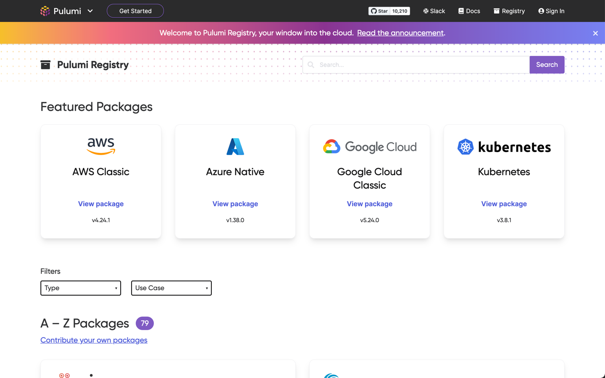
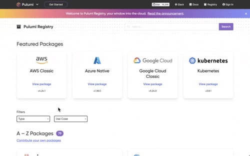
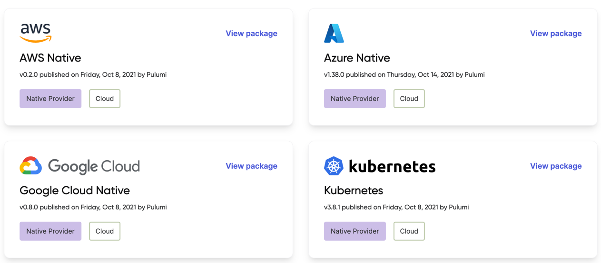

Pulumi offers the most complete [infrastructure as code]() platform for building, deploying, and managing modern cloud infrastructure and applications. When you use Pulumi, a vast library of cloud resources—from compute, storage, and other cloud infrastructure to databases to identity providers to monitoring systems—is at your fingertips. As the Pulumi community has grown, we’ve [heard from many of you](https://github.com/pulumi/pulumi/issues/3297) that we needed a central hub where you could find all of those resources. We’ve also heard from Pulumi partners that they wanted a great place to showcase their integrations with Pulumi so that their customers can more easily learn how to use Pulumi to deploy and manage their products.

Today, we’re excited to launch [Pulumi Registry](), the one place to discover and share everything you can achieve using Pulumi. Pulumi Registry is a searchable collection of Pulumi Packages published by Pulumi and our partners. With Pulumi Registry, you can easily find the package with the resources you need, install that package directly into your project, and start building. You can choose from Providers that give you full access to everything a cloud provider has to offer, or choose a Component that gets you started quickly with best practices and sensible defaults baked in. All Pulumi Packages are available in all Pulumi languages, so you can build your infrastructure using C#, Go, Python, and TypeScript/JavaScript. You’ll also find all of the documentation you need to succeed: from detailed API reference to how-to guides with source code for specific use cases.

<!--more-->



Pulumi Registry is launching with support for 64 of the leading cloud providers and modern cloud SaaS offerings, including Amazon Web Services, Microsoft Azure, Google Cloud, Kubernetes, Auth0, CloudFlare, Confluent Cloud, Datadog, DigitalOcean, Docker, GitHub, Kong, MinIO, MongoDB Atlas, PagerDuty, Snowflake, Spot by NetApp, and SumoLogic. Pulumi Registry also features some of the most popular Helm charts wrapped as Pulumi Components so you can take advantage of the most popular cloud native technologies.

We’re excited to enable any developer to take advantage of the power of these offerings, and we can’t wait to see what you achieve with them and Pulumi. If you’d like to enable your customers with the power of the Pulumi cloud engineering platform, [get in touch](). We’re eager to work with you!

## Everything you need to build for the modern cloud

The modern cloud has put more power and more capability to delight customers in developers’ hands than ever before. In Azure, Amazon Web Services, and Google Cloud alone, there are more than 6,300 distinct services, each of which might be the service that gives your team, or your company, the competitive advantage you need to win in the marketplace. But, with all of this power comes cloud complexity: you need to pick the right service, configure it correctly and securely, and integrate it with all of your existing cloud infrastructure.

Pulumi Registry, an integral part of the Pulumi Cloud Engineering Platform, tames this complexity by bringing together everything you can do with the cloud into a single location. At [pulumi.com/registry](), you can see all of our Pulumi Packages, including our Native Providers for the largest and most popular clouds; our broad range of Providers for various cloud, database, networking, monitoring, and other offerings; and all the Components that get you to production faster than ever before. You can easily filter packages by these categories or to find packages for your modern cloud use case, including Serverless, Containers, or Kubernetes.

Once you find a package of interest, everything you need to know to build, deploy, and manage cloud infrastructure with that package is at your fingertips. If you’re using a package for the first time or using a service you haven’t used before, Pulumi Registry has tutorials and scenario-specific how-to guides to help you get started. If you want to jump right in, you can install the package–whether you need the NuGet package, the npm package, the Python package, or the Go module–right from Pulumi Registry. If you’re already familiar with the package and need the API reference, it’s only a click away. We’ve also taken this opportunity to make some improvements to the API documentation (which was previously hosted on pulumi.com/docs), like adding a left navigation and type-ahead filter so it’s easier to quickly find the resource or method you’re looking for.



👉 [Visit the Registry]()

## Providers: the most complete and consistent way to program the modern cloud

Pulumi Registry’s packages come in two categories: Providers and Components. Providers are direct representations of all of the resources available from your choice of cloud or SaaS provider: everything from Alicloud to Cloudflare to Okta to Yandex. They’re a great choice when you want to work directly with individual cloud resources and define your infrastructure from scratch. (For higher-level building blocks, skip to the next section.)

For the largest and most popular clouds, we’ve created a special type of Provider that’s unique to Pulumi: Native Providers. Native Providers are the most advanced infrastructure-as-code packages available in the market. Each Native Provider is built directly from the underlying API of the cloud provider, so you get complete access to the full resource model of all of the provider’s services: every resource, every property, every method. We update Native Providers within 24 hours of the underlying API being updated, so you never have to wait to try out the latest improvements and new services.

Just a few weeks ago, we launched the [AWS Native Provider](), which is built directly from the new [AWS Cloud Control APIs](https://aws.amazon.com/blogs/aws/announcing-aws-cloud-control-api/) and gives you same-day access to every new AWS service. AWS Native joins our existing [Azure Native Provider](), [Google Native Provider](), and [Kubernetes Native Provider]().



### Full access to the Terraform ecosystem

If Pulumi Registry doesn’t yet have a native provider for your preferred cloud service, that’s OK! With Pulumi, you have full access to the Terraform ecosystem and can use any Terraform provider via our Terraform bridge. A number of bridged Terraform providers are already available in Pulumi Registry, including providers for popular services like Auth0, CloudFlare, Datadog, DigitalOcean, GitHub, and PagerDuty.

### Authoring new Providers

We also invite the entire Pulumi community to contribute new Providers to Pulumi Registry. You can enable your customers to manage your cloud service or cloud resources using Pulumi’s modern infrastructure-as-code by authoring a Native Provider, or by bridging an existing Terraform provider into the Pulumi ecosystem, and publishing it to the Pulumi Registry. We’ve also seen passionate customers and community members author Native Providers for cloud services with public, well-known APIs! Pulumi Registry will enable fully self-service publishing in 2022, but until then, we’re happy to work with you to publish your Provider.

👉 [Build and publish a Pulumi Provider]()

## Components: from new to production, faster than ever

When you need full control over the cloud resources you’re building, Providers are a great choice, because they give you access to all of the resources, all of the settings, and everything else you need to build and deploy infrastructure from scratch. But, we frequently hear from developers and infrastructure engineers that they need higher-level building blocks that "just work": things like secure and production-ready Kubernetes clusters or complete serverless configurations for popular combos like AWS Lambda and API Gateway or Azure Functions and API Management. Pulumi Components are the answer to those requests.

Components are higher-level building blocks that come with best practices and sensible defaults built in. They frequently encode the opinions of the component author so that you don’t have to configure every setting and understand every detail of all the cloud resources you want to use. Let’s look at some examples to understand the power of Components.

### Example: Production-ready EKS cluster in 15 lines of code

Amazon’s Elastic Kubernetes Service (EKS) is a great example of a powerful but complex service. With Pulumi’s AWS Native Provider, you can define a production-ready EKS cluster, but you need to know a fair amount about EKS. If you’re a platform team building out a custom Kubernetes shared services platform for a big organization, that’s OK, as you’ll likely want (and expect) full control over every setting on your cluster. For many other scenarios, you just want a well-configured EKS cluster with minimal configuration. Pulumi’s [EKS Component]() gives you just that, with just 15 lines of code:



{}

```typescript
import * as awsx from "@pulumi/awsx";
import * as eks from "@pulumi/eks";

// Create a VPC for our cluster.
const vpc = new awsx.ec2.Vpc("my-vpc", {});

// Create an EKS cluster inside of the VPC.
const cluster = new eks.Cluster("my-cluster", {
    vpcId: vpc.id,
    publicSubnetIds: vpc.publicSubnetIds,
    privateSubnetIds: vpc.privateSubnetIds,
    nodeAssociatePublicIpAddress: false,
});

// Export the cluster's kubeconfig.
export const kubeconfig = cluster.kubeconfig;
```

{}
{}

```python
import pulumi
import pulumi_eks as eks

# Create or lookup a VPC for our cluster.
vpc = ...

# Create an EKS cluster inside of our VPC.
cluster = eks.Cluster('my-cluster',
    eks.ClusterArgs(
        vpc_id = vpc.id,
        public_subnet_ids = vpc.public_subnet_ids,
        private_subnet_ids = vpc.private_subnet_ids,
        node_associate_public_ip_address = False,
    )
)

# Export the cluster's kubeconfig.
pulumi.export('kubeconfig', cluster.kubeconfig)
```

{}
{}

```go
package main

import (
    "github.com/pulumi/pulumi-eks/sdk/go/eks"
    "github.com/pulumi/pulumi/sdk/v3/go/pulumi"
)

func main() {
    pulumi.Run(func(ctx *pulumi.Context) error {
        // Create or lookup a VPC for our cluster.
        vpc := ...

        // Create an EKS cluster with the default configuration.
        cluster, err := eks.NewCluster(ctx, "my-cluster", &eks.ClusterArgs{
            VpcId:                        vpc.ID,
            PublicSubnetIds:              vpc.PublicSubnetIds,
            PrivateSubnetIds:             vpc.PrivateSubnetIds,
            NodeAssociatePublicIpAddress: pulumi.Bool(false),
        })
        if err != nil {
            return err
        }

        // Export the cluster's kubeconfig.
        ctx.Export("kubeconfig", cluster.Kubeconfig)
        return nil
    })
}
```

{}
{}

```csharp
using Pulumi;
using Pulumi.Eks;

class MyStack : Stack
{
    public MyStack()
    {
        // Create or lookup a VPC for our cluster.
        var vpc = ...;

        // Create an EKS cluster with the default configuration.
        var cluster = new Cluster("my-cluster", new ClusterArgs {
            VpcId = vpc.Id,
            PublicSubnetIds = vpc.PublicSubnetIds,
            PrivateSubnetIds = vpc.PrivateSubnetIds,
            NodeAssociatePublicIpAddress = false,
        });

        // Export the cluster's kubeconfig.
        this.Kubeconfig = cluster.Kubeconfig;
    }

    [Output]
    public Output<object> Kubeconfig { get; set; }
}
```

{}

### Example: Lambda serverless function and API Gateway in 21 lines of code

For event-driven and stateless workloads, serverless compute can be a great choice that enables you to pay only for the compute time you need instead of keeping VMs or containers idle. But, setting up serverless functions and the networking required for them to work together isn’t always straightforward. Pulumi’s [AWS API Gateway package]() makes it easy to create a serverless function (or several!) and make them accessible via an API Gateway:



{}

```typescript
import * as apigateway from "@pulumi/aws-api-gateway";
import * as aws from "@pulumi/aws";

const f = new aws.lambda.CallbackFunction("f", {
    callback: async (ev, ctx) => {
        console.log(JSON.stringify(ev));
        return {
            statusCode: 200,
            body: "goodbye",
        };
    },
});

const api = new apigateway.RestAPI("api", {
    routes: [{
        path: "/",
        method: apigateway.Method.GET,
        eventHandler: f,
    }],
});

export const url = api.url;
```

{}
{}

```python
import pulumi
import pulumi_aws_api_gateway as apigateway

api = apigateway.RestAPI('api', routes=[
    apigateway.RouteArgs(path="/", method=apigateway.Method.GET, event_handler=f),
    apigateway.RouteArgs(path="/www", method=apigateway.Method.GET, local_path="www", index=False),
    apigateway.RouteArgs(path="/integration",
        target=apigateway.TargetArgs(uri="https://www.google.com", type=apigateway.IntegrationType.Http_proxy))
])

pulumi.export('url', api.url)
```

{}
{}

```go
package main

import (
    "github.com/pulumi/pulumi-aws-api-gateway/sdk/go/apigateway"
    "github.com/pulumi/pulumi/sdk/v3/go/pulumi"
)

func main() {
    pulumi.Run(func(ctx *pulumi.Context) error {
        // Create cluster with default settings
        api, err := apigateway.NewRestAPI(ctx, "api", &apigateway.RestAPIArgs{
            Routes: []apigateway.RouteArgs{
                &apigateway.RouteArgs{
                    Path:         pulumi.String("/"),
                    Method:       apigateway.MethodGET,
                    EventHandler: f,
                },
                &apigateway.RouteArgs{
                    Path:      pulumi.String("/"),
                    Method:    apigateway.MethodGET,
                    LocalPath: pulumi.String("www"),
                    Index:     pulumi.Bool(false),
                },
                &apigateway.RouteArgs{
                    Path:   pulumi.String("/integration"),
                    Method: apigateway.MethodGET,
                    Target: &apigateway.TargetArgs{
                        Uri:  pulumi.String("https://www.google.com"),
                        Type: apigateway.IntegrationType.Http_proxy,
                    },
                },
            }
        })
        if err != nil {
            return err
        }

        ctx.Export("url", api.Url)
        return nil
    })
}
```

{}
{}

```csharp
using Pulumi;
using ApiGateway = Pulumi.AwsApiGateway;

class MyStack : Stack
{

    [Output("url")] Output<string> Url { get; set; }

    public MyStack()
    {
        var api = new ApiGateway.RestAPI("api", new ApiGateway.RestAPIArgs
        {
            Routes =
            {
                new ApiGateway.RouteArgs{ Path = "/", Method = ApiGateway.Method.GET, EventHandler = f },
                new ApiGateway.RouteArgs{
                    Path = "/www",
                    Method = ApiGateway.Method.GET,
                    LocalPath = "www",
                    Index = false
                },
                new ApiGateway.RouteArgs{
                    Path = "/integration",
                    Target = new ApiGateway.TargetArgs{
                        Uri = "https://www.google.com",
                        Type = ApiGateway.IntegrationType.Http_proxy,
                    }
                },
            },
        });

        this.Url = api.Url;
    }
}
```

{}



### Author your own Components

Want to share your own best practices and cloud configurations with the Pulumi community? You can author a Pulumi Component and publish it to Pulumi Registry. We’ll have fully self-service publishing in 2022, but until then, we’re happy to work with you to publish your Component. You can get started using the link below.

👉 [Build and publish a Pulumi Component]()

## What’s next

Today’s announcements are just the start of the journey for Pulumi Registry. In the coming months, we’ll continue to invest in making it even easier to author and publish a Pulumi Package. In 2022, we’ll also launch self-service publishing on Pulumi Registry, so you can share your packages directly with the Pulumi community. And, soon we’ll be bringing all of the goodness of Registry–the central index, the easy-to-use documentation, and more–to Pulumi Enterprise customers, so you can host Pulumi Packages private to your organization.

👉 [Visit Pulumi Registry]()

👉 [Contact sales to learn more about today’s announcements and get started with Pulumi]()
