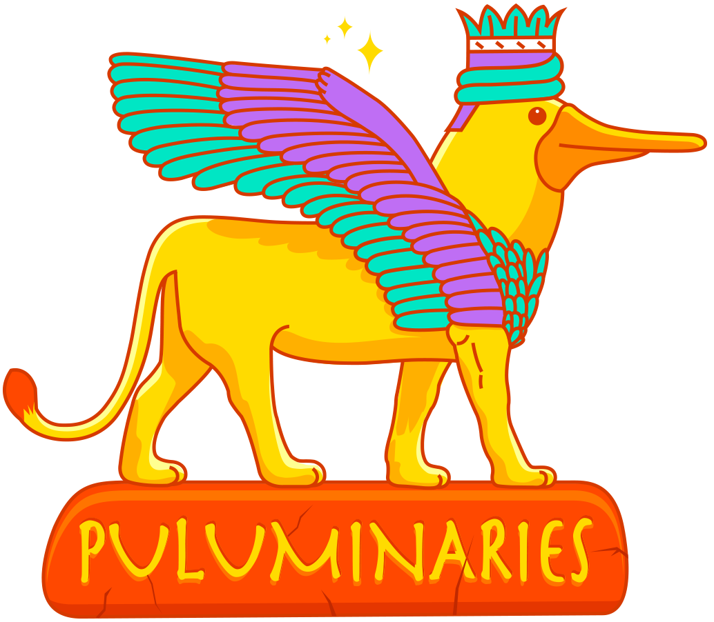
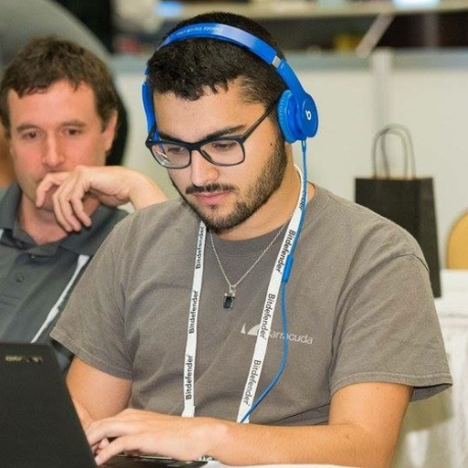
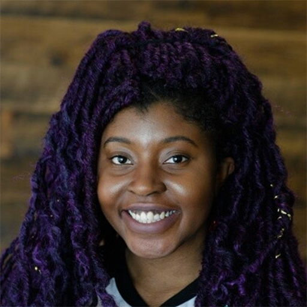

Pulumi is more than a way to build, deploy, and manage your infrastructure and cloud applications. Pulumi is also a strong and vibrant community. We are very excited to announce and showcase our new program of community champions, the Puluminaries!

<!--more-->

The Puluminaries program was created to recognize members of the Pulumi community who are experts and leaders in the field of programming and infrastructure, but also who give back to the community to make it grow! They help others get started, give feedback to make Pulumi's roadmap even better, and educate people through content or public speaking. The program is open to all members of the community, and we welcome anyone to join the program.

While the Puluminaries themselves have been active in the community for quite some time, we officially launched the program at [PulumiUP](https://pulumi.com/pulumi-up) in 2022, and it is our pleasure to introduce the first cohort of members to the program!

## Meet The Puluminaries!

### Engin Diri

<a data-track="twitter" href="https://twitter.com/_ediri"><i class="fab fa-twitter"></i></a>&nbsp;<a data-track="github" href="https://github.com/dirien"><i class="fab fa-github"></i></a>

Engin's excitement for Pulumi is not possible to be measured using current science. He will always share his thoughts on new developements in the Pulumi project, as well as join in for fun and discussion in various PulumiVision livestreams!

### Joshua Studt

<a data-track="github" href="https://github.com/orionstudt"><i class="fab fa-github"></i></a>

Joshua is a longtime member of the Pulumi community, and he contributed to the implementation of Automation API for C#.

### Kat Morgan

<a data-track="twitter" href="https://twitter.com/usrbinkat"><i class="fab fa-twitter"></i></a>&nbsp;<a data-track="github" href="https://github.com/usrbinkat"><i class="fab fa-github"></i></a>&nbsp;<a data-track="linkedin" href="https://linkedin.com/in/usrbinkat"><i class="fab fa-linkedin"></i></a>

Kat has been a helpful member of the Pulumi community - not only providing feedback on real-world use of Pulumi, but also sharing her knowledge with [workshops and webinars](https://konghq.com/webinars/devmyops-deploy-kong-with-pulumi?utm_souce=pulumi&utm_medium=pulumi)

### Komal Ali

<a data-track="twitter" href="https://twitter.com/zwitkali"><i class="fab fa-twitter"></i></a>&nbsp;<a data-track="github" href="https://github.com/komalali"><i class="fab fa-github"></i></a>&nbsp;<a data-track="linkedin" href="https://linkedin.com/in/komal-ali"><i class="fab fa-linkedin"></i></a>

In addition to being a Puluminary, Komal is also a Pulumni, having spent time working to make Pulumi a better tool for developers -  they were ever-present in making our Python SDK better and creating the [Automation API](https://www.pulumi.com/docs/guides/automation-api/)!

### Paul Hicks

<a data-track="github" href="https://github.com/tenwit"><i class="fab fa-github"></i></a>

Paul seems to have an answer to everything. He is ever-present in the Pulumi Community, sharing his knowledge to folks who are just getting started, but also bringing to bear his real-world expertise in complex Pulumi implementations. Chances are, if you see a great answer to a question in [Pulumi Community Slack](https://slack.pulumi.com/), it came from Paul.

### Ringo De Smet

<a data-track="twitter" href="https://twitter.com/ringods"><i class="fab fa-twitter"></i></a>&nbsp;<a data-track="github" href="https://github.com/ringods"><i class="fab fa-github"></i></a>

Ringo is one of the founding board members of [the Pulumiverse](https://www.pulumi.com/blog/2022-03-30-introducing-pulumiverse/) - a place to interact and collaborate on Pulumi-based libraries, projects, and educational materials. Ringo (along with fellow Puluminary Simen A. W. Olsen) have brought their vision for expanding the Pulumi community to life with the creating of this community-operated space! Ringo also created the [Pulumi Resource Type for Concourse](https://github.com/ringods/pulumi-resource), and is ever-present in every community he is a part of, not just Pulumi's!

### Rizel Scarlett

<a data-track="twitter" href="https://twitter.com/blackgirlbytes"><i class="fab fa-twitter"></i></a>&nbsp;<a data-track="github" href="https://github.com/blackgirlbytes"><i class="fab fa-github"></i></a>&nbsp;<a data-track="linkedin" href="https://www.linkedin.com/in/rizel-bobb-semple/"><i class="fab fa-linkedin"></i></a>

Rizel brings her remarkable talent for guidance and teaching to the Pulumi community. She has participated in many Pulumi events, including [Cloud Engineering Summit](https://www.pulumi.com/resources/from-code-to-cloud/), and [appearing on the PulumiVision livestream](https://youtu.be/2uQEIYuJBZ4).

### Simen A. W. Olsen

<a data-track="github" href="https://github.com/cobraz"><i class="fab fa-github"></i></a>

Another one of the founding board members of [the Pulumiverse](https://www.pulumi.com/blog/2022-03-30-introducing-pulumiverse/), Simen has a great passion for technology communities, but especially for the Pulumi community. Simen was instrumental on the [Pulumi GitHub Action](https://github.com/pulumi/actions) rewrite - designing and rearchitecting it in his free time.

_Do you know someone who would make a great Puluminary? Let us know! You can email us at da@pulumi.com with your nominations!_
