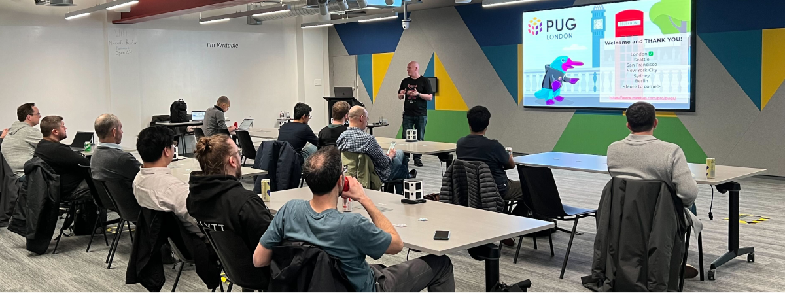
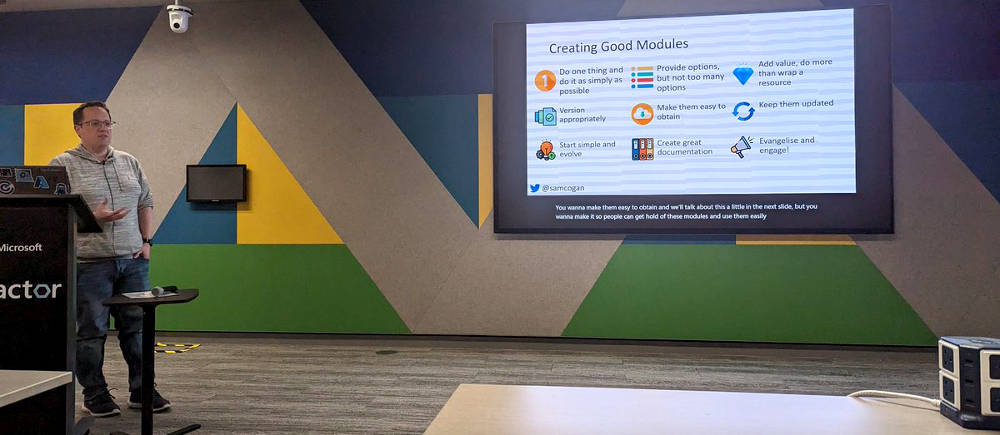

We have a global community made up of people from many different countries, but we also have many local communities. We want to enable our users to meet, share knowledge and ideas, answer questions, and learn about Pulumi and best practices. For that reason, we created the [Pulumi User Groups, aka PUGs](https://www.meetup.com/pro/pugs) on Meetup.

Members of PUGs will have access to a global network of experts who can offer help, advice, and support on using Pulumi effectively. The PUGs will also feature regular in-person meetups, webinars, in-person and virtual workshops, and other events to help members stay up-to-date with the latest cloud infrastructure and Pulumi developments.

## 9 Pulumi User Groups (PUGs) Meetups in 6 countries

PUGs are led by Pulumi employees and [Puluminaries](/community/puluminaries/), who are passionate community members that are experts in topics related to cloud infrastructure, Pulumi Cloud, cloud-native software development, and much more, and are willing to share their knowledge with the community.

### United States Pulumi User Groups

* [Austin Pulumi User Group](https://www.meetup.com/austin-pulumi-user-group/)
* [Seattle Pulumi User Group](https://www.meetup.com/pulumi-seattle/)
* [New York Pulumi User Group](https://www.meetup.com/new-york-pulumi-user-group/)
* [San Francisco Pulumi User Group](https://www.meetup.com/san-francisco-pulumi-user-group/)

### European Pulumi User Groups

* [London Pulumi User Group](https://www.meetup.com/london-pulumi-user-group/)
* [Oslo Pulumi User Group](https://www.meetup.com/oslo-pulumi-user-group/)
* [Berlin Pulumi User Group](https://www.meetup.com/berlin-pulumi-user-group/)
* [Prague Pulumi User Group](https://www.meetup.com/prague-pulumi-user-group/)

### Australian Pulumi User Groups

* [Sydney Pulumi User Group](https://www.meetup.com/sydney-pulumi-user-group/)

## The First PUG in person

Our very first in-person PUG meetup took place in London, UK. The event was well-attended by developers, cloud architects, and other infrastructure enthusiasts. The attendees had the opportunity to network with other like-minded professionals and learn more about Pulumi's tools and features from expert speakers.

During the meetup, attendees heard from several speakers, including Joe Duffy, Co-Founder & CEO at Pulumi, who was there to speak about Infrastructure as Code that writes itself after the release of [Pulumi Insights](/blog/pulumi-insights/), which happened that same day.

Other speakers included Liam Hampton, Sr. Regional Cloud Advocate at Microsoft, who spoke about Microsoft Azure and IaC, and Sam Cogan, Director of Solution Architecture at Willis Towers Watson, who spoke about building a library of reusable modules you can repeatedly reuse in your IaC projects.

Overall, the first PUG meetup was a huge success, and attendees left feeling inspired and energized about Pulumi's tools and the community's possibilities. With the launch of PUGs, Pulumi is demonstrating its commitment to building a strong and supportive community of professionals passionate about cloud infrastructure.

## More PUGs and events to come

We are planning more in-person PUG events for the months to come. With PUGs, you'll have the opportunity to connect with like-minded professionals, share knowledge and best practices, and stay up-to-date with the latest developments in cloud infrastructure and Pulumi.

Join the [Pulumi User Groups](https://www.meetup.com/pro/pugs) in your local area, or if there isn’t one yet, you are welcome to join the [Pulumi Slack community](https://slack.pulumi.com/) and meet people from all over the world.
