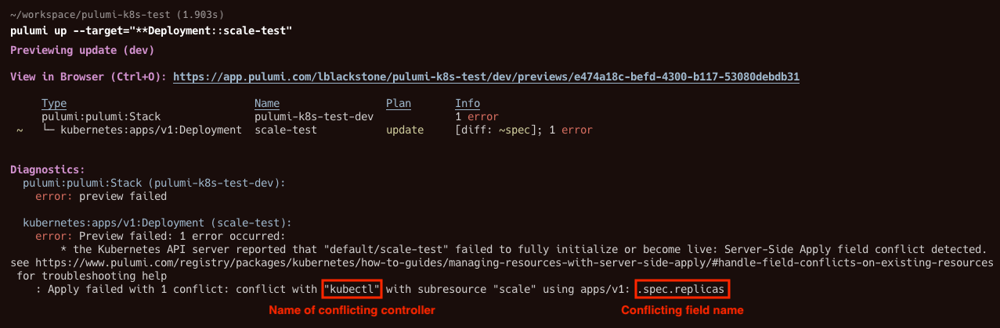
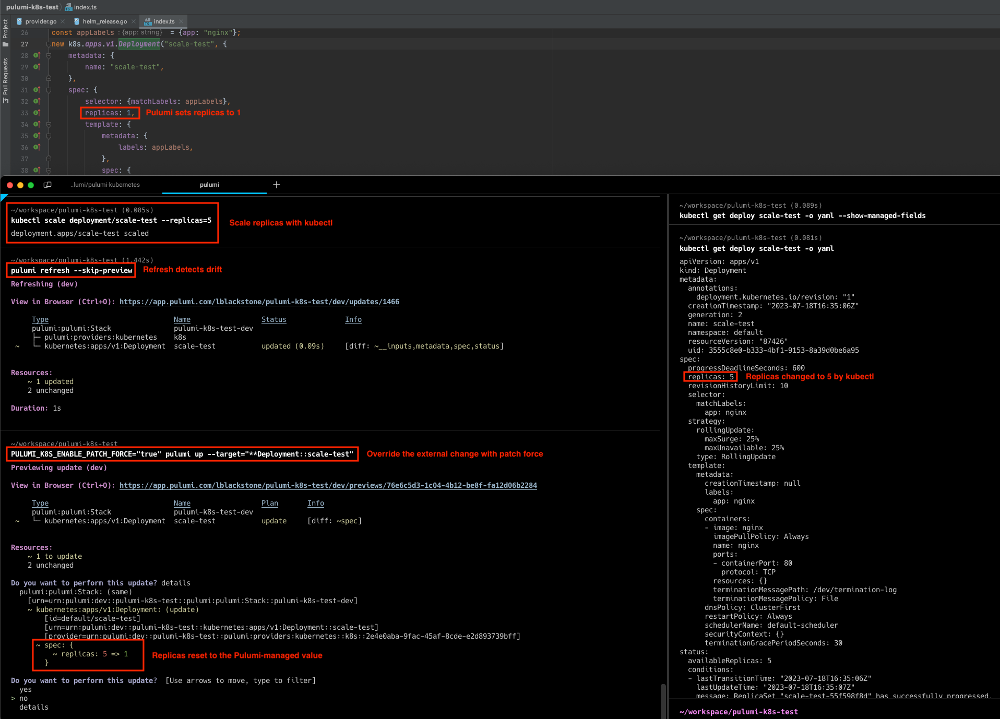

Since the very earliest days of the Pulumi project, Kubernetes has been a core part of the Pulumi platform.  The initial Pulumi Kubernetes provider supported the entire API surface area of the Kubernetes platform, derived directly and automatically from the Kubernetes OpenAPI specifications, and available to all of Pulumi's familiar programming languages.  Since then, we have offered day one support for every new Kubernetes version, added support for Helm, YAML, Kustomize and CRDs, added tools for converting to Pulumi (kube2pulumi and crd2pulumi) and delivered the Pulumi Kubernetes Operator.  During that same time, Kubernetes usage has continued to expand within the ecosystem and among Pulumi users, with the Kubernetes provider growing from the fourth most used to the second most used provider on the platform.

Today, we are excited to release the next major version of our Kubernetes provider - [Pulumi Kubernetes 4.0](/registry/packages/kubernetes/).

<!--more-->

Pulumi Kubernetes 4.0 uses Kubernetes Server-Side Apply by default, supports upserting on all resources, and enables new Patch resources for every resource type in the provider.  It also brings improved diffs, removes dependence on kubectl annotations, and provides simpler access to outputs in the Python, Go and Java SDKs, supporting any self-hosted or managed Kubernetes cluster with version 1.13 or newer.

Together, these additions make Pulumi’s support for Kubernetes even more Kubernetes-native, allowing the best of both worlds between Kubernetes’ flexible resource model and Pulumi’s robust desired state infrastructure as code model, all while using your favorite languages (TypeScript, Python, Go, .NET and Java) to define and manage your Kubernetes Infrastructure.  Pulumi programs that need to manage Kubernetes resources that are also modified by other systems (external controllers, managed Kubernetes service control planes, `kubectl` or other IaC solutions) can faithfully represent the modifications they want to make to existing resources within the Pulumi resource lifecycle.  Pulumi accurately detects any differences between the current state of resources in the cluster, and the desired state specified by Pulumi IaC.


## Server-Side Apply, Upserts and Patch Resources

Kubernetes [Server-side Apply](https://kubernetes.io/docs/reference/using-api/server-side-apply/) (SSA) mode is now default in the v4 provider. SSA mode enables several useful new features: Kubernetes resources can be safely managed by more than one controller. Any conflicting fields will produce a detailed error message which avoids accidentally overriding changes made by other controllers. Resources can be “upserted”; in other words, create the resource if it does not exist, or apply the specified configuration to an existing resource. Patch resources add a new way to manage shared Kubernetes resources. Patch resources can be used to make targeted changes, and do not require the entire resource to be specified. This is a convenient way to update shared resources; a common example is resources that are provisioned by the cloud provider rather than as part of the Pulumi stack. Deleting a Patch resource undoes the patched change, but does not remove the shared Kubernetes resource. See the [SSA how-to guide](https://www.pulumi.com/registry/packages/kubernetes/how-to-guides/managing-resources-with-server-side-apply/) for more details and usage examples for SSA mode.

> Note: Users may opt into the previous default Client-side Apply (CSA) mode by setting the `enableServerSideApply` provider configuration to “false”.

In this example, we define a `ConfigMap` as an upsert which will create the resource if it doesn't exist.



{}

```typescript
import * as pulumi from "@pulumi/pulumi";
import * as kubernetes from "@pulumi/kubernetes";

const example = new kubernetes.core.v1.ConfigMap("example", {
    metadata: {
        annotations: {
            "pulumi.com/patchForce": "true",
        },
        name: "example",
    },
    data: {
        foo: "bar",
    },
});
```

{}

{}

```python
import pulumi
import pulumi_kubernetes as kubernetes

example = kubernetes.core.v1.ConfigMap(
    "example",
    metadata=kubernetes.meta.v1.ObjectMetaArgs(
        annotations={
            "pulumi.com/patchForce": "true",
        },
        name="example",
    ),
    data={
        "foo": "bar",
    })
```

{}

{}

```go
package main

import (
    corev1 "github.com/pulumi/pulumi-kubernetes/sdk/v4/go/kubernetes/core/v1"
    metav1 "github.com/pulumi/pulumi-kubernetes/sdk/v4/go/kubernetes/meta/v1"
    "github.com/pulumi/pulumi/sdk/v3/go/pulumi"
)

func main() {
    pulumi.Run(func(ctx *pulumi.Context) error {
        _, err = corev1.NewConfigMap(ctx, "example", &corev1.ConfigMapArgs{
            Metadata: &metav1.ObjectMetaArgs{
                Annotations: pulumi.StringMap{
                    "pulumi.com/patchForce": pulumi.String("true"),
                },
                Name: pulumi.String("example"),
            },
            Data: pulumi.StringMap{
                "foo": pulumi.String("bar"),
            },
        })
        if err != nil {
            return err
        }
        return nil
    })
}
```

{}

{}

```csharp
using System.Collections.Generic;
using Pulumi;
using Kubernetes = Pulumi.Kubernetes;

return await Deployment.RunAsync(() =>
{
    var example = new Kubernetes.Core.V1.ConfigMap("example", new()
    {
        Metadata = new Kubernetes.Types.Inputs.Meta.V1.ObjectMetaArgs
        {
            Annotations =
            {
                { "pulumi.com/patchForce", "true" },
            },
            Name = "example",
        },
        Data =
        {
            { "foo", "bar" },
        },
    });
});
```

{}

{}

```java
package generated_program;

import com.pulumi.Context;
import com.pulumi.Pulumi;
import com.pulumi.core.Output;
import com.pulumi.kubernetes;
import com.pulumi.kubernetes.core_v1.ConfigMap;
import com.pulumi.kubernetes.core_v1.ConfigMapArgs;
import com.pulumi.kubernetes.meta_v1.inputs.ObjectMetaArgs;
import java.util.List;
import java.util.ArrayList;
import java.util.Map;
import java.io.File;
import java.nio.file.Files;
import java.nio.file.Paths;

public class App {
    public static void main(String[] args) {
        Pulumi.run(App::stack);
    }

    public static void stack(Context ctx) {
        var example = new ConfigMap("example", ConfigMapArgs.builder()
            .metadata(ObjectMetaArgs.builder()
                .annotations(Map.of("pulumi.com/patchForce", "true"))
                .name("example")
                .build())
            .data(Map.of("foo", "bar"))
            .build());

    }
}
```

{}

{}

```yaml
resources:
  example:
    type: kubernetes:core/v1:ConfigMap
    properties:
      metadata:
        annotations:
          pulumi.com/patchForce: "true"
        name: example
      data:
        foo: bar
```

{}



## Improved diff experience

The process for calculating what changes a provider needs to make to achieve the desired state is called “diffing”. This is a complex process that accounts for the current and previous state of the Pulumi program (the “inputs”), the stack’s state/checkpoint, and the actual current state of any resources managed by the provider. A major challenge of this process is detecting “drift”, where resources have been changed by something other than the Pulumi stack so that these changes are not reflected in Pulumi’s view of the world. The Server-side Apply (SSA) support available in v3.x versions does detect resource drift, but the implementation was slow for larger stacks. The v4 provider now detects resource drift in both Client-side Apply and Server-side Apply by running a refresh operation. This brings the behavior in line with other providers, and offers consistent performance that scales well to larger stacks.





As part of this work, we removed the use of the `kubectl.kubernetes.io/last-applied-configuration` annotation, which was previously used by the provider to track input values for Kubernetes resources. This change addresses [many longstanding issues](https://github.com/pulumi/pulumi-kubernetes/issues?q=is%3Aissue+label%3Alast-applied-configuration+) caused by the use of this annotation, including challenges working with resources that were modified by tools other than `kubectl`.

## Migrating to Kubernetes 4.0

You can migrate your existing Pulumi Kubernetes projects to 4.0 today, or start a new project targeting 4.0 with any of the Pulumi templates.  

For users migrating to 4.0, check out the [v4 Provider Migration Guide](https://www.pulumi.com/registry/packages/kubernetes/how-to-guides/v4-migration/) with full details of the additional changes in this release.
