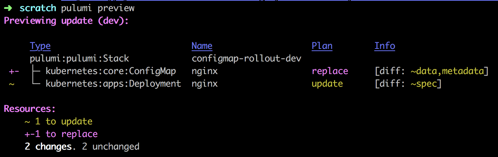

In software development, an anti-pattern is defined as an apparent solution that has unintended or negative consequences. The other side of anti-patterns is that they also offer solutions. Let's look at [container](https://codefresh.io/containers/docker-anti-patterns/) and [Kubernetes](https://betterprogramming.pub/10-antipatterns-for-kubernetes-deployments-e97ce1199f2d) anti-patterns and how to avoid them with infrastructure as code.

<!--more-->

## Hardcoding configuration in containers

Containers are immutable, and a single image can be used throughout the software lifecycle, i.e., from dev, to test, and to production. However, developers frequently use an image built using artifacts and configurations unique to a stage in the software lifecycle. The result is that the image in dev or test is not the same as the image deployed in production.

Best practice uses ConfigMaps, a Kubernetes native resource that doesn't require integration.   Because configuration is decoupled from the application, building the image at each stage is not necessary. Furthermore, ConfigMaps let you update when the application is running because the configuration is available during runtime.

Let's look at an example where NginX is configured as a reverse-proxy that sends traffic to `pulumi.github.io`. The configuration is contained in a file, `default.conf`. Changing the file registers as a change in the ConfigMap's data triggering a rollout of the NginX Deployment. If we change `.node.server` and `.serve.location.proxy_set_header` to `google.com`, NginX will redirect requests to google.com. When we run `pulumi up`, the preview shows it will explicitly trigger a rollout in the Deployment by replacing the ConfigMap. In contrast, kubectl will update the ConfigMap, but changes are not automatically applied to running containers.



ConfigMap

```
upstream node {
  server pulumi.github.io;
}
server {
  listen                  80;
  server_name             _;
  root                    /usr/share/nginx/html;
  location / {
    proxy_set_header X-Real-IP \$remote_addr;
    proxy_set_header X-Forwarded-For \$proxy_add_x_forwarded_for;
    proxy_set_header Host pulumi.github.io;
    proxy_pass http://node;
    proxy_redirect off;
    port_in_redirect off;
  }
}
```

Deployment

```typescript
import * as k8s from "@pulumi/kubernetes";
import * as pulumi from "@pulumi/pulumi";
import * as fs from "fs";

const config = new pulumi.Config();

const appName = "nginx";
const appLabels = { app: appName };

// nginx Configuration data to proxy traffic to `pulumi.github.io`. Read from
// `default.conf` file.
const nginxConfig = new k8s.core.v1.ConfigMap(appName, {
    metadata: { labels: appLabels },
    data: { "default.conf": fs.readFileSync("default.conf").toString() },
});
const nginxConfigName = nginxConfig.metadata.name;

// Deploy 1 nginx replica, mounting the configuration data into the nginx
// container.
const nginx = new k8s.apps.v1.Deployment(appName, {
    metadata: { labels: appLabels },
    spec: {
        replicas: 1,
        template: {
            metadata: { labels: appLabels },
            spec: {
                containers: [
                    {
                        image: "nginx:1.13.6-alpine",
                        name: "nginx",
                        volumeMounts: [{ name: "nginx-configs", mountPath: "/etc/nginx/conf.d" }],
                    },
                ],
                volumes: [{ name: "nginx-configs", configMap: { name: nginxConfigName } }],
            },
        },
    },
});
```

## Applications shouldn’t crash because a dependency isn’t ready.

Kubernetes starts all services concurrently, letting containers crash and restart until all the resources have started. We can control restarts with a Retry pattern, which include:

- Cancel the service and don't allow repeated attempts.
- Retry immediately for a specified number of times
- Retry with a delay

Like Kubernetes, Pulumi attempts to start all services concurrently but understands resource dependencies that can prevent a resource from starting. It does this through resource inputs, i.e., properties needed to start a resource, and outputs, properties from resources that are inputs to other resources.  Suppose an output of one resource is provided as an input to another. In that case, the engine records the dependency between resources as part of the state and uses this information when scheduling operations.

Outputs behave like promises because outputs are not fully known until the infrastructure resource has completed provisioning, which happens asynchronously. Outputs are also how Pulumi tracks dependencies between resources. Outputs, therefore, represent two things:

- The eventual raw value of the output
- The dependency on the source(s) of the output value

Pulumi automatically captures dependencies when you pass an output from one resource as input to another, ensuring that physical infrastructure resources are not created or updated until all their dependencies are available and up-to-date. Pulumi understands the dependencies between resources, which maximizes parallelism and ensures correct ordering. When you run the pulumi up command, Pulumi computes the desired state, compares it to the current infrastructure (if any), displays the delta, and lets you confirm and carry out the changes.

By default, if a resource must be replaced, Pulumi will attempt to create a new copy of the resource before destroying the old one. This is helpful because it allows updates to infrastructure to happen without downtime.

## Naked Pods are prohibited

Pods not bound to a ReplicaSet or Deployment will not be rescheduled in the event of a node failure. A Deployment with a ReplicaSet ensures that the specified number of Pods is always available and a strategy to replace Pods (such as RollingUpdate) is preferable to creating Pods directly.

Pulumi's policy as code solution, Crossguard, lets you create a policy that checks if there are naked Pods. Learn more about [Crossguard]().

```typescript
const policies = new PolicyPack("best-practices", {
  policies: [
    {
      name: "pods-are-prohibited",
      description: "Checks that Kubernetes Pods are not being used directly.",
      enforcementLevel: "mandatory",
      validateResource: validateResourceOfType(k8s.core.v1.Pod, (_, __, reportViolation) => {
        reportViolation("Kubernetes Pods should not be used directly. " +
          "Instead, you may want to use a Deployment, ReplicaSet or Job.");
      }),
    }
  ],
});

```

## Deploying pods without set memory and CPU limits

Although it's best practice not to deploy Pods directly, we can still set resource limits for memory and CPU. If limits are not set, containers can use all available memory or CPU resources leading to unstable environments and possible node crashes. By setting resource limits, the kube-scheduler can determine which Node to create a Pod and efficiently use cluster resources.

In this example, we create a [ResourceQuota](https://kubernetes.io/docs/concepts/policy/resource-quotas/) with the [label](https://kubernetes.io/docs/concepts/overview/working-with-objects/labels/) `namespace`. When we create a deployment or replicaset, we can define a [label selector](https://kubernetes.io/docs/concepts/overview/working-with-objects/labels/#label-selectors), `namespace: appsNamespaceName` to enforce the quota.

```typescript
import * as k8s from "@pulumi/kubernetes";

// Create a resource quota in the apps namespace.
const quotaAppNamespace = new k8s.core.v1.ResourceQuota("apps", {
    metadata: {namespace: appsNamespaceName},
    spec: {
        hard: {
            cpu: "20",
            memory: "1Gi",
            pods: "10",
            replicationcontrollers: "20",
            resourcequotas: "1",
            services: "5",
        },
    }
},{
    provider: cluster.provider
});
```

## Don't pull the latest tag in containers in production

Another best practice is to pin the version of an image by its tag. When a Pod crashes, Kubernetes pulls down the latest version of an image by default if the tag is not specified when a Pod is restarted. This can cause the application to crash if a Pod is no longer available because the image has changed. For example, an application may need to connect to a database, but if the most recent database image changes the authentication method, the application won't be able to connect.

We can use policy as code to check resource properties such as the image tag. The example policy below checks every image in a Deployment to ensure that it does not have a `latest` tag.

```typescript
import * as k8s from "@pulumi/kubernetes";
import { PolicyPack, validateResourceOfType } from "@pulumi/policy";

new PolicyPack("k8s", {
    policies: [
            name: "pin-image-versions",
            description: "Images should be pinned to a specific version",
            enforcementLevel: "advisory",
            validateResource: validateResourceOfType(k8s.apps.v1.Deployment, (resource, _, reportViolation) => {
                resource.spec?.template?.spec?.containers.forEach(it => {
                    if (it?.image?.endsWith(":latest")) {
                        reportViolation("Image version should not be 'latest'.");
                    }
                });
            }),
        },
    ],
});

```

## Mixing both production and non-production workloads in the same cluster

Namespaces in Kubernetes support multiple environments on the same cluster. Each namespace is, in effect, a virtual cluster within the physical cluster. While there are operational gains and cost advantages by mixing multiple environments in the same cluster, mixing other environments with production can impact application performance and security by either competition for resources or by increasing the production attack surface because it's not isolated from other environments.

Your production environment should be rock solid and separate from other environments. One way to separate environments is to tag resources such as clusters and use policy to enforce that the cluster is only used for production.

The example script below shows how to tag a resource when it's created.

```typescript
import * as pulumi from "@pulumi/pulumi";
import * as aws from "@pulumi/aws";

const foo = new aws.ecs.cluster("foo", {
   tags: {
        "environment:production",
    },
})
```

The following policy validates if a resource is tagged 'production.'

```typescript
import * as policy from "@pulumi/policy";
import { isTaggable } from "../lib/taggable";

const requiredTags = ["environment"];

new policy.PolicyPack("aws-tags-policies", {
    policies: [{
        name: "check-production-tags",
        description: "Ensure required tags are present on all production resources.",
        configSchema: {
            properties: {
                requiredTags: {
                    type: "array",
                    items: { type: "string" },
                },
            },
        },
        validateResource: (args, reportViolation) => {
            if (requiredTags && isTaggable(args.type)) {
                const ts = args.props[tags];
                for (const rt of requiredTags) {
                    if (rt != "production" || !ts[rt]) {
                        reportViolation(`Only production resources are allowed.`);
                    }
                }
            }
        },
    }],
});

interface AwsTagsPolicyConfig {
    requiredTags?: string[];
}

```

Read more about tagging resources on the [Pulumi blog]().

## Automate Best Practices

Infrastructure as code provides fine-grained control over resources and helps you avoid Kubernetes and container anti-patterns. The ability to programmatically tag resources and associate policies is just one way to implement best practices. In addition, Pulumi's deployment engine is designed to handle asynchronous deployment patterns and concurrently create services efficiently and reduces thrashing from restarts.

Learn how to manage Kubernetes with code with these resources:

[Kubernetes Tutorials]()
[Crosswalk for Kubernetes]()
[Crossguard - Policy as Code]()
