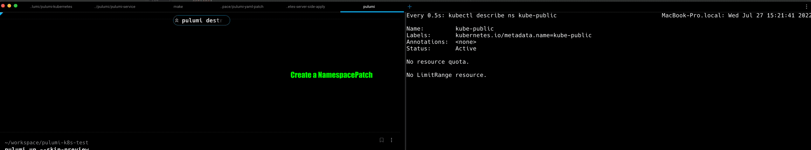

Kubernetes resources often have more than one controller making changes to them. These controllers can include `kubectl`, the Kubernetes control plane, custom operators, or infrastructure as code (IaC) tools like Pulumi.
With the [v3.20.1 release](https://github.com/pulumi/pulumi-kubernetes/releases/tag/v3.20.1) of the Kubernetes provider, you have some powerful new options for managing shared resources in Kubernetes. In this post, we show you
how Pulumi can help you work with shared resources safely and effectively.

<!--more-->

We first launched the Pulumi Kubernetes provider in 2018, and it has grown to be one of the most used providers across the Pulumi ecosystem. Many of our customers rely on this provider to manage critical production workloads, and a common request was for an easier way to manage shared Kubernetes resources with Pulumi. We've been listening, and are grateful to everyone who took the time to share their feedback with us!

A lot has changed since 2018, and our provider continues to evolve to support new use cases and the ever-growing richness of the Kubernetes ecosystem. One such development is [Server-Side Apply](https://kubernetes.io/docs/reference/using-api/server-side-apply/) (SSA), which is a resource management strategy that was introduced in Kubernetes `v1.18`. Kubernetes clients that use SSA can safely share the management of Kubernetes resources by making the API Server responsible for computing diffs and resolving conflicts.

We have kept a close eye on the SSA feature since it was announced and have been waiting patiently for its broad availability in production clusters. The wait is over, and we are excited to bring the power of SSA to Pulumi users!

## What's new in Pulumi's Kubernetes provider?

Our Server-Side Apply support adds several new capabilities:

1. New Patch resource types corresponding to every Kubernetes resource kind. (e.g., `NamespacePatch`, `DeploymentPatch`)
2. "Upsert" support; create a resource if it does not exist, or update the existing resource with specified changes.
3. Diffs no longer depend on the `last-applied-configuration` annotation, which fixes a number of open issues in the provider.

For additional details on each of these changes, see the [how-to guide for Server-Side Apply](/registry/packages/kubernetes/how-to-guides/managing-resources-with-server-side-apply/).

Now, let's take a look at some practical examples that take advantage of these improvements.

## Adding labels to an existing Namespace

Some Kubernetes resources, like Namespaces, are shared by all users of the cluster. Users often want to edit these resources, perhaps by adding a new label to them. In this example, we add a label to the `kube-public` Namespace using the new `NamespacePatch` resource:

{}
Multiple Patch resources can modify the same Kubernetes resource.
{}



{}

```typescript
import * as pulumi from "@pulumi/pulumi";
import * as kubernetes from "@pulumi/kubernetes";

const provider = new kubernetes.Provider("provider", {enableServerSideApply: true});
const blogLabel = new kubernetes.core.v1.NamespacePatch("blog-label", {metadata: {
        name: "kube-public",
        labels: {
            "pulumi.com/blog-example": "true",
        },
    }}, {
    provider: provider,
});
```

{}

{}

```python
import pulumi
import pulumi_kubernetes as kubernetes

provider = kubernetes.Provider("provider", enable_server_side_apply=True)
blog_label = kubernetes.core.v1.NamespacePatch("blog-label", metadata=kubernetes.meta.v1.ObjectMetaPatchArgs(
    name="kube-public",
    labels={
        "pulumi.com/blog-example": "true",
    },
), opts=pulumi.ResourceOptions(provider=provider))
```

{}

{}

```go
package main

import (
    "github.com/pulumi/pulumi-kubernetes/sdk/v3/go/kubernetes"
    corev1 "github.com/pulumi/pulumi-kubernetes/sdk/v3/go/kubernetes/core/v1"
    metav1 "github.com/pulumi/pulumi-kubernetes/sdk/v3/go/kubernetes/meta/v1"
    "github.com/pulumi/pulumi/sdk/v3/go/pulumi"
)

func main() {
    pulumi.Run(func(ctx *pulumi.Context) error {
        provider, err := kubernetes.NewProvider(ctx, "provider", &kubernetes.ProviderArgs{
            EnableServerSideApply: pulumi.Bool(true),
        })
        if err != nil {
            return err
        }
        _, err = corev1.NewNamespacePatch(ctx, "blog-label", &corev1.NamespacePatchArgs{
            Metadata: &metav1.ObjectMetaPatchArgs{
                Name: pulumi.String("kube-public"),
                Labels: pulumi.StringMap{
                    "pulumi.com/blog-example": pulumi.String("true"),
                },
            },
        }, pulumi.Provider(provider))
        if err != nil {
            return err
        }
        return nil
    })
}
```

{}

{}

```csharp
using System.Collections.Generic;
using Pulumi;
using Kubernetes = Pulumi.Kubernetes;

return await Deployment.RunAsync(() =>
{
    var provider = new Kubernetes.Provider("provider", new()
    {
        EnableServerSideApply = true,
    });

    var blogLabel = new Kubernetes.Core.V1.NamespacePatch("blog-label", new()
    {
        Metadata = new Kubernetes.Types.Inputs.Meta.V1.ObjectMetaPatchArgs
        {
            Name = "kube-public",
            Labels =
            {
                { "pulumi.com/blog-example", "true" },
            },
        },
    }, new CustomResourceOptions
    {
        Provider = provider,
    });

});
```

{}

{}

```java
package generated_program;

import com.pulumi.Context;
import com.pulumi.Pulumi;
import com.pulumi.core.Output;
import com.pulumi.kubernetes;
import com.pulumi.ProviderArgs;
import com.pulumi.kubernetes.core_v1.NamespacePatch;
import com.pulumi.kubernetes.core_v1.NamespacePatchArgs;
import com.pulumi.kubernetes.meta_v1.inputs.ObjectMetaPatchArgs;
import com.pulumi.resources.CustomResourceOptions;
import java.util.List;
import java.util.ArrayList;
import java.util.Map;
import java.io.File;
import java.nio.file.Files;
import java.nio.file.Paths;

public class App {
public static void main(String[] args) {
Pulumi.run(App::stack);
}

    public static void stack(Context ctx) {
        var provider = new Provider("provider", ProviderArgs.builder()
            .enableServerSideApply(true)
            .build());

        var blogLabel = new NamespacePatch("blogLabel", NamespacePatchArgs.builder()
            .metadata(ObjectMetaPatchArgs.builder()
                .name("kube-public")
                .labels(Map.of("pulumi.com/blog-example", "true"))
                .build())
            .build(), CustomResourceOptions.builder()
                .provider(provider)
                .build());

    }
}
```

{}

{}

```yaml
resources:
    provider:
        type: pulumi:providers:kubernetes
        properties:
            enableServerSideApply: true
    blog-label:
        type: kubernetes:core/v1:NamespacePatch
        properties:
            metadata:
                name: kube-public
                labels:
                    pulumi.com/blog-example: "true"
        options:
            provider: ${provider}
```

{}



After running an update with this program, the new label is applied to the shared Namespace.



```
$ pulumi up --skip-preview

Updating (dev)

View Live: https://app.pulumi.com/lblackstone/ssa/dev/updates/1

     Type                                  Name                 Status
 +   pulumi:pulumi:Stack                   ssa-dev              created
 +   ├─ pulumi:providers:kubernetes        provider             created
 +   └─ kubernetes:core/v1:NamespacePatch  blog-label           created

Resources:
    + 3 created

Duration: 2s

$ kubectl get ns kube-public -o yaml

apiVersion: v1
kind: Namespace
metadata:
  creationTimestamp: "2022-05-17T22:44:22Z"
  labels:
    kubernetes.io/metadata.name: kube-public
    pulumi.com/blog-example: "true"
  name: kube-public
  resourceVersion: "1571522"
  uid: 1096ae2b-925e-4ac7-9b26-9cc6b7c6c4cb
spec:
  finalizers:
  - kubernetes
status:
  phase: Active
```

## Change the default StorageClass

If you want to change the default `StorageClass` for a cluster, the [upstream documentation](https://kubernetes.io/docs/tasks/administer-cluster/change-default-storage-class/#changing-the-default-storageclass) suggests using a `kubectl patch` command to make this change. We can accomplish the same thing declaratively with `StorageClassPatch`.
In this case, we want to override any existing setting for this value, so we use the `pulumi.com/patchForce` annotation to overwrite the existing annotation. If the annotation does not already exist, then it will be created.



{}

```typescript
import * as pulumi from "@pulumi/pulumi";
import * as kubernetes from "@pulumi/kubernetes";

const provider = new kubernetes.Provider("provider", {enableServerSideApply: true});
const storageClassHostpath = new kubernetes.storage.v1.StorageClassPatch("storage-class-hostpath", {metadata: {
        name: "hostpath",
        annotations: {
            "pulumi.com/patchForce": "true",
            "storageclass.kubernetes.io/is-default-class": "false",
        },
    }}, {
    provider: provider,
});
const storageClassPremium = new kubernetes.storage.v1.StorageClassPatch("storage-class-premium", {metadata: {
        name: "premium",
        annotations: {
            "pulumi.com/patchForce": "true",
            "storageclass.kubernetes.io/is-default-class": "true",
        },
    }}, {
    provider: provider,
});
```

{}

{}

```python
import pulumi
import pulumi_kubernetes as kubernetes

provider = kubernetes.Provider("provider", enable_server_side_apply=True)
storage_class_hostpath = kubernetes.storage.v1.StorageClassPatch("storage-class-hostpath", metadata=kubernetes.meta.v1.ObjectMetaPatchArgs(
    name="hostpath",
    annotations={
        "pulumi.com/patchForce": "true",
        "storageclass.kubernetes.io/is-default-class": "false",
    },
), opts=pulumi.ResourceOptions(provider=provider))
storage_class_premium = kubernetes.storage.v1.StorageClassPatch("storage-class-premium", metadata=kubernetes.meta.v1.ObjectMetaPatchArgs(
    name="premium",
    annotations={
        "pulumi.com/patchForce": "true",
        "storageclass.kubernetes.io/is-default-class": "true",
    },
), opts=pulumi.ResourceOptions(provider=provider))
```

{}

{}

```go
package main

import (
    "github.com/pulumi/pulumi-kubernetes/sdk/v3/go/kubernetes"
    metav1 "github.com/pulumi/pulumi-kubernetes/sdk/v3/go/kubernetes/meta/v1"
    storagev1 "github.com/pulumi/pulumi-kubernetes/sdk/v3/go/kubernetes/storage/v1"
    "github.com/pulumi/pulumi/sdk/v3/go/pulumi"
)

func main() {
    pulumi.Run(func(ctx *pulumi.Context) error {
        provider, err := kubernetes.NewProvider(ctx, "provider", &kubernetes.ProviderArgs{
            EnableServerSideApply: pulumi.Bool(true),
        })
        if err != nil {
            return err
        }
        _, err = storagev1.NewStorageClassPatch(ctx, "storage-class-hostpath", &storagev1.StorageClassPatchArgs{
            Metadata: &metav1.ObjectMetaPatchArgs{
                Name: pulumi.String("hostpath"),
                Annotations: pulumi.StringMap{
                    "pulumi.com/patchForce": pulumi.String("true"),
                    "storageclass.kubernetes.io/is-default-class": pulumi.String("false"),
                },
            },
        }, pulumi.Provider(provider))
        if err != nil {
            return err
        }
        _, err = storagev1.NewStorageClassPatch(ctx, "storage-class-premium", &storagev1.StorageClassPatchArgs{
            Metadata: &metav1.ObjectMetaPatchArgs{
                Name: pulumi.String("premium"),
                Annotations: pulumi.StringMap{
                    "pulumi.com/patchForce": pulumi.String("true"),
                    "storageclass.kubernetes.io/is-default-class": pulumi.String("true"),
                },
            },
        }, pulumi.Provider(provider))
        if err != nil {
            return err
        }
        return nil
    })
}
```

{}

{}

```csharp
using System.Collections.Generic;
using Pulumi;
using Kubernetes = Pulumi.Kubernetes;

return await Deployment.RunAsync(() =>
{
    var provider = new Kubernetes.Provider("provider", new()
    {
        EnableServerSideApply = true,
    });

    var storageClassHostpath = new Kubernetes.Storage.V1.StorageClassPatch("storage-class-hostpath", new()
    {
        Metadata = new Kubernetes.Types.Inputs.Meta.V1.ObjectMetaPatchArgs
        {
            Name = "hostpath",
            Annotations =
            {
                { "pulumi.com/patchForce", "true" },
                { "storageclass.kubernetes.io/is-default-class", "false" },
            },
        },
    }, new CustomResourceOptions
    {
        Provider = provider,
    });

    var storageClassPremium = new Kubernetes.Storage.V1.StorageClassPatch("storage-class-premium", new()
    {
        Metadata = new Kubernetes.Types.Inputs.Meta.V1.ObjectMetaPatchArgs
        {
            Name = "premium",
            Annotations =
            {
                { "pulumi.com/patchForce", "true" },
                { "storageclass.kubernetes.io/is-default-class", "true" },
            },
        },
    }, new CustomResourceOptions
    {
        Provider = provider,
    });
});
```

{}

{}

```java
package generated_program;

import com.pulumi.Context;
import com.pulumi.Pulumi;
import com.pulumi.core.Output;
import com.pulumi.kubernetes.Provider;
import com.pulumi.kubernetes.ProviderArgs;
import com.pulumi.kubernetes.storage.k8s.io_v1.StorageClassPatch;
import com.pulumi.kubernetes.storage.k8s.io_v1.StorageClassPatchArgs;
import com.pulumi.kubernetes.meta_v1.inputs.ObjectMetaPatchArgs;
import com.pulumi.resources.CustomResourceOptions;
import java.util.List;
import java.util.ArrayList;
import java.util.Map;
import java.io.File;
import java.nio.file.Files;
import java.nio.file.Paths;

public class App {
    public static void main(String[] args) {
        Pulumi.run(App::stack);
    }

    public static void stack(Context ctx) {
        var provider = new Provider("provider", ProviderArgs.builder()
            .enableServerSideApply(true)
            .build());

        var storageClassHostpath = new StorageClassPatch("storageClassHostpath", StorageClassPatchArgs.builder()
            .metadata(ObjectMetaPatchArgs.builder()
                .name("hostpath")
                .annotations(Map.of("pulumi.com/patchForce", "true"))
                .annotations(Map.of("storageclass.kubernetes.io/is-default-class", "false"))
                .build())
            .build(), CustomResourceOptions.builder()
                .provider(provider)
                .build());

        var storageClassPremium = new StorageClassPatch("storageClassPremium", StorageClassPatchArgs.builder()
            .metadata(ObjectMetaPatchArgs.builder()
                .name("premium")
                .annotations(Map.of("pulumi.com/patchForce", "true"))
                .annotations(Map.of("storageclass.kubernetes.io/is-default-class", "true"))
                .build())
            .build(), CustomResourceOptions.builder()
                .provider(provider)
                .build());

    }
}
```

{}

{}

```yaml
resources:
    provider:
        type: pulumi:providers:kubernetes
        properties:
            enableServerSideApply: true
    storage-class-hostpath:
        type: kubernetes:storage.k8s.io/v1:StorageClassPatch
        properties:
            metadata:
                name: hostpath
                annotations:
                    pulumi.com/patchForce: "true"
                    storageclass.kubernetes.io/is-default-class: "false"
        options:
            provider: ${provider}
    storage-class-premium:
        type: kubernetes:storage.k8s.io/v1:StorageClassPatch
        properties:
            metadata:
                name: premium
                annotations:
                    pulumi.com/patchForce: "true"
                    storageclass.kubernetes.io/is-default-class: "true"
        options:
            provider: ${provider}
```

{}



## Share a ConfigMap resource

Many applications use `ConfigMap` resources to configure shared data. Consider the case where more than one application depends on the same `ConfigMap`, but does not use all the same keys. Each application requires that the same `ConfigMap` exists, but may need to update rather than create it (also known as an "Upsert" operation). With Server-Side Apply support, this doesn't require any special handling. Create a `ConfigMap` resource with the desired configuration, and the changes will be applied as required.
Again, in the case of conflicts, we can set the `pulumi.com/patchForce` annotation to force an override for conflicting values.



{}

```typescript
import * as pulumi from "@pulumi/pulumi";
import * as kubernetes from "@pulumi/kubernetes";

const provider = new kubernetes.Provider("provider", {enableServerSideApply: true});
const sharedConfig = new kubernetes.core.v1.ConfigMap("shared-config", {
    metadata: {
        name: "app-settings",
    },
    data: {
        backendUrl: "https://example.com",
    },
}, {
    provider: provider,
});
```

{}

{}

```python
import pulumi
import pulumi_kubernetes as kubernetes

provider = kubernetes.Provider("provider", enable_server_side_apply=True)
shared_config = kubernetes.core.v1.ConfigMap("shared-config",
                                             metadata=kubernetes.meta.v1.ObjectMetaArgs(
                                                 name="app-settings",
                                             ),
                                             data={
                                                 "backendUrl": "https://example.com",
                                             },
                                             opts=pulumi.ResourceOptions(provider=provider))
```

{}

{}

```go
package main

import (
    "github.com/pulumi/pulumi-kubernetes/sdk/v3/go/kubernetes"
    corev1 "github.com/pulumi/pulumi-kubernetes/sdk/v3/go/kubernetes/core/v1"
    metav1 "github.com/pulumi/pulumi-kubernetes/sdk/v3/go/kubernetes/meta/v1"
    "github.com/pulumi/pulumi/sdk/v3/go/pulumi"
)

func main() {
    pulumi.Run(func(ctx *pulumi.Context) error {
        provider, err := kubernetes.NewProvider(ctx, "provider", &kubernetes.ProviderArgs{
            EnableServerSideApply: pulumi.Bool(true),
        })
        if err != nil {
            return err
        }
        _, err = corev1.NewConfigMap(ctx, "shared-config", &corev1.ConfigMapArgs{
            Metadata: &metav1.ObjectMetaArgs{
                Name: pulumi.String("app-settings"),
            },
            Data: pulumi.StringMap{
                "backendUrl": pulumi.String("https://example.com"),
            },
        }, pulumi.Provider(provider))
        if err != nil {
            return err
        }
        return nil
    })
}
```

{}

{}

```csharp
using System.Collections.Generic;
using Pulumi;
using Kubernetes = Pulumi.Kubernetes;

return await Deployment.RunAsync(() =>
{
    var provider = new Kubernetes.Provider("provider", new()
    {
        EnableServerSideApply = true,
    });

    var sharedConfig = new Kubernetes.Core.V1.ConfigMap("shared-config", new()
    {
        Metadata = new Kubernetes.Types.Inputs.Meta.V1.ObjectMetaArgs
        {
            Name = "app-settings",
        },
        Data =
        {
            { "backendUrl", "https://example.com" },
        },
    }, new CustomResourceOptions
    {
        Provider = provider,
    });
});
```

{}

{}

```java
package generated_program;

import com.pulumi.Context;
import com.pulumi.Pulumi;
import com.pulumi.core.Output;
import com.pulumi.kubernetes.Provider;
import com.pulumi.kubernetes.ProviderArgs;
import com.pulumi.kubernetes.core_v1.ConfigMap;
import com.pulumi.kubernetes.core_v1.ConfigMapArgs;
import com.pulumi.kubernetes.meta_v1.inputs.ObjectMetaArgs;
import com.pulumi.resources.CustomResourceOptions;
import java.util.List;
import java.util.ArrayList;
import java.util.Map;
import java.io.File;
import java.nio.file.Files;
import java.nio.file.Paths;

public class App {
    public static void main(String[] args) {
        Pulumi.run(App::stack);
    }

    public static void stack(Context ctx) {
        var provider = new Provider("provider", ProviderArgs.builder()
            .enableServerSideApply(true)
            .build());

        var sharedConfig = new ConfigMap("sharedConfig", ConfigMapArgs.builder()
            .metadata(ObjectMetaArgs.builder()
                .name("app-settings")
                .build())
            .data(Map.of("backendUrl", "https://example.com"))
            .build(), CustomResourceOptions.builder()
                .provider(provider)
                .build());

    }
}
```

{}

{}

```yaml
resources:
    provider:
        type: pulumi:providers:kubernetes
        properties:
            enableServerSideApply: true
    shared-config:
        type: kubernetes:core/v1:ConfigMap
        properties:
            metadata:
                name: app-settings
            data:
                backendUrl: https://example.com
        options:
            provider: ${provider}
```

{}



Here is what it looks like to update an existing `ConfigMap` with this program.


```
$ kubectl get configmap app-settings -o yaml
apiVersion: v1
data:
  appReplicas: "3"
kind: ConfigMap
metadata:
  creationTimestamp: "2022-07-26T22:25:16Z"
  name: app-settings
  namespace: default
  resourceVersion: "1603792"
  uid: b366e6a5-703e-4897-ab5d-a99b19ba82d5


$ pulumi up --skip-preview
Updating (dev)

View Live: https://app.pulumi.com/lblackstone/pulumi-k8s-test/dev/updates/42

     Type                             Name                 Status
 +   pulumi:pulumi:Stack              pulumi-k8s-test-dev  created
 +   ├─ pulumi:providers:kubernetes   provider             created
 +   └─ kubernetes:core/v1:ConfigMap  shared-config        created

Resources:
    + 3 created

Duration: 2s


kubectl get configmap app-settings -o yaml
apiVersion: v1
data:
  appReplicas: "3"
  backendUrl: https://example.com
kind: ConfigMap
metadata:
  creationTimestamp: "2022-07-26T22:25:16Z"
  name: app-settings
  namespace: default
  resourceVersion: "1603817"
  uid: b366e6a5-703e-4897-ab5d-a99b19ba82d5
```

{}
Use the [retainOnDelete option](/docs/concepts/options/retainondelete/) if you don't want to delete the shared resource when a stack is destroyed.
{}

## Give it a try!

To get started with these improvements, check out our [how-to guide for Server-Side Apply](/registry/packages/kubernetes/how-to-guides/managing-resources-with-server-side-apply/).
If you run into any issues, you can reach out to us on [Community Slack](https://slack.pulumi.com) with your questions on the #kubernetes channel, or file an issue on the [pulumi-kubernetes repo](https://github.com/pulumi/pulumi-kubernetes/issues).
