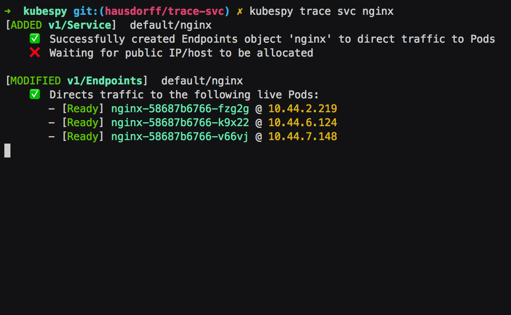
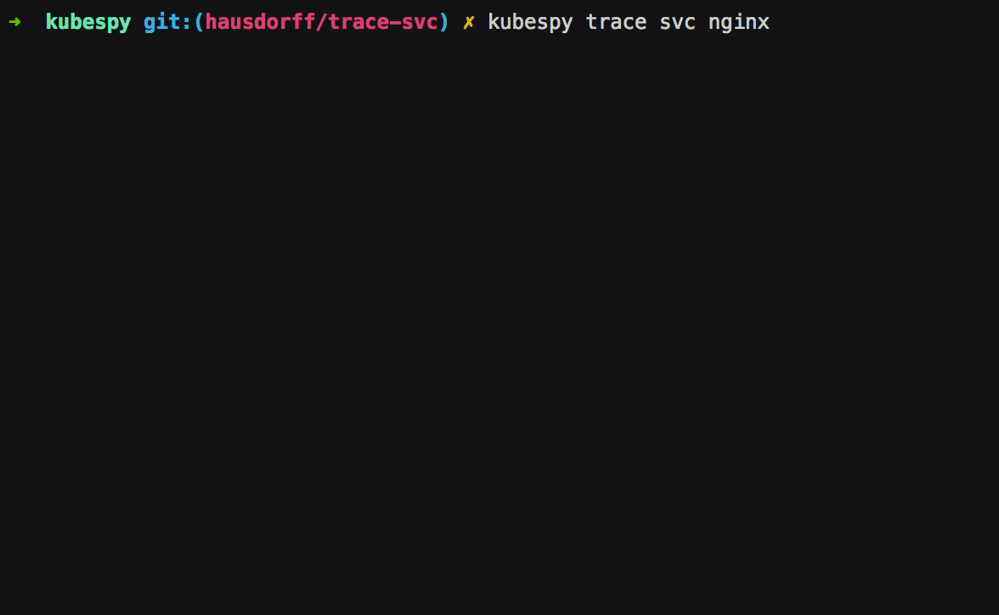
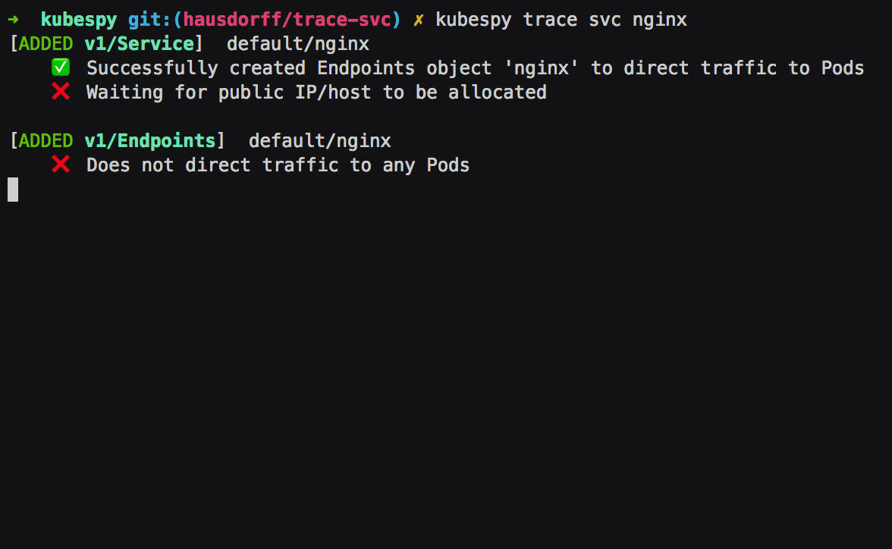
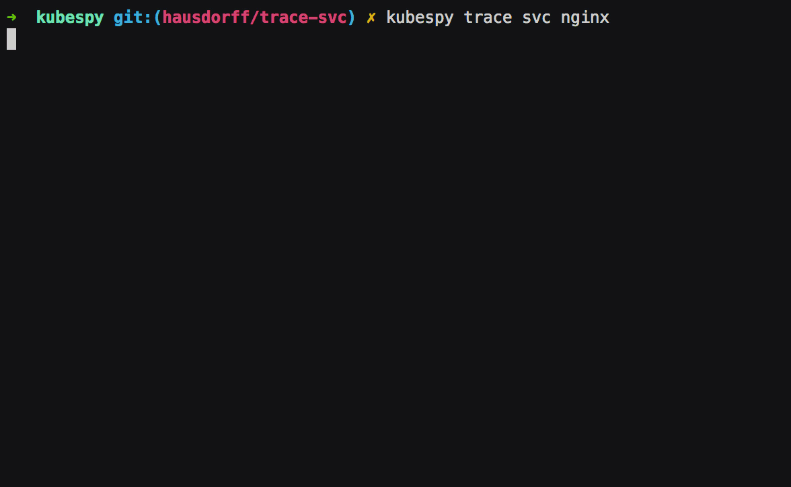

<!-- spacer -->

> This post is part 3 in a series on the Kubernetes API. Earlier,
> [Part 1]()
> focused on the lifecycle of a `Pod`, and later
> [Part 3]()
> details how Kubernetes deployments work.

Why isn't my `Pod` getting any traffic?

An experienced ops team running on GKE might assemble the following
checklist to help answer this question:

1.  Does a `Service` exist? Does that service have a `.spec.selector`
    that matches some number of `Pod`s?
2.  Are the `Pod`s alive and has their readiness probe passed?
3.  Did the `Service` create an `Endpoints` object that specifies one or
    more `Pod`s to direct traffic to?
4.  Is the `Service` reachable via DNS? When you `kubectl ``exec` into a
    `Pod` and you use `curl` to poke the `Service` hostname, do you get
    a response? (If not, does *any* `Service` have a DNS entry?)
5.  Is the `Service` reachable via IP? When you SSH into a `Node` and
    you use `curl` to poke the `Service` IP, do you get a response?
6.  Is `kube-proxy` up? Is it writing iptables rules? Is it proxying to
    the `Service`?

This question might have the highest complexity-to-sentence-length ratio
of any question in the Kubernetes ecosystem. Unfortunately, it's also a
question that *every* user finds themselves asking at some point. And
when they do, it usually means their app is down.

To help answer questions like this, we've been developing a small
diagnostic tool, `kubespy`. In this post we'll look at the new
`kubespy trace` command, which is broadly aimed at automating questions
1, 2, 3, and providing "hints" about 4 and 5.
<!--more-->

Below is a gif demonstrating the CLI experience. You can watch in
real-time as the `Service` comes online, finds pods to target, and
finally is allocated a public IP address:

## What is kubespy, again?

`kubespy` is a simple, standalone diagnostic tool, meant to make it easy
to introspect on Kubernetes resources in real time.

Before we begin, it's worth noting that this `kubespy` actually
re-packages the machinery we developed for Kubernetes support in
Pulumi.

One of our major goals in this work was to make deploying an application
to Kubernetes as simple as possible, by presenting a concise summary of
this information in the CLI experience. See
[my tweetstorm](https://twitter.com/hausdorff_space/status/1039940379301179392)
on the subject, or [try it out]() for
yourself!

## A real-time view of a Service's life

The [`kubespy` repository](https://github.com/pulumi/kubespy) contains
the [simple `trace` example](https://github.com/pulumi/kubespy/tree/master/examples/trivial-service-trace-example)
we use in this demo. The
[README](https://github.com/pulumi/kubespy/tree/master/examples/trivial-service-trace-example)
contains detailed installation instructions, as well as explaining how
to run the app (using either `kubetl` or `pulumi` though of course we
hope you will try Pulumi).

Essentially: running `kubespy trace service nginx` will cause `kubespy`
to sit and wait for you to deploy a `Service` called `nginx`. When you
run this example, it will do just this: creating a `Deployment` which
replicates an nginx `Pod` 3 times and exposes it publicly to the
Internet with a `Service`, also called `nginx`.

Let's break down the `kubespy trace` gif above to show that there are
actually several distinct steps in the process of booting up a
`Service`.

**First: `Service` is created, the `Service` controller creates an
`Endpoints` object of the same name.** The `Endpoints` object is to
specify which `Pod`s get traffic --- their IPs, which ports to direct
traffic to, and so on. In this case, there are no `Pod`s to target,
which `kubespy trace` tells us:

**Second: `Pod`s that match the `Service`'s `.spec.selector` are
created; their readiness probes immediately pass.** The `Endpoints`
object is updated to reflect this. As we will see below, if the `Pods`
failed the readiness probes, `kubespy trace` would note this. 

**Third: `Service` is allocated a public IP address.** The `Service` has
`.spec.type` set to `LoadBalancer`, which on most cloud platforms means
that a public IP address should be allocated for it.

## Exercise: Other Service types, watching rollouts, deleting Services!

`kubespy trace` supports all the other `Service` types, including
`ExternalName` and `ClusterIP`. Try both of those, and you'll see
slightly different output. Try them! It's also worth watching what
happens when a `Service` is deleted.

You can also use `kubespy trace` to watch an unhealthy deployment become
healthy. In the following gif, we see a bunch of `Pod`s that are failing
readiness checks become healthy as a new version is rolled out:

## Conclusions

Confession time. Last time we told you we'd dig more into the lifecycle
of a `Pod`. And we will, at some point. But we ended up deciding that it
would be easier to explain with a cohesive `trace` command.

And, while this is a good start, it is only the beginning. `trace`
currently supports only `Service`. In our next post, we'll extend trace
to `Deployment` (or perhaps `ReplicaSet`), and from there, we will have
enough tools to really dig into what is happening when you roll out your
app.

In the mean time, if you enjoyed this post, or are curious to see how
this lifecycle is baked into the Pulumi CLI, [give it a spin]()!
We'd love to have your feedback.
