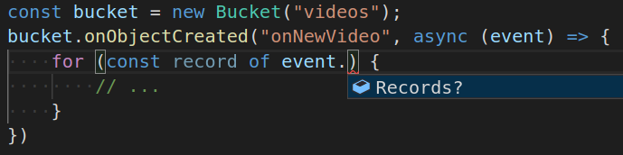

Pulumi's approach to infrastructure as code uses real languages instead
of YAML or DSLs. One major advantage of this approach is that AWS
Lambdas, Azure Functions, Google Cloud Functions, et al. can just be
real language lambdas, offering a flexible and simple path to
serverless. Such functions behave as normal functions, allowing you to
treat serverless code as part of your application instead of separate
"infrastructure" that needs to be configured, managed, and versioned
manually. In this post, we'll examine this capability in JavaScript,
which is already very function- and callback-oriented, making serverless
feel like a natural extension of the language we already know and love. 

While Functions as a Service (FaaS) systems have become more popular,
getting up and running can still feel overly complex compared to normal
application development. FaaS offerings today divide the development
experience between "infrastructure" -- doing all the work to
configure the Lambda runtime itself (i.e. how much memory to use, what
environment variables should be present, etc.) -- and writing and
maintaining the code that will execute *in* the function itself when
triggered. Most developers just want to focus on the latter, write some
code, and have it work.
<!--more-->

For [AWS Lambda](https://aws.amazon.com/lambda/), for example, the code
itself needs to written and packaged up with all its dependencies into a
single zip-file, stored as a blob that is then placed in
[AWS S3](https://aws.amazon.com/s3/). This blob is then referenced by Lambda
so that it can be loaded on-demand when necessary. Updating just a
single character of this code, like fixing a bug, then requires fully
repackaging and re-uploading everything. Compounding all of that, this
code is necessary independent of any other pieces of your application.
If the code for the Lambda needs to read or write to an S3 bucket,
publish to an [AWS SNS](https://aws.amazon.com/sns/) topic, etc., it
will need to be manually configured to have that bucket's information
passed to it, often using out of band in environment variables. These
same issues also apply when creating
[FunctionApps](https://docs.microsoft.com/en-us/azure/azure-functions/functions-overview)
using Node.js on Azure.

At Pulumi, we thought there could be a better way to do this. Why have
to jump out of your application code just to create another bit of
configuration (in YAML or JSON) just to run your application? Put
simply, we wanted developers to write event-driven code, in their
favorite language and in their favorite IDE, and simply hit "deploy"
when done.

## Magic Functions

From a desire to do better here, the "closure serialized function" was
born. However, "closure serialized function" is a geeky mouthful, so I
like just calling them "magic functions." Our team is comprised of
cloud, language, and runtime geeks alike, so we figured out a way to
hook into the language runtimes to just make lambdas as lambdas work.

Before diving more deeply into how magic functions work, let's take a
look at how they look in action:

    // Example simplified to not get too bogged down :)
    const sharp = require("sharp");

    const videoBucket = new aws.s3.Bucket("videos");
    const videoTopic = new cloud.Topic("videoTopic");

    videoBucket.onObjectCreated("onNewVideo", async (event) => {
        for (const record of event.Records) {
            const dimensions = computeDimensions(record.s3.object.key);
            videoTopic.publish({ s3ObjectKey: record.s3.object.key, time: record.eventTime });
        }
    });

    function computeDimentions(objectKey: string): { height: number, width: number } { 
        /* simplified */ 
        const metadata = await sharp(...);
        return { height: metadata.height, width: metadata.width };
    }

    videoTopic.subscribe("compressVideo", async (event) => {
        const { s3ObjectKey, time } = event;

        // actually compress video.
    });

    videoTopic.subscribe("createThumbnail", async (event) => {
        const { s3ObjectKey, time } = event;

        // actually create thumbnail.
    });

Let's still walk through it to see what's happening. It can be a little
subtle because we are mixing *deployment-time* code -- code that
declares infrastructure as code resources -- and *runtime *code --
application code that runs as a function.

First, we're just defining two simple resources: 1) an `s3.Bucket`,
where we expect new video files to be uploaded to, and 2) a
`cloud.Topic` that will inform interested parties when new videos are
uploaded. (The full surface area of AWS is available in [the aws package](), and
[the cloud package]() offers
multi-cloud abstractions that work at a higher level of abstraction.)
Right after defining the resources, we start creating our first FaaS
resources. `videoBucket` has an `onObjectCreated` event subscription
function that will fire when new objects appear, and we invoke it with a
*real* JavaScript (or TypeScript)
[arrow-function](https://developer.mozilla.org/en-US/docs/Web/JavaScript/Reference/Functions/Arrow_functions)
defining the code that will execute in an AWS Lambda at *runtime*.

## Not So Fast...

This code is pretty magical in a few ways. To see how it's magic, let's
consider a fairly naive way to create a Lambda for
this `onObjectCreated` event handler function -- something we need to
do by hand with FaaS solutions today. Imagine we took the raw source
text of this arrow-function by `toString`ing it and using that as the
text of the Lambda code:

    // index.js

    module.exports = async (event) => {
        foreach (var record in event.Records) {
            const dimensions = computeDimensions(record.s3.object.key);
            videoTopic.publish({ s3ObjectKey: record.s3.object.key, time: record.eventTime });
        }
    };

Now, the above translation could have worked for an extremely basic
function, but totally breaks down here for several reasons. First,
`computeDimensions` isn't included, which will make this immediately
fail if ever called. Second, if `computeDimensions` was included, it
wouldn't work unless the `sharp` module was properly imported for it.
Third, even if the module was imported in the code, the actual NPM
package would have to be available along with the code in the cloud.
Fourth, if that module was
properly `require`d,
and the package was properly included, the code is both referencing
`videoTopic` (a resource defined when the application originally ran),
*and* it is invoking a helper method on it. Remember, this code is going
to be executing at cloud *runtime*, not at the time when Pulumi is
actually executing the application on your developer machine, and
actually doing things like running the
`const videoTopic = new cloud.Topic("videoTopic")` code.

To summarize, we have quickly realized, we can't just analyze
everything locally to figure out what has to be included, instead the
entire transitive closure must be considered -- a task usually left up
to FaaS developers to perform manually! This coupled with the manual
configuration using YAML can lead to plenty a headache.

## Compilers to the Rescue

Despite all those issues, Pulumi is able to make that original
application code work and it is able to magically effectively translate
the above into a working Lambda. The real secret sauce here is that, by
leveraging real languages, we can stand on the shoulders of all the
great compiler work underpinning them.

So let's dig in -- how does this all really work?

(Note that, if you want some of the more nitty gritty details, we have a
[doc]()
going in depth. For now, we'll try to stick to providing a high-level
overview of what's going on, so that we can grok the basic approach.)

Pulumi executes your application as a normal Node.js application. As
such, when it hits the `const videoBucket = new aws.s3.Bucket("videos")`
lines, it actually goes and creates those resources. When it then hits
the `videoBucket.onObjectCreated("onNewVideo", async (event) => {` line
this executes a normal line of JavaScript. Namely, `onObjectCreated` is
a normal JavaScript function that will be passed the `name` parameter as
the first arg, and the JavaScript
[function](https://developer.mozilla.org/en-US/docs/Web/JavaScript/Guide/Functions)
as the second arg.
[onObjectCreated](https://github.com/pulumi/pulumi-aws/blob/2159b44b296ab66ce4386d42b28fb22f27a6ef6a/sdk/nodejs/s3/s3Mixins.ts#L223)
eventually bottoms out with a call to a call to
[pulumi.runtime.serializeFunction](https://github.com/pulumi/pulumi/blob/fb18032a42eb34e9b5cbbe22a77a1b292d260a24/sdk/nodejs/runtime/closure/serializeClosure.ts#L89).
This function is the root of where our deep analysis of your JavaScript
function analysis and translation will happen.

It's worth pausing here. We can use all the standard approaches to
function composition to build bigger functions out of smaller functions,
even before we hit that serialization routine. The closures are built up
in the V8 runtime as usual, and are eagerly awaiting the transformation
into magic functions as soon as they are needed. Pretty cool!

Once we get to that point, using the awesome analysis APIs provided by
[TypeScript](https://github.com/Microsoft/TypeScript), we start
introspecting the function instance, seeing what code it contains, and
what external objects it references. The legal objects that can be
included in the captured function's environment include (but aren't
limited) to things like simple JavaScript objects, other functions (like
`computeDimensions`), modules (like `sharp`), other Pulumi resources
(like `videoTopic`), and even complex beasts like
[Promises](https://developer.mozilla.org/en-US/docs/Web/JavaScript/Reference/Global_Objects/Promise).
Basically, anything that Pulumi knows how to serialize and rehydrate
inside the Lambda.

When Pulumi determines that these objects are referenced, it
automatically includes enough information about them into the final
translated Lambda code file so that they are available and can be
effectively used at runtime. Thanks to JavaScript's deep, dynamic
introspection capabilities, as well as its rich APIs for creating nearly
anything at runtime, it's very possible to effectively hydrate out all
the information present when Pulumi runs, and put it into a form that
can be cheaply and accurately rehydrated into runtime objects again when
the Lambda runs.

This analysis also understands the NPM package structure of an
application and its dependencies, ensuring that necessary imported
packages are properly included with the final Lambda. This analysis is
also very smart about not including things that aren't necessary at all.
For example, it might drop information from the serialized form if it
can prove that would never be observable, in addition to relying on
built-in runtime functions being there without needing any sort of
serialization. There are definite subtleties and interesting cases that
can arise here, and for those very curious, reading the documentation
linked above may be very enlightening.

Pulumi also understands diffs and dependencies, so updating is a cinch.
Any changes to the code in the JavaScript function (including anything
it depends on) is properly tracked and understood by Pulumi, allowing an
easy development model where FaaS code can be easily modified and
republished without jumping through extra hoops. 

## The Result? Simple serverless Functions

With this approach, serverless programming becomes dramatically simpler,
whether it's an AWS Lambda, Azure Function, or GCP Cloud Function.
(Stay tuned, we're hoping to bring this to Kubernetes FaaS offerings
soon.)

In short, you just write event-driven JavaScript code that's familiar
and easy, you run `pulumi up`, and everything is taken care of from
there. No YAML configuration files, no point and clicking in a cloud
console UI, no fuss.

On top of all of that, because this is just code itself, and because
these are normal APIs, other tooling (like your editor) knows exactly
what is going on and can guide you through this. For example:

While there's a lot of really cool tech going on under the covers here,
we really hope that this ends up just feeling super-awesome to use for
you. Now that we have this functionality, we wouldn't want to ever write
an AWS Lambda any other way!

Get started building serverless functions on Pulumi today!
